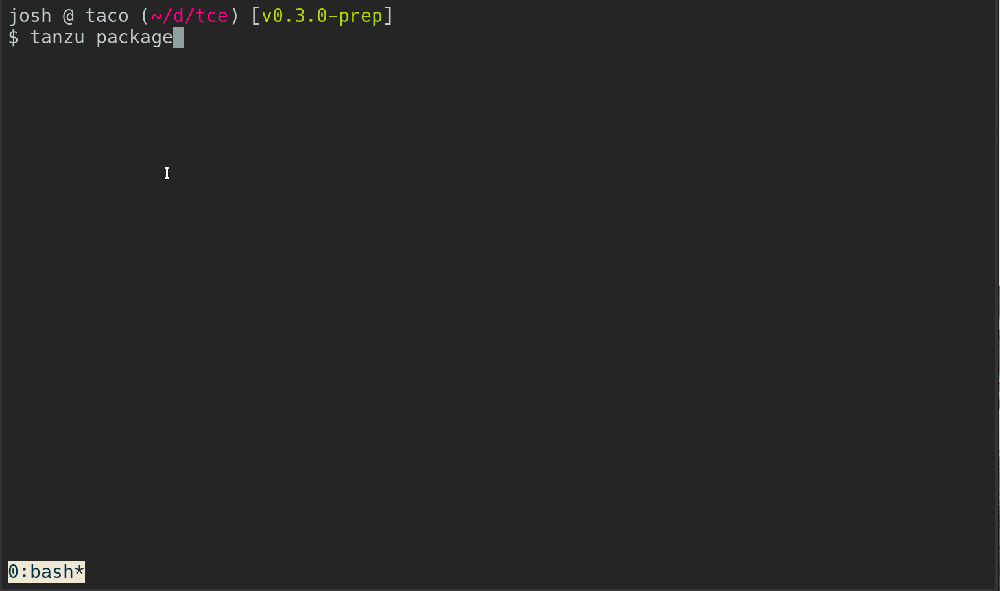

# Tanzu Community Edition

⚠️ Tanzu Community Edition has not been announced; it is
currently a VMware internal project. ⚠️

## Overview

Tanzu Community Edition (TCE) enables the creation of application platforms.
Application platforms are infrastructure, tooling, and services that foster
a viable location to run applications and enable positive developer experiences.

TCE does this by leveraging [Cluster API](https://cluster-api.sigs.k8s.io/) to
provide declarative deployment and management of Kubernetes clusters. Kubernetes
acts as the foundation in which we orchestrate workloads. With this foundation
in place, TCE enables the installation of platform packages that support
applications running in clusters.

TCE allows you to get bootstrapped by providing a set of opinionated building blocks.
Additionally, it enables you to add or replace these with your own components. This
flexibility enables you to produce application platforms that meet your unique
requirements without having to start from scratch.

## Getting Started

* [Getting Started Guides](https://quirky-franklin-8969be.netlify.app/docs/latest)
  * Password: `ExpectedBirthdayIndirectBinary`
  * Select a getting started guide based on your provider.

## Architectures / Designs

To support our [_talk, then
code_](https://github.com/vmware-tanzu/tce/blob/main/CONTRIBUTING.md#before-you-submit-a-pull-request)
approach, all implementation (both completed and intended) is captured in the
following.

* [Standalone Workload Clusters](docs/designs/standalone-cluster.md)
  * How standalone (no dedicated management cluster) workload clusters are bootstrapped.
* [Tanzu Package Management](./docs/designs/tanzu-package-management.md)
  * How packages are managed, client and server side, in TCE.
* [Tanzu Packaging Process](./docs/designs/tanzu-packaging-process.md)
  * Packaging methodology for packages in TCE.
* [Package and Repository Operations](./docs/designs/package-and-repository-operations.md)
  * A guide for working with packages assets and repositories.

## Packages

Packages provide the additional functionality necessary to build an application platform atop Kubernetes. We follow a modular approach in which operators building a platform can deploy the packages they need to fulfill their requirements.

| Name | Description | Documentation |
|------|-------------|---------------|
| Cert Manager | Provides certificate management provisioning within the cluster | [Cert Manager pacakge docs](./addons/packages/cert-manager) |
| Contour | Provides ingress support to workloads | [Contour package docs](./addons/packages/contour) |
| Contour-Operator | Provides an operator for Contour, an ingress controller | [Contour Operator package docs](./addons/packages/contour-operator) |
| ExternalDNS | Provides discoverability of services via public DNS | [ExternalDNS package docs](./addons/packages/external-dns) |
| Fluent-Bit | Log processor and forwarder | [Fluent Bit package docs](./addons/packages/fluentbit) |
| Gatekeeper | Provides policy enforcement within clusters | [Gatekeeper package docs](./addons/packages/gatekeeper) |
| Grafana | Metrics visualization and analytics | [Grafana package docs](./addons/packages/grafana) |
| Knative Serving | Provides serving functionality to clusters | [knative serving package docs](./addons/packages/knative-serving) |
| Prometheus | Time series database for metrics. Includes AlertManager | [Prometheus package docs](./addons/packages/prometheus) |
| Velero | Provides disaster recovery capabilities | [Velero package docs](./addons/packages/velero) |

Here's a demonstration of working with packages.

## Repository Layout

The following describes the key directories that make up this repository.

* **addons/**: our packages and package repos installed in TCE clusters.
  * **packages/**: software packages installed in TCE clusters.
  * **repos/**: bundles of packages that can be installed in TCE clusters making all packages within available.
* **cli/**: plugins that add TCE-specific functionality to the `tanzu` CLI
  * **cmd/plugin/${PLUGIN_NAME}/**: main file for each plugin, containing the plugin descriptor and plugin creation.
  * **pkg/addon/${PLUGIN_NAME}/**: commands and logic for a plugins command(s), implemented with [cobra](https://github.com/spf13/cobra).
  * **pkg/addon/common/**: shared functionality amongst plugins.
* **docs/**: documentation and our hugo-based website
* **hack/**: scripts used for development and build processes
