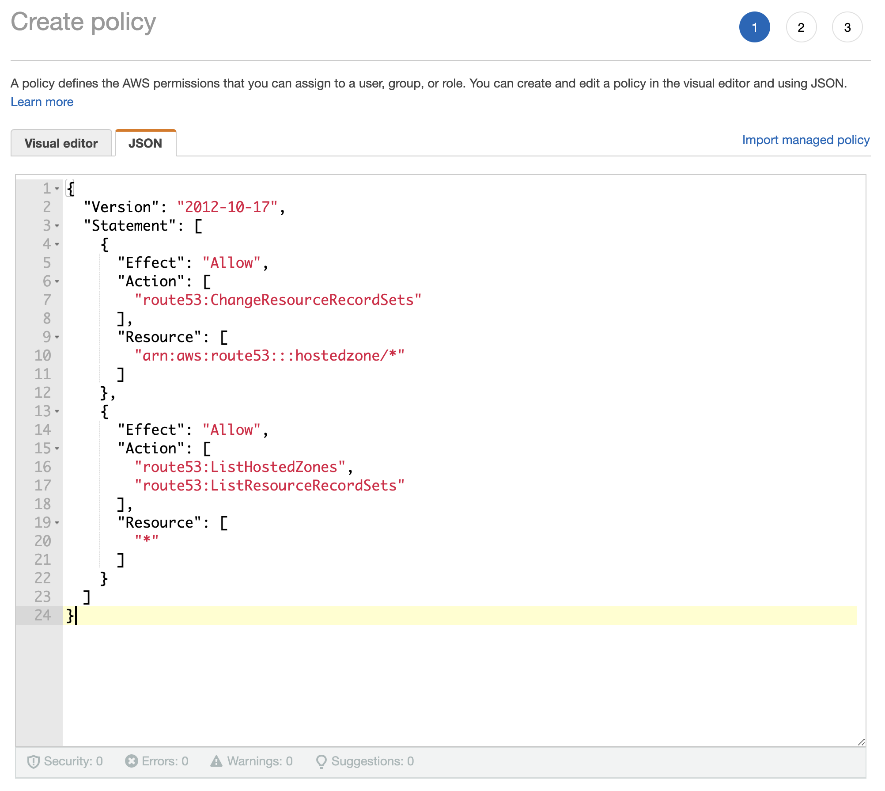
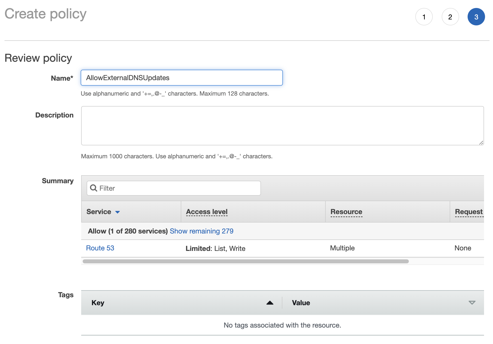
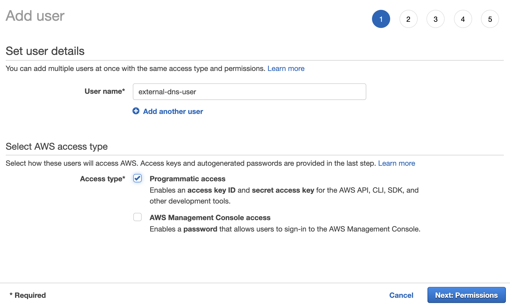
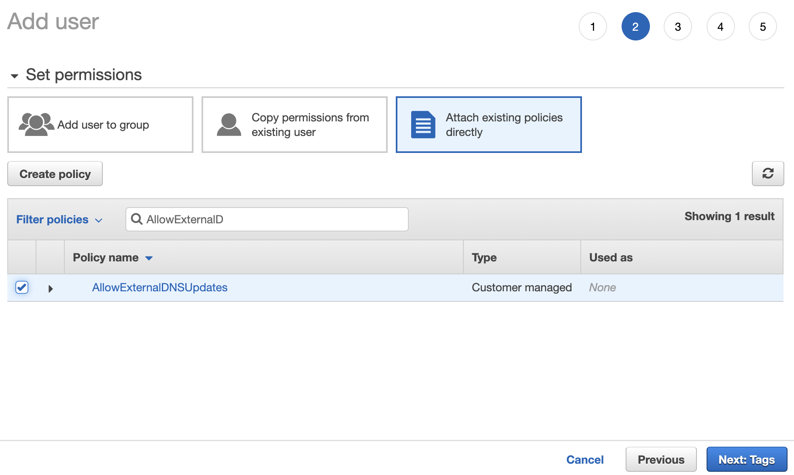
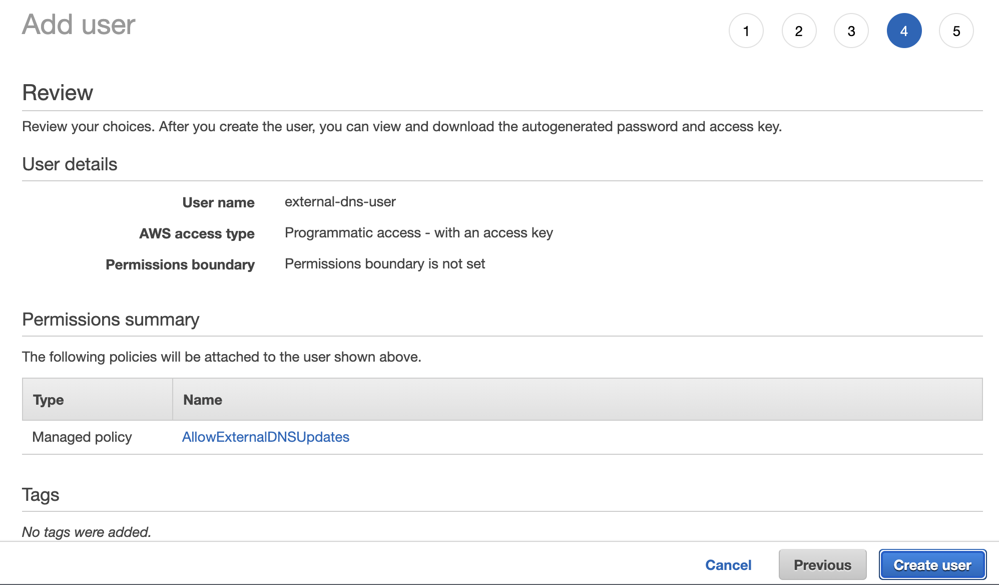
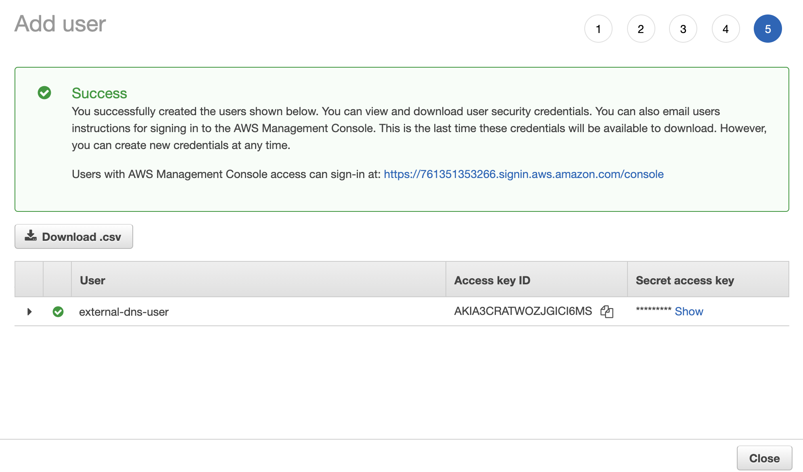
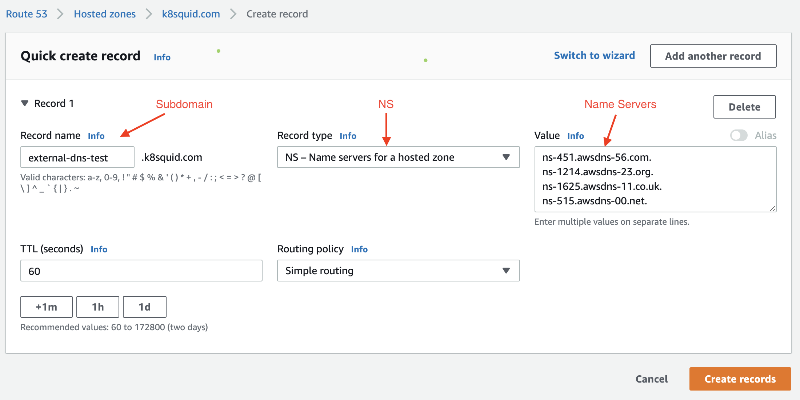

# THIS CONTENT HAS MOVED TO THE DOCS BRANCH: PLEASE MAKE ANY FURTHER UPDATES THERE**

File is available here on docs branch: ``docs\site\content\docs\latest\externaldns-config``

## ExternalDNS

[ExternalDNS](https://github.com/kubernetes-sigs/external-dns) synchronizes exposed Kubernetes Services and Ingresses with DNS providers.

## Components

* ExternalDNS deployment

## Configuration

The following configuration values can be set to customize the external-dns installation.

### Global

| Value       | Required/Optional | Description                                    |
|-------------|-------------------|------------------------------------------------|
| `namespace` | Optional          | The namespace in which to deploy external-dns. |

### external-dns Configuration

| Value                        | Required/Optional | Description                                       |
|------------------------------|--------------------|--------------------------------------------------|
| `deployment.args`            | Required           | Args passed via command-line to external-dns     |
| `deployment.env`             | Optional           | Environment variables to pass to external-dns    |
| `deployment.securityContext` | Optional           | Security context of the external-dns container   |
| `deployment.volumeMounts`    | Optional           | Volume mounts of the external-dns container      |
| `deployment.volumes`         | Optional           | Volumes of the external-dns pod                  |

Follow [the external-dns docs](https://github.com/kubernetes-sigs/external-dns#running-externaldns)
for guidance on how to configure ExternalDNS for your DNS provider.

### Configuration sample

After installing this package with the name, for example, `external-dns.tce.vmware.com`, the
following command will generate an empty configuration file in the current directory:

`tanzu package configure external-dns.tce.vmware.com`

A sample of how to fill in that empty configuration file is given below, for a simple `bind`
(rfc2136) implementation. Note that comments which
begin with `#@` are important `ytt` directives and should remain unchanged in
your final configuration file.

```yaml
#@data/values
#@overlay/match-child-defaults missing_ok=True
---

#! The namespace in which to deploy ExternalDNS.
namespace: external-dns

#! Deployment related configuration
deployment:
  #@overlay/replace
  args:
  - --source=service
  - --source=contour-httpproxy
  - --txt-owner-id=k8s
  - --domain-filter=k8s.example.org
  - --namespace=tanzu-system-service-discovery
  - --provider=rfc2136
  - --rfc2136-host=100.69.97.77
  - --rfc2136-port=53
  - --rfc2136-zone=k8s.example.org
  - --rfc2136-tsig-secret=MTlQs3NNU=
  - --rfc2136-tsig-secret-alg=hmac-sha256
  - --rfc2136-tsig-keyname=externaldns-key
  - --rfc2136-tsig-axfr
  env: []
  securityContext: []
  volumeMounts: []
  volumes: []
```

### Configuring with Contour HTTPProxy

Follow [this tutorial](https://github.com/kubernetes-sigs/external-dns/blob/v0.7.6/docs/tutorials/contour.md)
for guidance on providing arguments to ExternalDNS to enable HTTPProxy support. The ExternalDNS package is
preconfigured with the correct RBAC permissions to watch for HTTPProxies, so this part of the tutorial
may be skipped.

## Amazon Web Services Route 53 Example

This walkthrough guides you through setting up the ExternalDNS package with the AWS Route 53 DNS service. This example builds off of the instructions for [Setting Up ExternalDNS for Serivce on AWS](https://github.com/kubernetes-sigs/external-dns/blob/master/docs/tutorials/aws.md). This example assumes the following prerequisites:

* Your Cluster is on AWS
* You have a Domain managed by Route 53
* You have the ability to create AWS IAM users and permissions

### 1. AWS Permissions

As outlined in the official [documentation](https://github.com/kubernetes-sigs/external-dns/blob/master/docs/tutorials/aws.md#iam-policy), you'll need to start by creating a permissions poilcy that allows external DNS updates. You can do that in the AWS Console [here](https://console.aws.amazon.com/iam/home#/policies$new?step=edit). Switch to the JSON tab, and paste in the policy.

```json
{
  "Version": "2012-10-17",
  "Statement": [
    {
      "Effect": "Allow",
      "Action": [
        "route53:ChangeResourceRecordSets"
      ],
      "Resource": [
        "arn:aws:route53:::hostedzone/*"
      ]
    },
    {
      "Effect": "Allow",
      "Action": [
        "route53:ListHostedZones",
        "route53:ListResourceRecordSets"
      ],
      "Resource": [
        "*"
      ]
    }
  ]
}
```

> Note that this policy allows updating of any hosted zone. You can limit the zones effected by replacing the wildcard with the hosted zone you will be using for this example.



Continue through the wizard and complete the policy. For simplicity, name the policy as the documentation suggests, as `AllowExternalDNSUpdates` and create the policy.



### 2. AWS User

Create a new user in IAM. This user will have the sole permission of updating DNS. You can go directly to creating a new user [here](https://console.aws.amazon.com/iam/home#/users$new?step=details). In this example, we called the user `external-dns-user`. Check the box to only allow programmatic access.



Attach the `AllowExternalDNSUpdates` permission to the new user. Select the box to `Attach existings policies directly`. Then search for the policy, and be sure to check the box.



Continue on to the review page and make sure everything is correct. Then create the user.



The final step in creating the user is to copy the access keys. These credentials will be used to give ExternalDNS access to this user and permission to modify your DNS settings. This will be your only opportunity to see the `secret-access-key`. Make a note of the Access Key ID and Secret access key.



### 3. Hosted Zone

You can follow the instructions in the official [documentation](https://github.com/kubernetes-sigs/external-dns/blob/master/docs/tutorials/aws.md#set-up-a-hosted-zone), or here. The official documentation creates a subdomain on the hosted zone. You can do this, or just use the hosted zone itself. There is a special step if you choose the subdomain route that is not reflected in the official documentation. This example will follow the offical documentation and call out the additional step.

For this example, we will be using the domain `k8squid.com`, and a subdomain of `external-dns-test`. Create the new hosted zone.

```shell
aws route53 create-hosted-zone --name "external-dns-test.k8squid.com." --caller-reference "external-dns-test-$(date +%s)"
/hostedzone/Z09346372A26K4C7GYTEI
```

Obtain the name servers assigned to the new subdomain

```shell
aws route53 list-resource-record-sets --output json --hosted-zone-id "/hostedzone/Z09346372A26K4C7GYTEI" --query "ResourceRecordSets[?Type == 'NS']" | jq -r '.[0].ResourceRecords[].Value'
ns-451.awsdns-56.com.
ns-1214.awsdns-23.org.
ns-1625.awsdns-11.co.uk.
ns-515.awsdns-00.net.
```

Take note of the new hosted zone id and name servers.

"Hook up your DNS zone with is parent zone", as the official documentation cryptically suggests. Go to the [AWS Route 53 Console](https://console.aws.amazon.com/route53/v2/hostedzones#) and select your domain. Create a new record. Enter the desired subdomain, select NS for the record type, and paste in the list of name servers from the previous step into the Value field.



After creating the NS record on the hosted zone for your new subdomain, you've completed the prerequisites on AWS for this example.

### 4. Create a Kubernetes Secret

In an earlier section, you obtained AWS credentials. Use these credentials to make a secret in Kubernetes that ExternalDNS can reference. Start by creating a manifest for an opaque secret.

The secret must be created in the same namespace that the ExternalDNS package will run it. If that namespace does not exist, create it now and use it in the manifest below.

```shell
kubectl create namespace my-external-dns
```

For this secret, you will need to name to reference it by, the namespace, and finally the AWS access key ID and Secret access key. Create this manifest and apply it to your cluster with `kubectl apply -f secret.yaml`.

```yaml
apiVersion: v1
kind: Secret
metadata:
  name: << SECRET CREDENTIAL NAME >>
  namespace: << NAMESPACE >>
type: Opaque
stringData:
  access-key-id: << ACCESS KEY ID >>
  secret-access-key: << SECRET ACCESS KEY >>
```

### 5. Install the ExternalDNS package

Configure the ExternalDNS package to use your new AWS hosted zone. Start by obtaining the configuration file.

```shell
tanzu package configure external-dns.tce.vmware.com
```

Edit the configuration file and provide the values to configure ExternalDNS with the Route 53 provider. In this example, provide the values for:

* DOMAIN, e.g. `example.com`
* HOSTED ZONE ID, e.g. `Z09346372A26K4C7GYTEI`
* SECRET CREDENTIAL NAME, e.g whatever name was used in step 4.

```yaml
#@data/values
#@overlay/match-child-defaults missing_ok=True
---

#! The namespace in which to deploy ExternalDNS.
namespace: external-dns

#! Deployment related configuration
#@overlay/replace
deployment:
  args:
    - --source=service
    - --source=ingress
    - --domain-filter=external-dns-test.<< DOMAIN >> # will make ExternalDNS see only the hosted zones matching provided domain, omit to process all available hosted zones
    - --provider=aws
    - --policy=upsert-only # would prevent ExternalDNS from deleting any records, omit to enable full synchronization
    - --aws-zone-type=public # only look at public hosted zones (valid values are public, private or no value for both)
    - --registry=txt
    - --txt-owner-id=<< HOSTED ZONE ID >>
  env:
    - name: AWS_ACCESS_KEY_ID
      valueFrom:
        secretKeyRef:
          name: << SECRET CREDENTIAL NAME >>
          key: access-key-id
    - name: AWS_SECRET_ACCESS_KEY
      valueFrom:
        secretKeyRef:
          name: << SECRET CREDENTIAL NAME >>
          key: secret-access-key
  securityContext: []
  volumeMounts: []
  volumes: []
```

Once the configuration file is updated with your information, deploy the ExternalDNS package to your cluster.

```shell
tanzu package install external-dns.tce.vmware.com --config external-dns.tce.vmware.com-values.yaml
```

After a minute or so, check to see that the package has installed.

```shell
kubectl get apps --all-namespaces
NAMESPACE         NAME                             DESCRIPTION           SINCE-DEPLOY   AGE
external-dns      external-dns.tce.vmware.com      Reconcile succeeded   26s            26s
```

ExternalDNS should now be installed and running on your cluster. To verify that it works, you can follow the example in the [offical documentation using a service](https://github.com/kubernetes-sigs/external-dns/blob/master/docs/tutorials/aws.md#verify-externaldns-works-service-example). Be sure to substitute your domain name and hosted zone id in service manifest and relevant AWS CLI commands.

>⚠️ Note: For more advanced use cases and documentation, see the official ExternalDNS [documentation](https://github.com/kubernetes-sigs/external-dns).
