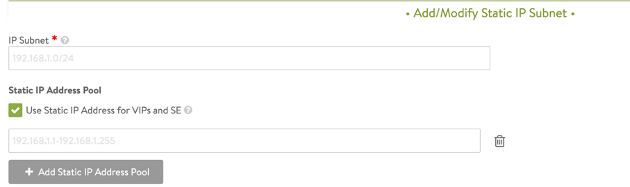
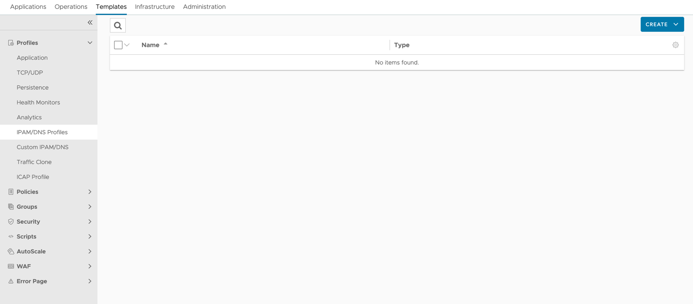
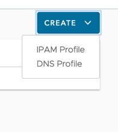
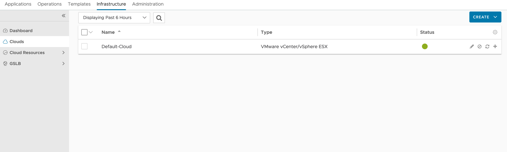

# load-balancer-and-ingress-service

This package provides NSX Advanced Load Balancer.

## Components

* load-balancer-and-ingress-service provide L4-L7 load balancing for applications deployed in a kubernetes cluster for north-south traffic.
* load-balancer-and-ingress-service ingests the K8s objects and construct corresponing objects in Avi, then programs the datapath.

## Supported Providers

The following tables shows the providers this package can work with. Other cloud provider support will be added  
in the future.

| AWS  |  Azure  | vSphere  | GCP |
|:---:|:---:|:---:|:---:|
|  ✅ |  ✅  | ✅  |  ✅  |

## Mailing lists

* Use [tkg-infrax-akita](mailto:tkg-infrax-akita@groups.vmware.com) to report security concerns to the AKO Team,
  who is responsible for maintenance and bug fixes

[comment]: <> (* Join the[AKO Distributors]&#40;mailto:tkg-infrax-akita@groups.vmware.com&#41; mailing list for early private information and vulnerability disclosure. )

[comment]: <> (Early disclosure may include mitigating steps and additional information on security patch releases.)

[comment]: <> (* Send new membership requests to tkg-infrax-akita@groups.vmware.com.)

[comment]: <> (In the body of your request please specify how you qualify for)

[comment]: <> (membership and fulfill each criterion listed in the Membership Criteria section above.)

## Installation of AVI controller

load-balancer-and-ingress-service(Avi) supports different cloud infrastructure and we use vsphere as example in the following setup.
Please refer to the following documents if you are using a different cloud infrastructure.

* [vsphere](https://avinetworks.com/docs/21.1/installing-avi-vantage-for-vmware-vcenter/)
* [AWS](https://avinetworks.com/docs/21.1/installing-avi-vantage-in-amazon-web-services/)
* [Azure](https://avinetworks.com/docs/latest/installing-avi-controller-in-microsoft-azure/)
* [GCP](https://avinetworks.com/docs/21.1/avi-deployment-guide-for-google-cloud-platform-gcp/)

### Prerequisites

* Before proceeding, make sure you have a running management cluster on vSphere
following the [steps](https://tanzucommunityedition.io/docs/v0.11/verify-deployment/). Verify it is running with `tanzu management-cluster get`.
* Have access to AVI controller image(vsphere ova, aws ami, azure vm image) deployed and all the network in cloud infrastructure pre-configured for the desired user case.

### Deploy AVI controller on Vsphere

* Access the Avi Networks portal from the Tanzu Kubernetes Grid downloads page.
* In the VMware NSX Advanced Load Balancer row, click Go to Downloads.
* Click Download Now to go the NSX Advanced Load Balancer Customer Portal.
* In the customer portal, go to Software and then choose 20.1.6.
* Other supported version are 20.1.3, 20.1.6, 20.1.7 and 21.1.x
* Scroll down to VMware, and click the download button for Controller OVA.
* Once you have found the image upload it vCenter
* Note: In the example we are using the newer version of 21.1.2, but the idea is the same with the difference in user interface.

* Following the wizard to deploy VM
* Filling the following field if any of these are setup otherwise skip them

* Once you have successfully deployed the VM, power it on and wait for it to shows an IP address
* Wait couple minutes at this point for controller to fully start up
* You might see the following error, at this point all you have to do is just wait

* The Avi Controller will eventually come online, and the first hint is a warning about the TLS certificate

* Accept and continue and you will find the first time user setup page

* Enter password to finish setup

* Enter the passphrase and follow the prompt for more specific setup please take a look the [documentation](https://docs.vmware.com/en/VMware-Tanzu-Kubernetes-Grid/1.4/vmware-tanzu-kubernetes-grid-14/GUID-mgmt-clusters-install-nsx-adv-lb.html#install-avi-controller-on-vcenter-server-7).
* You should the see the following page afterwards

* Next we need to setup cloud we are connecting to
* Navigate to infrastructure tab, select cloud and click on the pen icon, enter the ip, username, password for vcenter


* If everything works it should connect and you will see this page

* Follow the wizard and set up datacenter and network

* Examples of a network setup


### Extra configuration for AVI controller

#### Installing license(opitional)

Avi controllers should come with trial license, you can skip if AVI is only used for evaluation

* Next we need to configure licence for the AVI controller.
* Navigate to the Administration and click on settings, under settings you will find the licensing tab.

* If you have a license number or license file you can upload it, it will show up under licenses afterwards

* Depends on the need you may need to switch license type depending on your need, click the shown icon below.

* After which you will see this page and choose the license based on your need and click save afterward and license will switch.


#### VIP network configuration

This sections describes how to configure the Avi Controller to place virtual services on a specific Virtual IP (VIP) network

* First navigate to the infrastructure, and cloud resources and then networks.

* In this case we use the VM network as an example we add a new subnet.

* Click on the subnet button and you should be able to see the following to pop up,
add your subnet here and click on add static IP address Pool

Add the static IPs for this specific subnet, it can be a single ip or a range. But should always be
in format of x.x.x.x-x.x.x.x and click on save. You should be able to see the newly added subnet under
the network section.


#### IPAM configuration

This section illustrates how to configure Avi to use IPAM for assigning VIPs to virtual services

* Click on the templates, and then profiles and then click on the IPAM/DNS Profiles.

* Then click on the create and select IPAM profile

* For the name we use `Default-IPAM` here, for `Cloud for Usabel Network` click on the drop-down menu
and select the Default-cloud which is the cloud we connected to. Next select `Usable Network` from
drop-down menu, and click on the save button

* Once the IPAM profile is configured we need to add it to the Clouds, navigate the following page:
infrastructure -> Clouds, and click on the pencil icon to edit.

* Go the IPAM/DNS section, under `IPAM Profile` click on the drop-down menu and select the IPAM we just created,
click save afterwards


### Installation

Fetch a list of available versions.

```shell
tanzu package available list load-balancer-and-ingress-service.tanzu.vmware.com -n tkg-system
```

The ako package with specified version and values can be installed with the Tanzu package CLI.
Refer to [next section](#configuration-values) for a detailed list of configuration values in `values.yaml`.

```shell
tanzu package install load-balancer-and-ingress-service --values-file values.yaml \
  --package-name load-balancer-and-ingress-service.community.tanzu.vmware.com \
  --version 1.4.3 --namespace tkg-system
```

Verify the ako app has reconciled successfully in the management cluster, by asserting the following grep is non-empty.

```shell
kubectl get apps -A | grep ako-0
```

### Removal

Issue a package delete command with the Tanzu package CLI to remove ako. For example,

```shell
tanzu package installed delete ako --namespace avi-system
```

## Configuration

The following configuration values can be set to customize the load-balancer-and-ingress-service installation.
a configuration should look like following, the field that has value are the required field.

```yaml
loadBalancerAndIngressService:
  name: ako-default-wc-1
  namespace: avi-system
  config:
    is_cluster_service: false
    replica_count: 1
    ako_settings:
      log_level: INFO
      full_sync_frequency: 1800
      api_server_port: 8080
      delete_config: false
      disable_static_route_sync:  true
      cluster_name: default-wc-1
      cni_plugin: antrea
      sync_namespace:
    network_settings:
      subnet_ip: 10.193.32.0
      subnet_prefix: 19
      network_name: VM Network
      node_network_list: ""
      vip_network_list: "[]"
    l7_settings:
      disable_ingress_class: true
      default_ing_controller: false
      l7_sharding_scheme:
      service_type: NodePort
      shard_vs_size: SMALL
      pass_through_shardsize:
    l4_settings:
      default_domain:
    controller_settings:
      service_engine_group_name: Default-Group
      controller_version:
      cloud_name: Default-Cloud
      controller_ip: 10.193.44.127
    nodeport_selector:
      key:
      value:
    resources:
      limits:
        cpu: 250m
        memory: 300Mi
      request:
        cpu: 100m
        memory: 200Mi
    rbac:
      psp_enabled: false
      psp_policy_api_version:
    persistent_volume_claim:
    mount_path:
    log_file:
```

### Global

| Value | Required/Optional | Description |
|-------|-------------------|-------------|
| `name` | Required | describes the name of configuration.  |
| `namespace` | Required | describes which namespace ako will be deployed in. |
| `is_cluster_service` | Optional | describes if AKO is running in Kubernetes cluster. |
| `replica_count` | Required | describes the number of pods in AKO statefulset. |
| `ako_settings_log_level` | Optional | describes AKO log level, enum: INFO,DEBUG,WARN,ERROR. |
| `ako_settings_full_sync_frequency` | Required | describes how often AKO polls the Avi controller to update itself with cloud configurations. |
| `ako_settings_api_server_port` | Optional | describes internal port for AKO's API server for the liveness probe of the AKO pod default=8080. |
| `ako_settings_delete_config` | Required | describes if user wants to delete AKO created objects from AVI or not. |
| `ako_settings_disable_static_route_sync` | Required | describes ako should sync static routing or not. |
| `ako_settings_cluster_name` | Required | speficies the AVI Cloud AKO will be deployed with. |
| `ako_settings_cni_plugin` | Optional | describes which cni plugin cluster is using. |
| `ako_settings_sync_namespace` | Optional | describes should AKO sync objects from this namespace   |
| `network_settings_subnet_ip` | Required | describes the Data Networks gateway the AKO will be deployed with. |
| `network_settings_subnet_prefix` | Required | describes the Data Networks mask the AKO will be deployed with. |
| `network_settings_network_name` | Required | describes the Data Networks the AKO will be deployed with. |
| `network_settings_node_network_list` | Optional | describes the details of network and CIDRs are used in pool placement network for vcenter cloud. |
| `network_settings_vip_network_list` | Required | describes network name of the VIP network |
| `l7_settings_disable_ingress_class` | Required | DisableIngressClass will prevent AKO Operator to install AKO IngressClass into workload clusters for old version of K8s. |
| `l7_settings_default_ing_controller` | Optional | describes ako is the default ingress controller to use. |
| `l7_settings_l7_sharding_scheme` | Optional | describes the hostname. |
| `l7_settings_service_type` | Optional | describes ingress methods for a service. enum NodePort,ClusterIP,NodePortLocal |
| `l7_settings_shard_vs_size` | Optional | describes ingress shared virtual service size. |
| `l7_settings_pass_through_shardsize` | Optional | describes the passthrough virtualservice numbers, ENUMs: LARGE, MEDIUM, SMALL |
| `l4_settings_default_domain` | Optional | describes default sub-domain to use for L4 VSes. |
| `controller_settings_service_engine_group_name` | Required | the group name of Service Engine that's to be used by the set of AKO Deployments. |
| `controller_settings_controller_version` | Required | describes The controller API version. |
| `controller_settings_cloud_name` | Required | the configured cloud name on the Avi controller. |
| `controller_settings_controller_ip` | Required | Avi controller ip. |
| `nodeport_selector_key` | Optional | Only applicable if serviceType is NodePort. |
| `nodeport_selector_value` | Optional | Only applicable if serviceType is NodePort. |
| `resources_limits_cpu` | Required | describes AKO statefulset cpu resources limitation. |
| `resources_limits_memory` | Required | describes AKO statefulset memory resources limitation. |
| `resources_request_cpu` | Required | describes AKO statefulset requests cpu resources. |
| `resources_request_memory` | Required | describes AKO statefulset requests memory resources. |
| `rbac_psp_enabled` | Required | describes if creates the pod security policy. |
| `rbac_psp_policy_api_version` | Optional | describes which api version should be use if pod secrurity policy is enabled. |
| `persistent_volume_claim` | Optional | describes which PVC using for AKO. |
| `mount_path` | Optional | describes AKO logs mount path. |
| `log_file` | Optional | describes where to store AKO logs. |

## Usage Example

This walkthrough guides you through using load-balancer-and-ingress-service...

### Verify your configurations

After the package is installed and reconcile successfully, configmap for ako are deployed.  
You can list and inspect them with `kubectl get cm -A`. They are the configuration interfaces for the ako.

In the management cluster, ensure that there is no error level message in the ako manage log.

```shell
# retrieve the pod name of the ako manager
kubectl get pods -n avi-system

# check if the log is error-free.
kubectl logs ako-0 -n avi-system
```

### Create an L4 Service in management cluster

Deploy a `LoadBalancer` type of service with the following manifest.

```shell
$ cat <<EOF >sample-svc.yaml
---
apiVersion: apps/v1
kind: Deployment
metadata:
  name: corgi-test
  labels:
    corgi: test
spec:
  selector:
    matchLabels:
      corgi: test
  template:
    metadata:
      labels:
        corgi: test
    spec:
      containers:
        - name: nginx
          image: dockerhub/nginx
          ports:
            - containerPort: 80

---
apiVersion: v1
kind: Service
metadata:
  name: corgi-test
spec:
  type: LoadBalancer
  selector:
    corgi: test
  ports:
    - nodePort: 30008
      port: 80
      targetPort: 80
EOF
```

After that, verify that the service has been assigned an external IP using `kubectl`. Visit the AVI controller
dashboard at `http://<avi_controller_ip or FQDN>` and ensure a virtual service has been created accordingly for this deployment.

```shell
$ kubectl get svc
NAME         TYPE           CLUSTER-IP       EXTERNAL-IP     PORT(S)        AGE
corgi-test   LoadBalancer   100.67.166.194   10.191.167.75   80:30008/TCP   103s
```


