# load-balancer-and-ingress-service

This package provides NSX Advanced Load Balancer.

## Components

* load-balancer-and-ingress-service provide L4-L7 load balancing for applications deployed in a kubernetes cluster for north-south traffic.
* load-balancer-and-ingress-service ingests the K8s objects and construct corresponing objects in Avi, then programs the datapath.

## Supported Providers

The following tables shows the providers this package can work with. Other cloud provider support will be added  
in the future.

| AWS  |  Azure  | vSphere  | GCP |
|:---:|:---:|:---:|:---:|
|  ✅ |  ✅  | ✅  |  ✅  |

## Mailing lists

* Use [tkg-infrax-akita](mailto:tkg-infrax-akita@groups.vmware.com) to report security concerns to the AKO Team,
  who is responsible for maintenance and bug fixes

[comment]: <> (* Join the[AKO Distributors]&#40;mailto:tkg-infrax-akita@groups.vmware.com&#41; mailing list for early private information and vulnerability disclosure.)

[comment]: <> (  Early disclosure may include mitigating steps and additional information on security patch releases.)

[comment]: <> (* Send new membership requests to tkg-infrax-akita@groups.vmware.com.)

[comment]: <> (  In the body of your request please specify how you qualify for)

[comment]: <> (  membership and fulfill each criterion listed in the Membership Criteria section above.)

## Installation of AVI controller

load-balancer-and-ingress-service(Avi) supports different cloud infrastructure and we use vsphere as example in the following setup.
Please refer to the following documents if you are using a different cloud infrastructure.

* [vsphere](https://avinetworks.com/docs/21.1/installing-avi-vantage-for-vmware-vcenter/)
* [AWS](https://avinetworks.com/docs/21.1/installing-avi-vantage-in-amazon-web-services/)
* [Azure](https://avinetworks.com/docs/latest/installing-avi-controller-in-microsoft-azure/)
* [GCP](https://avinetworks.com/docs/21.1/avi-deployment-guide-for-google-cloud-platform-gcp/)

### Prerequisites

* Before proceeding, make sure you have a running management cluster on vSphere
  following the [steps](https://tanzucommunityedition.io/docs/v0.11/verify-deployment/). Verify it is running with `tanzu management-cluster get`.
* Have access to AVI controller image(vsphere ova, aws ami, azure vm image) deployed and all the network in cloud infrastructure pre-configured for the desired user case.

### Deploy VM with Avi controller

* Access the Avi Networks portal from the Tanzu Kubernetes Grid downloads page.
* In the VMware NSX Advanced Load Balancer row, click Go to Downloads.
* Click Download Now to go the NSX Advanced Load Balancer Customer Portal.
* In the customer portal, go to Software and then choose 20.1.6.
* Other supported version are 20.1.3, 20.1.6, 20.1.7 and 21.1.x
* Scroll down to VMware, and click the download button for Controller OVA.
* Once you have found the image upload it vCenter
* Note: In the example we are using the newer version of 21.1.2, but the idea is the same with the difference in user interface.
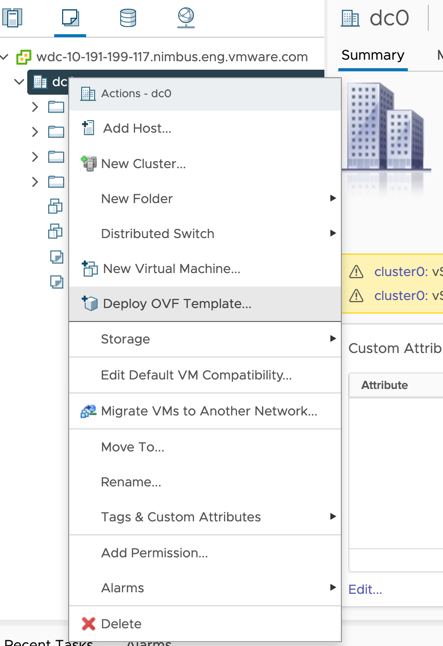
* Following the wizard to deploy VM
* Filling the following field if any of these are setup otherwise skip them
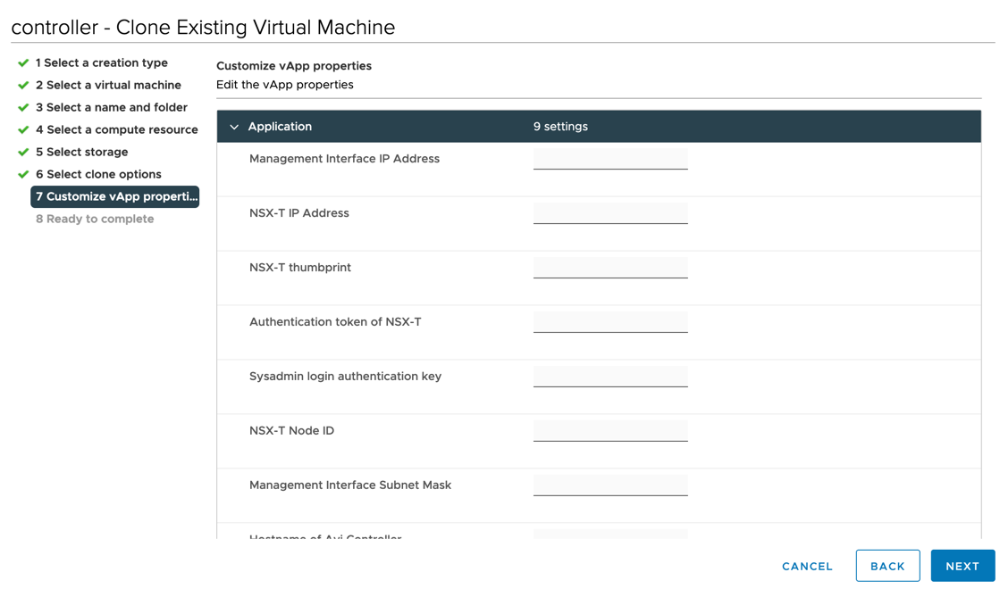
* Once you have successfully deployed the VM, power it on and wait for it to shows an IP address
* Wait couple minutes at this point for controller to fully start up
* You might see the following error, at this point all you have to do is just wait

* The Avi Controller will eventually come online, and the first hint is a warning about the TLS certificate

* Accept and continue and you will find the first time user setup page
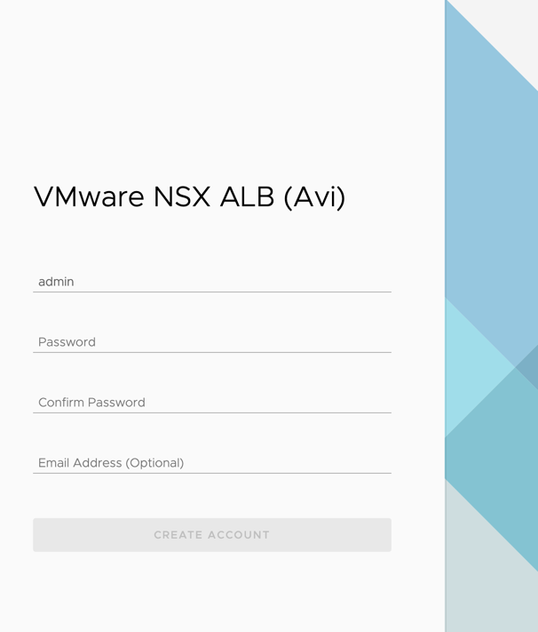
* Enter password to finish setup
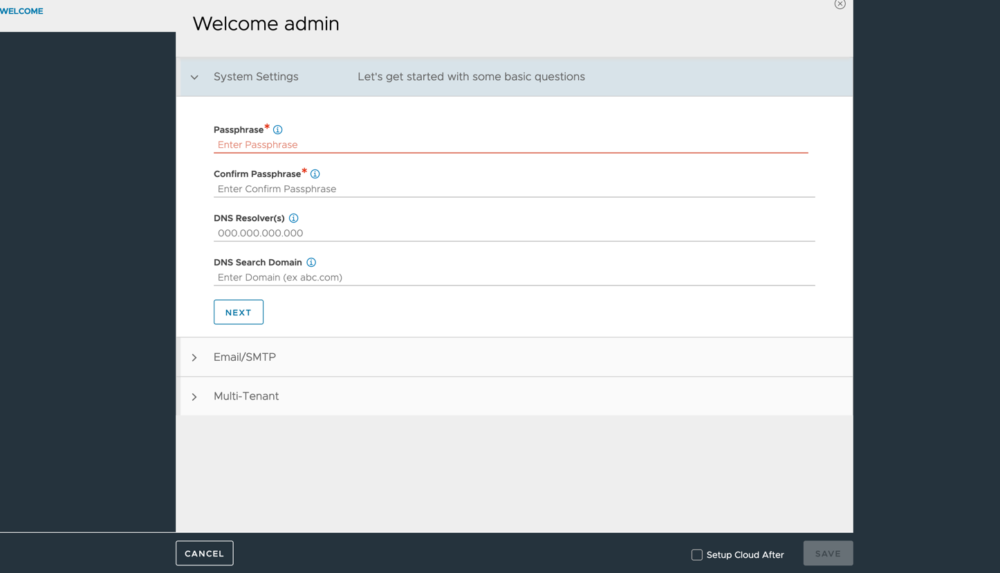
* Enter the passphrase and follow the prompt for more specific setup please take a look the [documentation](https://docs.vmware.com/en/VMware-Tanzu-Kubernetes-Grid/1.4/vmware-tanzu-kubernetes-grid-14/GUID-mgmt-clusters-install-nsx-adv-lb.html#install-avi-controller-on-vcenter-server-7).
* You should the see the following page afterwards
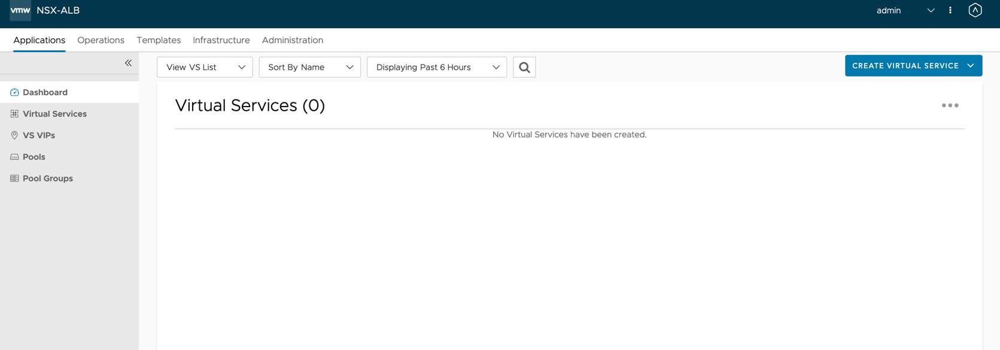
* Next we need to setup cloud we are connecting to
* Navigate to infrastructure tab, select cloud and click on the pen icon, enter the ip, username, password for vcenter


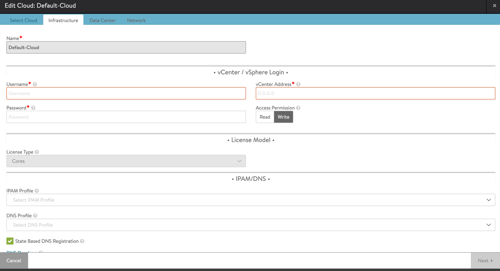
* If everything works it should connect and you will see this page
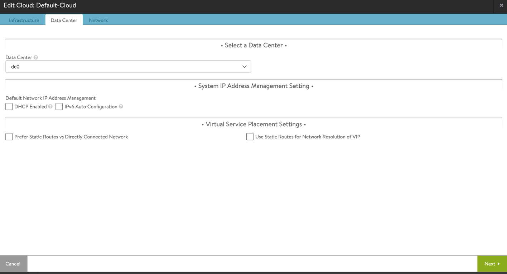
* Follow the wizard and set up datacenter and network
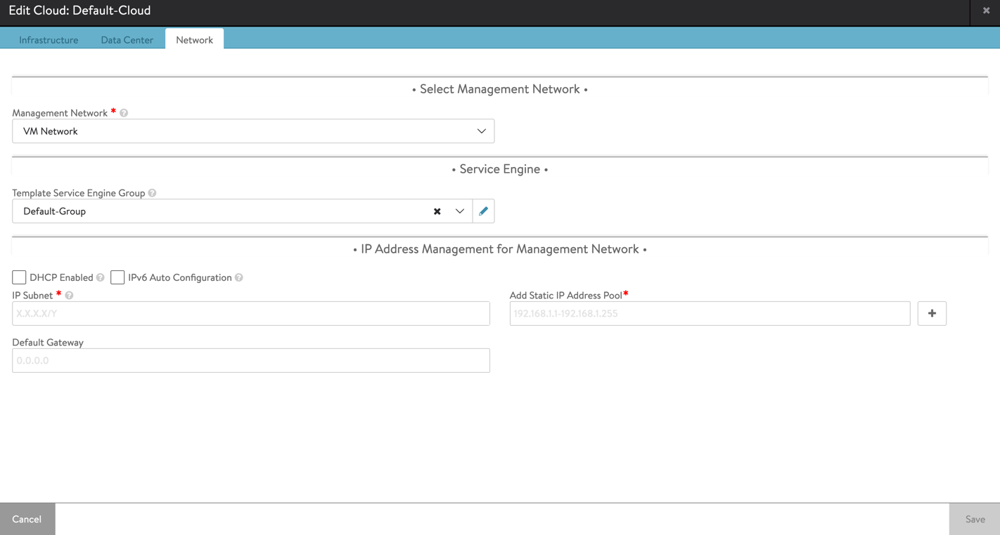
* Examples of a network setup
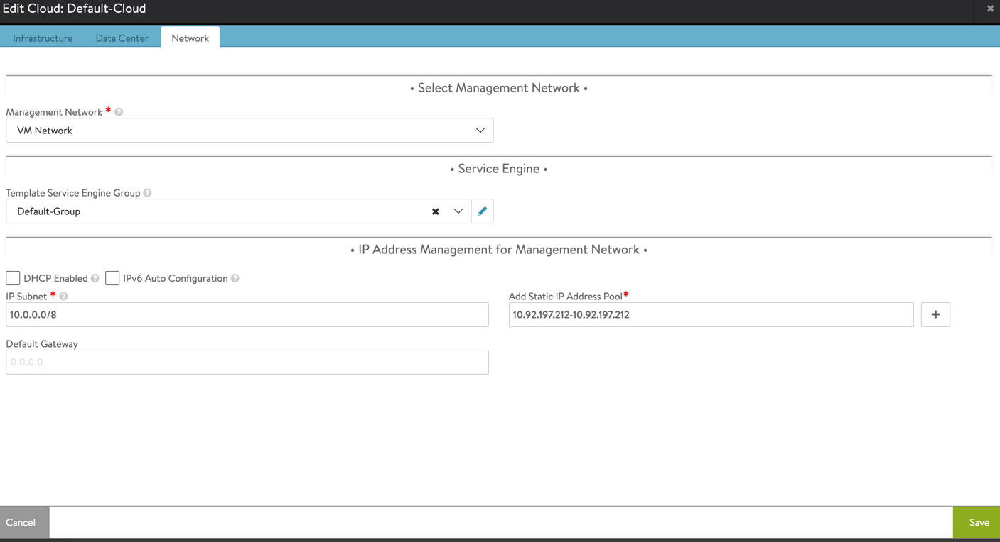

### Extra configuration for AVI controller

#### Installing license(opitional)

Avi controllers should come with trial license, you can skip if AVI is only used for evaluation

* Next we need to configure licence for the AVI controller.
* Navigate to the Administration and click on settings, under settings you will find the licensing tab.

* If you have a license number or license file you can upload it, it will show up under licenses afterwards
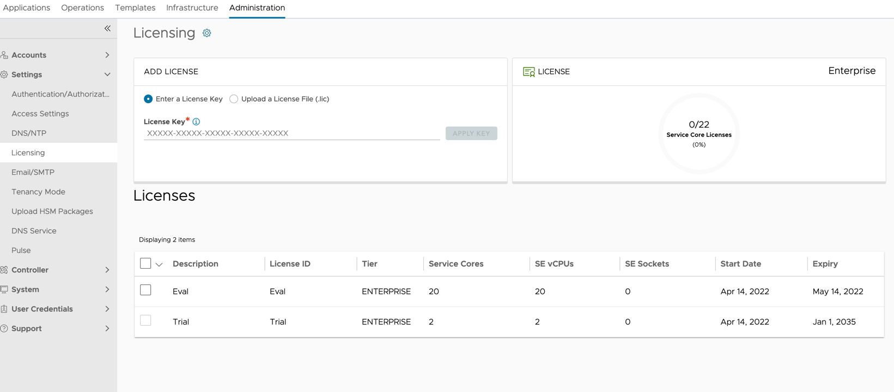
* Depends on the need you may need to switch license type depending on your need, click the shown icon below.

* After which you will see this page and choose the license based on your need and click save afterward and license will switch.
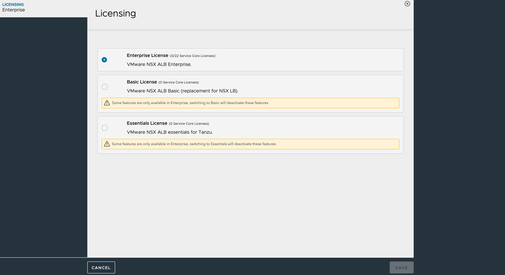

#### VIP network configuration

This sections describes how to configure the Avi Controller to place virtual services on a specific Virtual IP (VIP) network

* First navigate to the infrastructure, and cloud resources and then networks.

* In this case we use the VM network as an example we add a new subnet.
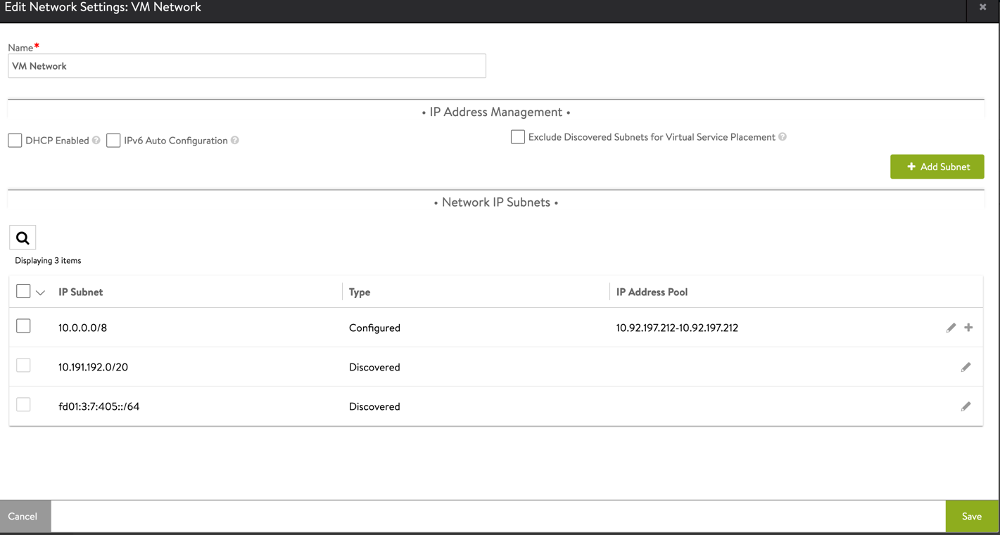
* Click on the subnet button and you should be able to see the following to pop up,
  add your subnet here and click on add static IP address Pool

* Add the static IPs for this specific subnet, it can be a single ip or a range. But should always be
  in format of x.x.x.x-x.x.x.x and click on save. You should be able to see the newly added subnet under
  the network section.


#### IPAM configuration

This section illustrates how to configure Avi to use IPAM for assigning VIPs to virtual services

* Click on the templates, and then profiles and then click on the IPAM/DNS Profiles.
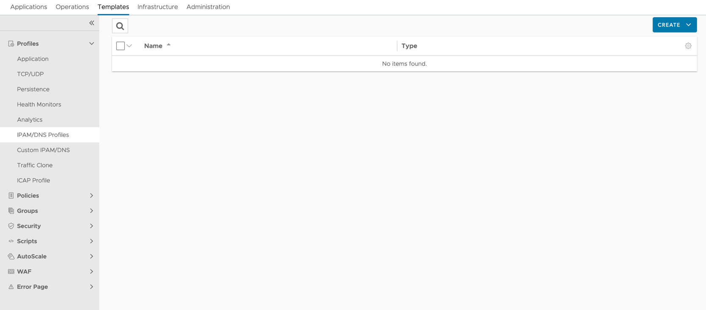
* Then click on the create and select IPAM profile
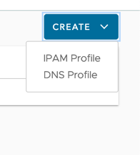
* For the name we use `Default-IPAM` here, for `Cloud for Usabel Network` click on the drop-down menu
  and select the Default-cloud which is the cloud we connected to. Next select `Usable Network` from
  drop-down menu, and click on the save button
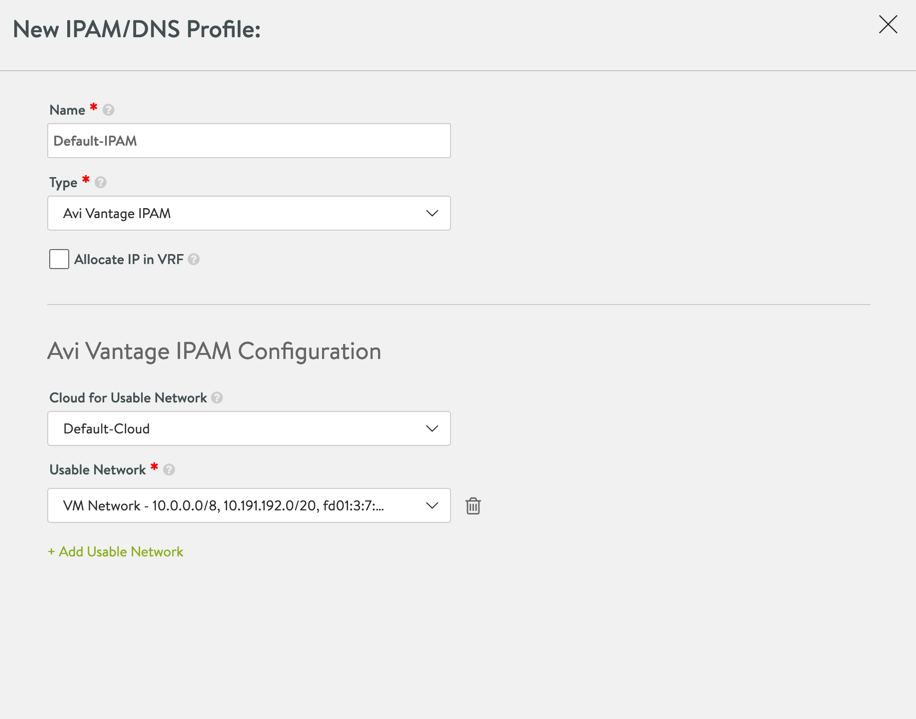
* Once the IPAM profile is configured we need to add it to the Clouds, navigate the following page:
  infrastructure -> Clouds, and click on the pencil icon to edit.

* Go the IPAM/DNS section, under `IPAM Profile` click on the drop-down menu and select the IPAM we just created,
  click save afterwards


### Installation

Fetch a list of available versions.

```shell
tanzu package available list load-balancer-and-ingress-service.tanzu.vmware.com -n tkg-system
```

The ako package with specified version and values can be installed with the Tanzu package CLI.
Refer to [next section](#configuration-values) for a detailed list of configuration values in `values.yaml`.

```shell
tanzu package install load-balancer-and-ingress-service --values-file values.yaml \
  --package-name load-balancer-and-ingress-service.community.tanzu.vmware.com \
  --version 1.8.2 --namespace tkg-system
```

Verify the ako app has reconciled successfully in the management cluster, by asserting the following grep is non-empty.

```shell
kubectl get apps -A | grep ako-0
```

### Removal

Issue a package delete command with the Tanzu package CLI to remove ako. For example,

```shell
tanzu package installed delete ako --namespace avi-system
```

## Configuration

The following configuration values can be set to customize the load-balancer-and-ingress-service installation.
a configuration should look like following, the field that has value are the required field.

```yaml
loadBalancerAndIngressService:
  name: ako-default-wc-1
  namespace: avi-system
  config:
    is_cluster_service: false
    replica_count: 1
    ako_settings:
      log_level: INFO
      full_sync_frequency: 1800
      api_server_port: 8080
      delete_config: false
      disable_static_route_sync:  true
      cluster_name: default-wc-1
      cni_plugin: antrea
      sync_namespace:
    network_settings:
      subnet_ip: 10.193.32.0
      subnet_prefix: 19
      network_name: VM Network
      node_network_list: ""
      vip_network_list: "[]"
    l7_settings:
      disable_ingress_class: true
      default_ing_controller: false
      l7_sharding_scheme:
      service_type: NodePort
      shard_vs_size: SMALL
      pass_through_shardsize:
    l4_settings:
      default_domain:
    controller_settings:
      service_engine_group_name: Default-Group
      controller_version:
      cloud_name: Default-Cloud
      controller_ip: 10.193.44.127
    nodeport_selector:
      key:
      value:
    resources:
      limits:
        cpu: 250m
        memory: 300Mi
      request:
        cpu: 100m
        memory: 200Mi
    rbac:
      psp_enabled: false
      psp_policy_api_version:
    persistent_volume_claim:
    mount_path:
    log_file:
```

### Global

| Value | Required/Optional | Description |
|-------|-------------------|-------------|
| `name` | Required | describes the name of configuration.  |
| `namespace` | Required | describes which namespace ako will be deployed in. |
| `is_cluster_service` | Optional | describes if AKO is running in Kubernetes cluster. |
| `replica_count` | Required | describes the number of pods in AKO statefulset. |
| `ako_settings_log_level` | Optional | describes AKO log level, enum: INFO,DEBUG,WARN,ERROR. |
| `ako_settings_full_sync_frequency` | Required | describes how often AKO polls the Avi controller to update itself with cloud configurations. |
| `ako_settings_api_server_port` | Optional | describes internal port for AKO's API server for the liveness probe of the AKO pod default=8080. |
| `ako_settings_delete_config` | Required | describes if user wants to delete AKO created objects from AVI or not. |
| `ako_settings_disable_static_route_sync` | Required | describes ako should sync static routing or not. |
| `ako_settings_cluster_name` | Required | speficies the AVI Cloud AKO will be deployed with. |
| `ako_settings_cni_plugin` | Optional | describes which cni plugin cluster is using. |
| `ako_settings_enable_EVH` | Optional | describes enabling the Enhanced Virtual Hosting Model in Avi Controller for the Virtual Services or not, default value is false. |
| `ako_settings_l7_only` | Optional | describes if you want AKO only to do layer 7 load balancing. Default value is false. |
| `ako_settings_sync_namespace` | Optional | describes should AKO sync objects from this namespace   |
| `ako_settings_namespace_selector_key` | Optional | describes the namespace selector key. namespace_selector used for namespace migration, same label has to be present on namespace/s which needs migration/sync to AKO.|
| `ako_settings_namespace_selector_value` | Optional | describes the namespace selector key. namespace_selector used for namespace migration, same label has to be present on namespace/s which needs migration/sync to AKO. |
| `ako_settings_services_API` | Optional | describes if enables AKO in services API mode. Default value is false. |
| `network_settings_subnet_ip` | Required | describes the Data Networks gateway the AKO will be deployed with. |
| `network_settings_subnet_prefix` | Required | describes the Data Networks mask the AKO will be deployed with. |
| `network_settings_network_name` | Required | describes the Data Networks the AKO will be deployed with. |
| `network_settings_control_plane_network_name` | Required | describes the Control Plane Networks of the cluster. |
| `network_settings_node_network_list` | Optional | describes the details of network and CIDRs are used in pool placement network for vcenter cloud. |
| `network_settings_bgp_peer_labels` | Optional | describes BGP peers, this is used for selective VsVip advertisement. |
| `network_settings_enable_RHI` | Optional | describes the cluster wide setting for BGP peering. Default value is false. |
| `network_settings_vip_network_list` | Required | describes network name of the VIP network |
| `l7_settings_disable_ingress_class` | Required | DisableIngressClass will prevent AKO Operator to install AKO IngressClass into workload clusters for old version of K8s. |
| `l7_settings_default_ing_controller` | Optional | describes ako is the default ingress controller to use. |
| `l7_settings_l7_sharding_scheme` | Optional | describes the hostname. |
| `l7_settings_service_type` | Optional | describes ingress methods for a service. enum NodePort,ClusterIP,NodePortLocal |
| `l7_settings_shard_vs_size` | Optional | describes ingress shared virtual service size. |
| `l7_settings_pass_through_shard_size` | Optional | describes the passthrough virtualservice numbers, ENUMs: LARGE, MEDIUM, SMALL |
| `l4_settings_default_domain` | Optional | describes default sub-domain to use for L4 VSes. |
| `l4_settings_advanced_l4` | Optional | describes the settings for the services API usage. Default value is false. |
| `l4_settings_auto_FQDN` | Optional | describes the FQDN generation. Valid value should be default(svc.ns.subdomain), flat (svc-ns.subdomain) or disabled, default values is disabled. |
| `controller_settings_service_engine_group_name` | Required | the group name of Service Engine that's to be used by the set of AKO Deployments. |
| `controller_settings_controller_version` | Required | describes The controller API version. |
| `controller_settings_cloud_name` | Required | the configured cloud name on the Avi controller. |
| `controller_settings_controller_ip` | Required | Avi controller ip. |
| `nodeport_selector_key` | Optional | Only applicable if serviceType is NodePort. |
| `nodeport_selector_value` | Optional | Only applicable if serviceType is NodePort. |
| `resources_limits_cpu` | Required | describes AKO statefulset cpu resources limitation. |
| `resources_limits_memory` | Required | describes AKO statefulset memory resources limitation. |
| `resources_request_cpu` | Required | describes AKO statefulset requests cpu resources. |
| `resources_request_memory` | Required | describes AKO statefulset requests memory resources. |
| `rbac_psp_enabled` | Required | describes if creates the pod security policy. |
| `rbac_psp_policy_api_version` | Optional | describes which api version should be use if pod secrurity policy is enabled. |
| `persistent_volume_claim` | Optional | describes which PVC using for AKO. |
| `mount_path` | Optional | describes AKO logs mount path. |
| `log_file` | Optional | describes where to store AKO logs. |
| `avi_credentials_username` | Required | describes username that addon manager will use to deploy avi secret. |
| `avi_credentials_password` | Required | describes password that addon manager will use to deploy avi secret. |
| `avi_credentials_certificate_authority_data` | Required | describes certificate_authority_data that addon manager will use to deploy avi secret. |

## Usage Example

This walkthrough guides you through using load-balancer-and-ingress-service...

### Verify your configurations

After the package is installed and reconcile successfully, configmap for ako are deployed.  
You can list and inspect them with `kubectl get cm -A`. They are the configuration interfaces for the ako.

In the management cluster, ensure that there is no error level message in the ako manage log.

```shell
# retrieve the pod name of the ako manager
kubectl get pods -n avi-system

# check if the log is error-free.
kubectl logs ako-0 -n avi-system
```

### Create an L4 Service in management cluster

Deploy a `LoadBalancer` type of service with the following manifest.

```shell
$ cat <<EOF >sample-svc.yaml
---
apiVersion: apps/v1
kind: Deployment
metadata:
  name: corgi-test
  labels:
    corgi: test
spec:
  selector:
    matchLabels:
      corgi: test
  template:
    metadata:
      labels:
        corgi: test
    spec:
      containers:
        - name: nginx
          image: dockerhub/nginx
          ports:
            - containerPort: 80

---
apiVersion: v1
kind: Service
metadata:
  name: corgi-test
spec:
  type: LoadBalancer
  selector:
    corgi: test
  ports:
    - nodePort: 30008
      port: 80
      targetPort: 80
EOF
```

After that, verify that the service has been assigned an external IP using `kubectl`. Visit the AVI controller
dashboard at `http://<avi_controller_ip or FQDN>` and ensure a virtual service has been created accordingly for this deployment.

```shell
$ kubectl get svc
NAME         TYPE           CLUSTER-IP       EXTERNAL-IP     PORT(S)        AGE
corgi-test   LoadBalancer   100.67.166.194   10.191.167.75   80:30008/TCP   103s
```


