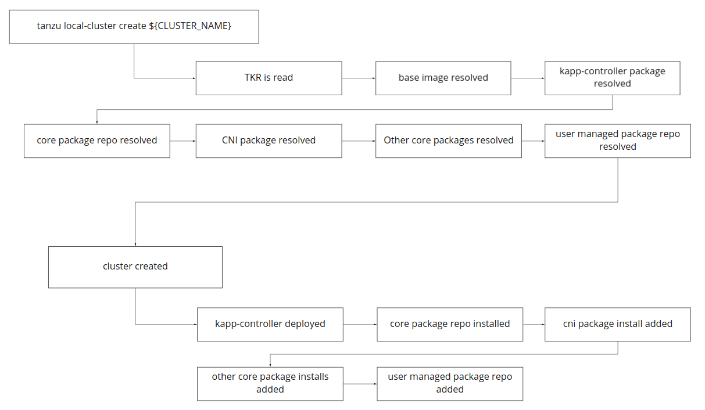

# Standalone

Standalone is a `tanzu` plugin that manages standalone, or static, Tanzu clusters. It is ideal for
local workstation or single node deployments. It is not meant for production workloads and does not
offer cluster-lifecycle capabilities. For needs involving cluster-lifecycle, use the 
`tanzu management-cluster` feature.

This project is currently 
[under proposal](https://github.com/vmware-tanzu/community-edition/issues/2266) and users should 
expect instability.

## Usage

### Setup
_**Pre-reqs**: Currently, you must have docker available on the workstation you're
using `standalone`. This could be in the form of the docker daemon (Linux) or Docker Desktop 
(Mac/Windows)._

1. Download the (unsigned) binary.
 
    * [Linux]()
    * [Windows]()
    * [Mac (Darwin 64)]()

### Create a cluster

1. Create a cluster.

    ```sh
    tanzu standalone create hello
    ```
    > `hello` is the cluster name.

### List clusters

1. List clusters.

    ```sh
    tanzu standalone ls
    ```
   
### Delete a cluster

1. Delete clusters.

    ```sh
    tanzu standalone delete hello
    ```
    > `hello` is the cluster name.

### Provide Custom Configuration

1. Generate a config file with defaults

    ```sh
    tanzu standalone configure hello
    ```
   > `hello` is the cluster name and will generate `./hello.yaml`.

1. Modify the configuration (`hello.yaml`) as desired.

1. Create the cluster with the custom configuration.

    ```sh
    tanzu standalone create hello -f hello.yaml
    ```

## Standalone as an API

While `standalone` provides cluster creation ability, it can also be called programmatically to 
install standalone Tanzu atop any arbitrary cluster. This can be especially compelling for projects
that handle the underlying provisioning of VM and container runtime and are looking for the
higher-level Tanzu bits to run atop.

## Design Details

Local cluster is a deployment model of community-edition where we aim to run a
Tanzu cluster on a single node. It supersedes an old model of cluster deployment
referred to as standalone clusters. You can [read about our deprecation plan
here](#deprecation-of-standalone-clusters).

## Local Cluster

A local cluster aims to replicate a Tanzu distribution in a local environment.
Tanzu distributions are encapsulated in `TanzuKubernetesRelease`s, which
specify the various components that make up the distribution. An example could
be, Kubernetes versions (by way of host image), CNI (antrea, calico, etc), and
kapp-controller.

### Deployment Infrastructure

A local cluster uses [kind](https://kind.sigs.k8s.io) as the lower-level
subsystem. We embed kind in our `local-cluster` binary. In order to use this
plugin, pre-reqs must be setup such as Docker and, if not running Linux, a
relevant Linux VM where Docker and its transitive dependencies can run.

The local cluster plugin does not aim to manage the full stack, from the host
and above. Meaning it is not mean to compete with Fusion, Docker Desktop, and
other related projects. It also has no affinity to kind or Docker, however the
initial model does leverage kind exclusively.

### Creating Clusters

To create a cluster, the following command is run.

```sh
tanzu local-cluster create ${CLUSTER_NAME}
```

To create this Tanzu cluster, we must first introspect the
`TanzuKubernetesRelease` to understand which components should be installed.
The TKR can be found in `${HOME}/.config/tanzu/tkg/bom/tkr-bom-*`. This file
provides instructions on every detail including things like:

* The Kubernetes version / node image to use.
* The instance (config/image) of `kapp-controller` to use.
* The CNI to use along with the config/image.
* The package repositories to make available in the cluster.

Users may also wish to reference custom TKRs, which can be done using the
`--tkr` flag.

```sh
tanzu local-cluster create ${CLUSTER_NAME} --tkr ${TKR_FILE_LOCATION}
```

Local clusters are **not** managed by Cluster API. The point of a local cluster
is **not** to replicate the cluster lifecycle management of Tanzu, but rather
create a local **instance** of a Tanzu cluster.



## Deprecation of Standalone Clusters

Standalone clusters were intended to be a deployment model where we could
bootstrap cluster without needing to run a long-running management cluster. This
has a use-case, however, usage of CAPI for the local cluster use-case was far
too heavy weight. Additionally, we found that for users wishing to run a single
cluster, they were better off just creating a management cluster and deploying
workloads to that. A management cluster is capable of self-managing, so it's a
far better model than the orphaned standalone clusters we were creating. Should
the model of single, self-managing clusters, be preferred -- work should occur
in our management-cluster plugin to offer them as such.
