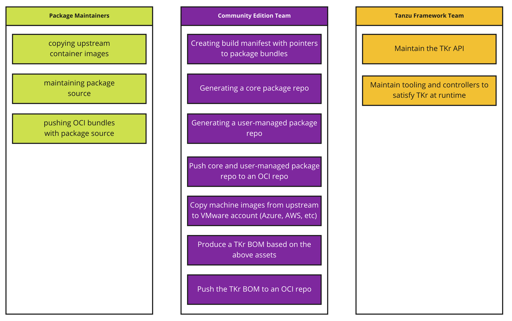

# Produce community-edition releases that are decoupled from Tanzu Kubernetes Grid

* Proposal:
  [https://github.com/vmware-tanzu/community-edition/issues/2717](https://github.com/vmware-tanzu/community-edition/issues/2717)

## Abstract

At the time of writing, Tanzu Community Edition (TCE) relies on the Bill of
Materials (BOMs) produced for VMware's paid product, Tanzu Kubernetes Grid
(TKG). This means that creation of clusters, both management and workload,
**always** use the same packages and versions as the rest of TKG. This binding
to a TKG BOM was a decision made to ensure we could release TCE. Now we are at
stage where we must unbind from TKG's BOM and begin producing TCE-specific BOMs.

### Why

Doing the above enables:

* Building and packaging in the open, rather than behind VMware's network.
* Packages that can be re-produced by users.
* Releasing Kubernetes versions ahead of TKG.
* Releasing core packages (e.g. antrea) ahead of TKG.
* Releasing core-packages specific to TCE.
* Patching TCE releases out-of-band from TKG.

## Proposal

### Creating a Core Package Repository

Today, the [TCE git
repository](https://github.com/vmware-tanzu/community-edition) only contains the
tce-main package repository. This **user-managed** repository contains packages
that are **optionally** installed by users after bootstrap.

```bash
$ crane export projects.registry.vmware.com/tce/main:stable - | tar xv
&>/dev/null && cat packages/packages.yaml | grep refName | uniq -u

  refName: external-dns.community.tanzu.vmware.com
  refName: fluent-bit.community.tanzu.vmware.com
  refName: gatekeeper.community.tanzu.vmware.com
  refName: grafana.community.tanzu.vmware.com
  refName: harbor.community.tanzu.vmware.com
  refName: knative-serving.community.tanzu.vmware.com
  refName: multus-cni.community.tanzu.vmware.com
  refName: prometheus.community.tanzu.vmware.com
  refName: velero.community.tanzu.vmware.com
```

To create a distribution of TCE, TCE must produce its own **core** package
repository. This will contain all the assets that run atop the Kubernetes layer.
For example, CSI-drivers, CNI-plugins, and metrics server. These packages are
installed during cluster bootstrapping. An example of this package repository
would be as follows.

```bash
crane export projects.registry.vmware.com/tce/core:v1.21.2_vmware.1-tkg.1 - |
tar xv | grep -i .*.yml

packages/addons-manager.community.tanzu.vmware.com/1.4.0+vmware.1-tkg.1.yml
packages/addons-manager.community.tanzu.vmware.com/metadata.yml
packages/ako-operator.community.tanzu.vmware.com/1.4.0+vmware.1-tkg.1.yml
packages/ako-operator.community.tanzu.vmware.com/metadata.yml
packages/antrea.community.tanzu.vmware.com/0.13.3+vmware.1-tkg.1.yml
packages/antrea.community.tanzu.vmware.com/metadata.yml
packages/calico.community.tanzu.vmware.com/3.11.3+vmware.1-tkg.1.yml
packages/calico.community.tanzu.vmware.com/metadata.yml
packages/kapp-controller.community.tanzu.vmware.com/0.23.0+vmware.1-tkg.1.yml
packages/kapp-controller.community.tanzu.vmware.com/metadata.yml
packages/load-balancer-and-ingress-service.community.tanzu.vmware.com/1.4.3+vmware.1-tkg.1.yml
packages/load-balancer-and-ingress-service.community.tanzu.vmware.com/metadata.yml
packages/metrics-server.community.tanzu.vmware.com/0.4.0+vmware.1-tkg.1.yml
packages/metrics-server.community.tanzu.vmware.com/metadata.yml
packages/pinniped.community.tanzu.vmware.com/0.4.4+vmware.1-tkg.1.yml
packages/pinniped.community.tanzu.vmware.com/metadata.yml
packages/vsphere-cpi.community.tanzu.vmware.com/1.21.0+vmware.1-tkg.1.yml
packages/vsphere-cpi.community.tanzu.vmware.com/metadata.yml
packages/vsphere-csi.community.tanzu.vmware.com/2.3.0+vmware.1-tkg.2.yml
packages/vsphere-csi.community.tanzu.vmware.com/metadata.yml
```

For a TCE release, generating a core package repository and pushing it is done
using the build manifest and process. See the [release
automation](#release-automation) section to understand how this is assembled.

### Producing Host Images

< TODO >

### Producing Container Images

Initially, community-edition will **not** build binaries or container images
from source. Instead, we will use the images made available by the upstream
project. To ensure retention and reference over time, upstream images
will be copied to `projects.registry.vmware.com`. This will be a responsibility
of the package maintainer(s) and accomplished using
[imgpkg](https://carvel.dev/imgpkg/).

Consider the following example, representing the release of cert-manager
`v1.6.1`. The relevant images are:

```sh
wget -q -O -
https://github.com/jetstack/cert-manager/releases/download/v1.6.1/cert-manager.yaml | grep -i image:
          image: "quay.io/jetstack/cert-manager-cainjector:v1.6.1"
          image: "quay.io/jetstack/cert-manager-controller:v1.6.1"
          image: "quay.io/jetstack/cert-manager-webhook:v1.6.1"
```

For each image, the container image is pushed to the same URI, prefixed with
`projects.registry.vmware.com/tce/packages`. The following is an example of the
`cert-manager-controller` image.

```sh
$ crane copy quay.io/jetstack/cert-manager-controller:v1.6.1 projects.registry.vmware.com/tce/packages/jetstack/cert-manager-controller:v1.6.1

2021/12/13 16:49:13 Copying from quay.io/jetstack/cert-manager-controller:v1.6.1 to projects.registry.vmware.com/tce/packages/jetstack/cert-manager-controller:v1.6.1
2021/12/13 16:49:15 existing manifest: sha256:41917b5d23b4abe3f5c34a156b1554e49e41185431361af46640580e4d6258fc
2021/12/13 16:49:16 existing blob: sha256:ec52731e927332d44613a9b1d70e396792d20a50bccfa06332a371e1c68d7785
2021/12/13 16:49:17 existing blob: sha256:dc34538f67ce001ae34667e7a528f5d7f1b7373b4c897cec96b54920a46cde65
2021/12/13 16:49:17 pushed blob: sha256:a6dbf7b27db03dd5a6e8d423d831a2574a72cc170d47fbae95318d3eeae32149
2021/12/13 16:49:57 pushed blob: sha256:29e5180199b812b0af5fe3d7cbe11787ba3234935537ec14ad0adf56847f005d
2021/12/13 16:49:58 projects.registry.vmware.com/tce/packages/jetstack/cert-manager-controller@sha256:e2be0d9dfa684e1abf5ef9b24b601b1ca6b9dd6d725342b13c18b44156518b49: digest: sha256:e2be0d9dfa684e1abf5ef9b24b601b1ca6b9dd6d725342b13c18b44156518b49 size: 947
2021/12/13 16:49:59 existing blob: sha256:ec52731e927332d44613a9b1d70e396792d20a50bccfa06332a371e1c68d7785
2021/12/13 16:49:59 existing blob: sha256:dc34538f67ce001ae34667e7a528f5d7f1b7373b4c897cec96b54920a46cde65
2021/12/13 16:50:00 pushed blob: sha256:24882da6a70629e1639eb5bff873474c56a8c794a4adeca7cde9ed3fcda12102
2021/12/13 16:50:42 pushed blob: sha256:313817109359e805c69c3824ca6bc0a4a491e8b418399f0beea479d140541973
2021/12/13 16:50:43 projects.registry.vmware.com/tce/packages/jetstack/cert-manager-controller@sha256:8898cc51a41a7848076cd7735e5a86feee734f13e802c563ef1deaafe6685040: digest: sha256:8898cc51a41a7848076cd7735e5a86feee734f13e802c563ef1deaafe6685040 size: 947
2021/12/13 16:50:44 existing blob: sha256:ec52731e927332d44613a9b1d70e396792d20a50bccfa06332a371e1c68d7785
2021/12/13 16:50:44 existing blob: sha256:dc34538f67ce001ae34667e7a528f5d7f1b7373b4c897cec96b54920a46cde65
2021/12/13 16:50:45 pushed blob: sha256:0714e6c1a7c35f6ea4fa848f83b7a8f341e3dcf44b5a5721fc569132d151a40c
2021/12/13 16:51:23 pushed blob: sha256:b68f7fa8b507c96446c17634e98eadacfac7b0473da27558ea4c9df64edd0fb6
2021/12/13 16:51:24 projects.registry.vmware.com/tce/packages/jetstack/cert-manager-controller@sha256:7a60aca7f3c33e58f722229a139514b24cee45881b4c39428ae3cc252ef3190d: digest: sha256:7a60aca7f3c33e58f722229a139514b24cee45881b4c39428ae3cc252ef3190d size: 947
2021/12/13 16:51:25 existing blob: sha256:ec52731e927332d44613a9b1d70e396792d20a50bccfa06332a371e1c68d7785
2021/12/13 16:51:25 existing blob: sha256:dc34538f67ce001ae34667e7a528f5d7f1b7373b4c897cec96b54920a46cde65
2021/12/13 16:51:26 pushed blob: sha256:19542d9fe421c98aa84668010a0842501e30f6a99007846962ec1f2bcf6f6b37
2021/12/13 16:52:14 pushed blob: sha256:2a38dfa462ca3cb493a46809d9f587c3df314c96c62697a9a23aad9782f00990
2021/12/13 16:52:14 projects.registry.vmware.com/tce/packages/jetstack/cert-manager-controller@sha256:1faa4c99e61db1e2227ca074de4e40c4e9008335f009fd6fd139c07ac4d5024b: digest: sha256:1faa4c99e61db1e2227ca074de4e40c4e9008335f009fd6fd139c07ac4d5024b size: 947
2021/12/13 16:52:15 projects.registry.vmware.com/tce/packages/jetstack/cert-manager-controller:v1.6.1: digest: sha256:fef465f62524ed89c27451752385ab69e5c35ea4bc48b62bf61f733916ea674c size: 1723
```

> `crane` is used instead of `imgpkg` because `crane` maintains the digest
> value.  it also copies **all** architectures over, so in the case of arm64,
> this is made available in the copy. The issue requesting this functionality in
> `imgpkg` is [here](https://github.com/vmware-tanzu/carvel-imgpkg/issues/310).

Using the above `copy`, the architectures are retained and digests (SHA) are
retained.

In some special cases, such as usage of a container base image with licensing
issues, the TCE team may build binaries or images and push them up rather than
the aforementioned `copy` approach.

In the future, the contents of all packages, TCE wants to build binaries and
container images from source, offering more obvious reproducibility for our users.

```sh
$ crane manifest projects.registry.vmware.com/tce/packages/jetstack/cert-manager-controller:v1.6.1 | grep -i digest

 "digest": "sha256:41917b5d23b4abe3f5c34a156b1554e49e41185431361af46640580e4d6258fc",
 "digest": "sha256:e2be0d9dfa684e1abf5ef9b24b601b1ca6b9dd6d725342b13c18b44156518b49",
 "digest": "sha256:8898cc51a41a7848076cd7735e5a86feee734f13e802c563ef1deaafe6685040",
 "digest": "sha256:7a60aca7f3c33e58f722229a139514b24cee45881b4c39428ae3cc252ef3190d",
 "digest": "sha256:1faa4c99e61db1e2227ca074de4e40c4e9008335f009fd6fd139c07ac4d5024b",

$ crane manifest quay.io/jetstack/cert-manager-controller:v1.6.1 | grep -i digest
 "digest": "sha256:41917b5d23b4abe3f5c34a156b1554e49e41185431361af46640580e4d6258fc",
 "digest": "sha256:e2be0d9dfa684e1abf5ef9b24b601b1ca6b9dd6d725342b13c18b44156518b49",
 "digest": "sha256:8898cc51a41a7848076cd7735e5a86feee734f13e802c563ef1deaafe6685040",
 "digest": "sha256:7a60aca7f3c33e58f722229a139514b24cee45881b4c39428ae3cc252ef3190d",
 "digest": "sha256:1faa4c99e61db1e2227ca074de4e40c4e9008335f009fd6fd139c07ac4d5024b",
```

### Packaging

< TODO >

### Signing

As part of this initial work, we will **not** sign our machine images, packages,
or package repositories. CLI binaries will continue to be signed to ensure Mac
and Windows users are not prompted to approve usage.

### Release Automation

In order to automate the process of creating repositories as outlined above, tooling must be created.

This tooling will be created as a Go library along with a command line utility.
The code will initially reside in the Tanzu Community Edition git repository for convenience, but is a strong candidate for being moved into its own repository.
A Go library will be useful to others seeking to build further tooling on top of TCE, and a command line utility will expose the functionality so that CI/CD processes may utilize it.

#### Go API

At the top level, the  API for creating a repository from a TanzuBuild will look like the following Go functions.
The `TanzuBuild` Go struct will also be defined by the API package. Discussion of the `TanzuBuild` [may be found below](#schema).

```go
// VerifyCrane checks for `crane` on the local $PATH.
// Not part of long term API, used because `crane` is an implementation detail at the moment
func VerifyCrane() error {}

type RepoCopier interface {
  // CopyAll processes a TanzuBuild manifest and copies the images and packages from one repository to another.
  CopyAll(manifest *TanzuBuild, destination string) error
  
  // DownloadPackage downloads a Carvel Package from an OCI registry.
  DownloadPackage(registry, outPath string) error
  
  // ExtractImages extracts image URI information from a Carvel Package.
  ExtractImages(pkg Package) []ContainerImage
  
  // CopyImages copies container images from one OCI registry to another.
  CopyImages(images []ContainerImage, destination string) error
  
  // CopyPackage copies an OCI package from one registry to another.
  // TODO(nrb): This is essentially the same as CopyImages, but because they use different fields to define the repository (Package.ImageBundleUri vs ContainerImage.Repository), we need different functions
  CopyPackages(pkgs []Package, destination string) error
  
  // RemapUri changes the registry information of a container image to the destination.
  // TODO(nrb): Should the ImageBundleUri field on Packages be changed to a ContainerImage for consistency?
  // We could do remapping for both with this function if Packages were changed.
  RemapUri(source string, destination string)
}
```

Usage:

```shell
  tanzu repogen <manifest_file> <destination>
  tanzu repogen tce-manifest.yaml projects.registry.vmware.com/tce/packages
```

#### TCE Release Build Manifest

A build manifest is used to:

* Create a core package repository
* Create a user-managed package repository
* Push the core package repository to an OCI repository
* Push the user-managed package repository to an OCI repository
* Push (upstream) OS images to relevant cloud providers
* Generate Tanzu Kubernetes Release (TKr)
* Push the TKr to an OCI repository

The following diagram visually represents the above.


Packages (bundles pushed using `imgpkg`) are **not** pushed in this process.
Instead, package maintainers are expected to have already pushed a given
package. The build metadata above only contains a reference to the pushed
package. With this, the CI can construct a package repository, which is a image
holding references and metadata to the packages.

The asset produced above will power cluster creation at runtime in the TKr.
The TKr should **not** include build information such as specific packages used.
Instead, it should reference what is relevant at runtime. This includes assets
such as package repositories and host OS images.

##### Schema

The proposed schema of the build manifest is:

```go
type TanzuBuild struct {
  // the version of this release and build
  Version string
  // packages to create a core package repo of
  // created repo will be uploaded to an OCI repo
  // uri of uploaded repo will be added to the generated TKR
  CorePackages []MetaPackage `yaml:"corePackages"`
  // packages to create a user-managed package repo of
  // created repo will be uploaded to an OCI repo
  // uri of uploaded repo will be added to the generated TKR
  UserPackages []MetaPackage `yaml:"userPackages"`
  // host images to add to the generated TKR
  HostImages []HostImage `yaml:"hostImages"`
  // k8s metadata added to the generated TKR
  KubernetesMeta `yaml:"kubernetesMeta"`
}

type MetaPackage struct {
  // name of the metapackage, e.g. contour
  Name string
  // each versioned package to make available
  Packages []Package
  // Embeds contents of package metadata:
  // https://carvel.dev/kapp-controller/docs/latest/packaging/#package-metadata
  PackageMetadata string  `yaml:"packageMetadata"`
}

type Package struct {
  // fully qualified name of package, e.g. contour.dev.1.5.3
  Name string
  // location of the OCI bundle
  ImageBundleURI string `yaml:"imageBundleUri"`
  // Arbitrary set of options to add in the package CR
  Options map[string]interface{}
}

type HostImage struct {
  // name of the host image (ami-dfdal)
  Name string
  // the infrastructure provider it relates to (aws, azure, etc)
  Provider string
  // metadata relevant to the specific provider. (aws-region: us-west-2)
  Metadata map[string]string
}

type KubernetesMeta struct {
  // the version of Kubernetes this TKR represents
  Version string
  // the kubernetes components used in bootstrap
  // these should match what is inside the host images
  // otherwise kubeadm will pull down new images on each
  // host during bootstrap
  Components []ContainerImage
}

type ContainerImage struct {
  // the name of the container image
  Name string
  // the host, and url used to access the container image
  Repository string
  // the tag associated with the image
  Tag string
}
```

Rendering this against a configuration ([go
playground](https://go.dev/play/p/vFYA7stM_y8)) produces the following.

```yaml
version: 1.25+tce.1
corePackages:
    - name: antrea
      packages:
        - name: antrea.2.1.2
          imageBundleUri: projects.registry.vmware.com/tce/packages/antrea:2.1.2
          options: {}
        - name: antrea.2.5.4
          imageBundleUri: projects.registry.vmware.com/tce/packages/antrea:2.5.4
          options: {}
      packageMetadata: |-
        apiVersion: data.packaging.carvel.dev/v1alpha1
        kind: PackageMetadata
        metadata:
          # Must consist of at least three segments separated by a '.'
          # Cannot have a trailing '.'
          name: antrea.vmware.com
          # The namespace this package metadata is available in
          namespace: my-ns
        spec:
          # Human friendly name of the package (optional; string)
          displayName: "Fluent Bit"
          # Long description of the package (optional; string)
          longDescription: "Fluent bit is an open source..."
          # Short desription of the package (optional; string)
          shortDescription: "Log processing and forwarding"
          # Base64 encoded icon (optional; string)
          iconSVGBase64: YXNmZGdlcmdlcg==
          # Name of the entity distributing the package (optional; string)
          providerName: VMware
          # List of maintainer info for the package.
          # Currently only supports the name key. (optional; array of maintner info)
          maintainers:
          - name: "Person 1"
          - name: "Person 2"
          # Classifiers of the package (optional; Array of strings)
          categories:
          - "logging"
          - "daemon-set"
          # Description of the support available for the package (optional; string)
    - name: vsphere-csi
      packages:
        - name: vsphere-csi.4.1.2
          imageBundleUri: projects.registry.vmware.com/tce/packages/vsphere-csi:4.1.2
          options: {}
        - name: vsphere-csi.4.1.5
          imageBundleUri: projects.registry.vmware.com/tce/packages/vsphere-csi:4.1.5
          options: {}
      packageMetadata: |-
        apiVersion: data.packaging.carvel.dev/v1alpha1
        kind: PackageMetadata
        metadata:
          # Must consist of at least three segments separated by a '.'
          # Cannot have a trailing '.'
          name: vsphere-csi.vmware.com
          # The namespace this package metadata is available in
          namespace: my-ns
        spec:
          # Human friendly name of the package (optional; string)
          displayName: "Fluent Bit"
          # Long description of the package (optional; string)
          longDescription: "Fluent bit is an open source..."
          # Short desription of the package (optional; string)
          shortDescription: "Log processing and forwarding"
          # Base64 encoded icon (optional; string)
          iconSVGBase64: YXNmZGdlcmdlcg==
          # Name of the entity distributing the package (optional; string)
          providerName: VMware
          # List of maintainer info for the package.
          # Currently only supports the name key. (optional; array of maintner info)
          maintainers:
          - name: "Person 1"
          - name: "Person 2"
          # Classifiers of the package (optional; Array of strings)
          categories:
          - "logging"
          - "daemon-set"
          # Description of the support available for the package (optional; string)
userPackages:
    - name: fluent-bit
      packages:
        - name: fluent-bit.1.8.2
          imageBundleUri: projects.registry.vmware.com/tce/packages/fluent-bit:1.8.2
          options: {}
        - name: fluent-bit.1.9.0
          imageBundleUri: projects.registry.vmware.com/tce/packages/fluent-bit:1.9.0
          options: {}
      packageMetadata: |-
        apiVersion: data.packaging.carvel.dev/v1alpha1
        kind: PackageMetadata
        metadata:
          # Must consist of at least three segments separated by a '.'
          # Cannot have a trailing '.'
          name: fluent-bit.vmware.com
          # The namespace this package metadata is available in
          namespace: my-ns
        spec:
          # Human friendly name of the package (optional; string)
          displayName: "Fluent Bit"
          # Long description of the package (optional; string)
          longDescription: "Fluent bit is an open source..."
          # Short desription of the package (optional; string)
          shortDescription: "Log processing and forwarding"
          # Base64 encoded icon (optional; string)
          iconSVGBase64: YXNmZGdlcmdlcg==
          # Name of the entity distributing the package (optional; string)
          providerName: VMware
          # List of maintainer info for the package.
          # Currently only supports the name key. (optional; array of maintner info)
          maintainers:
          - name: "Person 1"
          - name: "Person 2"
          # Classifiers of the package (optional; Array of strings)
          categories:
          - "logging"
          - "daemon-set"
          # Description of the support available for the package (optional; string)
    - name: contour
      packages:
        - name: contour.1.1.0
          imageBundleUri: projects.registry.vmware.com/tce/packages/contour:1.1.0
          options: {}
        - name: contour.2.0.0
          imageBundleUri: projects.registry.vmware.com/tce/packages/contour:2.0.0
          options: {}
      packageMetadata: |-
        apiVersion: data.packaging.carvel.dev/v1alpha1
        kind: PackageMetadata
        metadata:
          # Must consist of at least three segments separated by a '.'
          # Cannot have a trailing '.'
          name: contour.vmware.com
          # The namespace this package metadata is available in
          namespace: my-ns
        spec:
          # Human friendly name of the package (optional; string)
          displayName: "Fluent Bit"
          # Long description of the package (optional; string)
          longDescription: "Fluent bit is an open source..."
          # Short desription of the package (optional; string)
          shortDescription: "Log processing and forwarding"
          # Base64 encoded icon (optional; string)
          iconSVGBase64: YXNmZGdlcmdlcg==
          # Name of the entity distributing the package (optional; string)
          providerName: VMware
          # List of maintainer info for the package.
          # Currently only supports the name key. (optional; array of maintner info)
          maintainers:
          - name: "Person 1"
          - name: "Person 2"
          # Classifiers of the package (optional; Array of strings)
          categories:
          - "logging"
          - "daemon-set"
          # Description of the support available for the package (optional; string)
hostImages:
    - name: ami-192385
      provider: aws
      metadata:
        public: "true"
        region: us-west-2
    - name: ami-39402
      provider: aws
      metadata:
        public: "true"
        region: us-east-2
    - name: azi-3992
      provider: azure
      metadata:
        placement: east
        public: "true"
kubernetesMeta:
    version: "1.25"
    components:
        - name: etcd
          repository: projects.registry.vmware.com/tce/etcd
          tag: v3.5.0
        - name: pause
          repository: projects.registry.vmware.com/tce/pause
          tag: v3.4.1
        - name: etcd
          repository: projects.registry.vmware.com/tce/etcd
          tag: v1.8.0
```

This output should be enough to:

* Assemble the core package repository
* Assemble the user package repository
* Push the package repositories to an OCI repository
* Generate a TKR object
* Fill the TKR object with:
  * Kubernetes versions
  * Reference to the core package repository
  * Reference to the user package repository
  * Reference to all supported host images

### Ownership

This proposal covers several aspects that bring a community-edition release
together. There are 3 groups involved in this process.

* Package Maintainers
* Tanzu Community Edition Maintainers
* Tanzu Framework Maintainers

The follow diagram categorizes the units of work into the above owners.



## Compatibility

< TODO >

< If this change impacts compatibility of previous versions of TCE or software
integrated with TCE, please call it out here. If incompatibilities can be
mitigated, please add it here. >

## Alternatives Considered

< TODO >

< If alternatives were considered, please add details here >
