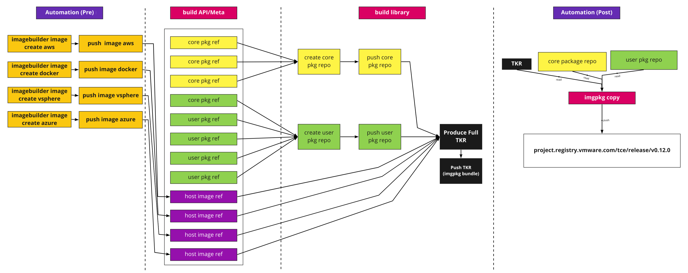

# Produce community-edition releases that are decoupled from Tanzu Kubernetes Grid

* Proposal:
  [https://github.com/vmware-tanzu/community-edition/issues/2717](https://github.com/vmware-tanzu/community-edition/issues/2717)

## Abstract

At the time of writing, Tanzu Community Edition (TCE) relies on the Bill of
Materials (BOMs) produced for VMware's paid product, Tanzu Kubernetes Grid
(TKG). This means that creation of clusters, both management and workload,
**always** use the same packages and versions as the rest of TKG. A BOM is
declares the components and their versions used in clusters. This includes
everything from Kubernetes versions to the software that runs on top of
Kubernetes.

This binding to a TKG BOM was a decision made to ensure we could release TCE.
Now we are at stage where we must unbind from TKG's BOM and begin producing
TCE-specific BOMs. Achieving this decoupling will enable TCE to release unique
components along with newer versions of existing components, such as Kubernetes.

### Why

Doing the above enables:

* Building and packaging in the open, rather than behind VMware's network.
* Packages that can be re-produced by users.
* Releasing Kubernetes versions ahead of TKG.
* Releasing core packages (e.g. antrea) ahead of TKG.
* Releasing core-packages specific to TCE.
* Patching TCE releases out-of-band from TKG.

## Proposal

To achieve a decoupled TCE, we plan to produce:

1. **[Build Metadata API](#1-build-metadata-api)**: a build BOM that describes
   what should be contained in a TKr.
2. **[Build Library](#2-build-library)**: reads the Build BOM and produces the
   required components and a TKr.
3. **[Host Images](#3-host-images)**: created with [image
   builder](https://github.com/kubernetes-sigs/image-builder) and pushed to
   cloud providers.
4. **[Container Images](#4-container-images)**: references upstream container
   images.
5. **[Core Package Repository](#5-core-package-repository)**: created and pushed
   to our .
6. **[User-managed Package Repository](#6-user-managed-package-repository)**: A
   user-managed package repository.
7. **[Bundling and Pushing a Release](#7-bundling-and-pushing-a-release)**
8. **[Tanzu Kubernetes Release (TKR)](#8-tanzu-kubernetes-release)**: created
   and pushed to our OCI registry, used at runtime to create clusters.

A visual representation of the above is as follows:



### 1. Build Metadata API

The Build metadata API is a build BOM that describes what components should be
included in a Tkr. This API is described via a manifest by the TCE team. This
manifest can then be satisfied using the build library (see next section). The
following provides a high-level representation of what the build manifest will
be translated into via the build library.

Packages (bundles pushed using `imgpkg`) are **not** pushed in this process.
Instead, package maintainers are expected to have already pushed a given
package. The build metadata above only contains a reference to the pushed
package. With this, the CI can construct a package repository, which is a image
holding references and metadata to the packages.

The asset produced above will power cluster creation at runtime in the TKr.
The TKr should **not** include build information such as specific packages used.
Instead, it should reference what is relevant at runtime. This includes assets
such as package repositories and host OS images.

##### Schema

The proposed schema of the build manifest is:

```go
type TanzuBuild struct {
  // the version of this release and build
  Version string
  // packages to create a core package repo of
  // created repo will be uploaded to an OCI repo
  // uri of uploaded repo will be added to the generated TKR
  CorePackages []MetaPackage `yaml:"corePackages"`
  // packages to create a user-managed package repo of
  // created repo will be uploaded to an OCI repo
  // uri of uploaded repo will be added to the generated TKR
  UserPackages []MetaPackage `yaml:"userPackages"`
  // host images to add to the generated TKR
  HostImages []HostImage `yaml:"hostImages"`
  // k8s metadata added to the generated TKR
  KubernetesMeta `yaml:"kubernetesMeta"`
}

type MetaPackage struct {
  // name of the metapackage, e.g. contour
  Name string
  // each versioned package to make available
  Packages []Package
  // Embeds contents of package metadata:
  // https://carvel.dev/kapp-controller/docs/latest/packaging/#package-metadata
  PackageMetadata string  `yaml:"packageMetadata"`
}

type Package struct {
  // fully qualified name of package, e.g. contour.dev.1.5.3
  Name string
  // location of the OCI bundle
  ImageBundleURI string `yaml:"imageBundleUri"`
  // Arbitrary set of options to add in the package CR
  Options map[string]interface{}
}

type HostImage struct {
  // name of the host image (ami-dfdal)
  Name string
  // the infrastructure provider it relates to (aws, azure, etc)
  Provider string
  // metadata relevant to the specific provider. (aws-region: us-west-2)
  Metadata map[string]string
}

type KubernetesMeta struct {
  // the version of Kubernetes this TKR represents
  Version string
  // the kubernetes components used in bootstrap
  // these should match what is inside the host images
  // otherwise kubeadm will pull down new images on each
  // host during bootstrap
  Components []ContainerImage
}

type ContainerImage struct {
  // the name of the container image
  Name string
  // the host, and url used to access the container image
  Repository string
  // the tag associated with the image
  Tag string
}
```

Rendering this against a configuration ([go
playground](https://go.dev/play/p/vFYA7stM_y8)) produces the following.

```yaml
version: 1.25+tce.1
corePackages:
    - name: antrea
      packages:
        - name: antrea.2.1.2
          imageBundleUri: projects.registry.vmware.com/tce/packages/antrea:2.1.2
          options: {}
        - name: antrea.2.5.4
          imageBundleUri: projects.registry.vmware.com/tce/packages/antrea:2.5.4
          options: {}
      packageMetadata: |-
        apiVersion: data.packaging.carvel.dev/v1alpha1
        kind: PackageMetadata
        metadata:
          # Must consist of at least three segments separated by a '.'
          # Cannot have a trailing '.'
          name: antrea.vmware.com
          # The namespace this package metadata is available in
          namespace: my-ns
        spec:
          # Human friendly name of the package (optional; string)
          displayName: "Fluent Bit"
          # Long description of the package (optional; string)
          longDescription: "Fluent bit is an open source..."
          # Short desription of the package (optional; string)
          shortDescription: "Log processing and forwarding"
          # Base64 encoded icon (optional; string)
          iconSVGBase64: YXNmZGdlcmdlcg==
          # Name of the entity distributing the package (optional; string)
          providerName: VMware
          # List of maintainer info for the package.
          # Currently only supports the name key. (optional; array of maintner info)
          maintainers:
          - name: "Person 1"
          - name: "Person 2"
          # Classifiers of the package (optional; Array of strings)
          categories:
          - "logging"
          - "daemon-set"
          # Description of the support available for the package (optional; string)
    - name: vsphere-csi
      packages:
        - name: vsphere-csi.4.1.2
          imageBundleUri: projects.registry.vmware.com/tce/packages/vsphere-csi:4.1.2
          options: {}
        - name: vsphere-csi.4.1.5
          imageBundleUri: projects.registry.vmware.com/tce/packages/vsphere-csi:4.1.5
          options: {}
      packageMetadata: |-
        apiVersion: data.packaging.carvel.dev/v1alpha1
        kind: PackageMetadata
        metadata:
          # Must consist of at least three segments separated by a '.'
          # Cannot have a trailing '.'
          name: vsphere-csi.vmware.com
          # The namespace this package metadata is available in
          namespace: my-ns
        spec:
          # Human friendly name of the package (optional; string)
          displayName: "Fluent Bit"
          # Long description of the package (optional; string)
          longDescription: "Fluent bit is an open source..."
          # Short desription of the package (optional; string)
          shortDescription: "Log processing and forwarding"
          # Base64 encoded icon (optional; string)
          iconSVGBase64: YXNmZGdlcmdlcg==
          # Name of the entity distributing the package (optional; string)
          providerName: VMware
          # List of maintainer info for the package.
          # Currently only supports the name key. (optional; array of maintner info)
          maintainers:
          - name: "Person 1"
          - name: "Person 2"
          # Classifiers of the package (optional; Array of strings)
          categories:
          - "logging"
          - "daemon-set"
          # Description of the support available for the package (optional; string)
userPackages:
    - name: fluent-bit
      packages:
        - name: fluent-bit.1.8.2
          imageBundleUri: projects.registry.vmware.com/tce/packages/fluent-bit:1.8.2
          options: {}
        - name: fluent-bit.1.9.0
          imageBundleUri: projects.registry.vmware.com/tce/packages/fluent-bit:1.9.0
          options: {}
      packageMetadata: |-
        apiVersion: data.packaging.carvel.dev/v1alpha1
        kind: PackageMetadata
        metadata:
          # Must consist of at least three segments separated by a '.'
          # Cannot have a trailing '.'
          name: fluent-bit.vmware.com
          # The namespace this package metadata is available in
          namespace: my-ns
        spec:
          # Human friendly name of the package (optional; string)
          displayName: "Fluent Bit"
          # Long description of the package (optional; string)
          longDescription: "Fluent bit is an open source..."
          # Short desription of the package (optional; string)
          shortDescription: "Log processing and forwarding"
          # Base64 encoded icon (optional; string)
          iconSVGBase64: YXNmZGdlcmdlcg==
          # Name of the entity distributing the package (optional; string)
          providerName: VMware
          # List of maintainer info for the package.
          # Currently only supports the name key. (optional; array of maintner info)
          maintainers:
          - name: "Person 1"
          - name: "Person 2"
          # Classifiers of the package (optional; Array of strings)
          categories:
          - "logging"
          - "daemon-set"
          # Description of the support available for the package (optional; string)
    - name: contour
      packages:
        - name: contour.1.1.0
          imageBundleUri: projects.registry.vmware.com/tce/packages/contour:1.1.0
          options: {}
        - name: contour.2.0.0
          imageBundleUri: projects.registry.vmware.com/tce/packages/contour:2.0.0
          options: {}
      packageMetadata: |-
        apiVersion: data.packaging.carvel.dev/v1alpha1
        kind: PackageMetadata
        metadata:
          # Must consist of at least three segments separated by a '.'
          # Cannot have a trailing '.'
          name: contour.vmware.com
          # The namespace this package metadata is available in
          namespace: my-ns
        spec:
          # Human friendly name of the package (optional; string)
          displayName: "Fluent Bit"
          # Long description of the package (optional; string)
          longDescription: "Fluent bit is an open source..."
          # Short desription of the package (optional; string)
          shortDescription: "Log processing and forwarding"
          # Base64 encoded icon (optional; string)
          iconSVGBase64: YXNmZGdlcmdlcg==
          # Name of the entity distributing the package (optional; string)
          providerName: VMware
          # List of maintainer info for the package.
          # Currently only supports the name key. (optional; array of maintner info)
          maintainers:
          - name: "Person 1"
          - name: "Person 2"
          # Classifiers of the package (optional; Array of strings)
          categories:
          - "logging"
          - "daemon-set"
          # Description of the support available for the package (optional; string)
hostImages:
    - name: ami-192385
      provider: aws
      metadata:
        public: "true"
        region: us-west-2
    - name: ami-39402
      provider: aws
      metadata:
        public: "true"
        region: us-east-2
    - name: azi-3992
      provider: azure
      metadata:
        placement: east
        public: "true"
kubernetesMeta:
    version: "1.25"
    components:
        - name: etcd
          repository: projects.registry.vmware.com/tce/etcd
          tag: v3.5.0
        - name: pause
          repository: projects.registry.vmware.com/tce/pause
          tag: v3.4.1
        - name: etcd
          repository: projects.registry.vmware.com/tce/etcd
          tag: v1.8.0
```

### 2. Build Library

#### Go API

At the top level, the  API for creating a TKr from a TanzuBuild will look like the following Go functions.
The `TanzuBuild` Go struct will also be defined by the API package.

```go
import framework "github.com/tanzu-framework/apis/run/v1alpha1"
// TODO:nrb - any validation of values? Conformance to URIs for container images? SemVer enforcement is probably limiting in case upstream images don't use it.

// ReadManifest will parse a TanzuBuild struct from a given YAML file.
func ReadManifest(filePath string) (TanzuBuild, error)

// TranslateToTKR will construct a [framework.TanzuKubernetesRelease](https://github.com/vmware-tanzu/tanzu-framework/blob/main/apis/run/v1alpha1/tanzukubernetesrelease_types.go#L97) struct from a TanzuBuild struct.
// The primary work here is to map relevant fields from a TanzuBuild into a TanzuKubernetesRelease, with little to no manipulation of values.
func TranslateToTKR(manifest TanzuBuild) (framework.TanzuKubernetesRelease, error)

// WriteTKR will output a framework.TanzuKubernetesRelease struct as YAML into a provided io.Writer.
func WriteTKR(tkr framework.TKr, out io.Writer)
```

#### CLI tooling

The CLI tool will be named `tkrgen` and provide a thin wrapper around the Go library.

Usage:

```shell
  tkrgen tce-manifest.yaml -o tce-tkr.yaml
```

### 3. Host Images

Out-of-band from the TKr creation, the TCE project will build upstream
**host** images using
[image-builder](https://github.com/kubernetes-sigs/image-builder). This will
kick-off using our own automation. Scripts and code for how we assemble images
will be made available in the `build/` directory.

#### 3.1 Building Images

TODO(joshrosso):

#### 3.2 Publishing Images

TODO(joshrosso):

### 4. Container Images

Package authors **must** reference upstream container images in their package's
[ImageLock](https://carvel.dev/kbld/docs/v0.32.0/resolving/#generating-resolution-imgpkg-lock-output).
This means image pointers will resolve to locations like DockerHub, GCR, etc. An
example of this can be seen in the
[contour](https://github.com/vmware-tanzu/community-edition/blob/ac6155e89336ee42be10a7560d70a118c05450d2/addons/packages/contour/1.19.1/bundle/.imgpkg/images.yml#L4-L20)
package.

As described in subsequent sections, the TCE project will leverage `imgpkg` to
copy all packages and their referenced images into `projects.registry.vmware.com/tce/release/${version}`.

In some special cases, such as usage of a container base image with licensing
issues, the TCE team may require package authors to custom build container
images rather than use this copy approach.

### 5. Core Package Repository

Based on the `corePackages` in the build meta, the build library should be able
to produce a compliant list of packages, bundled up such that they can be
referenced via a
[PackageRepository](https://carvel.dev/kapp-controller/docs/latest/packaging/#package-repository)
CRD in a cluster.

To see what this end-state should look like, view the existing `0.9.1`
repository.

```
$ crane export projects.registry.vmware.com/tce/main:0.9.1 - | tar xv
.
.imgpkg
.imgpkg/images.yml
packages
packages/packages.yaml
```

In the above, `packages/packages.yaml` contains many
[PackageMetadata](https://carvel.dev/kapp-controller/docs/latest/packaging/#package-metadata)
and [Package](https://carvel.dev/kapp-controller/docs/latest/packaging/#package)
objects. The generation of these object can be entirely sourced from the
contents of `corePackageRepo` in the build metadata.

### 6. User-managed Package Repository

Producing the user-managed package repository is the same as the core package
repository. However, it sources its packages from the `userManagedRepo` section
in the build metadata.

### 7. Bundling and Pushing a Release

As part of a release, TCE will use `imgpkg` to copy all created package
repositories. This includes core and user-managed repositories. This copy is
**recursive** meaning is will make a full copy of every package bundle and
container image referenced in the package bundles.

An example of this command is:

```shell
imgpkg copy --bundle projects.registry.vmware.com/tce/repos/repo --to-repo projects.registry.vmware.com/tce/packages
imgpkg copy -b projects.registry.vmware.com/tce/repos/repo@sha256:cf464b524f9a7fa149cd2322cb3e3c4dd0496ba6aa63728d61c613f39e5ec8c6 --to-repo projects.registry.vmware.com/tce/packages/foobar
copy | exporting 5 images...
copy | will export projects.registry.vmware.com/tce/cert-manager@sha256:ca4c551c1e9c5bc0e2b554f20651c9538c97a1159ccf9c9b640457e18cdec039
copy | will export quay.io/jetstack/cert-manager-cainjector@sha256:916ef12af73c8a4cbdfb6127d6f513f476f3aeed2447ec7f1a58a95113bda713
copy | will export quay.io/jetstack/cert-manager-controller@sha256:fef465f62524ed89c27451752385ab69e5c35ea4bc48b62bf61f733916ea674c
copy | will export quay.io/jetstack/cert-manager-webhook@sha256:45934ab42749e8c90da0726734155374f4ea55d7796246264e7adea87569918a
copy | will export projects.registry.vmware.com/tce/repos/repo@sha256:cf464b524f9a7fa149cd2322cb3e3c4dd0496ba6aa63728d61c613f39e5ec8c6
copy | exported 5 images
copy | importing 5 images...

 0 B / ? [-------------------------------------------------------------------------------------------------------------------------------------------------------------=]   0.00% 2562047h47m16s

copy | done uploading images

Succeeded
```

Subsequent pulls of the package repository with imgpkg will now include a
`.imgpkg/images.yaml` that references the new location of the copied packages.
This is largely handled by `kapp-controller` at runtime, but here is an example
of this occurring on a user's workstation:

```shell
imgpkg pull --bundle projects.registry.vmware.com/tce/packages/foobar@sha256:cf464b524f9a7fa149cd2322cb3e3c4dd0496ba6aa63728d61c613f39e5ec8c6 -o temp

Pulling bundle 'projects.registry.vmware.com/tce/packages/foobar@sha256:cf464b524f9a7fa149cd2322cb3e3c4dd0496ba6aa63728d61c613f39e5ec8c6'
  Extracting layer 'sha256:9530e318da7e41734d0545da1cb0011e0d1e84c1557510bf36491f1e4311a278' (1/1)

Locating image lock file images...
The bundle repo (projects.registry.vmware.com/tce/packages/foobar) is hosting every image specified in the bundle's Images Lock file (.imgpkg/images.yml)

Succeeded
```

Looking at the new images.yaml, you can see that the original `tce/cert-manager` package is now mapped to `tce/packages/foobar`. 

```yaml
---
apiVersion: imgpkg.carvel.dev/v1alpha1
images:
- annotations:
    kbld.carvel.dev/id: projects.registry.vmware.com/tce/cert-manager@sha256:ca4c551c1e9c5bc0e2b554f20651c9538c97a1159ccf9c9b640457e18cdec039
  image: projects.registry.vmware.com/tce/packages/foobar@sha256:ca4c551c1e9c5bc0e2b554f20651c9538c97a1159ccf9c9b640457e18cdec039
kind: ImagesLock
```

Pulling that copied package...

```shell
imgpkg pull -b projects.registry.vmware.com/tce/packages/foobar@sha256:ca4c551c1e9c5bc0e2b554f20651c9538c97a1159ccf9c9b640457e18cdec039 -o temp2
Pulling bundle 'projects.registry.vmware.com/tce/packages/foobar@sha256:ca4c551c1e9c5bc0e2b554f20651c9538c97a1159ccf9c9b640457e18cdec039'
  Extracting layer 'sha256:0bd8e44ad92aa15fee5e4a43c06531cc646deca55c61fa0dbd298e263fa3f077' (1/1)

Locating image lock file images...
The bundle repo (projects.registry.vmware.com/tce/packages/foobar) is hosting every image specified in the bundle's Images Lock file (.imgpkg/images.yml)

Succeeded
```

and inspecting its `.imgpkg/images.yaml` shows all digests now referencing the new location.

```yaml
---
apiVersion: imgpkg.carvel.dev/v1alpha1
images:
- annotations:
    kbld.carvel.dev/id: quay.io/jetstack/cert-manager-cainjector:v1.6.1
    kbld.carvel.dev/origins: |
      - resolved:
          tag: v1.6.1
          url: quay.io/jetstack/cert-manager-cainjector:v1.6.1
  image: projects.registry.vmware.com/tce/packages/foobar@sha256:916ef12af73c8a4cbdfb6127d6f513f476f3aeed2447ec7f1a58a95113bda713
- annotations:
    kbld.carvel.dev/id: quay.io/jetstack/cert-manager-controller:v1.6.1
    kbld.carvel.dev/origins: |
      - resolved:
          tag: v1.6.1
          url: quay.io/jetstack/cert-manager-controller:v1.6.1
  image: projects.registry.vmware.com/tce/packages/foobar@sha256:fef465f62524ed89c27451752385ab69e5c35ea4bc48b62bf61f733916ea674c
- annotations:
    kbld.carvel.dev/id: quay.io/jetstack/cert-manager-webhook:v1.6.1
    kbld.carvel.dev/origins: |
      - resolved:
          tag: v1.6.1
          url: quay.io/jetstack/cert-manager-webhook:v1.6.1
  image: projects.registry.vmware.com/tce/packages/foobar@sha256:45934ab42749e8c90da0726734155374f4ea55d7796246264e7adea87569918a
kind: ImagesLock
```

In summary, when the TCE project creates a release, imgpkg copy will be used to
copy **all** OCI assets into a canonical registry location. This is depicted
visually as:


### 8. Tanzu Kubernetes Release

TODO(joshrosso): need to figure our what a TKR means (existing BOM model vs new
package-based model)

### Signing

As part of this work, we will **not** sign our machine images, container images,
packages, or package repositories. CLI binaries will continue to be signed to
ensure Mac and Windows users are not prompted to approve usage.

### Release Automation

In order to facilitate creation of compliant Tanzu Kubernetes Release (TKr) files, automation is needed to translate the data from the TCE release build manifest (described in the next section) into the TKr format.

This tooling will be created as a Go library along with a command line utility.
The code will initially reside in the Tanzu Community Edition git repository for convenience, but is a strong candidate for being moved into its own repository.
A Go library will be useful to others seeking to build further tooling on top of TCE, and a command line utility will expose the functionality so that CI/CD processes may utilize it.

### Ownership

This proposal covers several aspects that bring a community-edition release
together. There are 3 groups involved in this process.

* Package Maintainers
* Tanzu Community Edition Maintainers
* Tanzu Framework Maintainers

The follow diagram categorizes the units of work into the above owners.


## Compatibility

Clusters will **not** be upgradable to this version of TCE. This switches
multiple assets over from re-using our downstream images (container and host) to
purely upstream one.
