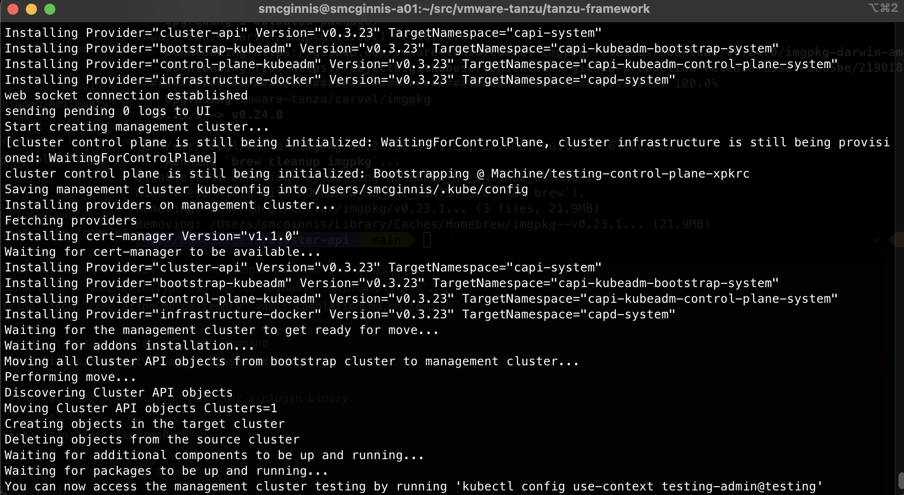
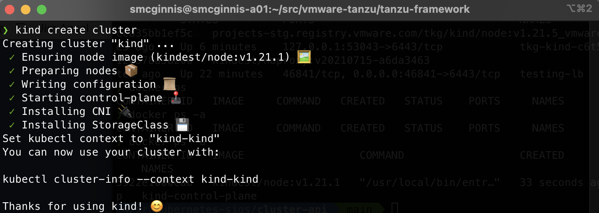
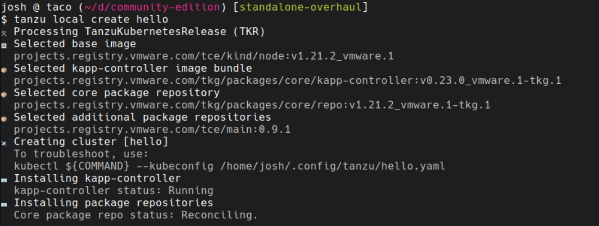

# Improved Bootstrap Visibility

A proposal for updating our console output on cluster creation (managed-cluster
and "workload" clusters) to make it
easier for end users to understand what is happening.

* Proposal:
  [https://github.com/vmware-tanzu/community-edition/issues/2730](https://github.com/vmware-tanzu/community-edition/issues/2730)

## Summary

One of the most common support requests we've received with Tanzu Community
Edition has been around failures bootstrapping new clusters. To make the
bootstrap process less confusing, and easier to troubleshoot when things go
wrong, this proposal is to update the bootstrap output for management and
workload cluster deployment to be more concise and targeted about what
information is given, with better context about the steps and what actions are
being performed for each one.

## Motivation

Often, the cause of cluster deployment failure ends up being fairly obvious
once the proper logs are found or statuses are checked. The hard part is
usually understanding what has happened and where to look to find this
information.

Whether the cluster deployment is successful or fails, it can also be confusing
to understand what is happening during deployment. This lack of visibility can
be a challenge to understand where things failed, but it can also be confusing
during a successful deployment. Especially for new users, this lack of
visibility can introduce uncertainty that decrease confidence in Tanzu
Community Edition.

Simplifying the output of our deployment process, even though it provides less
data along the way, should make it more clear what is happening and help users
understand where in the deployment process we are. That gives them some
confidence that things are progressing, and help them understand what is
happening during that process.

Better output on failure should lead the user to finding root cause and faster
resolution of blocking issues.

### Goals

* Minimize what gets emitted to the console during cluster deployment to only
  what the user needs to see
* Allow more details only if requested when the user requests verbose output
* Group output into the large grain steps of the process
* Within each step, only emit the details related to that step that may be
  useful for the end user to know
* In case of failure, perform some basic triaging to provide the user with
  enough details to help them correct the situation
* Provide clear and direct next steps for them to perform

The hope is to move from the unformatted and sometimes messy output we have
today:



to a more structured and visually easier to parse format similar to the `kind`
output:



or the output for the recently added `unmanaged-cluster` command:



### Non-Goals/Future Work

This proposal is only focused on cleaning up the output that happens during
cluster deployment and the information captured on failure. While there may be
other improvements while this is being implemented, the proposal does not
include:

* Rearchitecting the means of cluster deployment
* Auto-remediation of failure cases

We may want to consider updating other command's output such as `tanzu
management-cluster delete` and `tanzu cluster delete` to match the same style,
but that is not a primary goal of this proposal.

## Proposal

To implement these changes, the following steps will need to be taken

* Review and group current output into high level steps
* Review all output and ensure it is at an appropriate log level
  * Low level details should be at a higher verbosity level so they are not
    seen unless requested
  * What is emitted at normal logging levels should be reviewed for its
    usefulness
  * All output should be reviewed and removed from normal output if it only
    serves as development tracing of code paths (but still included when high
    verbosity is used for tracing purposes)
* A default bootstrap log should be added that always captures activity
* Failure cases should be reviewed to determine where we can automatically run
  commands to capture useful debug output

### User Stories

As a user, I want to see what is happening during deployment of a new cluster.

#### Successful cluster deployment

In the case of successful customer deployment, the output on the console or in
the web UI should tell me each step of the process. Even if I don't understand
cluster deployment well enough to know what each step entails, I should be able
to see from the output what the current action is that is being worked on and
be given useful details that I may need to refer to later.

Unless I've asked for more verbose output, there should not be any low level
messages for implementation details that do not provide me with useful
information about the deployment.

#### Failed cluster deployment

From the previous use case details, I should understand the high level steps in
the process, even if I don't understand what low level things need to happen to
implement those steps.

When something goes wrong, I need help understanding what caused the deployment
to fail, with only the bare low level details necessary to help guide me to
correcting the cause of the failure. I want to be told specifically what the
problem was, with as much guidance as possible to help me resolve the problem.

#### Ability to refer to deployment details

Whether my cluster deployment was successful or failed, I may have closed my
terminal that contained the original output from that process. I need a way to
refer back to that information so I can either look up information about my
cluster, or find the debugging information that is going to help me resolve the
problem. I should be able to access a log of the deployment activity that will
provide all the details of what happened, including both the output from the
console as well as more verbose details from the process.

As a user, I may not always be able to understand and fix the cause of a
failure. In this case, I need this captured information so I can provide it to
support or other community members so they can help me resolve my issue.

#### Functional Requirements

To address these needs, the following requirements must be met.

##### FR1 - Output should be captured to a persistent log file

If the users terminal closes or content scrolls off their buffer, they need to
be able to get the details from the cluster creation. This is especially
critical when something goes wrong and someone else needs to take a look at the
output to help troubleshoot the failure.

* Cluster creation output should be captured to
  `~/.config/tanzu/tkg/bootstrap-logs/${CLUSTER_NAME}.log`
* The log should capture everything, regardless of verbosity level set by the
  end user for console output
* Additional debug command output, such as tailing CAPI controller logs on
  failure, should be captured in the bootstrap log
* To prevent hidden leaked filesystem space consumption, the bootstrap log
  should be deleted as part of the `management-cluster delete` or `cluster
  delete` operations

##### FR2 - Log high level steps

The output should be grouped based on the high level steps of the process. So
rather than the current:

```txt
Doing something.
Start creating cluster...
Saving file.
Installing xyz
Waiting for x...
```

All output is at the same level and there is no differentiation or
relevance of each log line. The new output should have clear high level steps:

```txt
☑️  Determining cluster settings
   [specific useful details]
☑️  Performing step 2
   [specific useful details]
☑️  Performing step 3
   [specific useful details]
```

Emojis may vary to help relate to the type of step being performed - the ☑️
above is for illustration purposes only.

##### FR3 - Log relevant information for each high level step

The amount of lines should be minimized. No output should be given if it does
not directly help the user understand what they need to know.

With the output grouped into the high level sections as described in FR1,
within those high level sections there should be specific and useful details
for the user. Output from the currently being developed `unmanaged-cluster`
creation provides a good example of this:

```txt
🎨 Selected base image
   projects.registry.vmware.com/tce/kind/node:v1.21.5

📦 Selected core package repository
   projects.registry.vmware.com/tkg/packages/core/repo:v1.21.2_vmware.1-tkg.1

📦 Selected additional package repositories
   projects.registry.vmware.com/tce/main:0.9.1

📦 Selected kapp-controller image bundle
   projects.registry.vmware.com/tkg/packages/core/kapp-controller:v0.23.0_vmware.1-tkg.1

📧 Installing package repositories
   Core package repo status: Reconcile succeeded

🌐 Installing CNI
   antrea.tanzu.vmware.com:0.13.3+vmware.1-tkg.1

✅ Cluster created
```

Output is minimal, and can be skipped altogether if there isn't anything useful
for the end user to know.

##### FR4 - Debug capture on failed cluster deployment

During deployment, we capture the kubectl configuration and other details about
the bootstrap kind cluster and the cluster that is actively being deployed. We
use some of this to help guide the user today:

```txt
Failure while deploying management cluster, Here are some steps to investigate the cause:
Debug:
kubectl get po,deploy,cluster,kubeadmcontrolplane,machine,machinedeployment -A --kubeconfig /home/test/.kube-tkg/tmp/config_6SDG31q1
kubectl logs deployment.apps/ -n manager --kubeconfig /home/test/.kube-tkg/tmp/config_6SDG31q1
```

Since we have this information, we should actually perform some of the
debugging steps for the end user.

As a base requirement for this proposal, debug commands like getting pod and
deployment status from the cluster should be run, with the output captured to
the bootstrap log. We should also capture the error logs from the CAPI provider
manager pod (assuming things have gotten that far) and include that in the
bootstrap log.

For the purposes of this design proposal, the requirement is only to capture
this output so it can be used for later troubleshooting. But since we have this
information, a future effort of building in some parsing and automatic triaging
to the commands should be considered.

### Implementation Details/Notes/Constraints

* The main target for these changes are `management-cluster` and `cluster`
  create commands
* Output will be different between these two as there are different details
  that are more relevant for one versus the other
* The same output principles should be considered for things like `delete`
  commands and any others that perform a multi-step process to accomplish

With the debug functional requirement in mind, the following will be
implemented to capture to our bootstrap log. These are too detailed or verbose
to print to the console unless we can glean a clear summary failure message
from the output. All trace logging will be captured in the bootstrap log so we
have it available and can read through that log to get a full picture of the
failure condition of the cluster.

#### Process Steps

The main change in output will be the selection of current log messages that are
emitted. The things we will want to change for this process output will be:

* Print high level steps
  * Should lead with emoji if the console supports it
  * High level grouping of the current set of low level steps being performed
    (e.g. top level grouping of something like "Setting up core package repository"
    only including the output of the specific URL used for that repo)
* Limited output for each grouping
  * Raise log level of existing trace messages so they only print out if the
    verbosity level is set high enough
  * Lead with indentation so output is visually obvious as something underneath
    the top level group
  * Review the messages that are printed by default so they are very clear and
    easy for someone to understand from the context of where they are printed in
    the overall output

#### Cluster API Details

Both the `management-cluster` and `cluster` creation operations utilize
[cluster-api](https://cluster-api.sigs.k8s.io/) for declarative cluster creation.

Since we have the `kubeconfig` for the bootstrap and management clusters, we can
use this to gain more visibility into the cluster deployment process. We can get
the [Cluster](https://cluster-api.sigs.k8s.io/developer/architecture/controllers/cluster.html)
CRDs during deployment to inspect the Status.Conditions to get the status of
the new cluster creation. The JSON output from getting Cluster objects gives the
following:

```yaml
"status": {
      "conditions": [
        {
            "lastTransitionTime": "2022-01-31T20:29:39Z",
            "status": "True",
            "type": "Ready"
        },
        {
            "lastTransitionTime": "2022-01-31T20:29:29Z",
            "status": "True",
            "type": "ControlPlaneInitialized"
        },
        {
            "lastTransitionTime": "2022-01-31T20:29:39Z",
            "status": "True",
            "type": "ControlPlaneReady"
        },
        {
            "lastTransitionTime": "2022-01-31T20:28:50Z",
            "status": "True",
            "type": "InfrastructureReady"
        }
      ],
      "infrastructureReady": true,
      "observedGeneration": 2,
      "phase": "Provisioned"
  }
```

By inspecting each of these statuses, we can report the progress of the cluster
provisioning. In this case, we can use these summary statuses to update
progress on the command line in addition to capturing progress to the bootstrap
log.

Cluster-API also has `Bootstrap`, `Machine`, `MachineDeployment`, and other objects
that can be retrieved to find more details. We can explore the attributes of these
objects as well to see if there is any other status information to report to the
user.

Some of these Cluster-API objects will be too low level to show in the terminal
output at default verbosity, but we could get their details to include in the
bootstrap logging to aid in troubleshooting when deployments fail.

#### Cluster API Controller Logs

One common scenario we have found to work when troubleshooting deployment failures
is to [look at the `capX-controller-manager` POD logs](https://tanzucommunityedition.io/docs/latest/tsg-bootstrap/#troubleshooting-manually).
Looking for Error level logs (log lines that start with an `E`) will often indicate
what is failing in reconciliation that is preventing the cluster from being
properly created.

Again, with having access to the `kubeconfig` for the cluster, we are able to
automate this manual process, to some degree, by extracting these error logs
and capturing them in the bootstrap log for easier troubleshooting.

Another controller that provides relevant logs is the [Machine Healthcheck
Controller](https://cluster-api.sigs.k8s.io/developer/architecture/controllers/machine-health-check.html)
(MHC). The MHC is responsible for checking on the health of machines. This
provides some good detail for failure conditions. Extracting logs from the MHC
could provide useful troubleshooting logs for TCE to capture in the bootstrap
logs and could help point to the source of deployment failures.

#### Kapp Controller Events

After the cluster has been initialized using Cluster-API, we perform additional
package configuration for a default set of packages. Failures are less common
after the cluster has been successfully deployed, but we can inspect the
kapp-controller logs or events to help diagnose any other failures.

### Security Model

We will be logging the output from several components into the audit log. It
will be assumed that these services are not logging sensitive information. If
we find that is not the case, then we will need to explore ways to recognize
and filter that information.

Beyond this possibility, there are no other security concerns identified.

### Risks and Mitigations

Output is displayed on the console as well as the web UI, when used. This
should be kept in mind during development to make sure the output display in
the web UI is also useful and the changes do not introduce any UI breakage. The
UI developers should also be included in reviews to make sure there are no
concerns from their perspective on the way changes may impact the UI.

## Compatibility

N/A

## Alternatives

An alternative - and really the current approach - would be to leave the output
as is and address user concerns through documentation. We have seen this helps
in some cases, but the project documentation isn't the first place users go
when they encounter a problem.

## Upgrade Strategy

N/A

## Additional Details

### Test Plan

As the proposed changes are not functional in nature, there is no requirement
for test coverage. Unit tests will be added where deemed useful to exercise any
logging code, if necessary.
