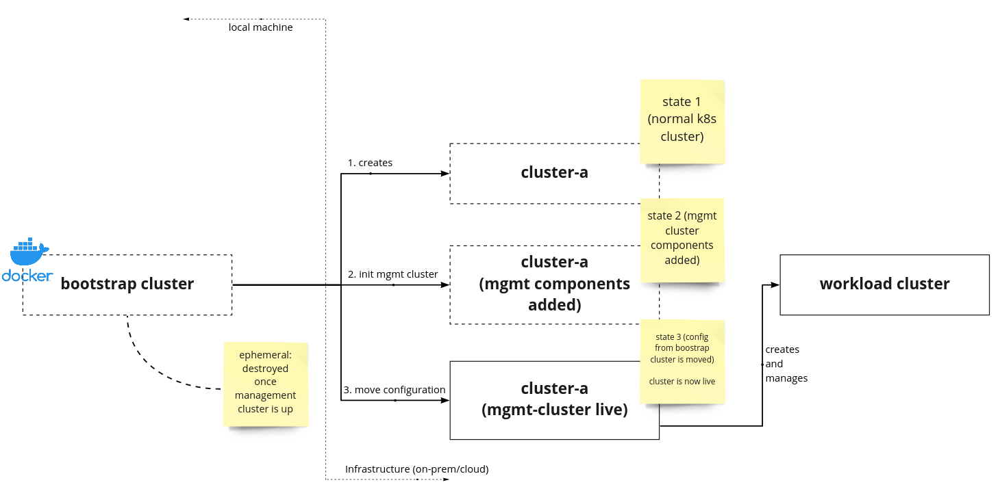
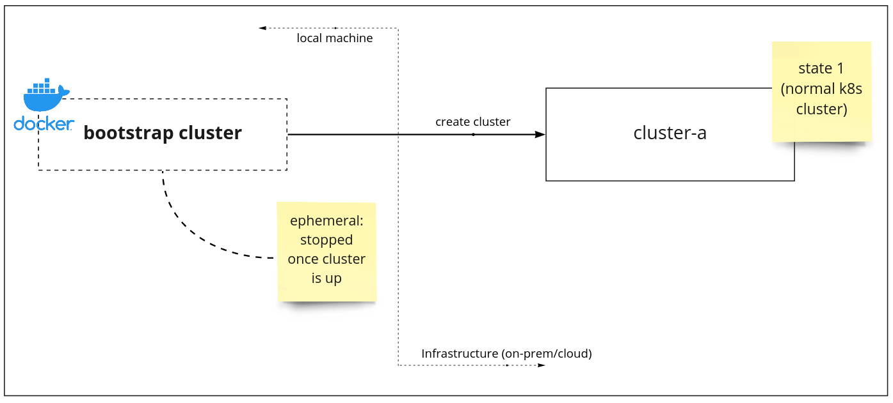
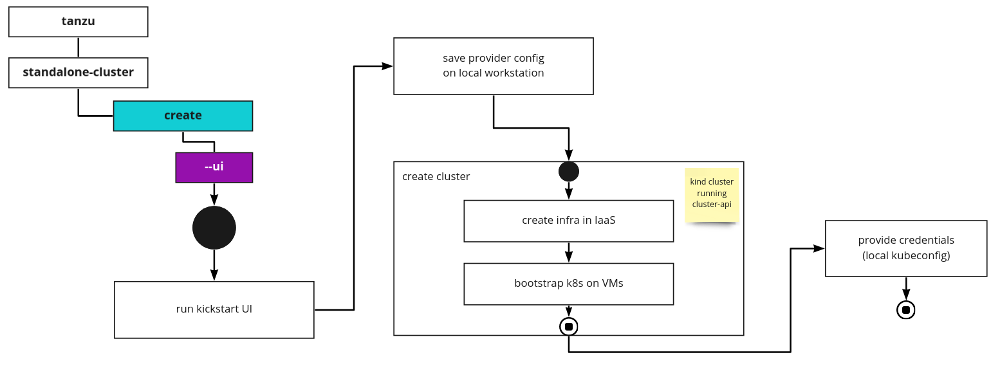
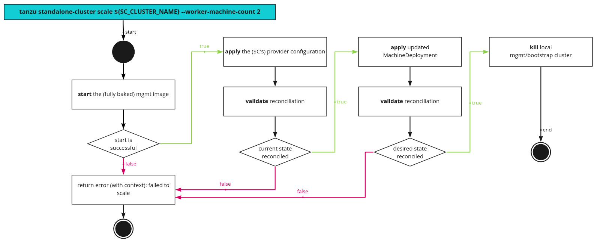
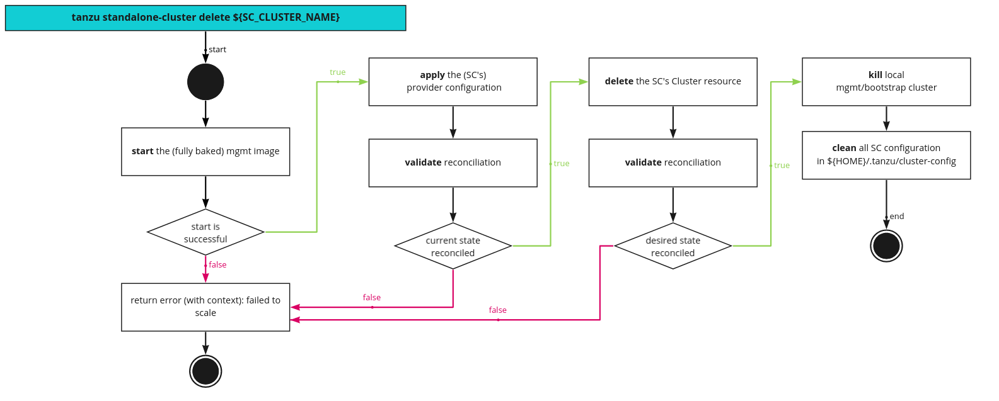
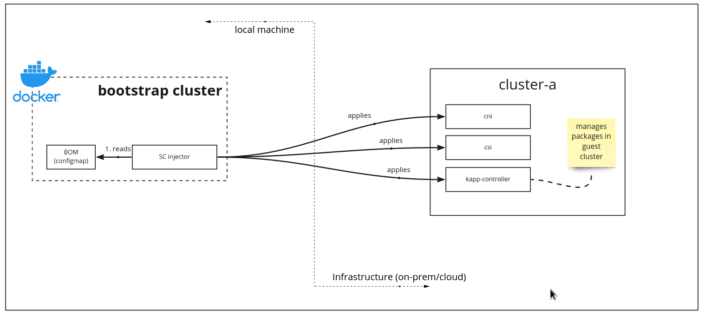

# Minimal Workload Cluster

This design document details our desired implementation to support *minimal workload clusters*. This design document is
a work in progress and will be updated as we implement.

## Why Minimal Workload Clusters?

Tanzu Community Edition users need a means to boostrap clusters in a fast manner (~10 minutes or less) and with minimal
resources. This enables our users to try out many projects and technology in the Tanzu portfolio with a reduced barrier
of entry.

## Current Bootstrapping Flow

Using Tanzu Kubernetes Grid (TKG), users initialize their clusters using the following commands.

```shell
# create a management cluster
tanzu management-cluster create --file ${HOME}/.tanzu/cluster-configs/some-config.yaml

## < ... logs for bootstrap cluster and management cluster ... >

# create workload cluster
tanzu cluster create --file ${HOME}/.tanzu/cluster-configs/some-config.yaml

## < ... logs for bootstrap cluster and management cluster ... >
```

When these commands are run, the following flows are triggered.



As seen above, we start with a boostrap cluster that runs in the same location
as the `tanzu` CLI. This bootstrap cluster leverages Docker and runs a
[kind](https://kind.sigs.k8s.io/) cluster. The kind cluster is injected with
provider details for creating the management cluster.

The management cluster is created in your target infrastructure (e.g. vSphere or
AWS). Initially, the management cluster is like any other cluster. This is until
a **pivot** occurs, where the cluster is initialized with management components
and resources are copied over from the boostrap cluster to this cluster. After
creation of the management cluster, provider components are pivoted into the
management cluster. This enables the management cluster to create and manage
workloads clusters. This pivot process is [described in the Cluster API
book](https://cluster-api.sigs.k8s.io/clusterctl/commands/move.html#bootstrap--pivot).

The workload cluster is a Kubernetes cluster that does not host any provider
management capabilities. It is where Kubernetes consumers (often referred to as _application developers_) deploy their
workloads.

## Minimal Workload Cluster (MWC) Creation

While the aforementioned process provides a production-capable, multi-cluster, platform, it also requires non-trivial
resources to get bootstrapped. In order to minimize resources and time required to achieve an eventual workload cluster,
TCE implements features to stop or delay the initialization of the management cluster. between bootstrap and cluster-a,
described in the previous section. The command would be as follows.

```sh
tanzu cluster create --minimal --ui
```

This would trigger a flow that looks as follows.



At a lower-level, the flow triggered from the CLI would look as follows.



Once this process is complete, the boostrap cluster is killed and the user is left with a workload cluster, which is
not actively managed. This cluster contains `kapp-controller` and is still able to have packages installed using
the `tanzu` CLI.

## Minimal Workload Cluster (MWC) Management

Eventually the MWC will need to be managed again. Reasons could include:

* **scaling**: The user wants to scale the MWC up or down.
* **deleting**: The user want to delete the MWC cluster.

> NOTE: At this time we do not plan to support **updating** of Kubernetes in this model.

In order to manage the MWC, we must re-initialize the original boostrap/management cluster to control the MWC. In order
to do this efficiently, the following must be in place.

1. Create an image that contains all the management components such that they do not need to be pulled.
    * cert-manager container images loaded
    * CAPI management container images loaded
    * CAPI providers used in TCE (CAPA, CAPV, CAPD, etc) container images loaded
1. Persist all provider configuration details in `~/.tanzu/cluster-config` until the user deletes the MWC.
1. Upon a management request of the MWC, start the fully-baked image and apply the provider configuration.

Assuming an MWC pre-exists, a **scaling** request would look as follows.

```shell
$ tanzu cluster scale ${MWC_CLUSTER_NAME} --worker-machine-count 2

starting management components...
started management components
scaling ${MWC_CLUSTER_NAME} worker nodes from 1 to 2...
scaled ${MWC_CLUSTER_NAME} worker nodes to 2
stopping management components...
stopped management components
```

The flow of the above interaction would look as follows.



Assuming an MC pre-exists, a **deleting** request would look as follows.

```shell
$ tanzu cluster delete ${MWC_CLUSTER_NAME}

starting management components...
started management components
deleting ${MWC_CLUSTER_NAME}...
deleted ${MWC_CLUSTER_NAME}
cleaned ${MWC_CLUSTER_NAME} local configuration
stopping management components...
stopped management components
```



## Minimizing the Bill of Materials (BOM)

MWCs will not have their core packages managed via a management cluster's `kapp-controller`. Instead, packages such as
CNI or CSI will be deployed at initialization then unmanaged (aside from standard Kubernetes reconciliation) there after.

Additionally, the BOM that composes a MWC should be as minimal as possible. The primary packages that should be installed
as part of a MWC instantiation should be:

* CNI plugin: provides networking
* CSI plugin (when available): provides storage integration
* kapp-controller: provides package management and installation features

This minimal BOM will have not be reconciled after the fact. Users of the MWC that install packages will have their
packages managed via the kapp-controller instance.

The flow of realizing the BOM for MWC is as follows.



It is TBD how the MWC injector should be implemented. In theory it could be satisfied by `kapp-controller`, as long
as `kapp-controller` will not try to reconcile the things it injects into the MWC if the bootstrap cluster needs to
come back up for a **scale** or **delete** operation. See last section.

## To be designed

The following items are important but not designed or prioritized for initial implementation.

* [ ] Further optimization of CAPD: While this proposal does work for CAPD, there are more optimizations we could consider.
  Namely, in the CAPD model, the bootstrap cluster already exists on the same host as the eventual MWC. There is likely room to run one hybrid cluster that can self manage.
  
* [ ] Decision and eventual design of delayed pivot: With this minimal model in place, we could offer a flow where users can pivot into the more production-ready model of running a dedicated management cluster.
