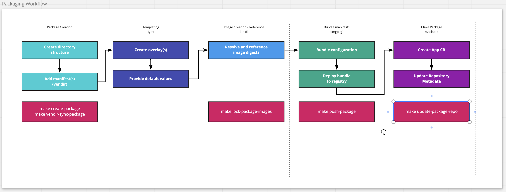

# Package and Repository Operations

The process for creating a package is outlined in the [Tanzu Addon Packaging](./tanzu-addon-packaging.md) document. That document thoroughly covers in depth the steps and commands necessary for package creation. While developing packages, the need to iterate on changes will arise, and to aid in that process, tasks have been added to the Makefile. This document will describe the use and function of these tasks.

## Initial Package Creation

When first starting off creating a new package, certain manifest files and the proper directory structure must be made.

Manifests needed for creating new packages are:

- `clusterrolebinding.yaml`
  
  > Permissions needed by`kapp-controller` to create objects. See [Create RBAC Assets](./tanzu-addon-packaging.md#rbac) for more details.
  
- `serviceaccount.yaml`

  > Service Account needed by`kapp-controller` to create objects. See [Create RBAC Assets](./tanzu-addon-packaging.md#rbac) for more details
  
- `installedPackage.yaml`
  
  > The declaration of intent to install a package, which kapp-controller will act on. See [Create a sample InstalledPackage](./tanzu-addon-packaging.md#installedPackage) for more details.

- `bundle/vendir.yaml`
  > File defining the upstream manifests for the package. See [Add Manifests](./tanzu-addon-packaging.md#manifests) for more details.
  
- `bundle/config/values.yaml`
  > File containing user configurable values. See [Create Default Values](./tanzu-addon-packaging.md#default-values) for more details.

- `addons/repos/main/packages/<<pacakge>>.yaml`
  > Package mainfest for the repository. See [Create a Package CR](./tanzu-addon-packaging.md#packagecr) for more details.

You can run the `create-package` task to stub out the directory structure and required manifest files listed above.

```shell
make create-package NAME=foobar
```

## Updating Upstream Assets

When changes happen to upstream manifests, you can trigger a `vendir sync` to bring down the newest manifests.

To update a specific package, run:

```shell
make vendir-sync-package PACKAGE=foobar
```

To update all packages, run:

```shell
make vendir-sync-all
```

## Locking Container Images

To ensure the integrity of your packages, it is important to reference image digests. The `kbld` command will create an image lock file containing the SHA of the images referenced in the package. For more details, see [Resolve and reference image digests](./tanzu-addon-packaging.md#kbld)

You can lock images for a specific package:

```shell
make lock-package-images PACKAGE=foobar
```

Or lock all packages in the repo:

```shell
make lock-images
```

## Pushing Packages to an OCI Repository

When the package is ready to be pushed to your OCI repository, use the `push-package` tasks. As part of pushing a package, you'll need to supply the repository and tag. The repository is the URL and path to where you want the package stored, such as `projects.registry.vmware.com/tce`. Tag your package image appripriately, with a SHA, semantic version or latest.

```shell
make push-package PACKAGE=foobar TAG=baz
```

To push all packages, use:

```shell
make push-package-all OCI_REPOSITORY=repo.example.com/tce TAG=SHA
```

## Package Development/Maintenance Process

In the course of normal development or maintenance of a package, the typical flow would look something like the following. You will most likely iterate on the templating and bundling manifest steps.



> More details TBD to discuss tags for environments....
