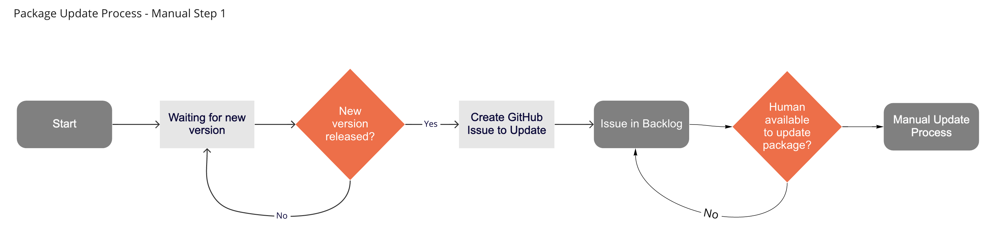

# Tanzu Community Edition Package Repositories and Versioning

This document defines TCE's approach to publishing package repositories and versioning. Considerations and questions that this document will address include the following:

* What happens when an application/functionality releases a new version?
* What is the prescribed process that TCE will use to make available that new version?
* How many package versions will TCE support?
  If N=$current_version, will we support n-2?
  Does N represent major? minor? patch?
* Can multiple versions of a package be available simultaneously?
* How will TCE respond to CVE's in existing packages?
* What channels should TCE provide for its repository (e.g. stable, beta. alpha)
* How we are going to think about "true" community-owned repositories
  Users will not always want their software to become part of TCE.
* We need to provide guidance on how folks can bring their own packages + bring their own package repositories.
* How will TCE handle `core` packages? These are packages required by Kubernetes itself.
* What can be automated?
* How will packages be tested?

## Package Repositories

Let us start by defining what a package repository is. As stated in the Carvel [packaging documentaion](https://carvel.dev/kapp-controller/docs/latest/packaging/#package-repositories), a package repository is a collection of packages that are grouped together. So what does this mean, a grouping of packages? The package repository author is grouping individual packages together to provide a curated set of functionality. Imagine a collection of all the versions of Contour. Or a collection of Ingress, Secret and Certificate management packages predefined and pre-configured for a getting started training class. Or maybe a set of advanced functionality for a secured, highly available production ready cluster.

Tanzu Community Edition will provide 2 package repositories, `core` and `user-managed`. The `core` package repository will contain packages that are required for bootstrapping, running and management of clusters. The `core` packages are not intended for end-user configuration. The `user-managed` package repository contains an opinionated collection of packages that TCE believes works well together and provides a solid foundation to build an application on top of.

TCE user managed packages can and will receive updates at any time. Independent of a TCE release, packages can be updated and commited to the GitHub repository, have an `imgpkgBundle` pushed to an OCI registry, and included into the TCE main package repository. Core packages, on the other hand, are tied to TKG releases. Updates to these packages will only occur in conjunction with a planned TKG release.

## Packages, Revisited

What exactly is a package again? According to the Carvel [documentation](https://carvel.dev/kapp-controller/docs/latest/packaging/#package),
> A single package is a combination of configuration metadata and OCI images that ultimately inform the package manager what software it holds and how to install it into a Kubernetes cluster.

In other words, it's metadata and images representing installable software for a Kubernetes cluster. A package can represent a single, deliverable, standalone piece of software, or a combination of distinct software bundled together to deliver a cohesive set of functionality.

For the first case, let's consider the cert-manager package. cert-manager itself is a standalone piece of software that can be installed to your cluster. We have packaged cert-manager at versions `1.1.0` and `1.3.1`, and you are free to choose which version you would like to use. In our packaging of cert-manager, we have bundled only cert-manager and have versioned the package to align with the version of cert-manager inside of it.

| software | version | package version|
| -------- | ------- | -------------- |
| cert-manager | 1.1.0 | 1.1.0-vmware0 |
| cert-manager | 1.3.1 | 1.3.1-vmware0 |

For the other example, lets consider the Prometheus package. It is actually a combination of Prometheus and Alert-Manager. Since the package is just called Prometheus, there is nothing on the surface that indicates it is actually a combination of 2 distinct pieces of software. The version of the package also tracks just Prometheus, leaving out alert-manager. Package authors are free to choose names and starting versions for their packages.

| software | version | package version|
| -------- | ------- | -------------- |
| prometheus/alert-maanger | 2.25.0/0.20.0 | 2.25.0-vmware0 |
| prometheus/alert-maanger | 2.26.0/0.21.0| 2.26.0-vmware0 |

For packages that bundle multiple pieces of software, it might be best to indicate through the name that the package contains multiple pieces of software. It might also be good to version the package starting with a `1.0.0` and increment from there.

## Versioning

When a new version is available for a package, TCE needs to have a defined process for how that version can be made available to end users. Lets start by looking at how the process works today, and then suggest a desired future state.

### High Level Overview

Here's a quick TL/DR of the process.

* Package created and pushed to OCI Regiestry
* PacakgeRepository created referencing package and pushed to repo.
* PackageRepository published for end-user consumption
* Package is updated and pushed to OCI Registry
* PackageRepository referencing package is updated with new reference and pushed. The PackageRepository author is free to choose:
  * to update the package refernce in place
  * or add the new reference alongside the old

### Manual Update Process

Initially, the process to update a pacakge version is manual. As new versions become available, a GitHub issue is created requesting that the package be updated. A human agrees to work the issue to manually run through the steps required to update the package. Let's walk through those steps.

#### 1. Is there a new version?

The first step is the waiting game. Is there a new version? In the manual process, a human must be, or is, aware that a new version of a package is available. The human creates a GitHub Issue with the details of the new version. The Issue then sits in the backlog until a human starts work on the actual update.



#### 2. Update Process

There are a number of steps that must be performed to update a package. The details of the process follows.


* Update the `vendir.yaml` with the new version
* Run `vendir sync` to pull down the upstream manifests
* Manually run `ytt`. If the command succeeds, there are no breaking changes with the new upstream manifests. If the command fails, a human will have to update the overlays to address the changes introduced by the new upstream manifests.
* Run `kbld` to create lock files for the package.
* Using `imgpkg`, push and tag the new updated package to an OCI Registry. Once the package is pushed, make a note of the URL and SHA returned from the imgpkg command, it will be needed to create the Package CR manifest.

#### 3. Package Repository Update Process

After the package has been version bumped, it needs to be made available via a Package Repository. There are 2 components to a Package Repository:

* An `imgpkgBundle` containing Package CRs
* A PackageRepository CR, with a name and a URL/SHA pointing to the `imgpkgBundle`

When TCE first launched, each package had a separate Package CR manifest in a repository `packages` directory. This was changed in 0.4.0 to have a single, generated `packages.yaml` that collected all `package` CRs included in the repository. Regardless of whether it was a static or generated file, a human had to put a URL and SHA, along with the updated version number, into a file, and then make that available in through a PackageRepository.

TCE has not yet officially released a PackageRepository containing a version bumped package. If we were to have done that, the process would have looked as follows:


* Update Package CRs in Package Repository
* Human decides on tag name for `imgpkgBundle`, or just defaults to `dev`
* Using `imgpkg`, bundle, push and tag the `imgpkgBundle`.
* A Human makes note of the URL/SHA returned from the `imgpkg` push and uses this to create a PackageRepository CR.

If the pushed `imgpkgBundle` is tagged appropriately, all clusters would update to the latest version of the Package Repository on their next reconciliation. This behaviour may nor may not be desirable.

## Proposal

The proposed process will flow much the same as the existing manual process. It is well within the realm of possibility to automate much, if not all of the process to update package versions. By replacing manual steps with code and automation, many of the questions asked above will be addressed and answered.

Before trying to automate the process, we first need to address the directory structure of the existing packages.

### Directory Structure

The current structure is shown below. This structure still uses old terminology and does not differentiate between package types.

```text
addons
├── packages
│   ├── foo
│   └── bar
└── repos
    ├── beta.yaml
    ├── main.yaml
    └── overlays
```

The proposed update introduces a number of changes to the structure.

* Remove outdated terminology and create sub-directories that better identifies their contents.
* The addons parent directory will be removed, and `packages` becomes the primary directory for package related contents.
* The existing `repos` directory will be renamed to `repositories` for clarity.
* Packages will be contained in 2 separate directories for the 2 types of packages: `core` and `user-managed`.
* A `misc` directory is introduced to contain files and templates useful for development and test. _*TODO: Should we just put things in the hack directory?*_

```txt
./packages
├── core
├── misc
├── repositories
└── user-managed
```

#### core

The `core` directory contains packages that are required for Kubernetes itself. These packages are not intended for end user use, modification or installation.

#### misc

The `misc` directory contains miscellaneous files used to support the development and testing of packages and package repositories.

#### repostiories

The `repositories` directory contains the files used to generate the package repository manifests.

#### user-managed

The `user-managed` directory contains packages that are intended for end user consumption. They represent additional functionality that a user can optionally add to extend and enhance their Kubernetes workload clusters.

#### `core` and `user-managed` Directory Structure

The `core` and `user-managed` directories will house the individual packages that require versioning. These package directories will continue to be structure the same as they currently are. To recap, the directory includes:

  ```txt
  ./cert-manager
  ├── README.md
  ├── config
  │   ├── overlays
  │   └── upstream
  ├── packageVersion.yaml
  ├── vendir.lock.yml
  ├── vendir.yml
  └── versions.yml
  ```

New to this are the `packageVersion.yaml`, `package.yaml` `and versions.yaml` files. `

Files that would go in to the package parent directory are:

* Package README
* `package.yaml`
* Other package related files.

In the package repository, TCE will support the current version and 2 previous. As an example, consider the cert-manager package. there would be 3 directories named after their respective versions.

```txt
packages/user-managed/cert-manager
├── 1.1.0-vmware.0
├── 1.2.0-vmware.0
├── 1.2.0-vmware.1
├── 1.3.0-vmware.0
├── package.yaml
└── README.md
```

Also maintained are 3 versions of TCE provided functionality. In this example, there are 2 versions of `1.2.0`, the `-vmware.0` and `-vmware.1`. These versions represent a change that is outside the scope of the upstream package. Meaning that the documentation, configuration, or capabilities have been changed but the underlying upstream package has not.  __Should we discuss why we are using the `pre-release` notation of semver instead of the proper `build` notation?__

### Process

#### Automated Update

TCE should be using an automated process to update packages. As long as a package has upstream files available via a [mechanism](https://carvel.dev/vendir/docs/latest/) supported by `vendir`, it is possible to programmatically check for new versions of a package. There are many different ways to accomplish this, and the methods may vary depending on the upstream source. If a package has been put together manually and has no upstream source, it will not be updated automatically.

#### GitHub Housekeeping

Once an update is detected, a GitHub issue should be created in the TCE GitHub repository. This issue will be used to inform humans that a package is available for update and to track the changes. Along with the issue, a branch will be created to contain the updated files. The name of the branch will follow a convention such as `update-<package-name>-to-<new-version>`.

With a branch to work on, actual updates and testing can be performed. The first bits to update are the package directories and their contents. The oldest version of the package will now be deprecated. The directory containing the old version will be deleted from the file system. References to this old version will also be deleted from the `main` channel package repository. A directory representing the new version will be created by copying the contents from the current version. The `vendir.yaml` will be updated to the new version. `vendir sync` and `kbld` shall be run and lock files will be updated. Other files that store version information should be updated the reflect the new version at this time.

Validation

Validation can occur at this point. The first and easiest test that can be performed is to check that the overlays still work. A run of `ytt` with the current overlays and `value.yaml` file shall be performed. If the result is a success, further validation and the automated process can continue. If the result is a failure, the upstream files have changed and are now incompatible with the current overlays. Human intervention is now required to adjust the overlays for the process to continue.

Assuming that the At the moment, there is no further validation or automated testing available for TCE packages. When implemented, there should be a hook at this point to trigger test execution.
