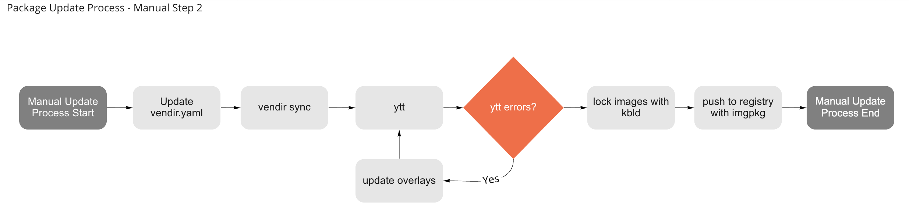
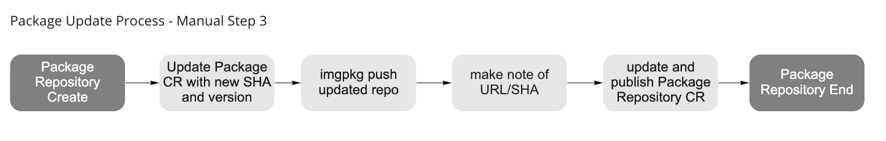

# Tanzu Community Edition Package Repositories and Versioning

This document defines TCE's approach to publishing package repositories and versioning. Considerations and questions that this document will address include the following:

* What happens when an application/functionality releases a new version?
* What is the prescribed process that TCE will use to make available that new version?
* How many package versions will TCE support?
  If N=$current_version, will we support n-2?
  Does N represent major? minor? patch?
* Can multiple versions of a package be available simultaneously?
* How will TCE respond to CVE's in existing packages?
* What channels should TCE provide for its repository (e.g. stable, alpha, beta, etc)
* How we are going to think about "true" community-owned repositories?
  Users will not always want their software to become part of the TCE GitHub repository.
* We need to provide guidance on how folks can bring their own packages + bring their own package repositories.
* How will TCE handle `core` packages? These are packages required by Kubernetes itself.
* What can be automated?
* How will packages be tested?
* How should we specify the version of our packages?

## Package Repositories

Let us start by defining what a package repository is. As stated in the Carvel [packaging documentaion](https://carvel.dev/kapp-controller/docs/latest/packaging/#package-repositories), a package repository is a collection of packages that are grouped together. So what does this mean, a grouping of packages? The package repository author is grouping individual packages together to provide a curated set of functionality. Imagine a collection of all the versions of Contour. Or a collection of Ingress, Secret and Certificate management packages predefined and pre-configured for a getting started training class. Or maybe a set of advanced functionality for a secured, highly available production ready cluster.

Tanzu Community Edition will provide 3 package repositories:

* `core`
* `main`
* `beta`

The `core` package repository will contain packages that are required for bootstrapping, running and management of clusters. The `core` packages are not intended for end-user configuration. The `user-managed` package repository contains an opinionated collection of packages that TCE believes works well together and provides a solid foundation to build an application on top of. The `beta` repository contains new or version bumped packages awaiting further validation and test before inclusion in the `main` user-managed repository.

TCE user managed packages can and will receive updates at any time. Independent of a TCE release, packages can be updated and commited to the GitHub repository, have an `imgpkgBundle` pushed to an OCI registry, and included into the TCE main package repository. Core packages, on the other hand, are tied to TKG releases. Updates to these packages will only occur in conjunction with a planned TKG release.

### Package Repository Tagging

Package Repositories should be tagged in the OCI registry.

* `main`

    `main` will always have a tag `:stable` that points to a package repository with a known good collection of packages.

    As package versions are updated and pushed to GitHub and the OCI registry, new versions of the `main` repository can be generated and pushed. These versions should be tagged with the GitHub commit SHA representing the latest package change. We could also at this time tag it with a prerelease notation, such as `:0.6.0-alpha.2` for the next release. 

    As part of the release process when an official TCE release is cut, the current, `stable` `main` package repository should be tagged with the latest version of TCE. For example, `:0.7.0` 

* `beta` - The beta repository is intended to be more ad-hoc and manual. It's a repository where we want to experiment with new packages while not disrupting the `main` repo.

* `core` - The `core` repository shall follow the same rules as the `main` repository.

### How/When do Package Repositories get updated?

  A new package repository should be generated after any update to a package contained within that repository. 

## Packages, Revisited

What exactly is a package again? According to the Carvel [documentation](https://carvel.dev/kapp-controller/docs/latest/packaging/#package),
> A single package is a combination of configuration metadata and OCI images that ultimately inform the package manager what software it holds and how to install it into a Kubernetes cluster.

In other words, it's metadata and images representing installable software for a Kubernetes cluster. A package can represent a single, deliverable, standalone piece of software, or a combination of distinct software bundled together to deliver a cohesive set of functionality.

For the first case, let's consider the cert-manager package. cert-manager itself is a standalone piece of software that can be installed to your cluster. We have packaged cert-manager at versions `1.1.0` and `1.3.1`, and you are free to choose which version you would like to use. In our packaging of cert-manager, we have bundled only cert-manager and have versioned the package to align with the version of cert-manager contained within.

| software | version | package version |
| -------- | ------- | -------------- |
| cert-manager | 1.1.0 | 1.1.0-vmware0 |
| cert-manager | 1.3.1 | 1.3.1-vmware0 |

However, in some respectes, this is wrong. The package should not track the version of the underlying software as we are versioning our package, not cert-manager and instead we should version as such:

| software | package version | description |
| -------- | --------------- | -------------- |
| vmware-pkg-cert-manager | 1.0.0 | cert-manager 1.1.0 |
| vmware-pkg-cert-manager | 1.1.0 | cert-manager 1.3.0 |

For the other example, let us consider the Prometheus package. It is actually a combination of Prometheus and Alert-Manager. Since the package is just called Prometheus, there is nothing on the surface that indicates it is actually a combination of 2 distinct pieces of software. The version of the package also tracks just Prometheus, leaving out alert-manager. Package authors are free to choose names and starting versions for their packages.

| software | version | package version |
| -------- | ------- | -------------- |
| prometheus/alert-maanger | 2.25.0/0.20.0 | 2.25.0-vmware0 |
| prometheus/alert-maanger | 2.26.0/0.21.0 | 2.26.0-vmware0 |

For packages that bundle multiple pieces of software, it makes sense that the package version does not align with any version of the bundled software. A different name and version would be a good indicator that the package contains multiple items.

| software | package version | description |
| -------- | --------------- | -------------- |
| vmware-tobs | 1.0.0 | prometheus 2.25.0; alert-maanger 0.20.0 |
| vmware-tobs | 1.1.0 | prometheus 2.26.0; alert-maanger 0.21.0 |

The only place where it is acceptable for the package version to align with the version of the containing software. This when the package is created and distributed by the organization managing said software. As that organization is creating the package in conjunction with actual releases of the software.

Given that discussion, the decision on how to name and version a package ultimately comes down to the authors. Package authors are free to name it, and they are free to pick the starting version number.

### Version Format

While discussing the makeup of packages, it's difficult to not mention the version string. The version string is important for tracking the package, underlying software, and tagging in OCI registries. TCE has been using the following format:

`x.y.z-vmwarex`

Let's break that apart:

* `x.y.z`: major, minor and patch version that is the same as the version of the underlying software in the package
* `-vmwarex`: an indicator that this package is provided by VMware, with a build number

If following the guidelines in [Semantic Versioning](https://semver.org/), we're doing it wrong:

* `x.y.z` is tracking the version of the underlying software. This works great when the package only has one thing in it, as is the usual case. However, as soon as you start bundling mulitple pieces of software together to deliver a cohesive experience, that version number is no longer accurate. The x.y.z should be tracking the major, minor and patch versions of the package itself.
* `-` indicates a prerelease version follows. Prerelease is `alpha`, `beta`, etc. Instead, we are specifying `vmwarex`, which is actually build metadata.
* The build metadata is incorrectly formatted as well, `vmwarex`. There are 2 bits of metadata in that string.

  * `vmware` which indicates that VMware created this package.
  * `x` indicates a build number

    Once again, following Semantic Versioning, build metadata *MAY* be denoted by appending a plus sign and a series of dot separated identifiers. We should be specifying it as `vmware.x`. We're actually free to do it however we want (note the `may`), but using the dot notation would be considered proper.

Our recommendation is to follow semantic versioning guidelines for packages.

For packages that bundle a single, deliverable piece of software:

* For simplicity, the version of the package should track the version of the bundled software.
* Build metadata should be provided correctly.
* Prerelease versions used when appropriate

For example, lets consider the third build from VMware of a package with version 1.3.1 of cert-manager. The version string should look like `1.3.1+vmware.3`

For packages that bundle multiple pieces of software, such as the Prometheus/Alert-Manager example, or just a single piece of software like cert-manager:

* The version of the package should start at `1.0.0`, or `0.1.0` if it represents initial development.
* Build metadata should be provided correctly
* Prerelease versions used when appropriate

> However, as stated earlier, a package author is free to choose the starting version and may choose to align the package version with a particular piece of software contained within.

## Versioning of Packages

When a new version is available for a package, TCE needs to have a defined process for how that version can be made available to end users. Let us start by looking at how the process works today, and then suggest a desired future state.

### Current High Level Overview

Here's a quick TL/DR of the process.

* Package created and pushed to OCI Regiestry
* PacakgeRepository created referencing package and pushed to repo.
* PackageRepository published for end-user consumption
* Package is updated and pushed to OCI Registry
* PackageRepository referencing package is updated with new reference and pushed. The PackageRepository author is free to choose:
  * to update the package refernce in place
  * or add the new reference alongside the old
* PackageRepository published for end-user consumption

### Manual Update Process

Initially, the process to update a pacakge version is manual. As new versions become available, a GitHub issue is created requesting that the package be updated. A human agrees to work the issue to manually run through the steps required to update the package. Let's walk through those steps.

#### 1. Is there a new version?

The first step is the waiting game. Is there a new version? In the manual process, a human must be, or is, aware that a new version of a package is available. The human creates a GitHub Issue with the details of the new version. The Issue then sits in the backlog until a human starts work on the actual update.

#### 2. Update Process

There are a number of steps that must be performed to update a package. The details of the process follows.

* Update the `vendir.yaml` with the new version
* Run `vendir sync` to pull down the upstream manifests
* Manually run `ytt`. If the command succeeds, there are no breaking changes with the new upstream manifests. If the command fails, a human will have to update the overlays to address the changes introduced by the new upstream manifests.
* Run `kbld` to create lock files for the package.
* Using `imgpkg`, push and tag the new updated package to an OCI Registry. Once the package is pushed, make a note of the digest returned from the imgpkg command, it will be needed to create the Package CR manifest.

#### 3. Package Repository Update Process

After the package has been version bumped, it needs to be made available via a Package Repository. There are 2 components to a Package Repository:

* An `imgpkgBundle` containing Package CRs
* A PackageRepository CR, with a name and a URl/digest pointing to the `imgpkgBundle`

When TCE first launched, each package had a separate Package CR manifest in a repository `packages` directory. This was changed in 0.4.0 to have a single, generated `packages.yaml` that collected all `package` CRs included in the repository. Regardless of whether it was a static or generated file, a human had to put a URl/digest, along with the updated version number, into a file, and then make that available in through a PackageRepository.

TCE has not yet officially released a PackageRepository containing a version bumped package. If we were to have done that, the process would have looked as follows:

* Update Package CRs in Package Repository
* Human decides on tag name for `imgpkgBundle`, or just defaults to `dev`
* Using `imgpkg`, bundle, push and tag the `imgpkgBundle`.
* A Human makes note of the URl/digest returned from the `imgpkg` push and uses this to create a PackageRepository CR.

If the pushed `imgpkgBundle` is tagged appropriately, all clusters would update to the latest version of the Package Repository on their next reconciliation. This behaviour may or may not be desirable.

## Proposal

The proposed process will follow much the same as the existing manual process. It is well within the realm of possibility to automate much, if not all of the process to update package versions. By replacing manual steps with code and automation, many of the questions asked above will be addressed and answered.

Before trying to automate the process, we first need to address the directory structure of the existing packages.

### Directory Structure

The current structure is shown below. This structure still uses old terminology and does not differentiate between package types.

    addons
    ├── packages
    │   ├── cert-manager
    │   └── contour-operator
    └── repos
        ├── beta.yaml
        ├── main.yaml
        └── overlays

The proposed update introduces a number of changes to the structure.

* Remove outdated terminology and create sub-directories that better identifies their contents.
* The addons parent directory will be removed, and `packages` becomes the primary directory for package related contents.
* The existing `repos` directory will be renamed to `repositories` for clarity.
* Packages will be contained in 2 separate directories for the 2 types of packages: `core` and `user-managed`.
* A `misc` directory is introduced to contain files and templates useful for development and test. _*TODO: Should we just put things in the hack directory?*_

    ./packages
    ├── core
    ├── misc
    ├── repositories
    └── user-managed

#### core

The `core` directory contains packages that are required for Kubernetes itself. These packages are not intended for end user use, modification or installation.

#### misc

The `misc` directory contains miscellaneous files used to support the development and testing of packages and package repositories. _*TODO: This might not be needed*_

#### repostiories

The `repositories` directory contains the files used to generate the package repository manifests.

#### user-managed

The `user-managed` directory contains packages that are intended for end user consumption. They represent additional functionality that a user can optionally add to extend and enhance their Kubernetes workload clusters.

#### `core` and `user-managed` Directory Structure

The `core` and `user-managed` directories will house the individual packages that require versioning. These package directories will continue to have the same structure. To recap, the directory looks as such:

    cert-manager
    └── 1.0
        ├── README.md
        ├── config
        │   ├── overlays
        │   │   └── overlay-namespace.yaml
        │   ├── upstream
        │   │   └── cert-manager.yaml
        │   └── values.yaml
        ├── packageVersion.yaml
        ├── test
        ├── vendir.lock.yml
        └── vendir.yml

New to this are `packageVersion.yaml` and `test`. The `pacakgeVersion.yaml` file contains version specific information according to Carvel [documentation](https://carvel.dev/kapp-controller/docs/latest/package-authoring/#creating-the-crs). The `test` folder should contain any version specific test and validation scripts/configuration.

Files that would go in to the package parent directory are:

* Package README
* `package.yaml`
* Any other package related files.

In the package repository, TCE will support the current version and 2 previous. As an example, consider the cert-manager package. There would be 3 directories named after their respective versions.

    packages/user-managed/cert-manager
    ├── 1.0
    ├── 1.1
    ├── 1.2
    ├── package.yaml
    └── README.md

Wait, at the time of writing, the current cert-manager version is `1.3.1`. Why isn't there a `1.3` directory? Remember, the package version does not track the underlying software version, but the package itself. Assuming we started with cert-manager `1.1.0`, our initial package version would be `1.0.0`. If cert-manager patch bumped to `1.1.1`, we would update our 1.0 directory to cert-manager `1.1.1` and bump the package version to 1.0.1. If we found a bug and needed to tweak an overlay, bump the version to `1.0.2`. If there is a new minor version of cert-manager, `1.2.0`, that would qualify for a minor version bump to our package as well - `1.1.0`. A change to the major version of the underlying software would bump the major version of the pacakge.

| package | package version | software | version | description |
| ------- | --------------- | -------- | ------- | ----------- |
| cert-mgr | 1.0.0 | cert-manager | 1.1.0 | initial |
| cert-mgr | 1.0.1 | cert-manager | 1.1.1 | patch |
| cert-mgr | 1.0.2 | cert-manager | 1.1.1 | overlay change |
| cert-mgr | 1.1.0 | cert-manager | 1.2.0 | minor |
| cert-mgr | 1.2.0 | cert-manager | 1.3.0 | minor |
| cert-mgr | 2.0.0 | cert-manager | 2.0.0 | major |

### Update Process

#### Automated Update

TCE should be using an automated process to update packages. As long as a package has upstream files available via a [mechanism](https://carvel.dev/vendir/docs/latest/) supported by `vendir`, it is possible to programmatically check for new versions of a package. There are many different ways to accomplish this, and the methods may vary depending on the upstream source. If a package has been put together manually and has no upstream source, it will not be updated automatically. However, a mechanism (commit, script or poke of some sort) should exist such that a manual update triggers an automated validation/test and package publishing process.

#### GitHub Housekeeping

Once an update is detected, a GitHub issue should be created in the TCE GitHub repository. This issue will be used to inform humans that a package is available for update and to track the changes. Along with the issue, a branch will be created to contain the updated files. The name of the branch will follow a convention such as `update-<package-name>-to-<new-version>`.

#### New Version Creation

With a branch to work on, actual updates and testing can be performed. The first bits to update are the package directories and their contents.

##### Patch Release of the Underlying Software

With a patch release of the underlying software, the package would receive an update in place in its existing directory in the TCE repository.

##### Major/Minor Release of the Underlying Software

 A new directory with the new major/minor version as its name will be created. As a starting point, all of the files and content from the previous version should be copied into the new direectory.

#### Packaging File Updates

 The `vendir.yaml` and `packageVersion` CR will be updated to the new version. `vendir sync` and `kbld` shall be run and lock files will be updated. Other files that store version information which can be updated in a programmatic fashion should be updated to reflect the new version at this time.

#### Old Version Cleanup

Cleanup and remove old versions of the package. If there are already 3 versions of the package, delete the oldest according to us maintaining N-2 versions. References to this old version will also be deleted from the `main` channel package repository. The N-2 rule will not apply to `core` packages as they will be locked to releases of TKG.

> Even though the directory is being deleted, it will still be available for reference in source control. The package for that version will also still be available in the OCI registry.

#### Basic Validation

Basic validation of the pacakge can occur at this point. If there are any validation tests/scripts that can be run at this time, they should be executed. These tests/scripts are found in the package's `test` directory. At this time, there are no existing tests.

A possible first and simple test that can be performed is to check that the overlays still work. A run of `ytt` with the current overlays and `value.yaml` file shall be performed. If the result is a success, further validation (if any) and the automated process can continue. If the result is a failure, the upstream files have changed and are now incompatible with the current overlays. Human intervention is now required to adjust the overlays for the process to continue.

#### Package Generation and Push

With successful validation, the package can be created and pushed to an OCI registry. The `imgpkg` command will be run and the package pushed. The package should be tagged in the OCI registry with its new package version (remember, package version does not track contents version).

#### Package Repository Update

With a package pushed to an OCI registry, it is ready for inclusion in a Package repository. Packages should be available to end users for further validation, test, and usage before having to wait for a new release of TCE. This can be accomplished by updating a beta release package repository.

The `beta` package repository will be updated to include the package at its new version. If the beta package repository already has that package, check the versions to determine how to handle the update. If the a patch version is changing, update the existing entry. If the minor version changes, then add a new entry.

wip...
