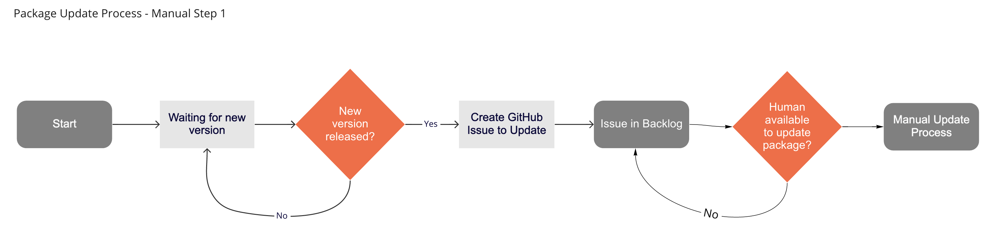
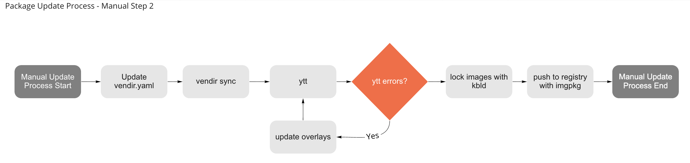
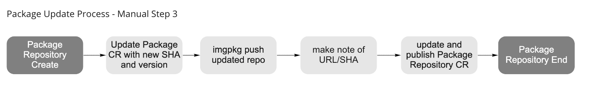

# Tanzu Community Edition Package Versioning

This document defines TCE's approach to versioning packages and publishing package repositories. Considerations and questions that this document will address include the following:

* What happens when an application/functionality releases a new version?
* What is the prescribed process that TCE will use to make available that new version?
* How many package versions will TCE support?
  If N=$current_version, will we support n-2?
  Does N represent major? minor? patch?
* Can multiple versions of a package be available simultaneously?
* How will TCE respond to CVE's in existing packages?
* What channels should TCE provide for its repository (e.g. stable, beta. alpha)
* How we are going to think about "true" community-owned repositories
  Users will not always want their software to become part of TCE.
* We need to provide guidance on how folks can bring their own packages + bring their own package repositories.
* How will TCE handle `core` packages? These are packages required by Kubernetes itself.
* What can be automated?
* How will packages be tested?

## Versioning

When new version is available for a package, TCE needs to have a defined process for how that version can be made available to end users. Lets start by looking at how the process works today, and then suggest a desired future state.

### Manual Update Process

Initially, the process to update a pacakge version is manual. As new versions become available, a GitHub issue is created requesting that the package be updated. A human agrees to work the issue to manually run through the steps required to update the package. Let's walk through those steps.

#### 1. Is there a new version?

The first step is the waiting game. Is there a new version? In the manual process, a human must be, or is, aware that a new version of a package is available. The human creates a GitHub Issue with the details of the new version. The Issue then sits in the backlog until a human starts work on the actual update.



#### 2. Update Process

There are a number of steps that must be performed to update a package. The details of the process follows.



* Update the `vendir.yaml` with the new version
* Run `vendir sync` to pull down the upstream manifests
* Manually run `ytt`. If the command succeeds, there are no breaking changes with the new upstream manifests. If the command fails, a human will have to update the overlays to address the changes introduced by the new upstream manifests.
* Run `kbld` to create lock files for the package.
* Using `imgpkg`, push and tag the new updated package to an OCI Registry. Once the package is pushed, make a note of the URL and SHA returned from the imgpkg command, it will be needed to create the Package CR manifest.

#### 3. Package Repository Update Process

After the package has been version bumped, it needs to be made available via a Package Repository. There are 2 components to a Package Repository:

* An `imgpkgBundle` containing Package CRs
* A PackageRepository CR, with a name and a URL/SHA pointing to the `imgpkgBundle`

When TCE first launched, each package had a separate Package CR manifest in a repository `packages` directory. This was changed in 0.4.0 to have a single, generated `packages.yaml` that collected all `package` CRs included in the repository. Regardless of whether it was a static or generated file, a human had to put a URL and SHA, along with the updated version number, into a file, and then make that available in through a PackageRepository.

TCE has not yet officially released a PackageRepository containing a version bumped package. If we were to have done that, the process would have looked as follows:



* Update Package CRs in Package Repository
* Human decides on tag name for `imgpkgBundle`, or just defaults to `dev`
* Using `imgpkg`, bundle, push and tag the `imgpkgBundle`.
* A Human makes note of the URL/SHA returned from the `imgpkg` push and uses this to create a PackageRepository CR.

If the pushed `imgpkgBundle` is tagged appropriately, all clusters would update to the latest version of the Package Repository on their next reconciliation. This behaviour may nor may not be desirable.

### Proposed Process

The proposed process will flow much the same as the existing manual process. It is well within the realm of possibility to automate much, if not all of the process to update package versions. By replacing manual steps with code and automation, many of the questions asked above will be addressed and answered.

Before trying to automate the process, we first need to address the directory structure of the existing packages.

#### Directory Structure

The current structure is shown below. This structure still uses old terminology and does not differentiate between package types.

```text
addons
├── packages
│   ├── foo
│   └── bar
└── repos
    ├── beta.yaml
    ├── main.yaml
    └── overlays
```

The proposed update introduces a number of changes to the structure.

* Remove outdated terminology and create sub-directories that better identifies their contents.
* The addons parent directory will be removed, and `packages` becomes the primary directory for package related contents.
* The existing `repos` directory will be renamed to `repositories` for clarity.
* Packages will be contained in 2 separate directories for the 2 types of packages: `core` and `user-managed`.
* A `misc` directory is introduced to contain files and templates useful for development and test.

```txt
./packages
├── core
├── misc
├── repositories
└── user-managed
```

##### core

The `core` directory contains packages that are required for Kubernetes itself. These packages are not intended for end user use, modification or installation.

##### misc

The `misc` directory contains miscellaneous files used to support the development and testing of packages and package repositories.

##### repostiories

The `repositories` directory contains the files used to generate the package repository manifests.

##### user-managed

The `user-managed` directory contains packages that are intended for end user consumption. They represent additional functionality that a user can optionally add to extend and enhance their Kubernetes workload clusters.

#### `core` and `user-managed` Directory Structure

The `core` and `user-managed` directories will house the individual packages that require versioning. The proposed structure of these directories to support versioning is to place version specific files into a sub-directory named after the version.

For example, consider the cert-manager package. If TCE was to support the previous 3 versions, there would be 3 directories named after their respective versions.

```txt
packages/user-managed/cert-manager
├── 1.1.0-vmware0
├── 1.2.0-vmware0
├── 1.3.0-vmware0
├── package.yaml
└── README.md
```
