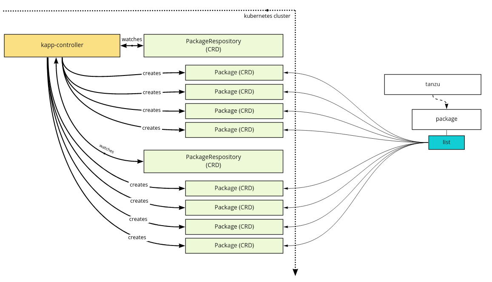
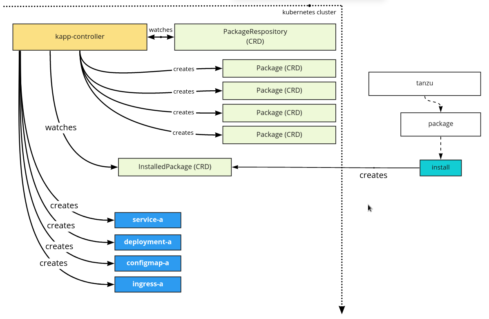

# Tanzu Add-on Management

This document covers the management of add-ons of a server-side and client-side
perspective. This is a working design doc that will evolve over time as our
add-on management is implemented and enhanced.

## Server Side

### Overview and APIs

## Client Side

This section describes the client side management of extensions. This
specifically focuses on our usage of `tanzu` CLI to discover, configure, deploy,
and manage add-ons.

### Overview and APIs

### Package Discovery

The `tanzu` CLI is able to discover packages known to the cluster. It discovers
these packages by viewing all available [Package
CRs](https://carvel.dev/kapp-controller/docs/latest/packaging/#package) to the
cluster. These Packages can be sourced from 1 or many
[PackageRepository](https://carvel.dev/kapp-controller/docs/latest/packaging/#package-repositories)
CRs. This model is inspired by popular Linux package managers where inclusion of
a repository (e.g. `/etc/apt/sources.list`)  will make new packages available to
the manager (e.g. `apt`). With this, a command such as the following is
possible.

```sh
tanzu package list

NAME               VERSION    REPO
knative-serving    1.12       tce-main 
contour            2.32       tce-main
nvidia-driver      1.11       nvidia-main
```

In the above, the `tanzu` CLI is aggregating and listing metadata from
already-existent objects. Namely the following from each `Package` instance:

* `NAME`: `spec.publicName`
* `VERSION`: `spec.version`
* `REPO`: TODO(see
[https://github.com/vmware-tanzu/carvel-kapp-controller/issues/124](https://github.com/vmware-tanzu/carvel-kapp-controller/issues/124))

This is visually represented as follows.



### Package Configuration

### Package Installation

The `tanzu` CLI is able to install packages. Where installation is the
declaration of intent to deploy workloads into the cluster. This is achieved
using the [InstalledPackage
CR](https://carvel.dev/kapp-controller/docs/latest/packaging/#installedpackage-cr).
Once present in the cluster, kapp-controller (server side) is able to resolve
what resources need to be created and reconcile to create them.

The primary work on the `tanzu` CLI side is to translate the desire to translate
a `Package` CR into an `InstalledPackage` based on the user's desire. Consider
the following available packages in a cluster.

```sh
tanzu package list

NAME               VERSION    REPO
knative-serving    1.12       tce-main 
contour            2.32       tce-main
nvidia-driver      1.11       nvidia-main
```

Should the user want to install the `knative-serving:1.12` package, they can run
the following command.

```sh
tanzu package install knative-serving

knative-serving 1.12 installed in cluster
reference: kubectl get InstalledPackage knative-serving-1-12
```

In running this command, the `tanzu` client will have done the following.

1. Read the contents of the `knative-serving:1.12` `Package`.

    The following is an example of what the Package contents might be.

    ```yaml
    apiVersion: package.carvel.dev/v1alpha1
    kind: Package
    metadata:
      # Resource name. Should not be referenced by InstalledPackage.
      # Should only be populated to comply with Kubernetes resource schema.
      # spec.publicName/spec.version fields are primary identifiers
      # used in references from InstalledPackage
      name: knative.vmware.com.1.12
      # Package is a cluster scoped resource, so no namespace
    spec:
      # Name of the package; Referenced by InstalledPackage (required)
      publicName: knative.vmware.com
      # Package version; Referenced by InstalledPackage;
      # Must be valid semver (required)
      version: 1.12
      # App template used to create the underlying App CR.
      # See 'App CR Spec' docs for more info
      template:
        spec:
          fetch:
          - imgpkgBundle:
              image: registry.tkg.vmware.run/tkg-knative@sha256:...
          template:
          - ytt:
              paths:
              - config/
          - kbld:
              paths:
              # - must be quoted when included with paths
              - "-"
              - .imgpkg/images.yml
          deploy:
          - kapp: {}
    ```

1. Created a `knative-serving-1-12` `InstalledPackage`.

    The following is an example of what the `InstalledPackage` contents might be.

    ```yaml
    apiVersion: install.package.carvel.dev/v1alpha1
    kind: InstalledPackage
    metadata:
      name: knative
      namespace: my-ns
    spec:
      # specifies service account that will be used to install underlying package contents
      serviceAccountName: knative-sa
      packageRef:
        # Public name of the package to install. (required)
        publicName: knative
        # Specifies a specific version of a package to install (optional)
        # Either version or versionSelection is required.
        version: 1.12
        # Selects version of a package based on constraints provided (optional)
        # Either version or versionSelection is required.
        versionSelection:
          # Constraint to limit acceptable versions of a package;
          # Latest version satisying the contraint is chosen;
          # Newly available, acceptable later versions are picked up and installed automatically. (optional)
          constraint: ">v1.12"
          # Include prereleases when selecting version. (optional)
          prereleases: {}
      # Values to be included in package's templating step
      # (currently only included in the first templating step) (optional)
      values:
      - secretRef:
          name: knative-values
    # Populated by the controller
    status:
      packageRef:
        # Kubernetes resource name of the package chosen against the constraints
        name: knative.tkg.vmware.com.v1.12
      # Derived from the underlying App's Status
      conditions:
      - type: ValuesSchemaCheckFailed
      - type: ReconcileSucceeded
      - type: ReconcileFailed
      - type: Reconciling
    ```

3. Applied the `InstalledPackage` to the cluster.

This is visually represented as follows.



### Package Management

### Package Repository Discovery

### Package Repository Creation

### Package Repository Deletion
