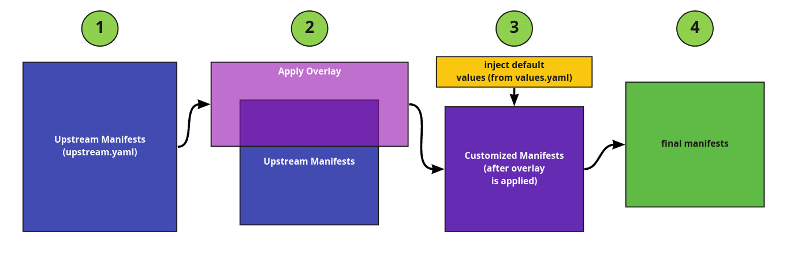
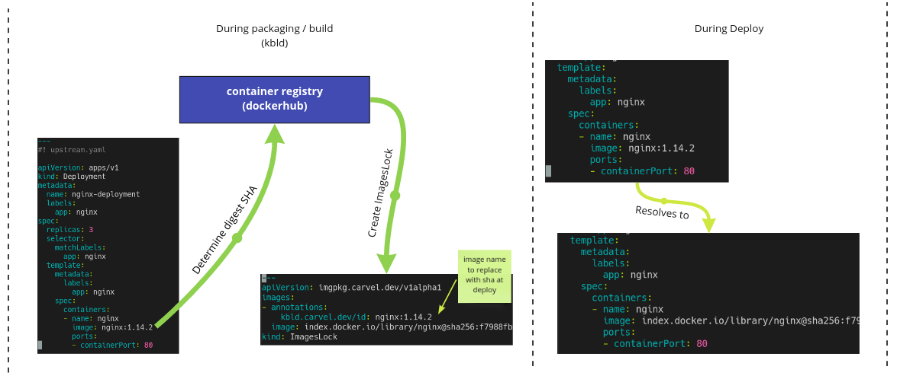
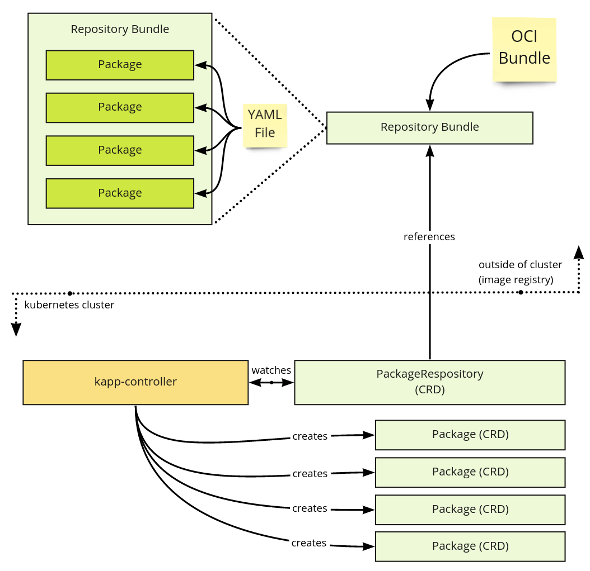

# Tanzu Add-on Packaging

This document covers the creation of add-ons for use in Tanzu Community Edition
(TCE). This is a working design doc that will evolve over time as add-ons are
implemented. Along with being a design doc, this asset walks you
through packaging of an add-on.

## Terminology

For definitions of extensions, add-ons, core add-ons, user-managed add-ons and
more, see our [terminology documentation](terminology.md).

## Packaging Add-Ons

Packaging of add-ons is done with the [Carvel](https://carvel.dev/) toolkit. The
end result is an OCI bundle stored in a container registry. For discovery,
deployment, and management operations, the `tanzu` CLI is used, as shown below.

```sh
$ tanzu extension install contour
contour install extension succeeded
```

> This experience is specific to user-managed add-ons

_For details on how these add-ons are discovered, deployed, and managed, see the
[Tanzu Add-on Management document](./tanzu-addon-management.md)._

### Packaging Workflow

The following flow describes how we package user-managed add-ons. These steps
are described in detail in the subsequent sections.


### 1. Create Directory Structure

Each add-on lives in a separate directory, named after the add-on. The
create-package make target will construct the directories and default files. You
can run it by setting a `NAME` variable.

```sh
make create-package NAME=foo

hack/create-package-dir.sh foo
mkdir: created directory 'addons/packages/foo'
mkdir: created directory 'addons/packages/foo/bundle'
mkdir: created directory 'addons/packages/foo/bundle/config'
mkdir: created directory 'addons/packages/foo/bundle/.imgpkg'
mkdir: created directory 'addons/packages/foo/bundle/config/overlay'
mkdir: created directory 'addons/packages/foo/bundle/config/upstream'

add-on bootstrapped at addons/packages/foo
```

The above script creates the following directory structure.

```txt
./addons/packages/foo
├── README.md
├── bundle
├── ├── .imgpkg
├── ├── config
├── ├── ├── overlay
├── ├── ├── upstream
```

The files and directories are used for the following.

* **README**: Contains the add-on's documentation.
* **bundle**: Contains the add-on's imgpkg bundle.
* **bundle/.imgpkg**: Contains metadata for the bundle.
* **bundle/config/upstream**: Contains the add-on's deployment manifests. Typically
sourced by upstream.
* **bundle/config/overlay**: Contains the add-on's overlay applied atop the
upstream manifest.

### 2. Add Manifest(s)

In order to stay aligned with upstream, store unmodified manifests. For example,
[gatekeeper's](https://github.com/open-policy-agent/gatekeeper) upstream
manifest is located
[here](https://raw.githubusercontent.com/open-policy-agent/gatekeeper/master/deploy/gatekeeper.yaml).
By storing the configuration of the upstream manifest, you can easily update the
manifest and have customizations applied via
[overlays](https://carvel.dev/ytt/#example:example-overlay).

To ensure integrity of the sourced upstream manifests,
[vendir](https://carvel.dev/vendir/docs/latest/vendir-spec) is used. It will
download and create a lock file that ensures the manifest matches a specific
commit.

In the `bundle` directory, create a `vendir.yml` file. The following
demonstrates the configuration for gatekeeper.

```yaml
apiVersion: vendir.k14s.io/v1alpha1
kind: Config
directories:
- path: config
  contents:
  - path: upstream
    git:
      url: https://github.com/open-policy-agent/gatekeeper
      ref: origin/master
    newRootPath: deploy
```

> There are multiple sources you can use. Ideally, packages use either `git` or `githubReleases` such that we can lock in the version. Using the `http` source does not give us the same guarentee as the aforementioned sources.

This configuration means vendir will manage the `config/upstream` directory. To
download the assets and produce a lock file, run the following.

```sh
vendir sync
```

A lock file will be created at `bundle/vendir.lock.yml`. It will contain the
  following lock metadata.

```yaml
apiVersion: vendir.k14s.io/v1alpha1
directories:
- contents:
  - git:
      commitTitle: Adding pod disruption budget (#1105)...
      sha: 6d99979b5eaf3e263c860694a4d64d4e1c302cf2
      tags:
      - v3.4.0-beta.0-17-g6d99979b
    path: upstream
  path: config
kind: LockConfig
```

With the above in place, the directories and files will appear as follows.

```txt
./addons/packages/foo
├── README.md
├── bundle
├── ├── .imgpkg
├── ├── config
├── ├── ├── overlay
├── ├── ├── upstream
├── ├── ├── ├── gatekeeper.yaml
├── ├── vendir.yml
├── ├── vendir.lock.yml
```

### 3. Create Overlay(s)

For each object (e.g. `Deployment`) you need to modify from upstream, an overlay
file should be created. Overlays are used to ensure we import
unmodified-upstream manifests and apply specific configuration on top.

Consider the following `gatekeeper.yaml` added in the previous step.

```yaml
---
#! upstream.yaml

apiVersion: apps/v1
kind: Deployment
metadata:
  name: gatekeeper-deployment
  labels:
    app: gatekeeper
spec:
  replicas: 1
  selector:
    matchLabels:
      app: gatekeeper
  template:
    metadata:
      labels:
        app: gatekeeper
    spec:
      containers:
      - name: gatekeeper
        image: gatekeeper:1.14.2
        ports:
        - containerPort: 80
```

Assume you want to modify `metadata.labels` to a static value and
`spec.replicas` to a user-configurable value.

Create a file named `overlay-deployment-gatekeeper.yaml` in the `bundle/overlay`
directory.

```yaml
---
#! overlay-deployment-gatekeeper.yaml

#@ load("@ytt:overlay", "overlay")
#@ load("@ytt:data", "data")

#@overlay/match by=overlay.subset({"kind":"Deployment", "metadata":{"name":"gatekeeper-deployment"}})
---
metadata:
  labels:
    #@overlay/match missing_ok=True
    class: gatekeeper
    #@overlay/match missing_ok=True
    owned-by: tanzu

#@overlay/match by=overlay.subset({"kind":"Deployment", "metadata": {"name": "gatekeeper-deployment"}})
---
spec:
  #@overlay/match missing_ok=True
  replicas: #@ data.values.runtime.replicas
```

> ⚠️: Do not templatize or overlay container image fields. `kbld` will be used to
create and/or reference image digest SHAs.

_Detailed overlay documentation is available [in the Carvel
site](https://carvel.dev/ytt/#example:example-overlay)._

### 4. Create Default Values

For every user-configurable value defined above, a `values.yaml` file should
contain defaults and documentation for what the parameter impacts.

Create a `values.yaml` file in `bundle/config`.

```yaml
#@data/values
---

#! The namespace in which to deploy foo.
namespace: foo-extension

#! The amount of replicas that should exist in foo.
runtime:
  replicas: 3
```

### [Optional]: Validate Templating

With the above in place, you can validate that overlays and templating are
working as expected. The conceptual flow is as follows.



To run the above, you can use `ytt` as follows.

```sh
ytt \
  -f addons/packages/foo/bundle/config
```

In the above example, the following manifest is produced.

```yaml
apiVersion: apps/v1
kind: Deployment
metadata:
  name: nginx-deployment
  labels:
    app: nginx
    class: nginx
    owned-by: tanzu
spec:
  replicas: 3
  selector:
    matchLabels:
      app: nginx
  template:
    metadata:
      labels:
        app: nginx
    spec:
      containers:
      - name: nginx
        image: nginx:1.14.2
        ports:
        - containerPort: 80
```

> In the above, the labels were set statically via the overlay. The
`spec.replicas` were set to a value variable by the overlay, then set to `2`
from the `values.yaml` file.

### 5. Resolve and reference image digests

To ensure integrity of packages, it is important to reference an [image
digest](https://github.com/opencontainers/image-spec/blob/master/descriptor.md#digests)
rather than a tag. A tag's underlying image can change arbitrarily. Where as
referencing a SHA (via digest) will ensure consistency on every pull.

kbld is used to create an lock file, which we name `images.yml`. This file contains an
`ImagesLock` resource. `ImagesLock` is similar to a
[go.sum](https://golang.org/ref/mod#go). The image field in the source manifests
**are not mutated**. Instead, the SHA will be swapped out for the tag upon
deployment. The relationship is as follows.



To find all container image references, create an `ImagesLock`, and ensure the
digest's SHA is referenced, you can run `kbld` as follows.

```sh
kbld --file addons/packages/foo/bundle \
  --imgpkg-lock-output addons/packages/foo/bundle/.imgpkg/images.yml
```

This will produce the following file `bundle/.imgpkg/images.yml`.

```yaml
---
apiVersion: imgpkg.carvel.dev/v1alpha1
images:
- annotations:
    kbld.carvel.dev/id: nginx:1.14.2
  image: index.docker.io/library/nginx@sha256:f7988fb6c02e0ce69257d9bd9cf37ae20a60f1df7563c3a2a6abe24160306b8d
kind: ImagesLock

```

By placing this file in `bundle/.imgpkg`, it will not pollute the
`bundle/config` directory and risk being deployed into Kubernetes
clusters. At this point, the following directories and files should be in place.

```txt
addons/packages/foo
├── bundle
├── ├── config
├── ├── ├── overlay
├── ├── ├── ├── overlay-deployment-gatekeeper.yaml
├── ├── ├── upstream
├── ├── ├── ├── gatekeeper.yaml
│   ├── .imgpkg
│   │   └── images.yml
├── ├── vendir.yml
├── ├── vendir.lock.yml
└── README.md
```

### 6. [Bundle configuration and deploy to registry](#imgpkg)

All the manifests and configuration are bundled in an OCI-compliant package.
This ensures immutability of configuration upon a release. The bundles are
stored in a container registry.

`imgpkg` is used to create the bundle and push it to the container registry. It
leverages your underlying container registry, so you must setup authentication
on the system you'll create the bundle from (e.g. `docker login`).

To ensure metadata about the add-on is captured, add the following `Bundle` file
into `bundle/.imgpkg/bundle.yaml`.

```yaml
apiVersion: imgpkg.carvel.dev/v1alpha1
kind: Bundle
metadata:
  name: foo
authors:
- name: Full Name
  email: name@example.com
websites:
- url: example.com
```

The following packages and pushes the bundle.

```sh
imgpkg push \
  --bundle $(OCI_REGISTRY)/foo-addon:$(BUNDLE_TAG) \
  --file addons/packages/foo/bundle
```

### 7. Create RBAC Assets

Add-ons are deployed using kapp-controller. kapp-controller will resolve a
service account reference in the App CR (see below) to determine if permission
are adequate to create relevant objects.

Today, we create a service account for each add-on and bind it to
`cluster-admin`. This is a bad practice and over time need to determine how to
provide a better UX that enables administrators to map appropriate permissions
that can be bound to service accounts and exposed such that users can reference
them in the App CR. The following shows an example of the service accounts we
pre-seed in the cluster using `tanzu` CLI.

```yaml
---
apiVersion: v1
kind: ServiceAccount
metadata:
  name: contour-extension-sa
  namespace: tanzu-extensions
---
apiVersion: rbac.authorization.k8s.io/v1
kind: ClusterRoleBinding
metadata:
  name: contour-extension
roleRef:
  apiGroup: rbac.authorization.k8s.io
  kind: ClusterRole
  name: cluster-admin
subjects:
  - kind: ServiceAccount
    name: contour-extension-sa
    namespace: tanzu-extensions
```

### 8. Create a Package CR

A `Package` is used to define metadata and templating information about a piece
of software. A `Package` CR is created for every addon and points to the OCI
registry where the `imgpkg` bundle can be found. The `Package` CR is put into
a directory structure with other packages to eventually form a
`PackageRepository`. The `Package` CR is **not** deployed to the cluster,
instead the `PackageRepsoitory` bundle, containing many `Package`s is. Once
the `PackageRepository` is in place, `kapp-controller` will make `Package` CRs
in the cluster. This relationship can be seen as follows.



An example `Package` for `foo` would read as follows.

```yaml
apiVersion: package.carvel.dev/v1alpha1
kind: Package
metadata:
  name: foo.tanzu.vmware.com.1.0.0-vmware0,
spec:
  publicName: foo.tanzu.vmware.com
  version: "1.0.0-vmware0"
  template:
    spec:
      fetch:
      - imgpkgBundle:
          image: registry.corp.com/packages/simple-app:1.0.0
      template:
        - ytt:
            ignoreUnknownComments: true
            paths:
              - config/
        - kbld:
            paths:
              - "-"
              - .imgpkg/images.yml
      deploy:
        - kapp:
            rawOptions: ["--wait-timeout=5m"]
```

* `name`: Concatenation of `spec.publicName` and `version` (see below).
* `spec.publicName`: Name that will show up to consumers. **Must be unique across
packages**.
* `version`: version number of this package instance, must use semver. The
version used should reflect the version of the packaged software. For example,
if `simple-app`'s main container image is version `1.0.0`, this
package should be the same. We add a suffix `-vmware0` to enable versioned
changes to just the package or template when needed.
* `spec.template.spec.fetch[0].imgpkgBundle.image`: reference to the
configuration/manifest bundle described in [this
section](#6-bundle-configuration-and-deploy-to-registry).

This file belongs in a repository directory stored in the TCE GitHub repo.
Assuming it is part of the TCE `main` repository, it would go in
`addons/repos/main/packages`. An example of the contents of this directory are as
follows.

```txt
addons/repos/main
└── packages
    ├── cert-manager-1.1.0_vmware0.yaml
    ├── contour-operator.1.11.0_vmware.0.yaml
    ├── gatekeeper.3.2.3-vmware0.yaml
    ├── knative-0.21.0_vmware0.yaml
    └── velero-1.5.2_vmware0.yaml
```

### 9. [Update repository metadata](#update-repo-metadata)

As described in the above section, `Package` manifests are stored in this
repository at `addons/repos/${REPO_NAME}`. The directory structure that holds
the main repo packages and main `PackageRepository` manifest is as follows.

```txt
addons/repos/
├── main
│   └── packages
│       ├── cert-manager-1.1.0_vmware0.yaml
│       ├── contour-operator.1.11.0_vmware.0.yaml
│       ├── gatekeeper.3.2.3-vmware0.yaml
│       ├── knative-0.21.0_vmware0.yaml
│       └── velero-1.5.2_vmware0.yaml
└── main.yaml
```

With the directory structure in place, the repository can be uploaded to a
container registry, as follows.

```sh
imgpkg push -i projects.registry.vmware.com/tce/main:dev -f addons/repos/main
```

The `main.yaml` contains the `PackageRepository` that is deployed to the
cluster. This manifest contains a reference to the repository bundle pushed to
the repo. For this example, it would read as follow.

```yaml
apiVersion: install.package.carvel.dev/v1alpha1
kind: PackageRepository
metadata:
  name: tce-main.tanzu.vmware
spec:
  fetch:
    image:
      url: projects.registry.vmware.com/tce/main:dev
```

### 10. Create a sample `InstalledPackage`

`InstalledPackage` is the declaration of intent to install a package, which
kapp-controller will act on. This file is generally created by a client (such as
`tanzu` CLI and applied to the cluster. However, for testing purposes, we
maintain a sample `InstalledPackage` in the file
`addons/packages/${package_name}/installedpackage.yaml`. For the `foo` example
above, the `InstalledPackage` would look as follows.

```yaml
# This InstalledPackage resource is used for testing purposes.
# Namely it's for manual installation when tooling such as the
# tanzu CLI is not in play.
---
apiVersion: install.package.carvel.dev/v1alpha1
kind: InstalledPackage
metadata:
  name: foo-sample
  namespace: tanzu-extensions
spec:
  serviceAccountName: foo-extension-sa
  packageRef:
    publicName: foo-operator
    versionSelection:
      constraints: "1.11.0-vmware0"
      prereleases: {}
```

### 11. (Optional) Validating Package Installation

This section describes how you can manually (using `kubectl`) validate the
installation of a package. For TCE users, this flow will happen through `tanzu`
CLI. You can read about that implementation in the [Tanzu Add-on Management
design doc](./tanzu-addon-management.md).

While the APIs are still alpha, you **must** follow [this
guide](../test-package-apis.md) to update your `kapp-controller instance`.

Once `kapp-controller` is configured, you can deploy the `PackageRepository`
your package is bundled within. Assuming this is main, you would do the
following.

```sh
kubectl apply -f addons/repos/main.yaml
```

Then you can validate the packages become available in the cluster.

```sh
$ k get package

NAME                                             PUBLIC-NAME                       VERSION          AGE
cert-manager.tce.vmware.com.1.2.0-vmware0        cert-manager.tce.vmware.com       1.2.0-vmware0    39h
contour-operator.tce.vmware.com.1.11.0-vmware0   contour-operator.tce.vmware.com   1.11.0-vmware0   39h
gatekeeper.tce.vmware.com.3.2.3-vmware0          gatekeeper.tce.vmware.com         3.2.3-vmware0    39h
knative-serving.tce.vmware.com.0.21.0-vmware0    knative-serving.tce.vmware.com    0.21.0-vmware0   39h
velero.tce.vmware.com.1.5.2-vmware0              velero.tce.vmware.com             1.5.2-vmware0    39h
```

Next, to run a package in the cluster an `InstalledPackage` must be introduced.
To install `contour-operator` above, the following `InstalledPackage` contents
can be used.

```yaml
---
apiVersion: install.package.carvel.dev/v1alpha1
kind: InstalledPackage
metadata:
  name: contour-operator-sample
  namespace: tanzu-extensions
spec:
  serviceAccountName: contour-extension-sa
  packageRef:
    publicName: contour-operator.tce.vmware.com
    versionSelection:
      constraints: "1.11.0-vmware0"
      prereleases: {}
```

> An example `InstalledPackage` is kept at
`addons/packages/contour-operator/installedpackage.yaml`.

## Common Packaging Considerations

### Preventing kapp-controller from Mutating Resources After Deploy

At times, a resource deployed and managed by kapp-controller may be expectedly
mutated by another process. For example, a configmap may be deployed alongside
an [operator](https://operatorhub.io/what-is-an-operator). When the operator
mutates the configmap, kapp-controller will eventually trigger an update and
refresh the configmap back to its original state.

To prevent this behavior, an annotation is added named
`kapp.k14s.io/update-strategy` set to the value of `skip`. It's likely you'll do
this via an [overlay](#3-create-overlays). Below is an example of how you'd set
this up for an upstream configmap.

Upstream Configmap

```yaml
apiVersion: v1
kind: ConfigMap
metadata:
  name: config-domain
  namespace: knative-serving
  labels:
    serving.knative.dev/release: "v0.20.0"
  annotations:
    knative.dev/example-checksum: "74c3fc6a"
data:
  _example: |
    ################################
    #                              #
    #    EXAMPLE CONFIGURATION     #
    #                              #
    ################################
```

Overlay

```yaml
---
#! overlay-configmap-configdomain.yaml

#@ load("@ytt:overlay", "overlay")
#@ load("@ytt:data", "data")

#@overlay/match by=overlay.subset({"kind":"ConfigMap", "metadata":{"name":"config-domain"}})
---
metadata:
  annotations:
    #@overlay/match missing_ok=True
    kapp.k14s.io/update-strategy: skip
```

With the above in place, updates will not cause the `config-domain` ConfigMap to
be mutated.

For more details on this annotation, see the [kapp Apply Ordering
documentation](https://carvel.dev/kapp/docs/latest/apply-ordering).

### Ensuring Order of Deploying Assets

It may be important that your package deploys specific components before others.
For example, you may wish for a Deployment that satisfies a [validating
webhook](https://kubernetes.io/docs/reference/access-authn-authz/admission-controllers/#validatingadmissionwebhook)
to be up before applying a ValidatingWebhookConfiguration. This would ensure
the service that does validation is up and healthy before blocking API traffic
to its endpoint.

To prevent this behavior, the annotations `kapp.k14s.io/change-group` and
`kapp.k14s.io/change-rule` are used. It's likely you'll do this via an
[overlay](#3-create-overlays). Below is an example of how you'd set this up for
an upstream Deployment and ValidatingWebhookConfiguration.

Upstream

```yaml
---
apiVersion: apps/v1
kind: Deployment
metadata:
  labels:
    control-plane: controller-manager
    gatekeeper.sh/operation: audit
    gatekeeper.sh/system: "yes"
  name: gatekeeper-controller-manager
  namespace: gatekeeper-system
  annotations:
spec:
---
apiVersion: admissionregistration.k8s.io/v1beta1
kind: ValidatingWebhookConfiguration
metadata:
  creationTimestamp: null
  labels:
    gatekeeper.sh/system: "yes"
  name: gatekeeper-validating-webhook-configuration
  annotations:
    # it is very important this resource (ValidatingWebhookConfiguration) is applied
    # last. Otherwise, it can wire up the admission request before components required
    # to satisfy it are deployed.
    kapp.k14s.io/change-group: "tce.gatekeeper/vwc"
    kapp.k14s.io/change-rule: "upsert after upserting tce.gatekeeper/deployment"
webhooks:
```

Overlays

```yaml
---
#! overlay-deployment-gatekeeperaudit.yaml

#@ load("@ytt:overlay", "overlay")
#@ load("@ytt:data", "data")

#@overlay/match by=overlay.subset({"kind":"Deployment", "metadata":{"name":"gatekeeper-controller-manager"}})
---
metadata:
  annotations:
    #@overlay/match missing_ok=True
    kapp.k14s.io/change-group: "tce.gatekeeper/deployment"
```

```yaml
---
#! overlay-validatingwebhookconfiguration-gatekeeper.yaml

#@ load("@ytt:overlay", "overlay")
#@ load("@ytt:data", "data")

#@overlay/match by=overlay.subset({"kind":"ValidatingWebhookConfiguration", "metadata":{"name":"gatekeeper-validating-webhook-configuration"}})
---
metadata:
  annotations:
    #@overlay/match missing_ok=True
    kapp.k14s.io/change-group: "tce.gatekeeper/vwc"
    #@overlay/match missing_ok=True
    kapp.k14s.io/change-rule: "upsert after upserting tce.gatekeeper/deployment"
```

With the above overlays applied, the ValidatingWebhookConfiguration will not be
applied until the Deployment is healthy.

For more details on this annotation, see the [kapp Apply Ordering
documentation](https://carvel.dev/kapp/docs/latest/apply-ordering).

## Designed Pending Details

This section covers concerns that need design work.

### Versioning of Multiple PackageRepository Instances

With the introduction of the `PackageRepository`, we need to determine how we
are going to handle the ever growing number of package instances
(package+version) that will grow over time.

* Do we maintain a `default` repo with all the latest packages?
* How to we offer older packages?
