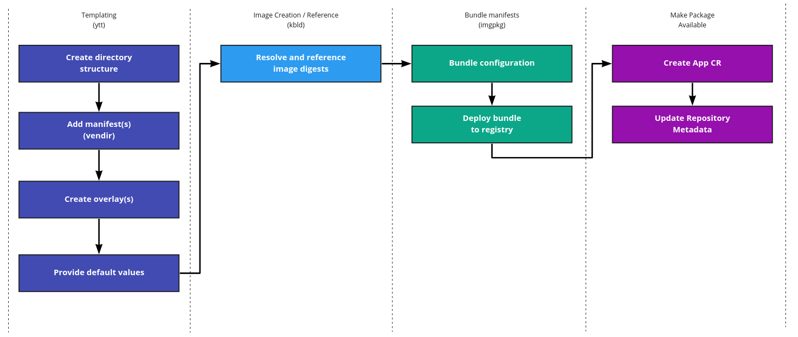

# Tanzu Add-on Packaging

This document covers the creation of add-ons for use in Tanzu Community Edition
(TCE). This is a working design doc that will evolve over time as add-ons are
implemented. Along with being a design doc, this asset walks you
through packaging of an add-on.

## Terminology

* **Add-ons:** software installed into a Kubernetes cluster. For example, [Project
Contour](https://projectcontour.io).
* **Extensions:** same as add-ons (see above)
* **User-Managed Add-ons**: Deployed into clusters and lifecycle managed independent
of a cluster. For example [Project
Contour](https://projectcontour.io).
* **Core Add-ons**: Deployed into clusters, typically after cluster bootstrap.
Lifecycle managed as part of cluster. For example,
[Antrea](https://github.com/vmware-tanzu/antrea). 
  * The packaging details in most
of this document are relevant to core and user-managed add-ons. However, much of the details
around discovery, repositories, and CLI interaction are only relevant for
user-managed add-ons.

## Packaging Add-Ons

Packaging of add-ons is done with the [Carvel](https://carvel.dev/) toolkit. The
end result is an OCI bundle stored in a container registry. For discovery,
deployment, and management operations, the `tanzu` CLI is used, as shown below.

```sh
$ tanzu extension install contour
contour install extension succeeded
```

> This experience is specific to user-managed add-ons

_For details on how these add-ons are discovered, deployed, and managed, see the
[Tanzu Add-on Management document](./tanzu-addon-management.md)._

### Packaging Workflow

The following flow describes how we package user-managed add-ons. These steps
are described in detail in the subsequent sections.



### 1. Create Directory Structure

Each add-on lives in a separate directory, named after the add-on. The
following script creates the appropriate directory structure.

```sh
#!/bin/sh

# set this value to your add-on name
EXT_NAME=foo

EXT_ROOT_DIR="extensions"
EXT_BUNDLE_DIR="bundle"
EXT_CONFIG_DIR="config"
EXT_OVERLAY_DIR="overlay"
EXT_UPSTREAM_DIR="upstream"
EXT_IMGPKG_DIR=".imgpkg"
EXT_DIR=${EXT_ROOT_DIR}/${EXT_NAME}

# create directory structure for add-on
mkdir -p ${EXT_DIR}/${EXT_BUNDLE_DIR}/{${EXT_CONFIG_DIR},${EXT_IMGPKG_DIR}}
mkdir ${EXT_DIR}/${EXT_BUNDLE_DIR}/${EXT_CONFIG_DIR}/{${EXT_OVERLAY_DIR},${EXT_UPSTREAM_DIR}}

# create README and fill with name of add-on
cp docs/extension-readme-template.md ${EXT_DIR}/README.md
sed -i "s/EXT_NAME/${EXT_NAME}/g" ${EXT_DIR}/README.md

# create addon yaml
cp docs/app-cr-template.yaml ${EXT_DIR}/addon.yaml
```

The above script creates the following directory structure.

```txt
./extensions/foo
├── README.md
├── bundle
├── ├── .imgpkg
├── ├── config
├── ├── ├── overlay
├── ├── ├── upstream
└── addon.yaml
```

The files and directories are used for the following.

* **README**: Contains the add-on's documentation.
* **bundle**: Contains the add-on's imgpkg bundle.
* **bundle/.imgpkg**: Contains metadata for the bundle.
* **bundle/config/upstream**: Contains the add-on's deployment manifests. Typically
sourced by upstream.
* **bundle/config/overlay**: Contains the add-on's overlay applied atop the
upstream manifest.
* **addon.yaml**: Contains the kapp-controller App CRD.

### 2. Add Manifest(s)

In order to stay aligned with upstream, store unmodified manifests. For example,
[gatekeeper's](https://github.com/open-policy-agent/gatekeeper) upstream
manifest is located
[here](https://raw.githubusercontent.com/open-policy-agent/gatekeeper/master/deploy/gatekeeper.yaml).
By storing the configuration of the upstream manifest, you can easily update the
manifest and have customizations applied via
[overlays](https://carvel.dev/ytt/#example:example-overlay).

To ensure integrity of the sourced upstream manifests,
[vendir](https://carvel.dev/vendir/docs/latest/vendir-spec) is used. It will
download and create a lock file that ensures the manifest matches a specific
commit.

In the `bundle` directory, create a `vendir.yml` file. The following
demonstrates the configuration for gatekeeper.

```yaml
apiVersion: vendir.k14s.io/v1alpha1
kind: Config
directories:
- path: config
  contents:
  - path: upstream
    git:
      url: https://github.com/open-policy-agent/gatekeeper
      ref: origin/master
    newRootPath: deploy
```

This configuration means vendir will manage the `config/upstream` directory. To
download the assets and produce a lock file, run the following.

```sh
vendir sync
```

A lock file will be created at `bundle/vendir.lock.yml`. It will contain the
  following lock metadata.

```yaml
apiVersion: vendir.k14s.io/v1alpha1
directories:
- contents:
  - git:
      commitTitle: Adding pod disruption budget (#1105)...
      sha: 6d99979b5eaf3e263c860694a4d64d4e1c302cf2
      tags:
      - v3.4.0-beta.0-17-g6d99979b
    path: upstream
  path: config
kind: LockConfig
```

With the above in place, the directories and files will appear as follows.

```txt
./extensions/foo
├── README.md
├── bundle
├── ├── .imgpkg
├── ├── config
├── ├── ├── overlay
├── ├── ├── upstream
├── ├── ├── ├── gatekeeper.yaml
├── ├── vendir.yml
├── ├── vendir.lock.yml
└── addon.yaml
```

### 3. Create Overlay(s)

For each object (e.g. `Deployment`) you need to modify from upstream, an overlay
file should be created. Overlays are used to ensure we import
unmodified-upstream manifests and apply specific configuration on top.

Consider the following `gatekeeper.yaml` added in the previous step.

```yaml
---
#! upstream.yaml

apiVersion: apps/v1
kind: Deployment
metadata:
  name: gatekeeper-deployment
  labels:
    app: gatekeeper
spec:
  replicas: 1
  selector:
    matchLabels:
      app: gatekeeper
  template:
    metadata:
      labels:
        app: gatekeeper
    spec:
      containers:
      - name: gatekeeper
        image: gatekeeper:1.14.2
        ports:
        - containerPort: 80
```

Assume you want to modify `metadata.labels` to a static value and
`spec.replicas` to a user-configurable value.

Create a file named `overlay-deployment-gatekeeper.yaml` in the `bundle/overlay`
directory.

```yaml
---
#! overlay-deployment-gatekeeper.yaml

#@ load("@ytt:overlay", "overlay")
#@ load("@ytt:data", "data")

#@overlay/match by=overlay.subset({"kind":"Deployment", "metadata":{"name":"gatekeeper-deployment"}})
---
metadata:
  labels:
    #@overlay/match missing_ok=True
    class: gatekeeper
    #@overlay/match missing_ok=True
    owned-by: tanzu

#@overlay/match by=overlay.subset({"kind":"Deployment", "metadata": {"name": "gatekeeper-deployment"}})
---
spec:
  #@overlay/match missing_ok=True
  replicas: #@ data.values.runtime.replicas
```

> ⚠️: Do not templatize or overlay container image fields. `kbld` will be used to
create and/or reference image digest SHAs.

_Detailed overlay documentation is available [in the Carvel
site](https://carvel.dev/ytt/#example:example-overlay)._

### 4. Create Default Values

For every user-configurable value defined above, a `values.yaml` file should
contain defaults and documentation for what the parameter impacts.

Create a `values.yaml` file in `bundle/config`.

```yaml
#@data/values
---

#! The namespace in which to deploy foo.
namespace: foo-extension

#! The amount of replicas that should exist in foo.
runtime:
  replicas: 3
```

### [Optional]: Validate Templating

With the above in place, you can validate that overlays and templating are
working as expected. The conceptual flow is as follows.


To run the above, you can use `ytt` as follows.

```sh
ytt \
  -f extensions/foo/bundle/config
```

In the above example, the following manifest is produced.

```yaml
apiVersion: apps/v1
kind: Deployment
metadata:
  name: nginx-deployment
  labels:
    app: nginx
    class: nginx
    owned-by: tanzu
spec:
  replicas: 3
  selector:
    matchLabels:
      app: nginx
  template:
    metadata:
      labels:
        app: nginx
    spec:
      containers:
      - name: nginx
        image: nginx:1.14.2
        ports:
        - containerPort: 80
```
> In the above, the labels were set statically via the overlay. The
`spec.replicas` were set to a value variable by the overlay, then set to `2`
from the `values.yaml` file.

### 5. Resolve and reference image digests

To ensure integrity of packages, it is important to reference an [image
digest](https://github.com/opencontainers/image-spec/blob/master/descriptor.md#digests)
rather than a tag. A tag's underlying image can change arbitrarily. Where as
referencing a SHA (via digest) will ensure consistency on every pull.

kbld is used to create an lock file, which we name `images.yml`. This file contains an
`ImagesLock` resource. `ImagesLock` is similar to a
[go.sum](https://golang.org/ref/mod#go). The image field in the source manifests
**are not mutated**. Instead, the SHA will be swapped out for the tag upon
deployment. The relationship is as follows.


To find all container image references, create an `ImagesLock`, and ensure the
digest's SHA is referenced, you can run `kbld` as follows.

```sh
kbld --file extensions/foo/bundle \
  --imgpkg-lock-output extensions/foo/bundle/.imgpkg/images.yml
```

This will produce the following file `bundle/.imgpkg/images.yml`.

```yaml
---
apiVersion: imgpkg.carvel.dev/v1alpha1
images:
- annotations:
    kbld.carvel.dev/id: nginx:1.14.2
  image: index.docker.io/library/nginx@sha256:f7988fb6c02e0ce69257d9bd9cf37ae20a60f1df7563c3a2a6abe24160306b8d
kind: ImagesLock

```

By placing this file in `bundle/.imgpkg`, it will not pollute the
`bundle/config` directory and risk being deployed into Kubernetes
clusters. At this point, the following directories and files should be in place.

```txt
extensions/foo
├── addon.yaml
├── bundle
├── ├── config
├── ├── ├── overlay
├── ├── ├── ├── overlay-deployment-gatekeeper.yaml
├── ├── ├── upstream
├── ├── ├── ├── gatekeeper.yaml
│   ├── .imgpkg
│   │   └── images.yml
├── ├── vendir.yml
├── ├── vendir.lock.yml
└── README.md
```

### 6. Bundle configuration and deploy to registry

All the manifests and configuration are bundled in an OCI-compliant package.
This ensures immutability of configuration upon a release. The bundles are
stored in a container registry.

`imgpkg` is used to create the bundle and push it to the container registry. It
leverages your underlying container registry, so you must setup authentication
on the system you'll create the bundle from (e.g. `docker login`). 

To ensure metadata about the add-on is captured, add the following `Bundle` file
into `bundle/.imgpkg/bundle.yaml`.

```yaml
apiVersion: imgpkg.carvel.dev/v1alpha1
kind: Bundle
metadata:
  name: foo
authors:
- name: Full Name
  email: name@example.com
websites:
- url: example.com
```

The following packages and pushes the bundle.

```sh
imgpkg push \
  --bundle $(OCI_REGISTRY)/foo-addon:$(BUNDLE_TAG) \
  --file extensions/foo/bundle
```

### 8. Create RBAC Assets

Add-ons are deployed using kapp-controller. kapp-controller will resolve a
service account reference in the App CR (see below) to determine if permission
are adequate to create relevant objects.

Today, we create a service account for each add-on and bind it to
`cluster-admin`. This is a bad practice and over time need to determine how to
provide a better UX that enables administrators to map appropriate permissions
that can be bound to service accounts and exposed such that users can reference
them in the App CR. The following shows an example of the service accounts we
pre-seed in the cluster using `tanzu` CLI.

```yaml
---
apiVersion: v1
kind: ServiceAccount
metadata:
  name: contour-extension-sa
  namespace: tanzu-extensions
---
apiVersion: rbac.authorization.k8s.io/v1
kind: ClusterRoleBinding
metadata:
  name: contour-extension
roleRef:
  apiGroup: rbac.authorization.k8s.io
  kind: ClusterRole
  name: cluster-admin
subjects:
  - kind: ServiceAccount
    name: contour-extension-sa
    namespace: tanzu-extensions
```

### 9. Create App CR

The bundles (created by `imgpkg`) are pulled down, processed, and deployed by
kapp-controller. In order to instruct kapp-controller on what bundles to pull on
reconcile, an App Custom Resource (CR) must be created.

The application CR, named `addon.yaml` should be added to `extensions/foo/`. The
file will look as follows.

```yaml
apiVersion: kappctrl.k14s.io/v1alpha1
kind: App
metadata:
  name: todo
  namespace: tanzu-extensions
spec:
  syncPeriod: 5m
  serviceAccountName: todo
  fetch:
    - imgpkgBundle:
        image: todo
  template:
    - ytt: 
        ignoreUnknownComments: true
        paths:
          - config/
    - kbld: {}
  deploy:
    - kapp:
        rawOptions: ["--wait-timeout=5m"]
```

Each `todo` field above must be customized for your add-ons, the fields
definitions are as follows.

* `metadata.name`: Name of the App CR that is deployed into the cluster
* `spec.serviceAccountName`: Name of the ServiceAccount used to instantiate the
objects via kapp-controller. (see section above)
* `spec.fetch[0].imagepkgBundle.image`: name of the add-on bundle stored in the
registry.`

### 10. Update repository metadata

Today, for an add-on to show up in the `tanzu` CLI for TCE, you need to open an
issue inside of the TCE repository. If approved, a TCE member can then update
our existing repository metadata and update it so that the add-ons shows up in
the `tanzu` CLI.

Add-on metadata is kept in a GCP bucket. This acts as repository metadata that
powers the `tanzu` CLI plugin. The metadata looks as follows.

```yaml
version: latest
branch: main
extensions:
  - name: velero
    version: v0.2.0-pre-alpha-1
    minsupported: v0.2.0-pre-alpha-1
    maxsupported: v0.2.0-pre-alpha-1
    files:
      - filename: extension.yaml
  - name: gatekeeper
    version: v0.2.0-pre-alpha-1
    minsupported: v0.2.0-pre-alpha-1
    maxsupported: v0.2.0-pre-alpha-1
    files:
      - filename: extension.yaml
  - name: contour
    version: v0.2.0-pre-alpha-1
    minsupported: v0.2.0-pre-alpha-1
    maxsupported: v0.2.0-pre-alpha-1
    files:
      - filename: extension.yaml
  - name: cert-manager
    version: v0.2.0-pre-alpha-1
    minsupported: v0.2.0-pre-alpha-1
    maxsupported: v0.2.0-pre-alpha-1
    files:
      - filename: extension.yaml
```

This is a temporary solution until new Carvel APIs
around packaging are integrated with TCE. You can [read about our planned work
for the new APIs here](#package-repository-and-installedpackage-apis).

## Common Packaging Considerations

### Preventing kapp-controller from Mutating Resources After Deploy

At times, a resource deployed and managed by kapp-controller may be expectedly
mutated by another process. For example, a configmap may be deployed alongside
an [operator](https://operatorhub.io/what-is-an-operator). When the operator
mutates the configmap, kapp-controller will eventually trigger an update and
refresh the configmap back to its original state.

To prevent this behavior, an annotation is added named
`kapp.k14s.io/update-strategy` set to the value of `skip`. It's likely you'll do
this via an [overlay](#3-create-overlays). Below is an example of how you'd set
this up for an upstream configmap. 

**Upstream Configmap**

```yaml
apiVersion: v1
kind: ConfigMap
metadata:
  name: config-domain
  namespace: knative-serving
  labels:
    serving.knative.dev/release: "v0.20.0"
  annotations:
    knative.dev/example-checksum: "74c3fc6a"
data:
  _example: |
    ################################
    #                              #
    #    EXAMPLE CONFIGURATION     #
    #                              #
    ################################
```

**Overlay**

```yaml
---
#! overlay-configmap-configdomain.yaml

#@ load("@ytt:overlay", "overlay")
#@ load("@ytt:data", "data")

#@overlay/match by=overlay.subset({"kind":"ConfigMap", "metadata":{"name":"config-domain"}})
---
metadata:
  annotations:
    #@overlay/match missing_ok=True
    kapp.k14s.io/update-strategy: skip
```

With the above in place, updates will not cause the `config-domain` ConfigMap to
be mutated.

For more details on this annotation, see the [kapp Apply Ordering
documentation](https://carvel.dev/kapp/docs/latest/apply-ordering).

### Ensuring Order of Deploying Assets

It may be important that your package deploys specific components before others.
For example, you may wish for a Deployment that satisfies a [validating
webhook](https://kubernetes.io/docs/reference/access-authn-authz/admission-controllers/#validatingadmissionwebhook)
to be up before applying a ValidatingWebhookConfiguration. This would ensure
the service that does validation is up and healthy before blocking API traffic
to its endpoint.

To prevent this behavior, the annotations `kapp.k14s.io/change-group` and
`kapp.k14s.io/change-rule` are used. It's likely you'll do this via an
[overlay](#3-create-overlays). Below is an example of how you'd set this up for
an upstream Deployment and ValidatingWebhookConfiguration.

**Upstream**

```yaml
---
apiVersion: apps/v1
kind: Deployment
metadata:
  labels:
    control-plane: controller-manager
    gatekeeper.sh/operation: audit
    gatekeeper.sh/system: "yes"
  name: gatekeeper-controller-manager
  namespace: gatekeeper-system
  annotations:
spec:
---
apiVersion: admissionregistration.k8s.io/v1beta1
kind: ValidatingWebhookConfiguration
metadata:
  creationTimestamp: null
  labels:
    gatekeeper.sh/system: "yes"
  name: gatekeeper-validating-webhook-configuration
  annotations:
    # it is very important this resource (ValidatingWebhookConfiguration) is applied
    # last. Otherwise, it can wire up the admission request before components required
    # to satisfy it are deployed.
    kapp.k14s.io/change-group: "tce.gatekeeper/vwc"
    kapp.k14s.io/change-rule: "upsert after upserting tce.gatekeeper/deployment"
webhooks:
```

**Overlays**

```yaml
---
#! overlay-deployment-gatekeeperaudit.yaml

#@ load("@ytt:overlay", "overlay")
#@ load("@ytt:data", "data")

#@overlay/match by=overlay.subset({"kind":"Deployment", "metadata":{"name":"gatekeeper-controller-manager"}})
---
metadata:
  annotations:
    #@overlay/match missing_ok=True
    kapp.k14s.io/change-group: "tce.gatekeeper/deployment"
```

```yaml
---
#! overlay-validatingwebhookconfiguration-gatekeeper.yaml

#@ load("@ytt:overlay", "overlay")
#@ load("@ytt:data", "data")

#@overlay/match by=overlay.subset({"kind":"ValidatingWebhookConfiguration", "metadata":{"name":"gatekeeper-validating-webhook-configuration"}})
---
metadata:
  annotations:
    #@overlay/match missing_ok=True
    kapp.k14s.io/change-group: "tce.gatekeeper/vwc"
    #@overlay/match missing_ok=True
    kapp.k14s.io/change-rule: "upsert after upserting tce.gatekeeper/deployment"
```

With the above overlays applied, the ValidatingWebhookConfiguration will not be
applied until the Deployment is healthy.

For more details on this annotation, see the [kapp Apply Ordering
documentation](https://carvel.dev/kapp/docs/latest/apply-ordering).

## Planned to Implement

The following sections include changes to this design that are either planned to
be implemented in TCE or currently in-flight.

### Package, Repository, and InstalledPackage APIs

**status:** planned

**impacts:**
* [Create App CR](#8-create-app-cr)
* [Update Respository Metadata](#9-update-repository-metadata)

The introduction of the [Package, PackageRepository, and InstalledPackage
APIs](https://carvel.dev/kapp-controller/docs/latest/packaging/#package-cr)
changes aspects of TCE's packaging approach. At a high-level, we move away from
the existing [App CR](#8-create-app-cr) and convert them to `Package` manifests.
These `Package` manifests are then bundled using `imgpkg`, creating a repository
bundle that can be stored in an OCI registry. In a TCE cluster (which is running
kapp-controller) a `PackageRepository` object is added. This object references
the registry bundle stored in the registry. With knowledge of this
`PackageRepository`, kapp-controller makes a `Package` CR for each package in
the bundle. This looks as follows.


With the above in place, a user can see all the packages using `kubectl`.

```sh
$ kubectl get packages
NAME                              PUBLIC-NAME            VERSION      AGE
pkg.test.carvel.dev.1.0.0         pkg.test.carvel.dev   1.0.0        7s
pkg.test.carvel.dev.2.0.0         pkg.test.carvel.dev   2.0.0        7s
pkg.test.carvel.dev.3.0.0-rc.1    pkg.test.carvel.dev   3.0.0-rc.1   7s
```
> example taken from https://carvel.dev/kapp-controller/docs/latest/package-consumption

Once a user determines which package they'd like installed, they instruct
kapp-controller to install it by applying a `InstalledPackage` object. The flow
looks as follows.


The following sections cover each API and the changes we need to make to this
current design to integrate/implement them.

#### Package API

Creating our add-on bundles remains largely unchanged. However, our declaration
of the add-on is no longer done in the App API. Instead it is done using a
`Package`. The `spec.template` is the same schema as the App API. Thus, TCE can
take existing App CRs and put their contents in `spec.template`. The `spec` also
includes the following fields packages need to propagate.

* `publicName`: Name that will show up to consumers. **Must be unique across
packages**.
* `version`: version number of this package instance, must use semver.

An example `Package` for `foo` (seen [here](#8-create-app-cr)) would read as follows.

```yaml
apiVersion: package.carvel.dev/v1alpha1
kind: Package
metadata:
  name: foo.tanzu.vmware.com.1.0.0,
spec:
  publicName: foo.tanzu.vmware.com
  version: "1.0.0"
  template:
    spec:
      fetch:
      - imgpkgBundle:
          image: registry.corp.com/packages/simple-app:1.0.0
      template:
        - ytt: 
            ignoreUnknownComments: true
            paths:
              - config/
        - kbld: {}
      deploy:
        - kapp:
            rawOptions: ["--wait-timeout=5m"]
```

The work needed to covert to this API is _roughly_ the following for each add-on.

* [ ] Create a new Package manifest
* [ ] Add the existing App CR `spec` to `spec.template`
* [ ] Set the metadata values including `spec.publicName` and `spec.version`
* [ ] Update `metadata.name` to be `spec.publicName`.`spec.version`
* [ ] Delete the App CR related to the add-on
* [ ] Update this design doc to include this model rather than the App CR

#### PackageRepository API

Unlike `App`, a `Package` is not deployed into the cluster. Instead multiple
packages are bundled together and stored in an OCI registry. A
`PackageRepository` object is then added to the cluster and points at the OCI
bundle. The expected directory structure looks as follows.

```txt
tce-main
└── packages
    └── gatekeeper.tanzu.vmware.1.0.0.yml
    └── velero.tanzu.vmware.1.2.0.yml
    └── knative.tanzu.vmware.2.1.0.yml
```

The above directories and files should be stored in the TCE repository under
`extensions/repo`. Packages should be versioned independent of the underlying
software. To ensure a change to a package can occur even when an container
image versions don't change.

With the directory structure in place, the repository can be uploading to a
container registry, as follows.

```sh
imgpkg push -i projects.registry.vmware.com/tce/repo:main -f extensions/repo/tce-main
```

In order for a TCE cluster to recognize the packages in this bundle, a
`PackageRepository` object must be created and (eventually) deployed into the
cluster. In the `extensions/repo` directory a YAML file should be created
reflecting the package repo. With the example above, the file would be
`extensions/repo/tce-main.yaml` and would look as follows.

```yaml
apiVersion: install.package.carvel.dev/v1alpha1
kind: PackageRepository
metadata:
  name: tce-main.tanzu.vmware
spec:
  fetch:
    image:
      url: projects.registry.vmware.com/tce/repo:main
```

We will eventually update the `tanzu` CLI to be able to init this into the
cluster.

The work needed to covert to this API is _roughly_ the following.

* [ ] Create a new directory structure as described above
* [ ] For each add-on, add a Package CR (`.yaml`)
* [ ] Use imgpkg to bundle and push to a container registry
* [ ] Create/Update TCE's default `PackageRepository` manifest to point to the
    bundle
* [ ] Update `tanzu` CLI tooling to init this default `PackageRepository`.

#### InstalledPackage API

`InstalledPackage` is the declaration of intent to install a package, which
kapp-controller will act on. There are no changes that need to happen from a
packaging perspective. However, we do need to introduce tooling changes to
ensure users can install these packages. The current design uses `tanzu` CLI to
add packages/add-ons. In order to continue this experience, the CLI must be able
to read available packages (Package CRDs) in the cluster and generate
`InstalledPackage` objects that are applied to the cluster. An example of this
declaration is as follows.

```yaml
---
apiVersion: install.package.carvel.dev/v1alpha1
kind: InstalledPackage
metadata:
  name: pkg-demo
  namespace: default
spec:
  serviceAccountName: default-ns-sa
  packageRef:
    publicName: pkg.test.carvel.dev
    version: 1.0.0
  values:
  - secretRef:
      name: pkg-demo-values
---
apiVersion: v1
kind: Secret
metadata:
  name: pkg-demo-values
stringData:
  values.yml: |
    #@data/values
    ---
    hello_msg: "hi"   
```

> example copied from https://carvel.dev/kapp-controller/docs/latest/package-consumption/#installing-a-package

This design goes beyond the scope of this Packaging document. It is (or will)
instead be detailed in our [Tanzu Add-on
Management](./tanzu-addon-management.md) document.

## Designed Pending Details

This section covers concerns that need design work.

### Versioning of Multiple PackageRepository Instances

With the introduction of the `PackageRepository`, we need to determine how we
are going to handle the ever growing number of package instances
(package+version) that will grow over time.

* Do we maintain a `default` repo with all the latest packages?
* How to we offer older packages?
