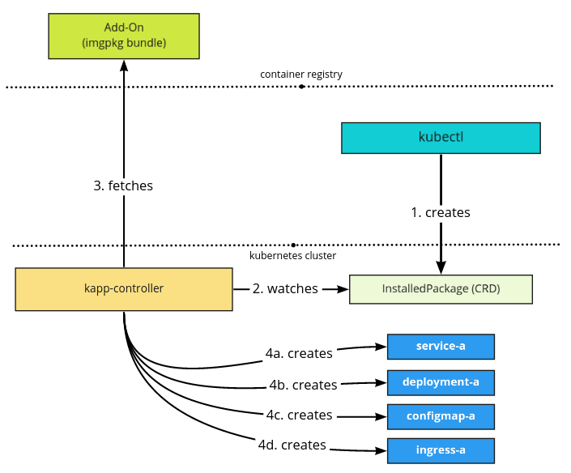
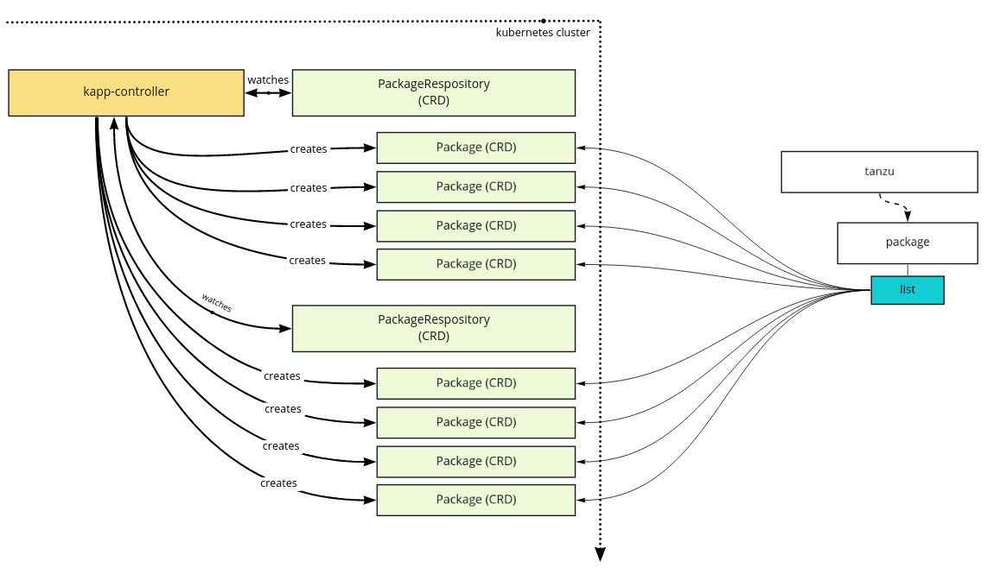
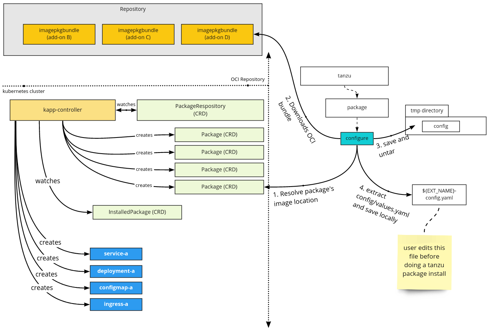
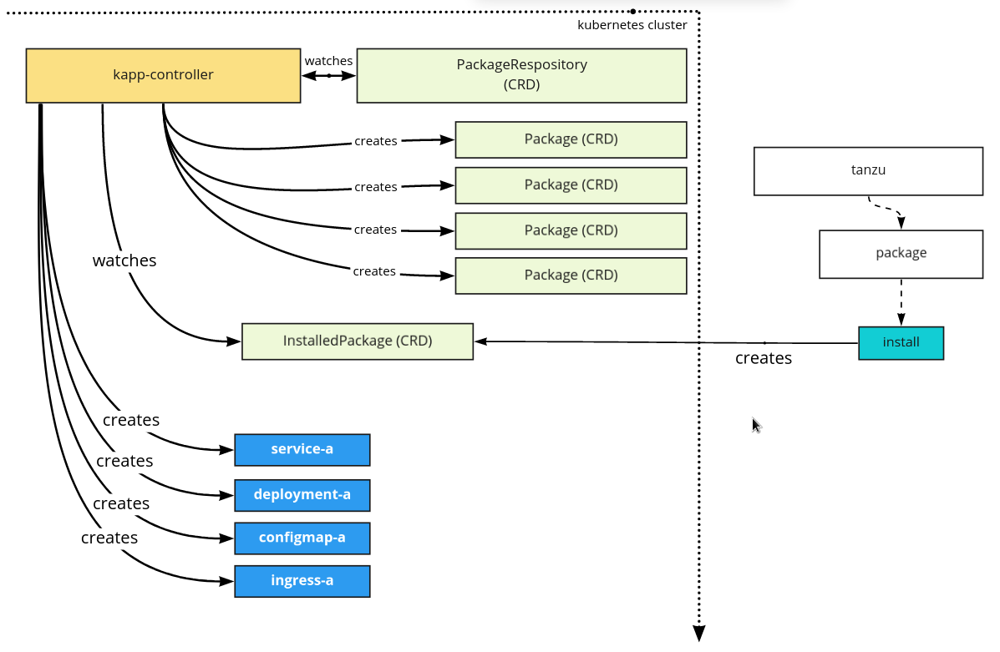
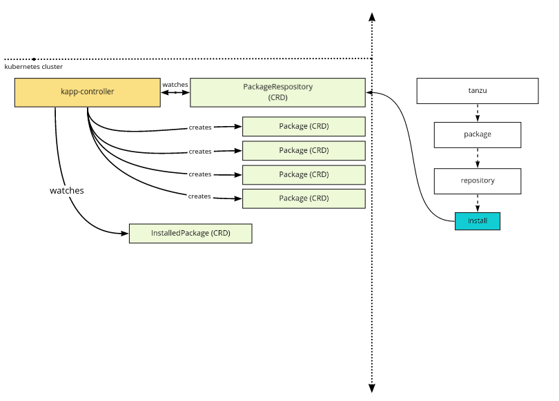
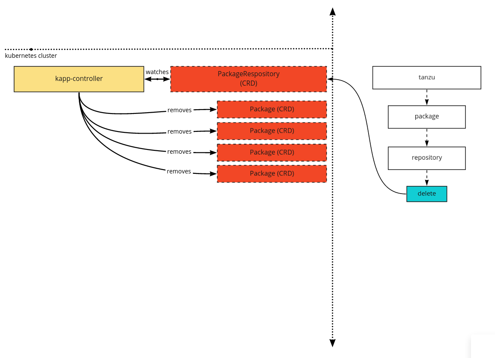

# Tanzu Package Management

This document covers the management of packages from the server-side and client-side
perspective in Tanzu Community Edition (TCE). This is a working design doc that will evolve over time as our
package management is implemented and enhanced.

## Server Side

This section describes the server-side management of extensions. This
specifically focuses on `kapp-controller` and the related Packaging APIs.

### Overview and APIs

TCE offers package management using the [Carvel Packaging
APIs](https://carvel.dev/kapp-controller/docs/latest/packaging). This primary
APIs are as follows.

* [Package](https://carvel.dev/kapp-controller/docs/latest/packaging/#package):
Contains metadata about a package and the OCI bundle that satisfies it.
Typically the OCI bundle referenced is an
[imgpkg](https://carvel.dev/imgpkg/docs/latest) bundle of configuration. A
Package is eventually bundled in a `PackageRepository`.
* [PackageRepository](https://carvel.dev/kapp-controller/docs/latest/packaging/#package-repositories):
A bundle of `Package`s. The bundle is created using `imgpkg` and pushed up to an
  OCI repository. `kapp-controller` watches the object and makes packages
  available in the cluster.
* [IntalledPackage](https://carvel.dev/kapp-controller/docs/latest/packaging/#installedpackage-cr):
Intent in the cluster to install a package. The is applied by a client-side tool
such as `tanzu` or `kubectl` CLIs. An `InstalledPackage` references a `Package`.

### Package Creation

`Package`s are created by `kapp-controller` based on the contents of a
`PackageRepository`. A `PackageRepository` points to an OCI bundle of `Package`
manifests. Inclusion of a `PackageRepository` in a cluster inherently makes the
`Package`s available. This can be visually represented as follows.


With the above in place, a user can see all the packages using `kubectl`.

```sh
$ kubectl get packages
NAME                              PUBLIC-NAME            VERSION      AGE
pkg.test.carvel.dev.1.0.0         pkg.test.carvel.dev   1.0.0        7s
pkg.test.carvel.dev.2.0.0         pkg.test.carvel.dev   2.0.0        7s
pkg.test.carvel.dev.3.0.0-rc.1    pkg.test.carvel.dev   3.0.0-rc.1   7s
```

### Package Installation (Server Side)

To install a `Package`, an `InstalledPackage` resource is applied to the
cluster. This instructs `kapp-controller` to lookup the configuration bundle
referenced in the corresponding `Package` manifest. It then downloads those
assets, renders them (e.g. `ytt`) and applies them to the cluster. This can be
visually represented as follows.



## Client Side

This section describes the client-side management of extensions. This
specifically focuses on our usage of `tanzu` CLI to discover, configure, deploy,
and manage packages.

### Package Discovery

The `tanzu` CLI is able to discover packages known to the cluster. It discovers
these packages by viewing all available [Package
CRs](https://carvel.dev/kapp-controller/docs/latest/packaging/#package) to the
cluster. These Packages can be sourced from 1 or many
[PackageRepository](https://carvel.dev/kapp-controller/docs/latest/packaging/#package-repositories)
CRs. This model is inspired by popular Linux package managers where inclusion of
a repository (e.g. `/etc/apt/sources.list`)  will make new packages available to
the manager (e.g. `apt`). With this, a command such as the following is
possible.

```sh
tanzu package list

NAME                              VERSION    REPO
knative-serving.tce.vmware.com    1.12       tce-main
contour.tce.vmware.com            2.32       tce-main
nvidia-driver.tce.vmware.com      1.11       nvidia-main
```

In the above, the `tanzu` CLI is aggregating and listing metadata from
already-existent objects. Namely the following from each `Package` instance:

* `NAME`: `spec.publicName`
* `VERSION`: `spec.version`
* `REPO`: TODO(see
[https://github.com/vmware-tanzu/carvel-kapp-controller/issues/124](https://github.com/vmware-tanzu/carvel-kapp-controller/issues/124))

This is visually represented as follows.



### Package Configuration

The `tanzu` CLI is able to configure packages before installation. This is
achieved by looking up the `config/value.yaml` file embedded in each package.
The `tanzu` CLI can pre-emptively download this file onto a user's workstation.
The user can then edit the values and ensure they are included during the
install. Consider the following means of capturing the configuration.

```sh
tanzu package configure knative-serving.tce.vmware.com
Looking up config for package: knative-serving.tce.vmware.com:
Values files saved to knative-serving.tce.vmware.com-values.yaml. Configure this file before installing the package.
```

With the above run, the CLI can lookup the `Package` for `knative-serving.tce.vmware.com` and
determine the location of its bundle using the field
`spec.template.spec.fetch[0].imgpkgBundle.image`. With this in mind, the
workflow for the CLI is as follows.

1. Resolves package's image location.
1. Unpacks the image in a temp directory.
1. Moves the `config/values.yaml` file into the current directory and names it
   `${PACKAGE_NAME}-config.yaml`.

This is visually represented as follows.



This design will be replaced with an approach to resolving values against the
OpenAPI schema exposed by packages. See
[vmware-tanzu/carvel-kapp-controller#104](https://github.com/vmware-tanzu/carvel-kapp-controller/issues/104)
for progress on this feature.

### Package Installation

The `tanzu` CLI is able to install packages. Where installation is the
declaration of intent to deploy workloads into the cluster. This is achieved
using the [InstalledPackage
CR](https://carvel.dev/kapp-controller/docs/latest/packaging/#installedpackage-cr).
Once present in the cluster, kapp-controller (server side) is able to resolve
what resources need to be created and reconcile to create them.

The primary work on the `tanzu` CLI side is to translate a `Package` CR into an
`InstalledPackage` based on the user's desire. Consider the following available
packages in a cluster.

```sh
tanzu package list

NAME                              VERSION    REPO
knative-serving.tce.vmware.com    0.21       tce-main
contour.tce.vmware.com            2.32       tce-main
nvidia-driver.tce.vmware.com      1.11       nvidia-main
```

Should the user want to install the `knative-serving.tce.vmware.com:0.21.0-vmware0` package,
they can run the following command.

```sh
tanzu package install knative-serving.tce.vmware.com

Looking up package to install: knative-serving.tce.vmware.com:
Installed package in default/knative-serving.tce.vmware.com:0.21.0-vmware0
```

In running this command, the `tanzu` client will have done the following.

1. Read the contents of the `knative-serving.tce.vmware.com:0.21.0-vmware0` `Package`.

    The following is an example of what the Package contents might be.

    ```yaml
    apiVersion: package.carvel.dev/v1alpha1
    kind: Package
    metadata:
      # Resource name. Should not be referenced by InstalledPackage.
      # Should only be populated to comply with Kubernetes resource schema.
      # spec.publicName/spec.version fields are primary identifiers
      # used in references from InstalledPackage
      name: knative.tce.vmware.com.0.21.0-vmware0
      # Package is a cluster scoped resource, so no namespace
    spec:
      # Name of the package; Referenced by InstalledPackage (required)
      publicName: knative.tce.vmware.com
      # Package version; Referenced by InstalledPackage;
      # Must be valid semver (required)
      version: 0.21.0-vmware0
      # App template used to create the underlying App CR.
      # See 'App CR Spec' docs for more info
      template:
        spec:
          fetch:
          - imgpkgBundle:
              image: registry.tkg.vmware.run/tkg-knative@sha256:...
          template:
          - ytt:
              paths:
              - config/
          - kbld:
              paths:
              # - must be quoted when included with paths
              - "-"
              - .imgpkg/images.yml
          deploy:
          - kapp: {}
    ```

1. Created a `knative-serving-0-21` `InstalledPackage`.

    The following is an example of what the `InstalledPackage` contents might be.

    ```yaml
    apiVersion: install.package.carvel.dev/v1alpha1
    kind: InstalledPackage
    metadata:
      name: knative-serving-0-21
      namespace: my-ns
    spec:
      # specifies service account that will be used to install underlying package contents
      serviceAccountName: knative-sa
      packageRef:
        # Public name of the package to install. (required)
        publicName: knative.tce.vmware.com
        # Specifies a specific version of a package to install (optional)
        # Either version or versionSelection is required.
        version: 0.21.0-vmware0
        # Selects version of a package based on constraints provided (optional)
        # Either version or versionSelection is required.
        versionSelection:
          # Constraint to limit acceptable versions of a package;
          # Latest version satisying the contraint is chosen;
          # Newly available, acceptable later versions are picked up and installed automatically. (optional)
          constraint: ">0.20"
          # Include prereleases when selecting version. (optional)
          prereleases: {}
    # Populated by the controller
    status:
      packageRef:
        # Kubernetes resource name of the package chosen against the constraints
        name: knative.tce.vmware.com.0.21.0-vmware0
      # Derived from the underlying App's Status
      conditions:
      - type: ValuesSchemaCheckFailed
      - type: ReconcileSucceeded
      - type: ReconcileFailed
      - type: Reconciling
    ```

1. Applied the `InstalledPackage` to the cluster.

This is visually represented as follows.



#### Including Package Configuration

A user may wish to bring additional configuration (as described in [package
  configuration](https://github.com/vmware-tanzu/tce/blob/e28594f42e7e10d89c2b7b927fa999d94094c9dc/docs/designs/tanzu-addon-management.md#package-configuration)
into their installation. Configuration may be included as a flag during
install `--config`/`-c`. The above example could be run again with the
following.

```sh
tanzu package install knative-serving.tce.vmware.com --config knative-serving-config.yaml

Looking up package to install: knative-serving.tce.vmware.com:
Installed package in default/knative-serving.tce.vmware.com:0.21.0-vmware0
```

The implication of including this configuration would do the following.

1. Apply `knative-serving-confg.yaml` as a Kubernetes secret.

    * For example:

    ```yaml
    ---
    apiVersion: v1
    kind: Secret
    metadata:
      name: knative-serving-config
    stringData:
      values.yml: |
        #@data/values
        ---
        hello_msg: "hi"
    ```

1. Add `spec.values` into the `InstalledPackage` CR before applying.

    ```yaml
      # Values to be included in package's templating step
      # (currently only included in the first templating step) (optional)
      values:
      - secretRef:
          name: knative-serving-config
    ```

### Package Repository Discovery

The `tanzu` CLI is able to list all package repositories known the to cluster.
This is essentially a list of all `PackageRespository` objects. The CLI
interaction would look as follows.

```sh
tanzu package repository list

NAME               VERSION
tce-main           1.12
```

In the above, the `tanzu` CLI is aggregating and listing metadata from
already-existent objects. Namely the following from each `PackageRepository` instance:

* `NAME`: `metadata.name`
* `VERSION`: Unknown at this point, will packagerepos be versioned?

### Package Repository Creation

The `tanzu` CLI is able to install package repositories. In turn, all packages
referenced in that repo will be created and made available in the cluster by
`kapp-controller`. A package repository points to an OCI bundle that contains
multiple `Package` manifests. `tanzu` CLI only needs to apply the
`PackageRepository` CR. Theses repository manifests can be found in the TCE
GitHub repo. The flow could look as follows.

```sh
tanzu package repository install -f ${REPO_MANIFEST_LOCATION}

installed package repo
```

The flow would look as follows.



### Package Repository Deletion

The `tanzu` CLI is able to delete package repositories. In turn, all packages
referenced in that repo will be deleted  by `kapp-controller`. The flow could
look as follows.

```sh
tanzu package repository delete ${REPO_NAME}

deleted package repo
```

The flow would look as follows.



## Designed Pending Details

This section covers concerns that need design work.

### Upgrading Packages and PackageRepositories

We need a design around how `Package` and `PackageRepsitory` upgrades will work
from a client-side perspective.
