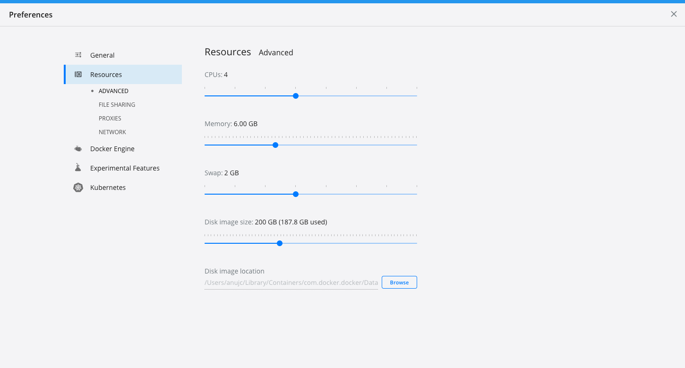

# Getting Started with TCE

This guide walks you through standing up a management and guest cluster using
Tanzu CLI. It then demonstrates how you can deploy add-ons into the cluster.
Currently we have getting started guides for [vSphere](#create-vsphere-clusters),
[AWS](#create-aws-clusters), and [Docker](#create-local-docker-clusters-capd). For detailed documentation on tanzu-cli and deployment of clusters,
see the [TKG docs](https://docs.vmware.com/en/VMware-Tanzu-Kubernetes-Grid/index.html).

🚨🚨🚨

**Thank you for trying Tanzu Community Edition! Please be sure to [leave
feedback
here](https://github.com/vmware-tanzu/tce/issues/new?assignees=&labels=feedback&template=feedback-on-tanzu-community-edition-template.md&title=)
after trying this guide!**

🚨🚨🚨

## Prerequistites

Please note, TCE currently works on **macOS** and **Linux** AMD64 (also known as
x64) environments. Windows and other architectures may be supported in the
future.

The Docker runtime is required on the deployment machine, regardless of your
final deployment environment. Before proceeding, please ensure [Docker has
been installed](https://docs.docker.com/engine/install/).

> ℹ️  These instructions also assume you are running them from a system using
> a graphical desktop environment. If you need to run from a non-GUI environment
> such as a cloud based VM, please see the [TCE Headless
> Installation](getting-started.md) documentation for suggestions.

## CLI Installation

1. Download the release.

    Make sure you're logged into GitHub and then go to the [TCE Releases](https://github.com/vmware-tanzu/tce/releases/tag/v0.3.0) page and download the Tanzu CLI for either

    * [Linux](https://github.com/vmware-tanzu/tce/releases/download/v0.3.0/tce-linux-amd64-v0.3.0.tar.gz)
    * [Mac](https://github.com/vmware-tanzu/tce/releases/download/v0.3.0/tce-darwin-amd64-v0.3.0.tar.gz)

1. Unpack the release.

    **linux**

    ```sh
    tar xzvf ~/Downloads/tce-linux-amd64-v0.3.0.tar.gz
    ```

    **macOS**

    ```sh
    tar xzvf ~/Downloads/tce-darwin-amd64-v0.3.0.tar.gz
    ```

1. Run the install script (make sure to use the appropriate directory for your platform).

    **linux**

    ```sh
    cd tce-linux-amd64-v0.3.0
    ./install.sh
    ```

    **macOS**

    ```sh
    cd tce-darwin-amd64-v0.3.0
    ./install.sh
    ```

    > This installs the `tanzu` CLI and puts all the plugins in their proper location.
    > The first time you run the `tanzu` command the installed plugins and plugin repositories will be initialized. This action might take a minute.

1. If you wish to run commands against any of the Kubernetes clusters that are created, you will need to download and install `kubectl`.

    **linux**

    ```sh
    curl -LO https://dl.k8s.io/release/v1.20.4/bin/linux/amd64/kubectl
    sudo install -o root -g root -m 0755 kubectl /usr/local/bin/kubectl
    ```

    **macOS**

    ```sh
    curl -LO https://dl.k8s.io/release/v1.20.4/bin/darwin/amd64/kubectl
    sudo install -o root -g root -m 0755 kubectl /usr/local/bin/kubectl
    ```

## Create vSphere Clusters

This section describes setting up management and workload/guest clusters for
vSphere. If your deployment target is AWS, skip this section and move on to the
next.

1. Download the machine image that matches the version of the Kubernetes you plan on deploying (1.20.4 is default).

    At this time, we cannot guarantee the exact plugin versions that will be
    used for cluster management. While using the kickstart UI to bootstrap your
    cluster, you may be asked add an `ova` to your vSphere environment. The
    following links are points to the most recent ovas at the time of writing
    this getting started guide.

    * [1.20.4
      OVA](http://build-squid.eng.vmware.com/build/mts/release/bora-17759077/publish/lin64/tkg_release/node/ova-photon-3-v1.20.4+vmware.1-tkg.0-2326554155028348692/photon-3-kube-v1.20.4+vmware.1-tkg.0-2326554155028348692.ova)
    * [1.19.8
      OVA](http://build-squid.eng.vmware.com/build/mts/release/bora-17759077/publish/lin64/tkg_release/node/ova-photon-3-v1.19.8+vmware.1-tkg.0-15338136437231643652/photon-3-kube-v1.19.8+vmware.1-tkg.0-15338136437231643652.ova)

    If you're asked for another `ova` version by the kickstart UI, you can
    download the ova that corresponds to the rc version (e.g. rc1, rc2, etc.) at the [TKG
    daily builds confluence
    page](https://confluence.eng.vmware.com/pages/viewpage.action?spaceKey=TKG&title=TKG+Release+Daily+Build#TKGReleaseDailyBuild-TKG1.3.0RC.3(March/09/2021)).

    Please note, validation work so far has focused on the **Photon** based
    images.

1. In vCenter, right click on your datacenter and import OVF template.

1. After importing, right-click and covert to a template.

1. Initialize the Tanzu kickstart UI.

    ```sh
    tanzu management-cluster create --ui
    ```

1. Go through the installation process for vSphere. With the following
   considerations:

   * Set all instance profile to large or larger.
     * In our testing, we found resource constraints caused bootstrapping
     issues. Choosing a large profile or more will give a better chance for
     successful bootstrapping.
   * Set your control plane IP
     * The control plane IP is a virtual IP that fronts the Kubernetes API
     server. You **must** set an IP that is routable and won't be taken by
     another system (e.g. DHCP).
   * Disable OIDC configuration.

    > Until we have more TCE documentation, you can find the full TKG docs
    > [here](https://docs.vmware.com/en/VMware-Tanzu-Kubernetes-Grid/1.2/vmware-tanzu-kubernetes-grid-12/GUID-mgmt-clusters-deploy-management-clusters.html).
    > We will have more complete `tanzu` cluster bootstrapping documentation available here in the near future.

1. Validate the management cluster started successfully.

    ```sh
    tanzu management-cluster get
    ```

1. Create a cluster names that will be used throughout this getting-started.md guide. This instance of `MGMT_CLUSTER_NAME` should be set to whatever value is returned by `tanzu management-cluster get` above.

    ```sh
    export MGMT_CLUSTER_NAME="<INSERT_MGMT_CLUSTER_NAME_HERE>"
    export GUEST_CLUSTER_NAME="<INSERT_GUEST_CLUSTER_NAME_HERE>"
    ```

1. Capture the management cluster's kubeconfig.

    ```sh
    tanzu management-cluster kubeconfig get ${MGMT_CLUSTER_NAME} --admin

    Credentials of workload cluster 'mtce' have been saved
    You can now access the cluster by running 'kubectl config use-context mtce-admin@mtce'
    ```

    > Note the context name `${MGMT_CLUSTER_NAME}-admin@${MGMT_CLUSTER_NAME}`, you'll use the above command in
    > future steps.

1. Set your kubectl context to the management cluster.

    ```sh
    kubectl config use-context ${MGMT_CLUSTER_NAME}-admin@${MGMT_CLUSTER_NAME}
    ```

1. Validate you can access the management cluster's API server.

    ```sh
    kubectl get nodes

    NAME                         STATUS   ROLES                  AGE   VERSION
    mtce-control-plane-8bmq7     Ready    control-plane,master   30m   v1.20.4+vmware.1
    mtce-md-0-6cbb66bff9-p58fw   Ready    <none>                 30m   v1.20.4+vmware.1
    ```

1. Setup a guest cluster config file.

    ```sh
    cp  ~/.tanzu/tkg/clusterconfigs/xw6nt8jduy.yaml ~/.tanzu/tkg/clusterconfigs/guest1.yaml
    ```

   > This takes the configuration used to create your management cluster and
   > duplicates for use in the guest cluster. You can edit values in this new
   > file `guest1.yaml` as you please.

   [](ignored)

   > Creation of guest clusters now require the use of workload cluster YAML
   > configuration files.  [Example configuration templates](https://gitlab.eng.vmware.com/TKG/tkg-cli-providers/-/tree/cluster-templates/docs/cluster-templates)
   > are available to help get you started. Review settings and populate fields
   > that are not set.

   [](ignored)

   > Validation is performed on the file prior to applying it, so the `tanzu`
   > command should give you any clues if something necessary is omitted.

1. Edit the guest cluster config file's
   (`~/.tanzu/tkg/clusterconfigs/guest1.yaml`) VSPHERE_CONTROL_PLANE_ENDPOINT to
   a viable IP.

   > This will be **the API Server IP** for you guest cluster. You must choose
   > an IP that is **1.) routable** and **2.) not used elsewhere in your network
   > (eg. out of your DHCP range)**.

   [](ignored)

   > For vSphere, the other settings are likely fine as-is. However, you can change
   > them as you'd like and/or reference the [Example configuration templates](https://gitlab.eng.vmware.com/TKG/tkg-cli-providers/-/tree/cluster-templates/docs/cluster-templates).

1. Create your guest cluster.

    ```sh
    tanzu cluster create ${GUEST_CLUSTER_NAME} --file ${HOME}/.tanzu/tkg/clusterconfigs/guest1.yaml
    ```

1. Validate the cluster starts successfully.

    ```sh
    tanzu cluster list
    ```

1. Capture the guest cluster's kubeconfig.

    ```sh
    tanzu cluster kubeconfig get ${GUEST_CLUSTER_NAME} --admin
    ```

1. Set your `kubectl` context accordingly.

    ```sh
    kubectl config use-context ${GUEST_CLUSTER_NAME}-admin@${GUEST_CLUSTER_NAME}
    ```

1. Verify you can see pods in the cluster.

    ```sh
    kubectl get pods --all-namespaces

    NAMESPACE     NAME                                                    READY   STATUS    RESTARTS   AGE
    kube-system   antrea-agent-9d4db                                      2/2     Running   0          3m42s
    kube-system   antrea-agent-vkgt4                                      2/2     Running   1          5m48s
    kube-system   antrea-controller-5d594c5cc7-vn5gt                      1/1     Running   0          5m49s
    kube-system   coredns-5d6f7c958-hs6vr                                 1/1     Running   0          5m49s
    kube-system   coredns-5d6f7c958-xf6cl                                 1/1     Running   0          5m49s
    kube-system   etcd-tce-guest-control-plane-b2wsf                      1/1     Running   0          5m56s
    kube-system   kube-apiserver-tce-guest-control-plane-b2wsf            1/1     Running   0          5m56s
    kube-system   kube-controller-manager-tce-guest-control-plane-b2wsf   1/1     Running   0          5m56s
    kube-system   kube-proxy-9825q                                        1/1     Running   0          5m48s
    kube-system   kube-proxy-wfktm                                        1/1     Running   0          3m42s
    kube-system   kube-scheduler-tce-guest-control-plane-b2wsf            1/1     Running   0          5m56s
    kube-system   kube-vip-tce-guest-control-plane-b2wsf                  1/1     Running   0          5m56s
    kube-system   vsphere-cloud-controller-manager-nwrg4                  1/1     Running   2          5m48s
    kube-system   vsphere-csi-controller-5b6f54ccc5-trgm4                 5/5     Running   0          5m49s
    kube-system   vsphere-csi-node-drnkz                                  3/3     Running   0          5m48s
    kube-system   vsphere-csi-node-flszf                                  3/3     Running   0          3m42s
    tkg-system    kapp-controller-78bdf9c48f-sk7qb                        1/1     Running   0          5m48s
    ```

## Create AWS Clusters

This section describes setting up management and workload/guest clusters for
AWS. If your deployment target is vSphere, skip this section.

1. Initialize the Tanzu kickstart UI.

    ```sh
    tanzu management-cluster create --ui
    ```

1. Go through the installation process for AWS. With the following
   considerations:

   * Set all instance sizes to m5.xlarge or larger.
   * Disable OIDC configuration.

    > Until we have more TCE documentation, you can find the full TKG docs
    > [here](https://docs.vmware.com/en/VMware-Tanzu-Kubernetes-Grid/1.2/vmware-tanzu-kubernetes-grid-12/GUID-mgmt-clusters-deploy-management-clusters.html).
    > We will have more complete `tanzu` cluster bootstrapping documentation available here in the near future.

1. Validate the management cluster started successfully.

    ```sh
    tanzu management-cluster get

    NAME  NAMESPACE   STATUS   CONTROLPLANE  WORKERS  KUBERNETES        ROLES
    mtce  tkg-system  running  1/1           1/1      v1.20.4+vmware.1  management

    Details:

    NAME                                                     READY  SEVERITY  REASON  SINCE  MESSAGE
    /mtce                                                    True                     113m
    ├─ClusterInfrastructure - AWSCluster/mtce                True                     113m
    ├─ControlPlane - KubeadmControlPlane/mtce-control-plane  True                     113m
    │ └─Machine/mtce-control-plane-r7k52                     True                     113m
    └─Workers
      └─MachineDeployment/mtce-md-0
        └─Machine/mtce-md-0-fdfc9f766-6n6lc                  True                     113m

    Providers:

    NAMESPACE                          NAME                   TYPE                    PROVIDERNAME  VERSION  WATCHNAMESPACE
    capa-system                        infrastructure-aws     InfrastructureProvider  aws           v0.6.4
    capi-kubeadm-bootstrap-system      bootstrap-kubeadm      BootstrapProvider       kubeadm       v0.3.14
    capi-kubeadm-control-plane-system  control-plane-kubeadm  ControlPlaneProvider    kubeadm       v0.3.14
    capi-system                        cluster-api            CoreProvider            cluster-api   v0.3.14
    ```

1. Create a cluster names that will be used throughout this getting-started.md guide. This instance of `MGMT_CLUSTER_NAME` should be set to whatever value is returned by `tanzu management-cluster get` above.

    ```sh
    export MGMT_CLUSTER_NAME="<INSERT_MGMT_CLUSTER_NAME_HERE>"
    export GUEST_CLUSTER_NAME="<INSERT_GUEST_CLUSTER_NAME_HERE>"
    ```

1. Capture the management cluster's kubeconfig.

    ```sh
    tanzu management-cluster kubeconfig get ${MGMT_CLUSTER_NAME} --admin

    Credentials of workload cluster 'mtce' have been saved
    You can now access the cluster by running 'kubectl config use-context mtce-admin@mtce'
    ```

    > Note the context name `${MGMT_CLUSTER_NAME}-admin@${MGMT_CLUSTER_NAME}`, you'll use the above command in
    > future steps.

1. Set your kubectl context to the management cluster.

    ```sh
    kubectl config use-context ${MGMT_CLUSTER_NAME}-admin@${MGMT_CLUSTER_NAME}
    ```

1. Validate you can access the management cluster's API server.

    ```sh
    kubectl get nodes

    NAME                                       STATUS   ROLES                  AGE    VERSION
    ip-10-0-1-133.us-west-2.compute.internal   Ready    <none>                 123m   v1.20.4+vmware.1
    ip-10-0-1-76.us-west-2.compute.internal    Ready    control-plane,master   125m   v1.20.4+vmware.1
    ```

1. Setup a guest cluster config file.

    ```sh
    cp  ~/.tanzu/tkg/clusterconfigs/xw6nt8jduy.yaml ~/.tanzu/tkg/clusterconfigs/guest1.yaml
    ```

   > This takes the configuration used to create your management cluster and
   > duplicates for use in the guest cluster. You can edit values in this new
   > file `guest1.yaml` as you please.

   [](ignored)

   > Creation of guest clusters now require the use of workload cluster YAML
   > configuration files.  [Example configuration templates](https://gitlab.eng.vmware.com/TKG/tkg-cli-providers/-/tree/cluster-templates/docs/cluster-templates)
   > are available to help get you started. Review settings and populate fields
   > that are not set.

   [](ignored)

   > Validation is performed on the file prior to applying it, so the `tanzu`
   > command should give you any clues if something necessary is omitted.

   [](ignored)

   > For AWS, the other settings are likely fine as-is. However, you can change
   > them as you'd like and/or reference the [Example configuration
   > templates](https://gitlab.eng.vmware.com/TKG/tkg-cli-providers/-/tree/cluster-templates/docs/cluster-templates).

1. Create your guest cluster.

    ```sh
    tanzu cluster create ${GUEST_CLUSTER_NAME} --file ${HOME}/.tanzu/tkg/clusterconfigs/guest1.yaml
    ```

1. Validate the cluster starts successfully.

    ```sh
    tanzu cluster list
    ```

1. Capture the guest cluster's kubeconfig.

    ```sh
    tanzu cluster kubeconfig get ${GUEST_CLUSTER_NAME} --admin
    ```

1. Set your `kubectl` context accordingly.

    ```sh
    kubectl config use-context ${GUEST_CLUSTER_NAME}-admin@${GUEST_CLUSTER_NAME}
    ```

1. Verify you can see pods in the cluster.

    ```sh
    kubectl get pods --all-namespaces

    NAMESPACE     NAME                                                    READY   STATUS    RESTARTS   AGE
    kube-system   antrea-agent-9d4db                                      2/2     Running   0          3m42s
    kube-system   antrea-agent-vkgt4                                      2/2     Running   1          5m48s
    kube-system   antrea-controller-5d594c5cc7-vn5gt                      1/1     Running   0          5m49s
    kube-system   coredns-5d6f7c958-hs6vr                                 1/1     Running   0          5m49s
    kube-system   coredns-5d6f7c958-xf6cl                                 1/1     Running   0          5m49s
    kube-system   etcd-tce-guest-control-plane-b2wsf                      1/1     Running   0          5m56s
    kube-system   kube-apiserver-tce-guest-control-plane-b2wsf            1/1     Running   0          5m56s
    kube-system   kube-controller-manager-tce-guest-control-plane-b2wsf   1/1     Running   0          5m56s
    kube-system   kube-proxy-9825q                                        1/1     Running   0          5m48s
    kube-system   kube-proxy-wfktm                                        1/1     Running   0          3m42s
    kube-system   kube-scheduler-tce-guest-control-plane-b2wsf            1/1     Running   0          5m56s
    tkg-system    kapp-controller-78bdf9c48f-sk7qb                        1/1     Running   0          5m48s
    ```

## Create Local Docker Clusters (CAPD)

⚠️: TCE's support for Cluster-API Docker (CAPD) is **experimental** and may require troubleshooting on your system.

In order to use CAPD, you should ensure your Docker engine has plenty of resources and storage available.
We do not have exact numbers at this time, but most modern laptops and desktops should be able to run this configuration.
Even with a modern system, there is always potential you're using up most or all of what Docker has allocated. **For your
best chance at success, you may wish to do the steps marked `(Optional)`.**

1. Ensure your Docker engine has >= 6GB of RAM and 4+ CPUs. This is especially critical for Mac users, below you can see a screenshot from Docker Desktop's settings.

   

   > These are the minimal settings we validated against with not other containers running.

1. (Optional): Stop all existing containers.

   ```shell
   docker kill $(docker ps -q)
   ```

1. (Optional): Prune all existing containers, volumes, and images

   ```sh
    docker system prune -a --volumes
   ```

   > Read the prompt carefully, this will erase a majority of what is cached in your Docker environment.
   > While this will ensure your environment is clean before starting, it will also significantly increase bootstrapping
   > time if you already had the docker images downloaded.

1. Create a cluster names that will be used throughout this getting-started.md guide. This instance of `MGMT_CLUSTER_NAME` should be set to whatever value is returned by `tanzu management-cluster get` above.

    ```sh
    export MGMT_CLUSTER_NAME="<INSERT_MGMT_CLUSTER_NAME_HERE>"
    export GUEST_CLUSTER_NAME="<INSERT_GUEST_CLUSTER_NAME_HERE>"
    ```

1. Create a Docker-based management cluster

   ```sh
   tanzu management-cluster create -i docker --name ${MGMT_CLUSTER_NAME} -v 10 --plan dev --ceip-participation=false
   ```

   > If you ran the `prune` command in the previous step, expect this to take some time, as it'll download an image that is over 1GB.

1. Capture the management cluster's kubeconfig.

    ```sh
    tanzu management-cluster kubeconfig get ${MGMT_CLUSTER_NAME} --admin

    Credentials of workload cluster 'mtce' have been saved
    You can now access the cluster by running 'kubectl config use-context mtce-admin@mtce'
    ```

   > Note the context name `${MGMT_CLUSTER_NAME}-admin@mtce`, you'll use the above command in
   > future steps. Your management cluster name may be different than
   > `${MGMT_CLUSTER_NAME}`.

1. Set your kubectl context to the management cluster.

    ```sh
    kubectl config use-context ${MGMT_CLUSTER_NAME}-admin@${MGMT_CLUSTER_NAME}
    ```

1. Validate you can access the management cluster's API server.

    ```sh
    kubectl get nodes

    NAME                        STATUS   ROLES                  AGE   VERSION
    mtce-control-plane-tcjk2    Ready    control-plane,master   59m   v1.20.4+vmware.1
    mtce-md-0-f68799ffd-lpqsh   Ready    <none>                 59m   v1.20.4+vmware.1
    ```

1. Create your guest cluster.

   ```shell
   tanzu cluster create ${GUEST_CLUSTER_NAME} --plan dev
   ```

1. Validate the cluster starts successfully.

    ```sh
    tanzu cluster list
    ```

1. Capture the guest cluster's kubeconfig.

    ```sh
    tanzu cluster kubeconfig get ${GUEST_CLUSTER_NAME} --admin
    ```

1. Set your `kubectl` context accordingly.

    ```sh
    kubectl config use-context ${GUEST_CLUSTER_NAME}-admin@${GUEST_CLUSTER_NAME}
    ```

1. Verify you can see pods in the cluster.

    ```sh
    kubectl get pods --all-namespaces

    NAMESPACE     NAME                                                    READY   STATUS    RESTARTS   AGE
    kube-system   antrea-agent-9d4db                                      2/2     Running   0          3m42s
    kube-system   antrea-agent-vkgt4                                      2/2     Running   1          5m48s
    kube-system   antrea-controller-5d594c5cc7-vn5gt                      1/1     Running   0          5m49s
    kube-system   coredns-5d6f7c958-hs6vr                                 1/1     Running   0          5m49s
    kube-system   coredns-5d6f7c958-xf6cl                                 1/1     Running   0          5m49s
    kube-system   etcd-tce-guest-control-plane-b2wsf                      1/1     Running   0          5m56s
    kube-system   kube-apiserver-tce-guest-control-plane-b2wsf            1/1     Running   0          5m56s
    kube-system   kube-controller-manager-tce-guest-control-plane-b2wsf   1/1     Running   0          5m56s
    kube-system   kube-proxy-9825q                                        1/1     Running   0          5m48s
    kube-system   kube-proxy-wfktm                                        1/1     Running   0          3m42s
    kube-system   kube-scheduler-tce-guest-control-plane-b2wsf            1/1     Running   0          5m56s
    tkg-system    kapp-controller-78bdf9c48f-sk7qb                        1/1     Running   0          5m48s
    ```

With the above done, you now have local clusters running atop Docker. The nodes can be seen by running a command as follows.

```shell
$ docker ps
CONTAINER ID   IMAGE                                                         COMMAND                  CREATED             STATUS             PORTS                                  NAMES
33e4e422e102   projects.registry.vmware.com/tkg/kind/node:v1.20.4_vmware.1   "/usr/local/bin/entr…"   About an hour ago   Up About an hour                                          guest-md-0-f68799ffd-lpqsh
4ae2829ab6e1   projects.registry.vmware.com/tkg/kind/node:v1.20.4_vmware.1   "/usr/local/bin/entr…"   About an hour ago   Up About an hour   41637/tcp, 127.0.0.1:41637->6443/tcp   guest-control-plane-tcjk2
c0947823840b   kindest/haproxy:2.1.1-alpine                                  "/docker-entrypoint.…"   About an hour ago   Up About an hour   42385/tcp, 0.0.0.0:42385->6443/tcp     guest-lb
a2f156fe933d   projects.registry.vmware.com/tkg/kind/node:v1.20.4_vmware.1   "/usr/local/bin/entr…"   About an hour ago   Up About an hour                                          mgmt-md-0-b8689788f-tlv68
128bf25b9ae9   projects.registry.vmware.com/tkg/kind/node:v1.20.4_vmware.1   "/usr/local/bin/entr…"   About an hour ago   Up About an hour   40753/tcp, 127.0.0.1:40753->6443/tcp   mgmt-control-plane-9rdcq
e59ca95c14d7   kindest/haproxy:2.1.1-alpine                                  "/docker-entrypoint.…"   About an hour ago   Up About an hour   35621/tcp, 0.0.0.0:35621->6443/tcp     mgmt-lb
```

The above reflects 1 management cluster and 1 workload cluster, both featuring 1 control plane node and 1 worker node.
Each cluster gets an `haproxy` container fronting the control plane node(s). This enables scaling the control plane into
an HA configuration.

🛠️: For troubleshooting failed bootstraps, you can exec into a container and use the kubeconfig at `/etc/kubernetes/admin.conf` to access
the API server directly. For example:

```shell
$ docker exec -it 4ae /bin/bash

root@guest-control-plane-tcjk2:/# kubectl --kubeconfig=/etc/kubernetes/admin.conf get nodes

NAME                         STATUS   ROLES                  AGE   VERSION
guest-control-plane-tcjk2    Ready    control-plane,master   67m   v1.20.4+vmware.1
guest-md-0-f68799ffd-lpqsh   Ready    <none>                 67m   v1.20.4+vmware.1
```

> In the above `4ae` is a control plane node.

## Configure kapp-controller

To use the Packaging APIs, TCE requires an alpha build of kapp-controller. In
order to make this work, you need to **stop** the management cluster from
managing the guest clusters's kapp-controller. This enables you to mutate the
version of kapp-controller on the guest cluster.

1. Set your kube context to the **management cluster**.

    ```sh
    kubectl config use-context ${MGMT_CLUSTER_NAME}-admin@${MGMT_CLUSTER_NAME}
    ```

1. Set the `kapp-controller` App CR to pause reconciliation.

    ```sh
    kubectl patch app/${GUEST_CLUSTER_NAME}-kapp-controller --patch '{"spec":{"paused":true}}' --type=merge
    ```

1. Validate `kapp-controller` is not actively managed.

    ```sh
    $ kubectl get app -A
    NAMESPACE    NAME                        DESCRIPTION           SINCE-DEPLOY   AGE
    default      tce-guest-kapp-controller   Canceled/paused       128m           135m
    tkg-system   antrea                      Reconcile succeeded   2m40s          152m
    tkg-system   metrics-server              Reconcile succeeded   2m49s          149m
    tkg-system   tanzu-addons-manager        Reconcile succeeded   2m53s          153m
    ```

1. Set your kube context to the **workload/guest** cluster.

    ```sh
    kubectl config use-context ${GUEST_CLUSTER_NAME}-admin@${GUEST_CLUSTER_NAME}
    ```

1. Delete the existing `kapp-controller`.

   ```sh
   kubectl delete deployment -n tkg-system kapp-controller
   ```

1. Apply the alpha `kapp-controller` into the cluster. You can check for the latest version in kapp-controller's [installation documentation](https://carvel.dev/kapp-controller/docs/latest/install-alpha/).

   ```sh
   kubectl apply -f https://raw.githubusercontent.com/vmware-tanzu/carvel-kapp-controller/dev-packaging/alpha-releases/v0.18.0-alpha.4.yml
   ```

## Installing and Managing Packages

With a cluster bootstrapped, you're ready to configure and install packages to the cluster.

1. Make sure your `kubectl` context is set to the workload cluster.

    ```sh
    kubectl config use-context ${GUEST_CLUSTER_NAME}-admin@${GUEST_CLUSTER_NAME}
    ```

1. Install the TCE package repository.

    ```sh
    tanzu package repository install --default
    ```

   > By installing the TCE package repository, kapp-controller will make multiple packages available in the cluster.

1. List the available packages.

    ```sh
    tanzu package list

    NAME                 VERSION          DESCRIPTION
    cert-manager         1.1.0-vmware0
    contour-operator     1.11.0-vmware0
    fluent-bit           1.7.2-vmware0
    gatekeeper           3.2.3-vmware0
    grafana              7.4.3-vmware0
    knative-serving      0.21.0-vmware0
    prometheus           2.25.0-vmware0
    velero               1.5.2-vmware0
    ```

1. [Optional]: Download the configuration for a package.

   ```sh
   tanzu package configure fluent-bit

   Looking up config for package: fluent-bit:
   Values files saved to fluent-bit-values.yaml. Configure this file before installing the package.
   ```

1. [Optional]: Alter the values files.

   ```sh
   vim fluent-bit-values.yaml
   ```

1. Install the package to the cluster.

    ```sh
    tanzu package install fluent-bit --config fluent-bit-values.yaml

   Looking up package to install: fluent-bit:
   Installed package in default/fluent-bit:1.7.2-vmware0
   ```

   > The `--config` flag is optional based on whether you customized the configuration file from the previous steps.

1. Verify fluent-bit is installed in the cluster.

    ```sh
    kubectl -n fluent-bit get all
    pod/fluent-bit-hgtc2   1/1     Running   0          27m
    pod/fluent-bit-j6jdj   1/1     Running   0          27m

    NAME                        DESIRED   CURRENT   READY   UP-TO-DATE   AVAILABLE   NODE SELECTOR   AGE
    daemonset.apps/fluent-bit   2         2         2       2            2           <none>          27m
    ```

1. For troubleshooting, you can view `InstalledPackage` and `App` objects in the cluster.

    ```sh
    kubectl get installedpackage,apps --all-namespaces

    NAMESPACE         NAME                    DESCRIPTION           SINCE-DEPLOY   AGE
    default           gatekeeper              Reconcile succeeded   13s            16s
    kapp-controller   tce-main.tanzu.vmware   Reconcile succeeded   17s            2m
    tkg-system        antrea                  Reconcile succeeded   116s           19h
    tkg-system        metrics-server          Reconcile succeeded   2m10s          19h
    ```

If you're interested in how this package model works from a server-side and client-side perspective, please read our
[Tanzu Add-on Management design doc](./designs/tanzu-addon-management.md).

## Cleaning up

After going through this guide, the following enables you to clean-up resources.

1. Delete any deployed workload clusters.

    ```sh
    tanzu cluster delete ${GUEST_CLUSTER_NAME}
    ```

1. Once all workload clusters have been deleted, the management cluster can
   then be removed as well.

    ```sh
    tanzu management-cluster get

    NAME  NAMESPACE   STATUS   CONTROLPLANE  WORKERS  KUBERNETES        ROLES
    mtce  tkg-system  running  1/1           1/1      v1.20.4+vmware.1  management
    ```

    ```sh
    tanzu management-cluster delete ${MGMT_CLUSTER_NAME}
    ```
