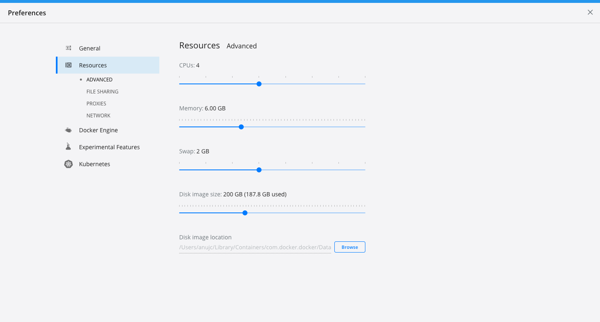

1. Ensure your Docker engine has >= 6GB of RAM and 4+ CPUs. This is especially critical for Mac users, below you can see a screenshot from Docker Desktop's settings.

   

   > These are the minimal settings we validated against with no other containers running.
