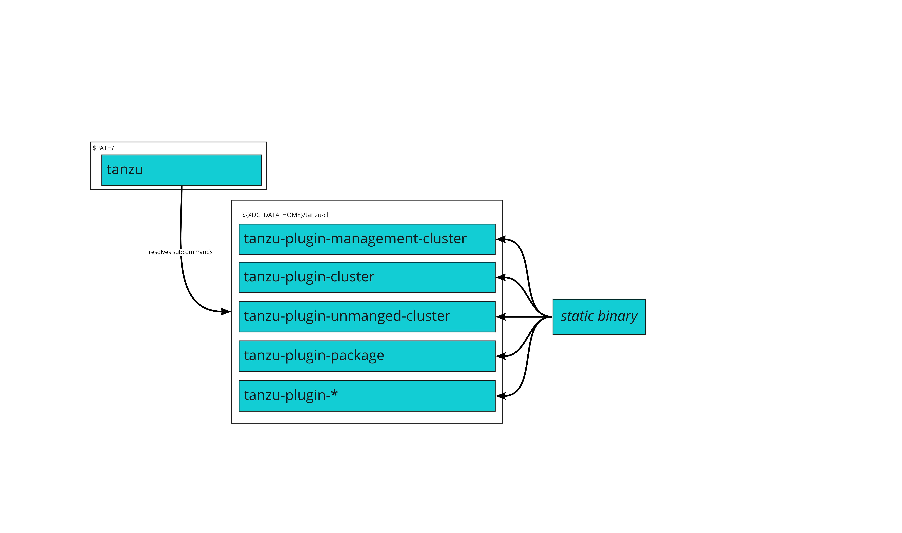
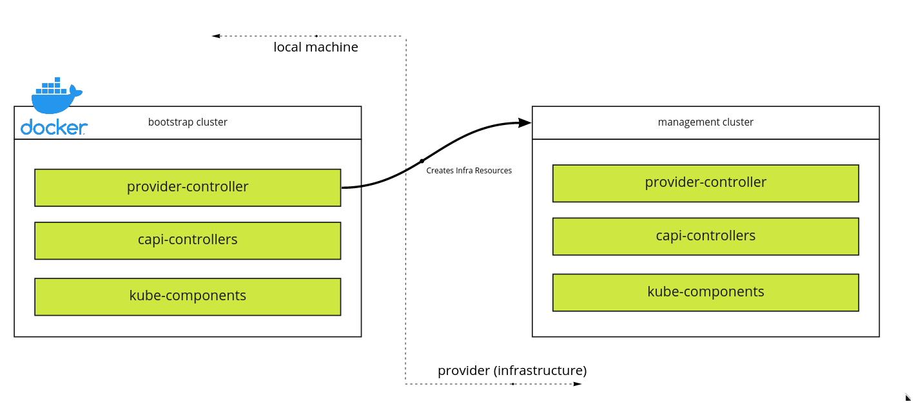
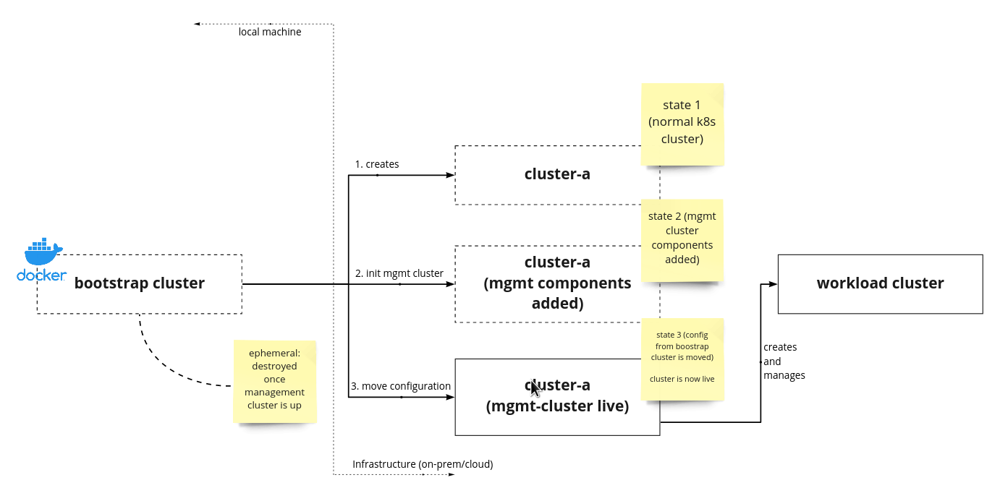
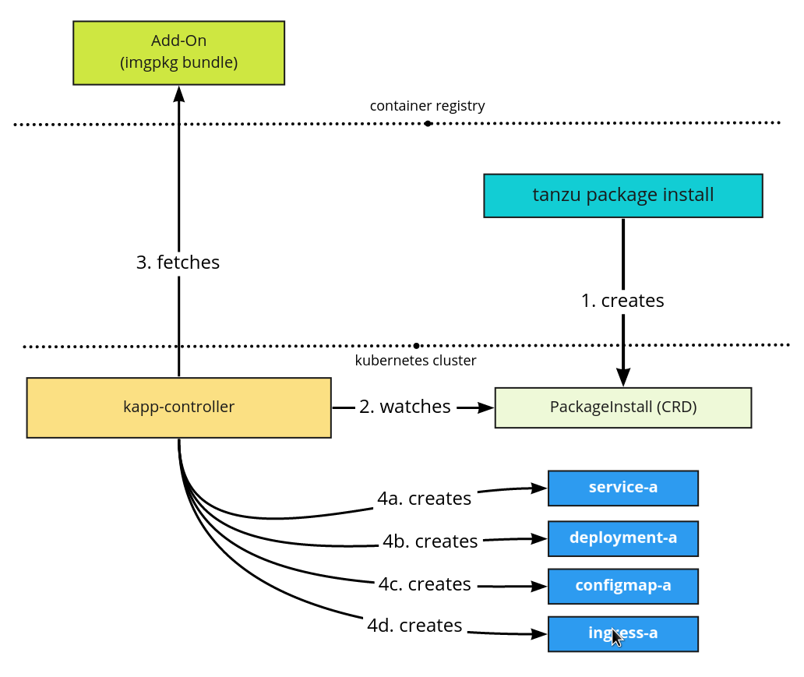

# Architecture

Tanzu Community Edition consists of a variety of components that enable the
bootstrapping and management of Kubernetes clusters and the various platform
services ran atop. This page details the architecture of:

* Tanzu CLI
* Managed Clusters
* Unmanaged Clusters
* Package Management

## Tanzu CLI

The `tanzu` CLI command exposes multiple subcommands.

```sh
$ tanzu

Tanzu CLI

Usage:
  tanzu [command]

Available command groups:

  Admin
    builder                 Build Tanzu components
    codegen                 Tanzu code generation tool

  Run
    cluster                 Kubernetes cluster operations
    conformance             Run Sonobuoy conformance tests against clusters
    diagnostics             Cluster diagnostics
    kubernetes-release      Kubernetes release operations
    management-cluster      Kubernetes management cluster operations
    package                 Tanzu package management
    secret                  Tanzu secret management
    standalone-cluster      (!!! deprecated - see unmanaged-cluster !!!)
    unmanaged-cluster       Deploy and manage single-node, static, Tanzu clusters.
  System
    completion              Output shell completion code
    config                  Configuration for the CLI
    init                    Initialize the CLI
    login                   Login to the platform
    plugin                  Manage CLI plugins
    update                  Update the CLI
    version                 Version information


Flags:
  -h, --help   help for tanzu

Use "tanzu [command] --help" for more information about a command.

Not logged in
```

Each subcommand provides functionality for Tanzu Community Edition. This
functionality can range from creating clusters to managing the software running
in clusters. Subcommands in `tanzu` are independent static binaries hosted on a
client system. This enables a pluggable architecture where plugins can be added,
removed, and updated independent of each other. The `tanzu` command is expected
to be installed in machine's path. Each subcommand (binary) is expected to be
installed in `${XDG_DATA_HOME}/tanzu-cli`. This relationship is demonstrated
below.



> [Click here to see where $XDG_DATA_HOME resolves
> to.](https://github.com/adrg/xdg#xdg-base-directory)

Tanzu Community Edition ships with the `tanzu` CLI and a select set of plugins.
Some plugins may live in the [vmware-tanzu/community-edition](https://github.com/vmware-tanzu/community-edition) repository while others live in [vmware-tanzu/tanzu-framework](https://github.com/vmware-tanzu/tanzu-framework/). Plugins that live in vmware-tanzu/tanzu-framework may be used in multiple Tanzu Editions. Plugins that live in vmware-tanzu/community-edition are used exclusively in Tanzu Community Edition. Plugins in vmware-tanzu/community-edition may be promoted
(moved) to vmware-tanznu/tanzu-framework. This move does not impact users of
Tanzu Community Edition; it only impacts contributors to the plugin.
Additionally, plugins may live in repositories outside of
vmware-tanzu/community-edition and vmware-tanzu/tanzu-framework.

## Tanzu Clusters

There are two different types of clusters that can be deployed using the `tanzu cluster` command(s):

### Managed Clusters

Managed clusters are deployed and managed by a Tanzu management cluster (originally deployed using `tanzu management-cluster`. This is the primary deployment model for clusters in the Tanzu ecosystem and is recommended for production scenarios. To bootstrap managed clusters, you first
need a management cluster.  This is done using the `tanzu management-cluster create` command. When running this command, a bootstrap cluster is created locally and is used to then create the management cluster. The following diagram shows this flow.



Once the management cluster has been created, the bootstrap cluster will perform
a move (aka pivot) of all management objects to the management cluster. From
this point forward, the management cluster is responsible for managing itself
and any new clusters you create. These new clusters, managed by the management
cluster, are referred to as workload clusters. The following diagram shows this
relationship end-to-end.



### Unmanaged Clusters

An unmanaged cluster offers a single node, local workstation cluster suitable for a development/test environment.  It requires minimal local resources and is fast to deploy. It provides support for running multiple clusters. The default Tanzu Community Edition package repository is automatically installed when you deploy an unmanaged cluster.

## Package Management

Tanzu Community Edition provides package management to users via the `tanzu`
CLI. Package management is defined as the discovery, installation, upgrading,
and deletion of software that runs on Tanzu clusters. Each package is created
using [carvel tools](https://carvel.dev/) and following our [packaging
process](designs/package-process). Packages are put into a single bundle, called
a package repository and pushed to an OCI-compliant registry. In Tanzu clusters,
[kapp-controller](https://carvel.dev/kapp-controller) is constantly watching for
package repositories. When a cluster is told about this package repository
(likely via the `tanzu package repository` command), kapp-controller can pull
down that repository and make all the packages available to the cluster. This
relationship is shown below.


With the packages available in the cluster, users of `tanzu` can install various
packages. Within the cluster, a
[PackageInstall](https://carvel.dev/kapp-controller/docs/latest/packaging/#packageinstall)
resource is created and it instructs `kapp-controller` to download the package
and install the software in your cluster. This flow is shown below.



Note: If you deploy an unmanaged cluster, the default Tanzu Community Edition package repository 'tce-repo' is automatically installed.
