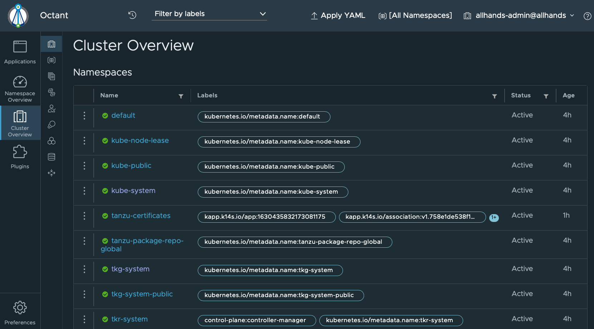

This section describes how to use [octant](https://github.com/vmware-tanzu/octant)
to visually navigate cluster(s). Using Octant is not
required for Tanzu Community Edition.

1. Install `octant` using [one of their documented
   methods](https://reference.octant.dev/?path=/docs/docs-intro--page#getting-started).

1. Ensure your context is pointed at the correct cluster you wish to monitor.

    ```sh
    kubectl config use-context ${CLUSTER_NAME}-admin@${CLUSTER_NAME}
    ```

    > `${CLUSTER_NAME}` should be replaced with the **name of the cluster** you
    > wish to visually inspect.

1. Run `octant`.

    ```sh
    octant
    ```

    > In most environments, `octant` should be able to start without arguments or
    > flags.  For details on how to configure Octant, run `octant --help`.

1. Navigate the Octant UI.

    
