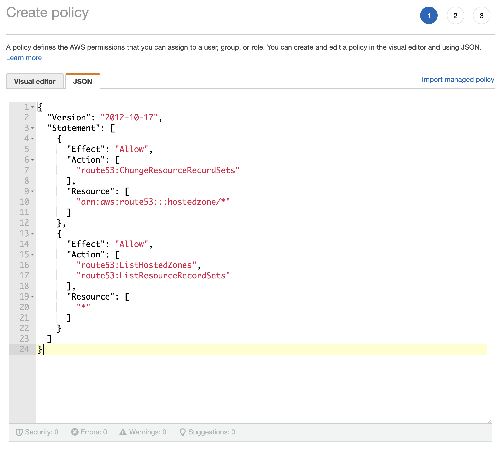
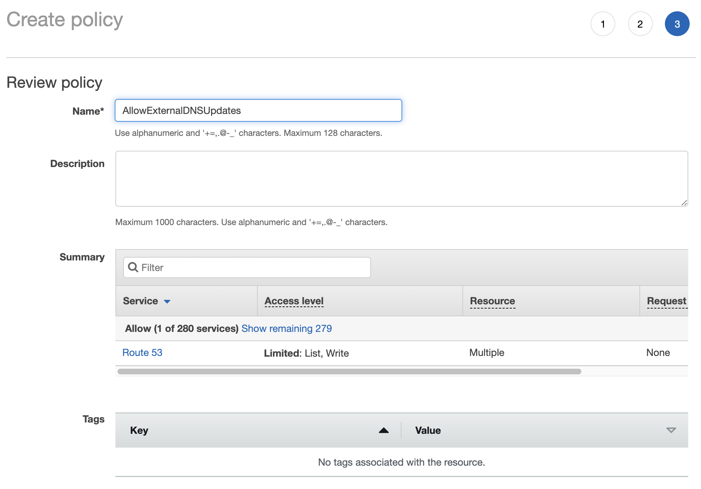
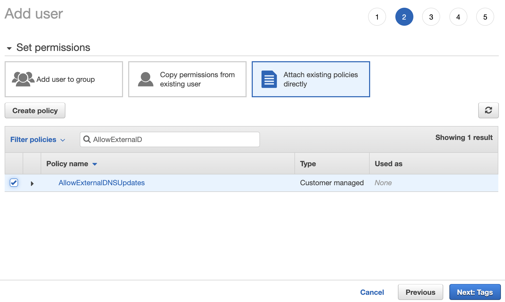
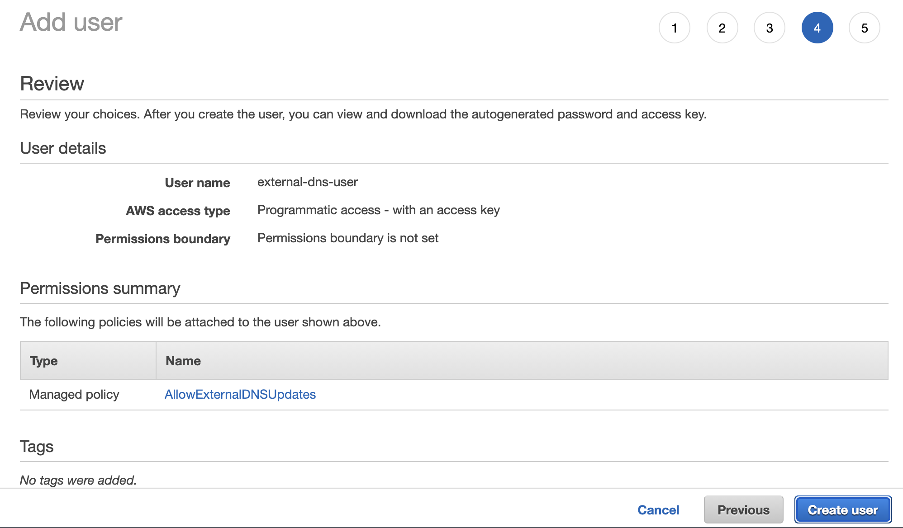
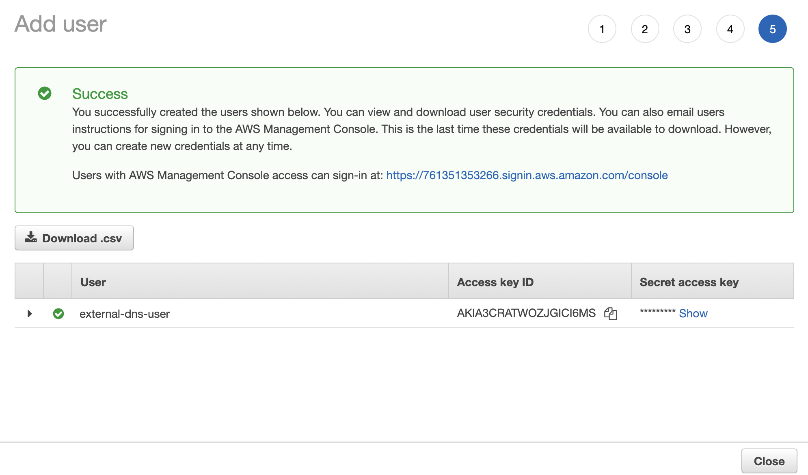
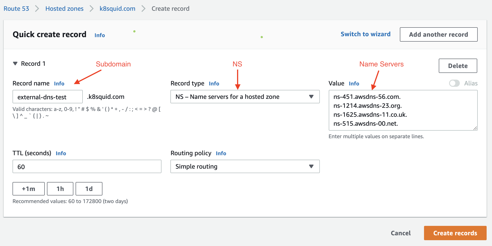

# ExternalDNS

[ExternalDNS](https://github.com/kubernetes-sigs/external-dns) synchronizes
exposed Kubernetes Services and Ingresses with DNS providers.

This documentation provides information about the specific TCE package. Please visit the [TCE package management page](https://tanzucommunityedition.io/docs/v0.11/package-management/) for general information about installation, removal, troubleshooting, and other topics.

## Installation

The ExternalDNS package requires a Kubernetes cluster that supports a [LoadBalancer type Service](https://kubernetes.io/docs/concepts/services-networking/service/#loadbalancer) and access to an external DNS provider that is supported by ExternalDNS. For a list of supported DNS providers, go [here](https://github.com/kubernetes-sigs/external-dns#status-of-providers).

ExternalDNS may be configured with various external DNS providers. We do not document this in depth, but rather show an example of how to configure the package with AWS Route 53 (see below).

For guides on how to configure ExternalDNS for other DNS providers, go [here](https://github.com/kubernetes-sigs/external-dns#deploying-to-a-cluster).

### Installation of dependencies

#### Amazon Web Services Route 53 example

This walkthrough guides you through setting up the ExternalDNS package with the
AWS Route 53 DNS service. It builds off of the instructions for
[Setting Up ExternalDNS for Services on
AWS](https://github.com/kubernetes-sigs/external-dns/blob/master/docs/tutorials/aws.md)
and assumes the following prerequisites:

* Your cluster is on AWS
* You have a domain managed by Route 53
* You can create AWS IAM users and permissions

##### 1. AWS Permissions

As outlined in the official
[ExternalDNS documentation](https://github.com/kubernetes-sigs/external-dns/blob/master/docs/tutorials/aws.md#iam-policy),
you'll need to start by creating a permissions policy that allows ExternalDNS
updates. You can do this in the AWS Console
[here](https://console.aws.amazon.com/iam/home#/policies$new?step=edit). Switch
to the JSON tab and paste in the policy.

```json
{
  "Version": "2012-10-17",
  "Statement": [
    {
      "Effect": "Allow",
      "Action": [
        "route53:ChangeResourceRecordSets"
      ],
      "Resource": [
        "arn:aws:route53:::hostedzone/*"
      ]
    },
    {
      "Effect": "Allow",
      "Action": [
        "route53:ListHostedZones",
        "route53:ListResourceRecordSets"
      ],
      "Resource": [
        "*"
      ]
    }
  ]
}
```

> Note that this policy allows updating of any hosted zone. You can limit the
> number of affected zones by replacing the wildcard with the hosted zone you will
> use for this example.



Continue through the policy page and complete the policy. For simplicity, name the
policy `AllowExternalDNSUpdates`.



##### 2. AWS User

[Go here](https://console.aws.amazon.com/iam/home#/users$new?step=details) to create a new user in IAM specifically for updating DNS. In the following example we call the user `external-dns-user`. Check only the box that allows programmatic access.


Attach the `AllowExternalDNSUpdates` permission to the new user. Select the
`Attach existings policies directly` box, then search for the policy and
check the box.



Continue on to the review page and make sure everything is correct. Then create
the user.



The final step in creating the user is to copy the access keys. These
credentials are for giving ExternalDNS access to this user and permission
to modify your DNS settings. This will be your only opportunity to see the
`secret-access-key`, so make a note of it and the Access Key ID.



##### 3. Hosted Zone

The [official ExternalDNS documentation](https://github.com/kubernetes-sigs/external-dns/blob/master/docs/tutorials/aws.md#set-up-a-hosted-zone) provides instructions for creating a subdomain on the hosted zone. You
can either do this or use the hosted zone itself.

This example follows the official docs and also calls out an additional step that they do not include.

In this example we will use the domain `k8squid.com` and a subdomain of
`external-dns-test`. Create the new hosted zone.

```shell
aws route53 create-hosted-zone --name "external-dns-test.k8squid.com." --caller-reference "external-dns-test-$(date +%s)"
/hostedzone/Z09346372A26K4C7GYTEI
```

Obtain the name servers assigned to the new subdomain.

```shell
aws route53 list-resource-record-sets --output json --hosted-zone-id "/hostedzone/Z09346372A26K4C7GYTEI" --query "ResourceRecordSets[?Type == 'NS']" | jq -r '.[0].ResourceRecords[].Value'
ns-451.awsdns-56.com.
ns-1214.awsdns-23.org.
ns-1625.awsdns-11.co.uk.
ns-515.awsdns-00.net.
```

Note the new hosted zone ID and name servers.

"Hook up your DNS zone with is parent zone", as the official documentation
cryptically suggests:

* Go to the [AWS Route 53
Console](https://console.aws.amazon.com/route53/v2/hostedzones#) and select
your domain.
* Create a new record.
* Enter the desired subdomain.
* Select NS for the record type and paste the list of name servers from the previous step
into the Value field.



Once you've created the NS record on the hosted zone for your new subdomain, you're
done with the prerequisites on AWS for this example.

##### 4. Create a Kubernetes Secret

In [the AWS Permissions section](#1-aws-permissions) you obtained AWS credentials. Use them to
create a secret in Kubernetes that ExternalDNS can reference.

Start by creating a manifest for an opaque secret in the same namespace where the ExternalDNS package
will run that secret. If the namespace does not exist, create it now and use it in the
manifest below.

```shell
kubectl create namespace external-dns
```

You will need the secret name to reference it by, the namespace, and
the AWS access key ID and Secret access key. Create this manifest and
apply it to your cluster with `kubectl apply -f secret.yaml`.

```yaml
apiVersion: v1
kind: Secret
metadata:
  name: << SECRET CREDENTIAL NAME >>
  namespace: << NAMESPACE >>
type: Opaque
stringData:
  access-key-id: << ACCESS KEY ID >>
  secret-access-key: << SECRET ACCESS KEY >>
```

### Installation of package

Configure the ExternalDNS package to use your new AWS hosted zone. Start by
editing the configuration file, providing the values to configure ExternalDNS
with the Route 53 provider. You may use the sample configuration files below as a template.

In this example, provide the values for:

* DOMAIN, e.g. `example.com`
* HOSTED ZONE ID, e.g. `Z09346372A26K4C7GYTEI`
* SECRET CREDENTIAL NAME, e.g. whatever name was used in step 4 above.

```yaml
---

#! The namespace in which to deploy ExternalDNS.
namespace: external-dns

#! Deployment-related configuration
deployment:
  args:
    - --source=service
    - --source=ingress
    - --domain-filter=external-dns-test.<< DOMAIN >> # will make ExternalDNS see only the hosted zones matching the provided domain, omit to process all available hosted zones
    - --provider=aws
    - --policy=upsert-only # would prevent ExternalDNS from deleting any records, omit to enable full synchronization
    - --aws-zone-type=public # only look at public hosted zones (valid values are public, private or no value for both)
    - --registry=txt
    - --txt-owner-id=<< HOSTED ZONE ID >>
  env:
    - name: AWS_ACCESS_KEY_ID
      valueFrom:
        secretKeyRef:
          name: << SECRET CREDENTIAL NAME >>
          key: access-key-id
    - name: AWS_SECRET_ACCESS_KEY
      valueFrom:
        secretKeyRef:
          name: << SECRET CREDENTIAL NAME >>
          key: secret-access-key
  securityContext: []
  volumeMounts: []
  volumes: []
```

Once the configuration file is updated with your information, deploy the
ExternalDNS package to your cluster.

Assuming the package repository that ships ExternalDNS was installed in namespace
"my-packages" like so:

```shell
tanzu package repository add tce-repo --url projects.registry.vmware.com/tce/main:stable --namespace my-packages --create-namespace
```

install the package with the following command:

```shell
tanzu package install external-dns --package-name external-dns.community.tanzu.vmware.com --version 0.11.0 --namespace my-packages --values-file << VALUES FILE NAME >>
```

After a minute or so, check to see that the package has installed.

```shell
kubectl get apps --all-namespaces
NAMESPACE         NAME              DESCRIPTION           SINCE-DEPLOY   AGE
my-packages       external-dns      Reconcile succeeded   26s            26s
```

ExternalDNS should now be installed and running on your cluster. To verify that
it works, you can follow the service example provided in the [official documentation](https://github.com/kubernetes-sigs/external-dns/blob/master/docs/tutorials/aws.md#verify-externaldns-works-service-example).

Be sure to substitute your domain name and hosted zone ID in the service manifest
and relevant AWS CLI commands.

## Options

### Package configuration values

The ExternalDNS package does not have any command line options at this time.

### Application configuration options

You can set the following configuration values to customize your ExternalDNS installation.

### Global

| Value       | Required/Optional | Description                                    |
|-------------|-------------------|------------------------------------------------|
| `namespace` | Optional          | The namespace in which to deploy ExternalDNS. |

### ExternalDNS configuration

| Value                        | Required/Optional  | Description                                      |
|------------------------------|--------------------|--------------------------------------------------|
| `deployment.args`            | Required           | Args passed via command-line to ExternalDNS     |
| `deployment.env`             | Optional           | Environment variables to pass to ExternalDNS    |
| `deployment.securityContext` | Optional           | Security context of the ExternalDNS container   |
| `deployment.volumeMounts`    | Optional           | Volume mounts of the ExternalDNS container      |
| `deployment.volumes`         | Optional           | Volumes of the ExternalDNS pod                  |
| `deployment.podLabels`       | Optional           | Lables for the ExternalDNS pod                  |
| `serviceaccount.annotations` | Optional           | Annotations for the ExternalDNS service account |

Follow [the ExternalDNS docs](https://github.com/kubernetes-sigs/external-dns#running-externaldns)
for guidance on how to configure ExternalDNS for your DNS provider.

### Configuring with Contour HTTPProxy

Follow [this tutorial](https://github.com/kubernetes-sigs/external-dns/blob/v0.11.0/docs/tutorials/contour.md)
for guidance on providing arguments to ExternalDNS to enable HTTPProxy support. The ExternalDNS package is
preconfigured with the correct RBAC permissions to watch for HTTPProxies, so you can skip this part of the tutorial.

### Multi-cloud configuration steps

For this package there is no unique configuration for different clouds.

## Expose Metrics

ExternalDNS can be configured to expose metrics.  [What metrics can I get from ExternalDNS and what do they mean?](https://github.com/kubernetes-sigs/external-dns/blob/master/docs/faq.md#what-metrics-can-i-get-from-externaldns-and-what-do-they-mean).  To configure with this package, include the following configuration in your data value file.

```yaml
deployment:
  args:
    - --metrics-address=:7979 #! ensures external dns exposes metrics
  podLabels:
    prometheus.io/scrape: "true"
    prometheus.io/path: "/metrics"
    prometheus.io/port: "7979"
```

## What this package does

From the ExternalDNS documentation:
> Inspired by [Kubernetes DNS](https://github.com/kubernetes/dns), Kubernetes' cluster-internal DNS server, ExternalDNS makes Kubernetes resources discoverable via public DNS servers. Like KubeDNS, it retrieves a list of resources (Services, Ingresses, etc.) from the [Kubernetes API](https://kubernetes.io/docs/api/) to determine a desired list of DNS records. Unlike KubeDNS, however, it's not a DNS server itself, but merely configures other DNS providers accordingly—e.g. [AWS Route 53](https://aws.amazon.com/route53/) or [Google Cloud DNS](https://cloud.google.com/dns/docs/).

In a broader sense, ExternalDNS allows you to control DNS records dynamically via Kubernetes resources in a DNS provider-agnostic way.

## Components

* ExternalDNS version: `0.11.0`

## Supported Providers

The following table shows the providers this package can work with.

| AWS  |  Azure  | vSphere  | Docker |
|:----:|:-------:|:--------:|:------:|
| ✅   | ✅      | ✅       | ⚠️      |

Notes:

* On vSphere a load balancer must be installed—for example, NSX ALB.
* Docker provider is only used in end-to-end tests, which require [MetalLB](https://metallb.universe.tf/) to be
  installed and configured.

## Files

### values.yaml - configuring RFC2136 (e.g Bind)

```yaml
---

#! The namespace in which to deploy ExternalDNS.
namespace: external-dns

#! Deployment-related configuration
deployment:
  args:
  - --source=service
  - --source=contour-httpproxy
  - --txt-owner-id=k8s
  - --domain-filter=k8s.example.org
  - --namespace=my-services-ns
  - --provider=rfc2136
  - --rfc2136-host=100.69.97.77
  - --rfc2136-port=53
  - --rfc2136-zone=k8s.example.org
  - --rfc2136-tsig-secret=MTlQs3NNU=
  - --rfc2136-tsig-secret-alg=hmac-sha256
  - --rfc2136-tsig-keyname=externaldns-key
  - --rfc2136-tsig-axfr
  env: []
  securityContext: []
  volumeMounts: []
  volumes: []

#! Service account related configuration
serviceaccount:
  annotations:
    key: value
```

`values.yaml` sample when configuring for AWS:

```yaml
---

#! The namespace in which to deploy ExternalDNS.
namespace: external-dns

#! Deployment related configuration
deployment:
  args:
    - --source=service
    - --source=ingress
    - --domain-filter=external-dns-test.<< DOMAIN >> # will make ExternalDNS see only the hosted zones matching provided domain, omit to process all available hosted zones
    - --provider=aws
    - --policy=upsert-only # would prevent ExternalDNS from deleting any records, omit to enable full synchronization
    - --aws-zone-type=public # only look at public hosted zones (valid values are public, private or no value for both)
    - --registry=txt
    - --txt-owner-id=<< HOSTED ZONE ID >>
  env:
    - name: AWS_ACCESS_KEY_ID
      valueFrom:
        secretKeyRef:
          name: << SECRET CREDENTIAL NAME >>
          key: access-key-id
    - name: AWS_SECRET_ACCESS_KEY
      valueFrom:
        secretKeyRef:
          name: << SECRET CREDENTIAL NAME >>
          key: secret-access-key
  securityContext: []
  volumeMounts: []
  volumes: []
```

## Package Limitations

There are currently no known issues.

To file an issue related to this package, open a [GitHub issue on the community-edition repo](https://github.com/vmware-tanzu/community-edition/issues/new/choose). Label the issue with `[external-dns package]` in the title.

## Usage Example

This example documents how to run an Nginx and configure a DNS record for its Service using ExternalDNS.

Run an Nginx pod:

```bash
kubectl run nginx --image=nginx --port=80
```

Expose a Kubernetes LoadBalancer type Service for Nginx:

```bash
kubectl expose pod nginx --port=80 --target-port=80 --type=LoadBalancer
```

Annotate the Service with your desired DNS name. Make sure to change `example.org` to your domain.

```bash
kubectl annotate service nginx "external-dns.alpha.kubernetes.io/hostname=nginx.example.org."
```

Optionally, you can [customize the TTL](https://github.com/kubernetes-sigs/external-dns/blob/master/docs/ttl.md) value of the resulting DNS record by using the `external-dns.alpha.kubernetes.io/ttl` annotation:

```bash
kubectl annotate service nginx "external-dns.alpha.kubernetes.io/ttl=10"
```

Check your DNS provider for a new DNS record created by ExternalDNS or attempt to query the address from your terminal.

```bash
dig +short nginx.example.org.
```

Clean up the example.

```bash
kubectl delete service nginx
kubectl delete pod nginx
```

## Troubleshooting

Here are some steps to troubleshoot an installation of ExternalDNS.

To validate that the package has been successfully installed and that the ExternalDNS pod is running:

```bash
kubectl -n external-dns get all,packageinstalls,apps
NAME                                               PACKAGE NAME                              PACKAGE VERSION   DESCRIPTION           AGE
packageinstall.packaging.carvel.dev/external-dns   external-dns.community.tanzu.vmware.com   0.10.0            Reconcile succeeded   39s

NAME                                DESCRIPTION           SINCE-DEPLOY   AGE
app.kappctrl.k14s.io/external-dns   Reconcile succeeded   31s            39s

NAME                                READY   STATUS    RESTARTS   AGE
pod/external-dns-7778c67665-bzl2s   1/1     Running   0          64s

NAME                           READY   UP-TO-DATE   AVAILABLE   AGE
deployment.apps/external-dns   1/1     1            1           64s

NAME                                      DESIRED   CURRENT   READY   AGE
replicaset.apps/external-dns-7778c67665   1         1         1       64s
```

If there are no errors in any of the above, and the pod is running, but ExternalDNS is not working—i.e you don't see any DNS records syncing with your external DNS provider—then you should check the ExternalDNS logs:

```bash
kubectl -n external-dns logs -l app=external-dns
```

You may also want to check that any LoadBalancer Services you have annotated have an ExternalIP set:

```bash
kubectl get service <my-service>
NAME    TYPE           CLUSTER-IP     EXTERNAL-IP    PORT(S)        AGE
nginx   LoadBalancer   10.96.78.225   172.18.0.241   80:31044/TCP   52s
```

## Additional Documentation

⚠️ Note: For more advanced use cases and documentation, see the official
ExternalDNS [documentation](https://github.com/kubernetes-sigs/external-dns).
