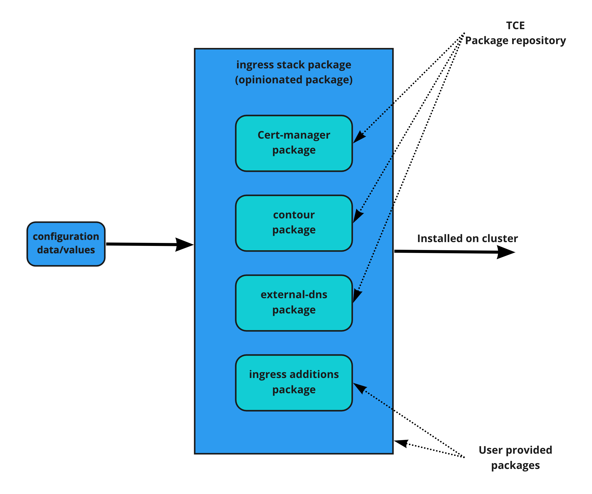

# Opinionated installation package

As a user, many times you will find yourself installing the same packages with similar configuration over and over. We call this an `opinionated installation`. The process, although simple, is still a few commands, and many times you will need to communicate these to your team in order to get similarly functional clusters. The more commands a user needs to type the more chances there are for error and the more complicated it gets to learn all the process.

If you don’t really care that much about all the necessary steps and configuration that is needed to provide you with your opinionated cluster, you can easily take advantage of the same mechanisms that are used in Tanzu Community Edition to provide capabilities onto a cluster: [Carvel packages](/docs/designs/package-process/#packages).

In this guide you’re going to learn the process of packaging an opinionated installation. As a base, we will use the configuration in the [Secure/Automated Ingress on AWS](solutions-secure-ingress) guide. This guide will focus on packaging what is shown in that guide, but should be easy enough for you to modify to your needs.

You’re going to follow the [same workflow](/docs/designs/package-process/#packaging-workflow) as Tanzu Community Edition uses internally to create the packages it provides, but since you can’t easily use the scripts described in that doc, we will lay down all the commands you need. We will use a Linux shell convention for this, and it should be easy for you to adapt to your Operating System.

First thing you will do is to create a package that will contain all the additional resources that are created in your opinionated environment. This package will be named `my-opinionated-config`. Then, we will create a package that will instantiate the four packages used: contour, cert-manager, external-dns and my-opinionated-config. This is actually the one that will trigger all the installations on your environment. You will name this package `my-opinionated-package`.



## Opinionated configuration and additional resources

Go ahead and create a folder structure that you will use for the first package.

```shell
mkdir my-opinionated-config  
cd my-opinionated-config
mkdir -p config/overlays
mkdir -p config/additions
touch config/values.yaml
```

In our [Secure automated Ingress on AWS guide](solutions-secure-ingress), we created some additional resources to make things work collaboratively. These were the ClusterIssuer and Certificate for cert-manager and the TLSDelegation for contour. As these resources depend on the existence of the other packages, we need to provide them as an additional package to the final opinionated installation. For now, place these files in the `config/additions` folder.

We create a new namespace where all our additional resources will be created.

`namespace.yaml`

```yaml
apiVersion: v1
kind: Namespace
metadata:
  name: my-package-certs
```

We add the resources we created in the previous guide, making sure they will live in the `my-package-certs` namespace.

`issuer.yaml`

```yaml
apiVersion: cert-manager.io/v1
kind: Issuer
metadata:
  name: wildcard-lets-encrypt
  namespace: my-package-certs
spec:
  acme:
    email: <EMAIL>
    privateKeySecretRef:
      name: issuer-account-key
    server: https://acme-v02.api.letsencrypt.org/directory
    solvers:
    - dns01:
        route53:
          region: <REGION>
          accessKeyID: <ACCESS_KEY_ID>
          secretAccessKeySecretRef:
            name: aws-creds
            key: secret-access-key
    - http01:
        ingress:
          class: contour
```

Note that this time, you’re setting up an [Issuer and not a ClusterIssuer](https://cert-manager.io/docs/concepts/issuer/) and placing it in the `my-package-certs` namespace. You will need to create the `my-package-certs` namespace as well. This is a convenience as this issuer is only used once.

`certificate.yaml`

```yaml
apiVersion: cert-manager.io/v1
kind: Certificate
metadata:
  name: wildcard
  namespace: my-package-certs
spec:
  secretName: wildcard
  issuerRef:
    name: wildcard-lets-encrypt
    kind: Issuer
  dnsNames:
  - <DNS_NAME>
```

`tls-delegation.yaml`

```yaml
apiVersion: projectcontour.io/v1
kind: TLSCertificateDelegation
metadata:
  name: wildcards
  namespace: my-package-certs
spec:
  delegations:
  - secretName: wildcard
    targetNamespaces: ["*"]
```

You also need to provide AWS IAM credentials as secrets for cert-manager and external-dns. The former will be placed in the `my-package-certs` namespace, the latter will be placed in the `external-dns` namespace. Place both files also in `config/additions`:

`aws-creds-cert-manager.yaml`

```yaml
apiVersion: v1
kind: Secret
metadata:
  name: aws-creds
  namespace: my-package-certs
type: Opaque
stringData:
  access-key-id: < ACCESS_KEY_ID >
  secret-access-key: < SECRET_ACCESS_KEY >
```

`aws-creds-external-dns.yaml`

```yaml
apiVersion: v1
kind: Secret
metadata:
  name: aws-creds
  namespace: external-dns
type: Opaque
stringData:
  access-key-id: < ACCESS_KEY_ID >
  secret-access-key: < SECRET_ACCESS_KEY >
```

With all these in place, now we can proceed to configuring our package. Looking back to the files we just created, you will notice that there are some values that were defined between angle brackets and in capital letters. These are all configurations that the users of the package will need to provide as these are the things that can change between environments and installations for the opinionated installation.

We will create a `values.yaml` where you can define all of these, and you will place that file in the `config` folder. This file is a [ytt data values file](https://carvel.dev/ytt/docs/latest/ytt-data-values/) and will contain an annotation at the top of the file indicating that.

`values.yaml`

```yaml
#@data/values
---
domain:
email:
aws:
  region:
  credentials:
    access_key_id:
    secret_access_key:
```

Now, we need to pass this configuration down to the package. This will be done via [ytt overlay files](https://carvel.dev/ytt/docs/latest/ytt-overlays/) that allows us to apply overlaid information into the original yaml files without the need to modify them, although this is also an option.

For each of the configuration files we want to configure via this package (the ones with placeholders), we will create an overlay file. This is just a convenience for readability but one can choose to group overlays in a different way. We will place these files in the `config/overlays` folder.

`overlay-creds-secret.yaml`

```yaml
#@ load("@ytt:overlay", "overlay")
#@ load("@ytt:data", "data")

#@overlay/match by=overlay.subset({"kind": "Secret", "metadata": {"name": "aws-creds"}}),expects=2
---
stringData:
  access-key-id: #@ data.values.aws.credentials.access_key_id
  secret-access-key: #@ data.values.aws.credentials.secret_access_key
```

This overlay will fill the AWS IAM credentials in the two aws-secrets the package uses.

`overlay-issuer.yaml`

```yaml
#@ load("@ytt:overlay", "overlay")
#@ load("@ytt:data", "data")

#@overlay/match by=overlay.subset({"kind":"Issuer"})
---
spec:
  acme:
    email: #@ data.values.email
    solvers:
    #@overlay/match by=lambda _,l,r: "dns01" in l
    - dns01:
        route53:
          region: #@ data.values.aws.region
          accessKeyID: #@ data.values.aws.credentials.access_key_id
```

This overlay will modify the `user-provided` configuration into the issuer so that the placeholders we created are replaced with the values the user has provided.

`overlay-certificate.yaml`

```yaml
#@ load("@ytt:overlay", "overlay")
#@ load("@ytt:data", "data")

#@overlay/match by=overlay.subset({"kind":"Certificate"})
---
spec:
  #@overlay/match
  #@overlay/replace
  dnsNames:
  - #@ "*.{}".format(data.values.domain)
```

This overlay will configure the dnsNames of the Certificate we will use.

We have finally created all the required files for our package. Well, not all really, but the ones that will be `in` the package bundle. We can test that everything works fine. For that, let’s create a test values file and invoke ytt manually. We will provide recognizable values in the sample file so that when we look into the output we can easily see what we have customized. Place this file in the root of your working directory, right outside the `my-opinionated-config` so that we don’t package it in later.

`sample-values.yaml`

```yaml
#@data/values
---
domain: example.com
email: jorge@example.com
aws:
  region: MY_REGION
  credentials:
    access_key_id: AAAAAAAAAA
    secret_access_key: BBBBBBBBB
```

Now, to test the configuration we can just do:

```shell
ytt -f config -f ../sample-values.yaml
```

We will see the yaml resource files that the package will install on the cluster with the values we have provided. If you get a `ytt` error, review your files as you probably have missed something.

Now it’s time to package all the files up into a [Carvel imgpkg bundle](https://carvel.dev/imgpkg/docs/latest/resources/#bundle). For this we will still need to add some files, and we will need to have an OCI Registry (container registry) to push the generated bundle to, so that we can then test it in the cluster. For the purpose of this guide we will use an [Anonymous & ephemeral Docker image registry called ttl.sh](https://ttl.sh/) so that we don’t need to care about the registry. In a real world environment you should use your own registry.

The first step in creating the bundle is to make sure that it is `complete` which means that if it references images within the descriptors used, those images are properly defined in an [imgpkg lock file](https://carvel.dev/imgpkg/docs/latest/resources/#imageslock-configuration). To do this, we need a folder `.imgpkg` in our package where that file will be generated. Create that folder and the run `[kbld](../designs/package-process/#5-resolve-and-reference-image-digests)` to search on your files for images references to be inventoried.

```shell
kbld --file config --imgpkg-lock-output .imgpkg/images.yml
```

Since the configuration you are packaging up does not use any images, the file will be empty.

Next, you will create [the package bundle](/designs/package-process/#6-bundle-configuration-and-deploy-to-registry). The bundle will be created and pushed into an OCI registry as a single operation.

```shell
imgpkg push --bundle ttl.sh/my-package-config:1d --file .
```

You should see a similar output like this:

```shell
dir: .
dir: .imgpkg
file: .imgpkg/images.yml
dir: config
dir: config/additions
file: config/additions/aws-creds-cert-manager.yaml
file: config/additions/aws-creds-external-dns.yaml
file: config/additions/cert.yaml
file: config/additions/issuer.yaml
file: config/additions/my-package-ns.yaml
file: config/additions/tls-delegation.yaml
dir: config/overlays
file: config/overlays/overlay-certificate.yaml
file: config/overlays/overlay-creds-secrets.yaml
file: config/overlays/overlay-issuer.yaml
file: config/values.yaml
Pushed 'ttl.sh/my-package-config@sha256:d066eb08e9783196e2348cd8da8e3d735d7e31e2cc076d94ce790ee73ca30cff'
Succeeded
```

[ttl.sh](https://ttl.sh/) will have this image in the ephemeral registry for one day. If you plan to use the package created here you should definitely use your own registry as otherwise the package will fail to install after 24 hours.

We can check that the image is there and look at the contents of the bundle with imgpkg.

```shell
imgpkg pull -b ttl.sh/my-package-config:1d -o /tmp/my-package-config
tree /tmp/my-package-config
```

Now it’s time for you to generate the [PackageMetadata](https://carvel.dev/kapp-controller/docs/latest/packaging/#packagemetadata) and [Package](https://carvel.dev/kapp-controller/docs/latest/packaging/#package-1) resource definitions that define Carvel Packages. You can see in the previous links that there’s a lot of possible configuration, but we will use the simplest. Place these files in the working root folder, outside the my-package folder.

`package-metadata.yaml`

```yaml
apiVersion: data.packaging.carvel.dev/v1alpha1
kind: PackageMetadata
metadata:
  name: config.my-opinionated.com
  namespace: default
spec:
  displayName: My opinionated config
```

**NOTE**: We are specifying the namespace where this package will live, but it’s up to you where you want to place it.

`package.yaml`

```yaml
apiVersion: data.packaging.carvel.dev/v1alpha1
kind: Package
metadata:
  name: config.my-opinionated.com.0.0.1
  namespace: default
spec:
  refName: config.my-opinionated.com
  version: 0.0.1
  template:
    spec:
      deploy:
      - kapp: {}
      fetch:
      - imgpkgBundle:
          image: ttl.sh/my-package-config:1d
      template:
      - ytt:
          paths:
          - config/
      - kbld:
          paths:
          - '-'
          - .imgpkg/images.yml
```

As you can see, the Package resource references the imgpkg bundle we created. It is recommended that this image reference is resolved to it’s sha256 for reproducibility, so you will now run this command to lock the reference:

```shell
kbld --file package.yaml | sponge package.yaml
```

**NOTE**: We’re using **[sponge](http://linux.die.net/man/1/sponge)** which is a command part of [moreutils](https://joeyh.name/code/moreutils/) that can redirect the output of a command to the file used initially. You can use `brew`, `apt` or any other package manager to install `sponge` on your computer or redirect the output to a temporary file and then rename that temporary file back to the original.

You will now see a reference to the exact image the bundle uses, so that any update to the bundle will not mess things up.

```yaml
apiVersion: data.packaging.carvel.dev/v1alpha1
kind: Package
metadata:
  annotations:
    kbld.k14s.io/images: |
      - origins:
        - resolved:
            tag: 1d
            url: ttl.sh/my-package-config:1d
        url: ttl.sh/my-package-config@sha256:d066eb08e9783196e2348cd8da8e3d735d7e31e2cc076d94ce790ee73ca30cff
  name: config.my-opinionated.com.0.0.1
  namespace: default
spec:
  refName: config.my-opinionated.com
  version: 0.0.1
  template:
    spec:
      deploy:
      - kapp: {}
      fetch:
      - imgpkgBundle:
          image: ttl.sh/my-package-config@sha256:d066eb08e9783196e2348cd8da8e3d735d7e31e2cc076d94ce790ee73ca30cff
      template:
      - ytt:
          paths:
          - config/
      - kbld:
          paths:
          - '-'
          - .imgpkg/images.yml
```

Now you can proceed and install the Package (and PackageMetadata) in your cluster. If you’re going to be creating many packages, it’s recommended to create a [PackageRepository](https://carvel.dev/kapp-controller/docs/latest/packaging/#packagerepository) which is a container for Packages.

To install the package on the cluster type:

```shell
kubectl apply -f package-metadata.yaml -f package.yaml
```

If the output from this command is successful, you should now be able to see the available packages with the `tanzu CLI`.

```shell
tanzu package available list config.my-opinionated.com
```

You have now created a package that provides your additional resources for the opinionated installation, but now we need to package this up with contour, cert-manager and external-dns packages as a single package that will provide the opinionated installation.

## Opinionated installation package

Now that you have packages for the parts you want to install on your clusters, you’re going to create a package that will install all of them in one shot. The process and structure is almost identical to the one you followed in the previous section of this guide.

Go ahead and create a folder structure that you will use for this new package `my-opinionated-package` on the root of your working directory.

```shell
mkdir my-opinionated-package  
cd my-opinionated-package
mkdir -p config/overlays
mkdir -p config/additions
touch config/values.yaml
```

In our [previous guide](solutions-secure-ingress), we created some additional resources to install our packages. These were created under the hood by the `tanzu CLI`. These are the [PackageInstall](https://carvel.dev/kapp-controller/docs/latest/packaging/#packageinstall) resources for [Contour](solutions-secure-ingress/#3-ingress-controller), [external-dns](solutions-secure-ingress/#external-dns) and [cert-manager](solutions-secure-ingress/#cert-manager) and the configuration needed for every package that we provided in a file as argument to the `tanzu package install` command. We will also create a PackageInstall and configuration file for the package we just created in the previous section `my-opinionated-config`. You will place these files in `config/additions` directory you just created:

`contour-packageinstall.yaml`

```yaml
apiVersion: packaging.carvel.dev/v1alpha1
kind: PackageInstall
metadata:
  name: contour
spec:
  packageRef:
    refName: contour.community.tanzu.vmware.com
    versionSelection:
      constraints: 1.17.1
      prereleases: {}
  serviceAccountName: my-package-default-sa
  values:
  - secretRef:
      name: contour-my-package-values
```

`external-dns-packageinstall.yaml`

```yaml
apiVersion: packaging.carvel.dev/v1alpha1
kind: PackageInstall
metadata:
  name: external-dns
spec:
  packageRef:
    refName: external-dns.community.tanzu.vmware.com
    versionSelection:
      constraints: 0.8.0
      prereleases: {}
  serviceAccountName: my-package-default-sa
  values:
  - secretRef:
      name: external-dns-my-package-values
```

`cert-manager-packageinstall.yaml`

```yaml
apiVersion: packaging.carvel.dev/v1alpha1
kind: PackageInstall
metadata:
  name: cert-manager
spec:
  packageRef:
    refName: cert-manager.community.tanzu.vmware.com
    versionSelection:
      constraints: 1.5.1
      prereleases: {}
  serviceAccountName: my-package-default-sa
```

`my-opinionated-config-packageinstall.yaml`

```yaml
apiVersion: packaging.carvel.dev/v1alpha1
kind: PackageInstall
metadata:
  name: my-opinionated-config
spec:
  packageRef:
    refName: config.my-opinionated.com
    versionSelection:
      constraints: 0.0.1
      prereleases: {}
  serviceAccountName: my-package-default-sa
  values:
  - secretRef:
      name: my-opinionated-config-my-package-values
```

**NOTE**: The serviceAccountName and secretRef.name have been adapted to fit the name of the package.

There were some other configurations and files that were provided as part of the guide that would need to be created as well. We provided a configuration for contour and external-dns packages. We will create these files in the `config/additions` folder and we will use placeholders for values that are installation/environment specific.

`external-dns-config.yaml`

```yaml
apiVersion: v1
kind: Secret
metadata:
  name: external-dns-my-package-values
type: Opaque
stringData:
  values.yml:
```

`contour-config.yaml`

```yaml
apiVersion: v1
kind: Secret
metadata:
  name: contour-my-package-values
type: Opaque
stringData:
  values.yml:
```

`my-opinionated-config-config.yaml`

```yaml
apiVersion: v1
kind: Secret
metadata:
  name: my-opinionated-config-my-package-values
type: Opaque
stringData:
  values.yml:
```

These configuration files are empty by default, as we will provide the values via overlay files. But first, you need to create a `values.yaml` where you can define all possible configuration that this package will use. As this file is a [ytt data values file](https://carvel.dev/ytt/docs/latest/ytt-data-values/), it will contain an annotation at the top of the file indicating that.

`values.yaml`

```yaml
#@data/values
---
domain:
email:
aws:
  region:
  credentials:
    access_key_id:
    secret_access_key:
```

Since this package will need to provide all the configuration downstream to the other four packages, it will require defining all the possible configurations. You will use the same values file structure as in the previous package for convenience.

Now, we need to pass this configuration down to the package. This will be done again via [ytt overlay files](https://carvel.dev/ytt/docs/latest/ytt-overlays/). You will place these overlay files in the `config/overlays` folder. There will be one overlay per configuration file to be tuned.

`overlay-contour-config.yaml`

```yaml
#@ load("@ytt:overlay", "overlay")
#@ load("@ytt:data", "data")
#@ load("@ytt:yaml", "yaml")

#@ def config():
envoy:
  service:
    annotations:
      external-dns.alpha.kubernetes.io/hostname: #@ "*.{}.".format(data.values.domain)
#@ end


#@overlay/match by=overlay.subset({"metadata":{"name": "contour-my-package-values"}})
---
stringData:
  values.yml: #@ yaml.encode(config())
```

This overlay does provide the correct values for the external-dns annotation of contour. This value is defined in the Secret contour-my-package-values that is passed to the Contour PackageInstall.

`overlay-external-dns-config.yaml`

```yaml
#@ load("@ytt:overlay", "overlay")
#@ load("@ytt:data", "data")
#@ load("@ytt:yaml", "yaml")

#@ def config():
deployment:
  args:
    - --source=service
    - #@ "--domain-filter={}".format(data.values.domain)
    - --provider=aws
    - --policy=upsert-only
    - --aws-zone-type=public
    - --registry=txt
    - #@ "--txt-owner-id={}".format(data.values.domain)
  env:
    - name: AWS_ACCESS_KEY_ID
      valueFrom:
        secretKeyRef:
          name: aws-creds
          key: access-key-id
    - name: AWS_SECRET_ACCESS_KEY
      valueFrom:
        secretKeyRef:
          name: aws-creds
          key: secret-access-key
#@ end


#@overlay/match by=overlay.subset({"metadata":{"name": "external-dns-my-package-values"}})
---
stringData:
  values.yml: #@ yaml.encode(config())
```

This overlay provides the configuration for external-dns, as the secret that was created in `config/additions` was empty.

`overlay-my-opinionated-config-config.yaml`

```yaml
#@ load("@ytt:overlay", "overlay")
#@ load("@ytt:data", "data")
#@ load("@ytt:yaml", "yaml")

#@ def config():
domain: #@ data.values.domain
email: #@ data.values.email
aws:
  region: #@ data.values.aws.region
  credentials:
    access_key_id: #@ data.values.aws.credentials.access_key_id
    secret_access_key: #@ data.values.aws.credentials.secret_access_key
#@ end


#@overlay/match by=overlay.subset({"metadata":{"name": "my-opinionated-config-my-package-values"}})
---
stringData:
  values.yml: #@ yaml.encode(config())
```

This overlay provides the values for the my-opinionated-config package. As noted before, you’re using the same values structure in both packages for convenience.

Using the same test file we used before we can verify that there’s no error in our ytt overlays. We test the configuration again with:

```shell
ytt -f config -f ../sample-values.yaml
```

If everything looks fine, you can move ahead to lock the images used in the package. Remember to create the `.imgpkg` folder before.

```shell
kbld --file config --imgpkg-lock-output .imgpkg/images.yml
```

Again, this package does not contain any direct image references so the file will be empty. In this case, the images used by contour, cert-manager and external-dns are all defined in the `.imgpkg/images.yml` file of those packages. The opinionated-config package you created in the previous section has locked the imgpkg bundle image used in the `Package` resource.

Next, you will create [the package bundle](../designs/package-process/#6-bundle-configuration-and-deploy-to-registry). The bundle will be created and pushed into an OCI registry as a single operation. We use again `ttl.sh` as a convenience registry.

```shell
imgpkg push --bundle ttl.sh/my-package-bundle:1d --file .
```

You should see a similar output like this:

```shell
dir: .
dir: .imgpkg
file: .imgpkg/images.yml
dir: config
dir: config/additions
file: config/additions/cert-manager-packageinstall.yaml
file: config/additions/contour-config.yaml
file: config/additions/contour-packageinstall.yaml
file: config/additions/external-dns-config.yaml
file: config/additions/external-dns-packageinstall.yaml
file: config/additions/my-opinionated-config-config.yaml
file: config/additions/my-opinionated-config-packageinstall.yaml
dir: config/overlays
file: config/overlays/overlay-contour-config.yaml
file: config/overlays/overlay-external-dns-config.yaml
file: config/overlays/overlay-myopinionatedconfig-config.yaml
file: config/values.yaml
Pushed 'ttl.sh/my-package-bundle@sha256:e22decb7b0c5afb32dbf5c6fce98d6ea011881dafca365d61e8b907d8524e1dc'
Succeeded
```

Remember these images will only be available in that registry for 24 hours.

You will generate now the [PackageMetadata](https://carvel.dev/kapp-controller/docs/packaging/#packagemetadata) and [Package](https://carvel.dev/kapp-controller/docs/latest/packaging/#package-1) resources for this new package:

`package-metadata.yaml`

```shell
apiVersion: data.packaging.carvel.dev/v1alpha1
kind: PackageMetadata
metadata:
  name: my-package.my-opinionated.com
  namespace: default
spec:
  displayName: My opinionated install
```

**NOTE**: We are specifying the namespace where this package will live, but it’s up to you where you want to place it.

`package.yaml`

```yaml
---
apiVersion: data.packaging.carvel.dev/v1alpha1
kind: Package
metadata:
  name: my-package.my-opinionated.com.0.0.1
  namespace: default
spec:
  refName: my-package.my-opinionated.com
  template:
    spec:
      deploy:
      - kapp: {}
      fetch:
      - imgpkgBundle:
          image: ttl.sh/my-package-bundle:1d
      template:
      - ytt:
          paths:
          - config/
      - kbld:
          paths:
          - '-'
          - .imgpkg/images.yml
  version: 0.0.1
```

We need to lock the image used for reproducibility.

```shell
kbld --file package.yaml | sponge package.yaml
```

You will now see a reference to the exact image the bundle uses, so that any update to the bundle will not mess things up.

```yaml
apiVersion: data.packaging.carvel.dev/v1alpha1
kind: Package
metadata:
  annotations:
    kbld.k14s.io/images: |
      - origins:
        - resolved:
            tag: 1d
            url: ttl.sh/my-package-bundle:1d
        url: ttl.sh/my-package-bundle@sha256:e22decb7b0c5afb32dbf5c6fce98d6ea011881dafca365d61e8b907d8524e1dc
  name: my-package.my-opinionated.com.0.0.1
  namespace: default
spec:
  refName: my-package.my-opinionated.com
  version: 0.0.1
  template:
    spec:
      deploy:
      - kapp: {}
      fetch:
      - imgpkgBundle:
          image: ttl.sh/my-package-bundle@sha256:e22decb7b0c5afb32dbf5c6fce98d6ea011881dafca365d61e8b907d8524e1dc
      template:
      - ytt:
          paths:
          - config/
      - kbld:
          paths:
          - '-'
          - .imgpkg/images.yml
```

What happens if you don’t lock this image? When you install the Package on the cluster it will have a reference to a rolling tag, this is a tag that can be reassigned. This means that if the imgpkg bundle is rebuilt and pushed again to that registry, all of the consumers of the package will get the latest version. This is ok while you’re developing your package, but once the package is ready to be released, if there’s a new version of the bits in the package, there should also be a new version of the Package definition, so this file would go from 0.0.1 to 0.0.2 or any other newer version.

Install the package metadata and package on the cluster:

```shell
kubectl apply -f package-metadata.yaml -f package.yaml
```

And now, you’re ready to create your installation of this opinionated installation package. We need a configuration file with our specific values. Let’s now create the values files for our cluster:

`my-package-config.yaml`

```shell
domain: example.com
email: jorge@none.com
aws:
  region: eu-west1
  credentials:
    access_key_id: AAAAAAAAAA
    secret_access_key: BBBBBBBBB
```

**NOTE**: Remember to use your own values when creating this file.

Verify that the package is available to install:

```shell
tanzu package available list my-package.my-opinionated.com
```

Install the package:

```shell
tanzu package install my-package --package-name my-package.my-opinionated.com --version 0.0.1 --values-file my-package-config.yaml
```

You will see the package being installed.

```shell
kubectl get pkgi
NAME                    PACKAGE NAME                              PACKAGE VERSION   DESCRIPTION           AGE
my-package              my-package.my-opinionated.com             0.0.1             Reconciling succeeded   10s
```

Soon after, this package will trigger the installation of the other four packages. Eventually all five packages will be installed on the cluster.

```shell
kubectl get pkgi
NAME                    PACKAGE NAME                              PACKAGE VERSION   DESCRIPTION           AGE
cert-manager            cert-manager.community.tanzu.vmware.com   1.5.1             Reconcile succeeded   2m
contour                 contour.community.tanzu.vmware.com        1.17.1            Reconcile succeeded   2m
external-dns            external-dns.community.tanzu.vmware.com   0.8.0             Reconcile succeeded   2m
my-opinionated-config   config.my-opinionated.com                 0.0.1             Reconcile succeeded   2m
my-package              my-package.my-opinionated.com             0.0.1             Reconcile succeeded   2m
```

You might have seen the package `my-opinionated-config` reporting a `Reconcile failed` error. This is expected, as it will fail until the other packages are fully installed. Carvel’s packaging controller (kapp-controller) will keep reconciling the packages every 2 minutes (by default), so the installation will eventually succeed.  

You should be able to use the same application as before. The only difference is that in this installation the wildcard certificate will be installed in `​​my-package-certs` namespace, so you will need to adjust the HTTPProxy accordingly.

One last reminder that since this guide uses [ttl.sh](https://ttl.sh) as ephemeral registry, your packages will stop working after 24 hours. You will see something like this when doing `kubectl get packageinstall`:

```shell
my-package              my-package.my-opinionated.com             0.0.1             Reconcile failed: Error (see .status.usefulErrorMessage for details)   1d1h
```

You can get the detail of the error by doing:

```shell
kubectl get packageinstall my-package -n default -o jsonpath='{.status.usefulErrorMessage}'
```

The details, although not self explanatory, means that the image is not available or valid.

```shell
Error: Syncing directory '0': Syncing directory '.' with imgpkgBundle contents: Imgpkg: exit status 1 (stderr: Error: Checking if image is bundle: Collecting images: Working with ttl.sh/my-package-bundle@sha256:0524e5115cbb740c3f4226ab55c337a89fdaf207d84788d3b27b5a874adfe2c8: Encountered an error most likely because this image is in Docker Registry v1 format; only v2 or OCI image format is supported (underlying error: GET https://ttl.sh/v2/my-package-bundle/manifests/sha256:0524e5115cbb740c3f4226ab55c337a89fdaf207d84788d3b27b5a874adfe2c8: MANIFEST_UNKNOWN: manifest unknown; map[Name:my-package-bundle Revision:sha256:0524e5115cbb740c3f4226ab55c337a89fdaf207d84788d3b27b5a874adfe2c8])
```

## Summary

This guide should have provided you with some details on how you can package up multiple packages and configuration into an opinionated package so that users of the clusters only need to deal with one single package installation and configuration.

There’s one last step left out of this guide which is to bundle your own packages into a [PackageRepository](https://carvel.dev/kapp-controller/docs/latest/packaging/#packagerepository) of your own. You can find more information on PackageRepositories on our [documentation](../designs/package-repositories-and-versioning/).
