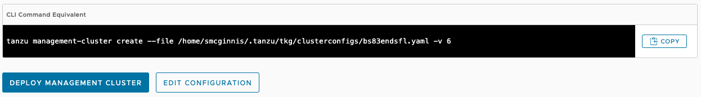

# TCE Headless Installation

Though the deployment of Tanzu Community Edition clusters can be done from any
machine, due to user preference or other constraints, performing the deployment
operations on a machine without a desktop environment may be required.

Our current (and recommended) installation method is to use the web based user
interface to perform new management cluster deployments. This is initiated with
the command:

```sh
tanzu management-cluster create --ui
```

This command will attempt to open a web browser pointed to the installation
wizard that steps through the various input needed to deploy a new management
cluster. If there is no desktop environment present, this command will give an
error message that it was unable to open a browser.

There are several ways to approach these "headless" installations. This
document provides a few suggestions for ways that are known to work well in the
past.

## Deployment Overview

Before going in to the various options for deploying in a headless environment,
it may help to have a basic understanding of what steps are necessary when
preparing a new management cluster deployment.

Ultimately, there are two main steps the user interface performs:

1. Collecting input in order to generate a cluster configuration YAML file
1. Passing that YAML file to the cluster create call to perform the deployment

In order to deploy from a headless machine, you will need to create this
configuration YAML file and call the `tanzu management-cluster create` command
using the file.

Here are a few different options to accomplish this task.

### Copy Generated File

The easiest option may be to run the cluster creation UI on a machine that does
have a desktop environment. You can then copy the generated YAML file from this
machine over to the headless machine to perform that actual deployment.

On the machine with a desktop environment, run the command line:

```sh
tanzu management-cluster create --ui
```

As in normal operations, that will launch a browser-based UI that will prompt
for the various configuration settings needed. Follow the wizard all the way
through to final "Confirm Settings" page if the wizard.

On this page you can review your settings and go back to make any additional
changes. If you scroll all the way down to the bottom of this page, there is a
box labeled "CLI Command Equivalent" that shows the command line that can be
used to perform the second step of kicking off the deployment.



Note the file path of the generated YAML file (the path is listed after the
`--file` argument). In this case, the file path is:

```sh
/home/smcginnis/.config/tanzu/tkg/clusterconfigs/bs83endsfl.yaml
```

Once you have the file path, you can copy that file over to your headless
machine. This can be done via a file share, thumb drive, or whatever means you
have at your disposal. Here is an example of using the SCP command to copy it
into the home directory on the headless machine:

```sh
scp /home/smcginnis/.config/tanzu/tkg/clusterconfigs/bs83endsfl.yaml ubuntu@deployment-vm:~/
```

Now the file is available on the headless machine to actually perform the
deployment. You can now run the command given at the end of the deployment UI
from the terminal on this machine, pointing to the file in your home directory:

```sh
tanzu management-cluster create --file ~/bs83endsfl.yaml -v 6
```

### Remote UI

Another option is to use the graphical UI to perform the installation, but
launched from the headless machine and run on your local machine with a desktop
environment.

In order to operate the UI in this scenario, we need to forward the local web
server port that the browser would normally connect to through to our desktop
machine using SSH port tunneling. To do so, first connect to your machine using
the `-L` argument for local port forwarding with a command similar to:

```sh
ssh -L 127.0.0.1:8080:127.0.0.1:8080 ubuntu@deployment-vm
```

This tells SSH to forward your localhost port 8080 to localhost:8080 on the
headless machine. With the port forwarding enabled, run this variation on the
management cluster creation command to launch the UI web server:

```sh
tanzu management-cluster create --ui --browser=none
```

The `--browser=none` argument tells the command to serve up the web interface,
but do not attempt to launch a browser instance to connect to it.

On your local desktop machine, you can now use your web browser to connect to
[http://localhost:8080](http://localhost:8080) and be forwarded through to the
tanzu command running on the headless machine.

In this scenario you can use the UI to complete the deployment completely, or
if you prefer, you can continue through to the "Confirm Settings" page and use
the provided CLI command at the end to run it in the terminal on the headless
machine.

To exit the kickstart UI once complete, press `Ctrl-C` in the terminal to exit
the command.
