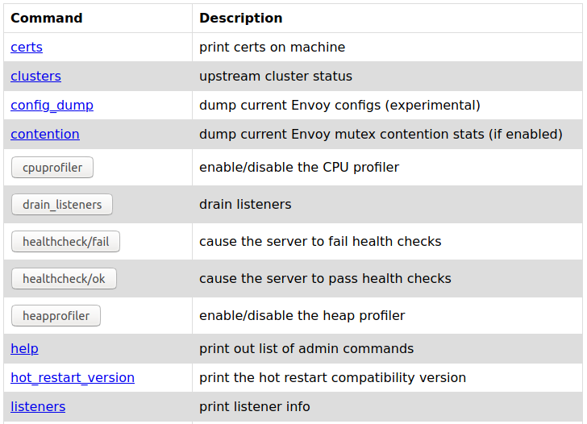
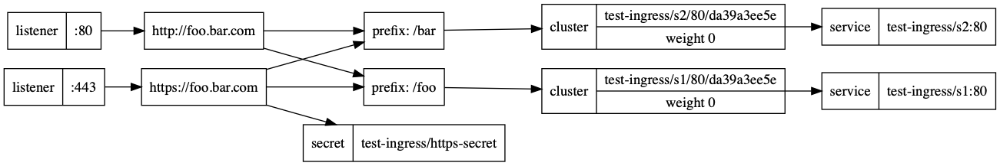

<!-- markdownlint-disable MD031 -->
<!-- TODO @randomvariable: Fix spacing to re-enable MD031 -->

# Implementing Ingress Control with Contour

Ingress control is a core concept in Kubernetes, that is implemented by a third party proxy. [Contour](https://projectcontour.io/) is a Kubernetes ingress controller that uses the [Envoy](https://www.envoyproxy.io/) edge and service proxy. Tanzu Kubernetes Grid includes signed binaries for Contour and Envoy, that you can deploy on Tanzu Kubernetes clusters to provide ingress control services on those clusters.

For general information about ingress control, see [Ingress Controllers](https://kubernetes.io/docs/concepts/services-networking/ingress-controllers/) in the Kubernetes documentation.

You deploy Contour and Envoy directly on Tanzu Kubernetes clusters. You do not need to deploy Contour on management clusters. Deploying Contour is a prerequisite if you want to deploy the Prometheus, Grafana, and Harbor extensions.

## <a id="prereqs"></a> Prerequisites

- Deploy a management cluster on vSphere, Amazon EC2, or Azure.
- You have downloaded and unpacked the bundle of Tanzu Kubernetes Grid extensions. For information about where to obtain the bundle, see [Download and Unpack the Tanzu Kubernetes Grid Extensions Bundle](index.md#unpack-bundle).
- You have installed the Carvel tools. For information about installing the Carvel tools, see [Install the Carvel Tools](../install-cli.md#install-carvel).

**IMPORTANT**:

- In this release of Tanzu Kubernetes Grid, the provided implementation of Contour and Envoy assumes that you use self-signed certificates. To configure Contour and Envoy with your own certificates, engage with VMware Tanzu support.
- Tanzu Kubernetes Grid does not support IPv6 addresses. This is because upstream Kubernetes only provides alpha support for IPv6. Always provide IPv4 addresses in the procedures in this section.
- The extensions  folder `tkg-extensions-v1.4.0+vmware.1
` contains subfolders for each type of extension, for example, `authentication`, `ingress`, `registry`, and so on. At the top level of the folder there is an additional subfolder named `extensions`. The `extensions` folder also contains subfolders for `authentication`, `ingress`, `registry`, and so on. Take care to run commands from the location provided in the instructions. Commands are usually run from within the `extensions` folder.

## <a id="prepare-tkc"></a> Prepare the Tanzu Kubernetes Cluster for Contour Deployment

Before you can deploy Contour on a Tanzu Kubernetes cluster, you must install the tools that the Contour extension requires.

This procedure applies to all clusters, running on vSphere, Amazon EC2, and Azure.

1. Create a cluster configuration YAML file for a workload cluster. For a cluster named `contour-test`, for example:

   ```
   INFRASTRUCTURE_PROVIDER: vsphere
   CLUSTER_NAME: contour-test
   CLUSTER_PLAN: dev
   ```

1. **vSphere**: To deploy the cluster to vSphere, add a line to the configuration file that sets `VSPHERE_CONTROL_PLANE_ENDPOINT` to a static virtual IP (VIP) address for the control plane of the Tanzu Kubernetes cluster. Ensure that this IP address is not in the DHCP range, but is in the same subnet as the DHCP range. If you mapped a fully qualified domain name (FQDN) to the VIP address, you can specify the FQDN instead of the VIP address. For example:

   ```
   VSPHERE_CONTROL_PLANE_ENDPOINT: 10.10.10.10
   ```

1. Deploy the cluster by passing the cluster configuration file to the `tanzu cluster create`:

   ```
   tanzu cluster create contour-test --file contour-test-config.yaml
   ```

1. In a terminal, navigate to the folder that contains the unpacked Tanzu Kubernetes Grid extension manifest files, `tkg-extensions-v1.4.0+vmware.1
/extensions`.

   ```
   cd <path>/tkg-extensions-v1.4.0+vmware.1
/extensions
   ```

   You should see folders for `authentication`, `ingress`, `logging`, `monitoring`, `registry`, and some YAML files. Run all of the commands in these procedures from this location.

1. Get the `admin` credentials of the Tanzu Kubernetes cluster on which to deploy Contour.

   ```
   tanzu cluster kubeconfig get contour-test --admin
   ```

1. Set the context of `kubectl` to the Tanzu Kubernetes cluster.

   ```
   kubectl config use-context contour-test-admin@contour-test
   ```

1. If you haven't already, install `cert-manager` on the Tanzu Kubernetes workload cluster by following the procedure in [Install Cert Manager on Workload Clusters](./index.md#cert-mgr
).

The cluster is ready for you to deploy the Contour service. For the next steps, see [Deploy Contour on the Tanzu Kubernetes Cluster](#deploy).

## <a id="deploy"></a> Deploy Contour on the Tanzu Kubernetes Cluster

After you have set up the cluster, you must create the configuration file that is used when you deploy Contour, create a Kubernetes secret, and then deploy Contour.

This procedure applies to all clusters, running on vSphere, Amazon EC2, and Azure.

1. Create a namespace for the Contour service on the Tanzu Kubernetes cluster.

    ```sh
    kubectl apply -f ingress/contour/namespace-role.yaml
    ```
    You should see confirmation that a `tanzu-system-ingress` namespace, service account, and RBAC role bindings are created.
    ```
    namespace/tanzu-system-ingress created
    serviceaccount/contour-extension-sa created
    role.rbac.authorization.k8s.io/contour-extension-role created
    rolebinding.rbac.authorization.k8s.io/contour-extension-rolebinding created
    clusterrole.rbac.authorization.k8s.io/contour-extension-cluster-role created
    clusterrolebinding.rbac.authorization.k8s.io/contour-extension-cluster-rolebinding created
    ```

1. Copy the relevant `contour-data-values` YAML example file into its directory and name it `contour-data-values.yaml`:

   **vSphere, installing Contour on a workload cluster with NSX Advanced Load Balancer (ALB):**

   ```
   cp ingress/contour/vsphere/contour-data-values-lb.yaml.example ingress/contour/vsphere/contour-data-values.yaml
   ```

   **vSphere, installing Contour on the shared services cluster, or on a workload cluster without NSX ALB:**

   ```
   cp ingress/contour/vsphere/contour-data-values.yaml.example ingress/contour/vsphere/contour-data-values.yaml
   ```

   **Amazon EC2**:

   ```
   cp ingress/contour/aws/contour-data-values.yaml.example ingress/contour/aws/contour-data-values.yaml
   ```

   **Azure**:

   ```
   cp ingress/contour/azure/contour-data-values.yaml.example ingress/contour/azure/contour-data-values.yaml
   ```

1. (Optional) Modify any values in `contour-data-values.yaml`. In most cases you do not need to modify `contour-data-values.yaml`, but the `ingress/contour/README.md` file in the extensions bundle directory lists non-default options that you may set.
   - For example, the Contour extension exposes Envoy as a `NodePort` type service by default, but also supports it as a `LoadBalancer` or `ClusterIP` service. You set this `envoy.service.type` value in `contour-data-values.yaml`.

1. Create a Kubernetes secret named `contour-data-values` with the values that you set in `contour-data-values.yaml`.

   **vSphere:**

   ```
   kubectl create secret generic contour-data-values --from-file=values.yaml=ingress/contour/vsphere/contour-data-values.yaml -n tanzu-system-ingress
   ```

   **Amazon EC2**:

   ```
   kubectl create secret generic contour-data-values --from-file=values.yaml=ingress/contour/aws/contour-data-values.yaml -n tanzu-system-ingress
   ```

   **Azure**:

   ```
   kubectl create secret generic contour-data-values --from-file=values.yaml=ingress/contour/azure/contour-data-values.yaml -n tanzu-system-ingress
   ```

   You should see the confirmation `secret/contour-data-values created`.

1. Deploy the Contour extension

   ```
   kubectl apply -f ingress/contour/contour-extension.yaml
   ```

   You should see the confirmation `extension.clusters.tmc.cloud.vmware.com/contour created`.

1. View the status of the Contour service itself.

    ```
    kubectl get app contour -n tanzu-system-ingress
    ```
    The status of the Contour app should show `Reconcile Succeeded` when Contour has deployed successfully.
    ```
    NAME      DESCRIPTION           SINCE-DEPLOY   AGE
    contour   Reconcile succeeded   15s            72s
    ```
1. If the status is not `Reconcile Succeeded`, view the full status details of the Contour service.

   Viewing the full status can help you to troubleshoot the problem.

   ```
   kubectl get app contour -n tanzu-system-ingress -o yaml
   ```

1. Check that the new services are running by listing all of the pods that are running in the cluster.

   ```
   kubectl get pods -A
   ```

   In the `tanzu-system-ingress` namespace, you should see the `contour` and `envoy` services running in a pod with names similar to `contour-55c56bd7b7-85gc2` and `envoy-tmxww`.

   ```
    NAMESPACE              NAME                                  READY   STATUS    RESTARTS   AGE
    [...]
    tanzu-system-ingress   contour-55c56bd7b7-85gc2              1/1     Running   0          6m37s
    tanzu-system-ingress   contour-55c56bd7b7-x4kv7              1/1     Running   0          6m37s
    tanzu-system-ingress   envoy-tmxww                           2/2     Running   0          6m38s
    ```
1. If you deployed Contour to Amazon EC2 or Azure, check that a load balancer has been created for the Envoy service.

   ```
   kubectl get svc envoy -n tanzu-system-ingress -o jsonpath='{.status.loadBalancer.ingress[0].hostname}'
   ```

   On Amazon EC2, the loadbalancer has a name similar to `aabaaad4dfc8e4a808a70a7cbf7d9249-1201421080.us-west-2.elb.amazonaws.com`. On Azure, it will be an IP address similar to `20.54.226.44`.

## <a id="envoy-interface"></a> Access the Envoy Administration Interface Remotely

After you have deployed Contour on a cluster, you can use the embedded Envoy administration interface to view data about your deployments.

For information about the Envoy administration interface, see [Administration interface](https://www.envoyproxy.io/docs/envoy/latest/operations/admin) in the Envoy documentation.

1. Obtain the name of the Envoy pod.

    ```sh
    ENVOY_POD=$(kubectl -n tanzu-system-ingress get pod -l app=envoy -o name | head -1)
    ```

1. Forward the Envoy pod to port 9001 on your local machine.

    ```sh
    kubectl -n tanzu-system-ingress port-forward $ENVOY_POD 9001
    ```

1. In a browser, navigate to [http://127.0.0.1:9001/](http://127.0.0.1:9001/).

   You should see the Envoy administration interface.

   
1. Click the links in the Envoy administration interface to see information about the operations in your cluster.

## <a id="contour-dag"></a> Visualize the Internal Contour Directed Acyclic Graph (DAG)

When you have started running workloads in your Tanzu Kubernetes cluster, you can visualize the traffic information that Contour exposes in the form of a directed acyclic graph (DAG).

1. Obtain a Contour pod.

    ```sh
    CONTOUR_POD=$(kubectl -n tanzu-system-ingress get pod -l app=contour -o name | head -1)
    ```

2. Forward port 6060 on the Contour pod.

    ```sh
    kubectl -n tanzu-system-ingress port-forward $CONTOUR_POD 6060
    ```

3. Open a new terminal window and download and store the DAG as a `*.png` file.

    This command requires you to install `dot` on your system, if it is not present already.

    ```sh
    curl localhost:6060/debug/dag | dot -T png > contour-dag.png
    ```

4. Open `contour-dag.png` to view the graph.

   

## <a id="configs"></a> Optional Configuration

In addition to the minimum configuration provided in the `contour-data-values.yaml` file for your logging endpoint, you can customize your configuration by adding values that you can copy from the file `tkg-extensions-v1.4.0+vmware.1
/ingress/contour/values.yaml`. Note that this file is not located in the `tkg-extensions-v1.4.0+vmware.1
/extensions/ingress/contour` folder, but in the `ingress` folder that is at the same level as the `extensions` folder.

You can also customize your Contour ingress setup using `ytt` overlays.
See [`ytt` Overlays and Example: External DNS Annotation](#ytt) below.

The table below contains information on the values you can copy from the `tkg-extensions-v1.4.0+vmware.1
/ingress/contour/values.yaml` file and how they can be used to modify the default behavior of Fluent Bit when deployed onto a Tanzu Kubernetes cluster.

**NOTE**: Where applicable, the settings that you configure in `contour-data-values.yaml` override any settings that you configure in `values.yaml`.

If you reconfigure your Fluent Bit settings after the initial deployment, you must follow the steps in [Update a Running Contour Deployment](#update) in order to apply the new configuration to the cluster.

| Parameter                                               | Type and Description                                                                                                   | Default                                                                                                                                                             |
| ------------------------------------------------------- | ---------------------------------------------------------------------------------------------------------------------- | ------------------------------------------------------------------------------------------------------------------------------------------------------------------- |
| `infrastructure_provider`                               | String. Infrastructure Provider: `vsphere`, `aws`, `azure`                                                             | Mandatory parameter                                                                                                                                                 |
| `contour.namespace`                                     | String. Namespace in which to deploy Contour.                                                                          | `tanzu-system-ingress`                                                                                                                                              |
| `contour.config.requestTimeout`                         | `time.Duration`. Client request timeout to pass to Envoy.                                                              | 0s                                                                                                                                                                  |
| `contour.config.tls.minimumProtocolVersion`             | String. Minimum TLS version that Contour will negotiate.                                                               | 1.1                                                                                                                                                                 |
| `contour.config.tls.fallbackCertificate.name`           | String. Name of the secret containing the fallback certificate for requests that do not match SNI defined for a vhost. | `null`                                                                                                                                                              |
| `contour.config.tls.fallbackCertificate.namespace`      | String. Namespace of the  secret containing the fallback certificate.                                                  | `null`                                                                                                                                                              |
| `contour.config.leaderelection.configmapName`           | String. Name of the `configmap` to use for Contour `leaderelection`.                                                   | `leader-elect`                                                                                                                                                      |
| `contour.config.leaderelection.configmapNamespace`      | String. Namespace of the contour `leaderelection` `configmap`.                                                         | `tanzu-system-ingress`                                                                                                                                              |
| `contour.config.disablePermitInsecure`                  | Boolean.  Disables `ingressroute permitInsecure` field.                                                                | `false`                                                                                                                                                             |
| `contour.config.accesslogFormat`                        | String. Access log format.                                                                                             | `envoy`                                                                                                                                                             |
| `contour.config.jsonFields`                             | Array of strings. Fields to log                                                                                        | See [https://godoc.org/github.com/projectcontour/contour/internal/envoy#JSONFields](https://godoc.org/github.com/projectcontour/contour/internal/envoy#JSONFields). |
| `contour.config.useProxyProtocol`                       | Boolean. See [https://projectcontour.io/guides/proxy-proto/](https://projectcontour.io/guides/proxy-proto/).           | `false`                                                                                                                                                             |
| `contour.config.defaultHTTPVersions`                    | Array of strings. HTTP versions that Contour should program Envoy to serve.                                            | "HTTP/1.1 HTTP2"                                                                                                                                                    |
| `contour.config.timeouts.requestTimeout`                | `time.Duration`. The timeout for an entire request.                                                                    | `null` (timeout is disabled)                                                                                                                                        |
| `contour.config.timeouts.connectionIdleTimeout`         | `time.Duration`. The time to wait before terminating an idle connection.                                               | 60s                                                                                                                                                                 |
| `contour.config.timeouts.streamIdleTimeout`             | `time.Duration`. The time to wait before terminating a request or stream with no activity.                             | 5m                                                                                                                                                                  |
| `contour.config.timeouts.maxConnectionDuration`         | `time.Duration`. The time to wait before terminating a connection irrespective of activity.                            | `null` (timeout is disabled)                                                                                                                                        |
| `contour.config.timeouts.ConnectionShutdownGracePeriod` | `time.Duration`. The time to wait between sending an initial and final `GOAWAY`.                                       | 5s                                                                                                                                                                  |
| `contour.config.debug`                                  | Boolean. Turn on Contour debugging.                                                                                    | `false`                                                                                                                                                             |
| `contour.config.ingressStatusAddress`                   | String. The address to set on status of every Ingress resource.                                                        | `null`                                                                                                                                                              |
| `contour.certificate.duration`                          | `time.Duration`. Duration of the Contour certificate.                                                                  | 8760h                                                                                                                                                               |
| `contour.certificate.renewBefore`                       | `time.Duration`. Time Contour certificate should be renewed.                                                           | 360h                                                                                                                                                                |
| `contour.deployment.replicas`                           | Integer. Number of Contour replicas.                                                                                   | 2                                                                                                                                                                   |
| `contour.image.repository`                              | String. Repository the containing Contour image.                                                                       | `projects.registry.vmware.com/tkg`                                                                                                                                  |
| `contour.image.name`                                    | String. Name of the Contour image.                                                                                     | `contour`                                                                                                                                                           |
| `contour.image.tag`                                     | String. Contour image tag.                                                                                             | `v1.8.1_vmware.1`                                                                                                                                                   |
| `contour.image.pullPolicy`                              | String. Contour image pull policy.                                                                                     | `IfNotPresent`                                                                                                                                                      |
| `envoy.image.repository`                                | String. Repository containing the Envoy image.                                                                         | `projects.registry.vmware.com/tkg`                                                                                                                                  |
| `envoy.image.name`                                      | String. Name of the Envoy image.                                                                                       | `envoy`                                                                                                                                                             |
| `envoy.image.tag`                                       | String. Envoy image tag.                                                                                               | `v1.15.0_vmware.1`                                                                                                                                                  |
| `envoy.image.pullPolicy`                                | String. Envoy image pull policy.                                                                                       | `IfNotPresent`                                                                                                                                                      |
| `envoy.hostPort.enable`                                 | Boolean. Flag to expose Envoy ports on host.                                                                           | `true`                                                                                                                                                              |
| `envoy.hostPort.http`                                   | Integer. Envoy HTTP host port.                                                                                         | 80                                                                                                                                                                  |
| `envoy.hostPort.https`                                  | Integer. Envoy HTTPS host port.                                                                                        | 443                                                                                                                                                                 |
| `envoy.service.type`                                    | String. Type of service to expose to Envoy: `ClusterIP`, `NodePort`, `LoadBalancer`                                    | `vsphere: NodePort` `AWS: LoadBalancer` `Azure: LoadBalancer`                                                                                                       |
| `envoy.service.externalTrafficPolicy`                   | String. External traffic policy for Envoy service: `Local`, `Cluster`                                                  | `Cluster`                                                                                                                                                           |
| `envoy.service.nodePort.http`                           | Integer. Desired `nodePort` for service of type `NodePort` used for HTTP requests.                                     | `null` - Kubernetes assigns a dynamic node port                                                                                                                     |
| `envoy.service.nodePort.https`                          | Integer. Desired `nodePort` for service of type `NodePort` used for HTTPS requests.                                    | `null` - Kubernetes assigns a dynamic node port                                                                                                                     |
| `envoy.deployment.hostNetwork`                          | Boolean. Run Envoy on `hostNetwork`                                                                                    | `false`                                                                                                                                                             |
| `envoy.service.aws.LBType`                              | String. AWS load balancer type to be used to expose the Envoy service: `classic`, `nlb`                                | classic                                                                                                                                                             |
| `envoy.loglevel`                                        | String. Log level to use for Envoy.                                                                                    | `info`                                                                                                                                                              |

### <a id="ytt"></a> `ytt` Overlays and Example: External DNS Annotation

In addition to modifying `contour-data-values.yaml`, you can use `ytt` overlays to configure your Contour setup as described in [Extensions and Shared Services](../ytt.md#extensions) in _Customizing Clusters, Plans, and Extensions with ytt Overlays_ and in the extensions mods examples in the [TKG Lab repository](https://github.com/Tanzu-Solutions-Engineering/tkg-lab).

One TKG Lab example, [Setup DNS for Wildcard Domain Contour Ingress](https://github.com/Tanzu-Solutions-Engineering/tkg-lab/blob/main/docs/mgmt-cluster/06_contour_mgmt.md#setup-dns-for-wildcard-domain-contour-ingress), adds a wildcard annotation to Contour for External DNS.
The example procedure does this by running a script [`generate-and-apply-external-dns-yaml.sh`](https://github.com/Tanzu-Solutions-Engineering/tkg-lab/blob/main/scripts/generate-and-apply-external-dns-yaml.sh) that sets up the configuration files used to deploy the External DNS and Contour extensions.
To customize the Contour extension, the script applies two `ytt` overlay files:

- [`contour-overlay.yaml`](https://github.com/Tanzu-Solutions-Engineering/tkg-lab/blob/main/tkg-extensions-mods-examples/ingress/contour/contour-overlay.yaml) adds `external-dns` annotation metadata to Contour's Envoy service
- [`contour-extension-overlay.yaml`](https://github.com/Tanzu-Solutions-Engineering/tkg-lab/blob/main/tkg-extensions-mods-examples/ingress/contour/contour-extension-overlay.yaml) directs the Contour extension to always deploy the Contour app and Envoy service with `contour-overlay.yaml`

See the TKG Lab repository and its [Step by Step setup guide](https://github.com/Tanzu-Solutions-Engineering/tkg-lab/blob/main/docs/baseline-lab-setup/step-by-step.md) for more examples.

## <a id="update"></a> Update a Contour Deployment

If you need to make changes to the configuration of the Contour extension, you can update the extension.

Perform the steps in this procedure if you modify either of the `extensions/ingress/contour/<INFRA_PROVIDER>/contour-data-values.yaml` or  `ingress/contour/values.yaml` files after the initial deployment of Contour.

1. Obtain the Contour data values from the Kubernetes secret.

    ```sh
    kubectl get secret contour-data-values -n tanzu-system-ingress -o 'go-template={{ index .data "values.yaml" }}' | base64 -d > contour-data-values.yaml
    ```
1. Modify either or both of the `extensions/ingress/contour/<INFRA_PROVIDER>/contour-data-values.yaml` or  `ingress/contour/values.yaml` files to update your configuration.
1. Update the Kubernetes secret.

   This command assumes that you are running it from `tkg-extensions-v1.4.0+vmware.1
/extensions`.

   **vSphere**:
   ```sh
   kubectl create secret generic contour-data-values --from-file=values.yaml=ingress/contour/vsphere/contour-data-values.yaml -n tanzu-system-ingress -o yaml --dry-run | kubectl replace -f-
   ```

   **Amazon EC2**:
   ```sh
   kubectl create secret generic contour-data-values --from-file=values.yaml=ingress/contour/aws/contour-data-values.yaml -n tanzu-system-ingress -o yaml --dry-run | kubectl replace -f-
   ```

   **Azure**:
   ```sh
   kubectl create secret generic contour-data-values --from-file=values.yaml=ingress/contour/azure/contour-data-values.yaml -n tanzu-system-ingress -o yaml --dry-run | kubectl replace -f-
   ```

   Note that the final `-` on the `kubectl replace` command above is necessary to instruct `kubectl` to accept the input being piped to it from the `kubectl create secret` command.

   The Contour extension will be reconciled using the new values you just added. The changes should show up in five minutes or less. This is handled by the Kapp controller, which synchronizes every five minutes.
