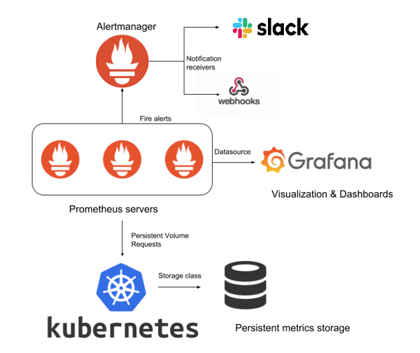

# Implementing Monitoring with Prometheus and Grafana

Tanzu Kubernetes Grid provides cluster monitoring services by implementing the open source Prometheus and Grafana projects.

- Prometheus is an open source systems monitoring and alerting toolkit. It can collect metrics from target clusters at specified intervals, evaluate rule expressions, display the results, and trigger alerts if certain conditions arise. For more information about Prometheus, see the [Prometheus Overview](https://www.prometheus.io/docs/introduction/overview/). The Tanzu Kubernetes Grid implementation of Prometheus includes Alert Manager, which you can configure to notify you when certain events occur.
- Grafana is open source visualization and analytics software. It allows you to query, visualize, alert on, and explore your metrics no matter where they are stored. In other words, Grafana provides you with tools to turn your time-series database (TSDB) data into high-quality graphs and visualizations. For more information about Grafana, see [What is Grafana?](https://grafana.com/docs/grafana/latest/getting-started/#what-is-grafana).

You deploy Prometheus and Grafana on Tanzu Kubernetes clusters. The following diagram shows how the monitoring components on a cluster interact.

For instructions on how to deploy Prometheus and Grafana on your clusters, see:

- [Deploy Prometheus on Tanzu Kubernetes Clusters](prometheus.md)
- [Deploy Grafana on Tanzu Kubernetes Clusters](grafana.md)
