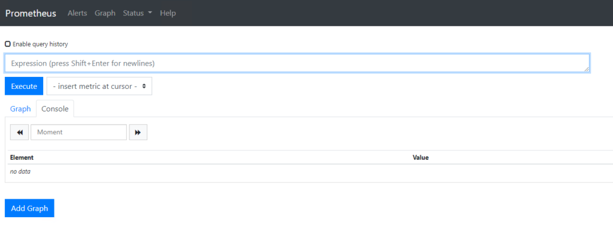

<!-- markdownlint-disable MD031 -->
<!-- TODO @randomvariable: Fix spacing to re-enable MD031 -->

# Deploy Prometheus on Tanzu Kubernetes Clusters

Tanzu Kubernetes Grid includes signed binaries for Prometheus, an open-source systems monitoring and alerting toolkit. You can deploy Prometheus on Tanzu Kubernetes clusters to monitor services in your clusters.

## <a id="prereqs"></a> Prerequisites

Before you begin this procedure, you must have:

- Downloaded and unpacked the bundle of Tanzu Kubernetes Grid extensions. For information on how to obtain the bundle, see [Download and Unpack the Tanzu Kubernetes Grid Extensions Bundle](index.md#unpack-bundle).
- Installed the Carvel tools. For information about installing the Carvel tools, see [Install the Carvel Tools](../install-cli.md#install-carvel).
- Deployed a Tanzu Kubernetes Grid management cluster on vSphere, Amazon EC2, or Azure.
- Deployed a Tanzu Kubernetes cluster. The examples in this topic use a cluster named `monitoring-cluster`.

**IMPORTANT**:

- Tanzu Kubernetes Grid does not support IPv6 addresses because upstream Kubernetes only provides alpha support for IPv6. In the following procedures, you must always provide IPv4 addresses.
- The extensions  folder `tkg-extensions-v1.4.0+vmware.1
` contains subfolders for each type of extension, for example, `authentication`, `ingress`, `registry`, and so on. At the top level of the folder there is an additional subfolder named `extensions`. The `extensions` folder also contains subfolders for `authentication`, `ingress`, `registry`, and so on. Take care to run commands from the location provided in the instructions. Commands are usually run from within the `extensions` folder.

## <a id="prepare-tkc"></a> Prepare the Tanzu Kubernetes Cluster for Prometheus Deployment

Before you can deploy Prometheus on a Tanzu Kubernetes cluster, you must install the tools that the Prometheus extension requires.

This procedure applies to Tanzu Kubernetes clusters running on vSphere, Amazon EC2, and Azure.

1. In a terminal, navigate to the folder that contains the unpacked Tanzu Kubernetes Grid extension manifest files, `tkg-extensions-v1.4.0+vmware.1
/extensions`.

   ```
   cd <path>/tkg-extensions-v1.4.0+vmware.1
/extensions
   ```

   You should see subfolders named `authentication`, `ingress`, `logging`, `monitoring`, `registry`, and some YAML files. Run all of the commands in these procedures from this location.

1. Retrieve the `admin` credentials of the cluster.

   ```sh
   tanzu cluster kubeconfig get monitoring-cluster --admin
   ```

1. Set the context of `kubectl` to the cluster.

   ```
   kubectl config use-context monitoring-cluster-admin@monitoring-cluster
   ```

1. If you haven't already, install `cert-manager` on the Tanzu Kubernetes workload cluster by following the procedure in [Install Cert Manager on Workload Clusters](./index.md#cert-mgr
).

1. Create a namespace for the Prometheus service on the Tanzu Kubernetes cluster.

    ```sh
    kubectl apply -f monitoring/prometheus/namespace-role.yaml
    ```
    You should see confirmation that a `tanzu-system-monitoring` namespace, service account, and RBAC role bindings have been created.

    ```
    namespace/tanzu-system-monitoring created
    serviceaccount/prometheus-extension-sa created
    role.rbac.authorization.k8s.io/prometheus-extension-role created
    rolebinding.rbac.authorization.k8s.io/prometheus-extension-rolebinding created
    clusterrole.rbac.authorization.k8s.io/prometheus-extension-cluster-role created
    clusterrolebinding.rbac.authorization.k8s.io/prometheus-extension-cluster-rolebinding created
    ```

When all pods are ready, the Tanzu Kubernetes cluster is ready for you to deploy the Prometheus extension. To do so, follow the procedure in [Prepare the Prometheus Configuration Files](#config).

## <a id="config"></a> Prepare the Prometheus Extension Configuration File

This procedure describes how to prepare the Prometheus extension configuration file for a Tanzu Kubernetes cluster. This configuration file applies to Tanzu Kubernetes clusters running on vSphere, Amazon EC2, and Azure and is required to deploy the Prometheus extension.

For additional configuration options, you can use `ytt` overlays as described in [Extensions and Shared Services](../ytt.md#extensions) in _Customizing Clusters, Plans, and Extensions with ytt Overlays_ and in the extensions mods examples in the [TKG Lab repository](https://github.com/Tanzu-Solutions-Engineering/tkg-lab).

1. Make a copy of the `prometheus-data-values.yaml.example` file and name it `prometheus-data-values.yaml`.

   ```sh
   cp monitoring/prometheus/prometheus-data-values.yaml.example monitoring/prometheus/prometheus-data-values.yaml
   ```

   After you have renamed the file, you do not need to modify it. The `prometheus-data-values.yaml` file only designates whether you are deploying to a cluster that is running on vSphere, Amazon EC2, or Azure.

1. You can now either deploy the Prometheus extension with default values, or you can customize the deployment.

   - To deploy Prometheus using default configuration values, proceed directly to [Deploy Prometheus on the Tanzu Kubernetes Cluster](#deploy). The default values for configuration parameters are listed in the table in [Customize Your Prometheus Deployment](#customize).

   - To customize your Prometheus deployment, see [Customize Your Prometheus Deployment](#customize). For example, you can customize how often Prometheus scrapes the cluster for data or configure how notifications and alerts are sent via Slack and email.

## <a id="customize"></a> Customize Your Prometheus Deployment

In addition to the minimum configuration provided in the `prometheus-data-values.yaml` file, you can customize your configuration by adding values that you can copy from the file `tkg-extensions-v1.4.0+vmware.1
/monitoring/prometheus/values.yaml` into `prometheus-data-values.yaml`.
Note that this file is not located in the `tkg-extensions-v1.4.0+vmware.1
/extensions/monitoring/prometheus` folder but in the `monitoring` folder that is at the same level as the `extensions` folder.

If you modify the `values.yaml` file _before_ you deploy the Prometheus extension, then the custom settings take effect immediately upon deployment. For instructions, see [Deploy Prometheus on the Tanzu Kubernetes Cluster](#deploy).

If you modify the `values.yaml` file _after_ you deploy the Prometheus extension, then you must update your running deployment. For instructions,
see [Update a Running Prometheus Deployment](#update).

<a id="config-table"></a> **Prometheus Extension Configuration Parameters**

The following table lists configuration parameters of the Prometheus extension and describes their default values. To customize Prometheus, specify the parameters and their custom values in the `extensions/monitoring/grafana/<platform>/prometheus-data-values.yaml` file of your Tanzu Kubernetes cluster.

| Parameter                                                   | Type and Description                                                                                                                                             | Default                                                         |
| ----------------------------------------------------------- | ---------------------------------------------------------------------------------------------------------------------------------------------------------------- | --------------------------------------------------------------- |
| `monitoring.namespace`                                      | String. Namespace where Prometheus is deployed.                                                                                                                  | `tanzu-system-monitoring`                                       |
| `monitoring.create_namespace`                               | Boolean. The flag indicates whether to create the namespace specified by `monitoring.namespace`.                                                                 | `false`                                                         |
| `onitoring.prometheus_server.config.alerting_rules_yaml`    | YAML file. Detailed alert rules defined in Prometheus.                                                                                                           | `alerting_rules.yaml`                                           |
| `monitoring.prometheus_server.config.recording_rules_yaml`  | YAML file. Detailed record rules defined in Prometheus.                                                                                                          | `recording_rules.yaml`                                          |
| `monitoring.prometheus_server.service.type`                 | String. Type of service to expose Prometheus. Supported value: `ClusterIP`.                                                                                      | `ClusterIP`                                                     |
| `monitoring.prometheus_server.enable_alerts.kubernetes_api` | Boolean. Enable SLO alerting for the Kubernetes API in Prometheus.                                                                                               | `true`                                                          |
| `monitoring.prometheus_server.sc.sc_enabled`                | Boolean. Define if `StorageClass` is enabled in the deployment.                                                                                                  | `false`                                                         |
| `monitoring.prometheus_server.sc.is_default`                | Boolean. Define if current `StorageClass` is the default `StorageClass`.                                                                                         | `false`                                                         |
| `monitoring.prometheus_server.sc.vsphereDatastoreurl`       | String. Datastore URL for `StorageClass` used in vCenter.                                                                                                        | `"xxx-xxx-xxxx"`                                                |
| `monitoring.prometheus_server.sc.aws_type`                  | String. AWS type defined for `StorageClass` on AWS.                                                                                                              | `gp2`                                                           |
| `monitoring.prometheus_server.sc.aws_fsType`                | String. AWS file system type defined for `StorageClass` on AWS.                                                                                                  | `ext4`                                                          |
| `monitoring.prometheus_server.sc.allowVolumeExpansion`      | Boolean. Define if volume expansion allowed for `StorageClass` on AWS.                                                                                           | `true`                                                          |
| `monitoring.prometheus_server.pvc.annotations`              | Map. Storage class annotations.                                                                                                                                  | `{}`                                                            |
| `monitoring.prometheus_server.pvc.storage_class`            | String. Storage class to use for Persistent Volume Claim. By default, this is null and the default provisioner is used.                                          | `null`                                                          |
| `monitoring.prometheus_server.pvc.accessMode`               | String. Define access mode for Persistent Volume Claim: `ReadWriteOnce`, `ReadOnlyMany`, `ReadWriteMany`.                                                        | `ReadWriteOnce`                                                 |
| `monitoring.prometheus_server.pvc.storage`                  | String. Define storage size for Persistent Volume Claim.                                                                                                         | `8Gi`                                                           |
| `monitoring.prometheus_server.deployment.replicas`          | Integer. Number of Prometheus replicas.                                                                                                                          | `1`                                                             |
| `monitoring.prometheus_server.image.repository`             | String. Repository containing the Prometheus image.                                                                                                              | `projects.registry.vmware.com/tkg/prometheus`                   |
| `monitoring.prometheus_server.image.name`                   | String. Name of the Prometheus image.                                                                                                                            | `prometheus`                                                    |
| `monitoring.prometheus_server.image.tag`                    | String. Image tag for the Prometheus image.                                                                                                                      | `v2.17.1_vmware.1`                                              |
| `monitoring.prometheus_server.image.pullPolicy`             | String. The image pull policy for the Prometheus image.                                                                                                          | `IfNotPresent`                                                  |
| `monitoring.alertmanager.config.slack_demo`                 | String. Slack notification configuration for Alert Manager.                                                                                                      | See [Slack configuration example](#slack-config-example) below  |
| `monitoring.alertmanager.config.email_receiver`             | String. Email notification configuration for Alert Manager.                                                                                                      | See [e-mail configuration example](#email-config-example) below |
| `monitoring.alertmanager.service.type`                      | String. Type of service to expose Alert Manager. Supported values: `ClusterIP`.                                                                                  | `ClusterIP`                                                     |
| `monitoring.alertmanager.image.repository`                  | String. Repository containing the Alert Manager image.                                                                                                           | `projects.registry.vmware.com/tkg/prometheus`                   |
| `monitoring.alertmanager.image.name`                        | String. Name of the Alert Manager image.                                                                                                                         | `alertmanager`                                                  |
| `monitoring.alertmanager.image.tag`                         | String. Image tag for the Alert Manager image.                                                                                                                   | `v0.20.0_vmware.1`                                              |
| `monitoring.alertmanager.image.pullPolicy`                  | String. The image pull policy for the Alert Manager image.                                                                                                       | `IfNotPresent`                                                  |
| `monitoring.alertmanager.pvc.annotations`                   | Map. `StorageClass` annotations.                                                                                                                                 | `{}`                                                            |
| `monitoring.alertmanager.pvc.storage_class`                 | String. `StorageClass` to use for Persistent Volume Claim. By default, this is null and the default provisioner is used.                                         | `null`                                                          |
| `monitoring.alertmanager.pvc.accessMode`                    | String. Define access mode for Persistent Volume Claim: `ReadWriteOnce`, `ReadOnlyMany`, `ReadWriteMany`.                                                        | `ReadWriteOnce`                                                 |
| `monitoring.alertmanager.pvc.storage`                       | String. Define storage size for Persistent Volume Claim.                                                                                                         | `2Gi`                                                           |
| `monitoring.alertmanager.deployment.replicas`               | Integer. Number of Alert Manager replicas.                                                                                                                       | `1`                                                             |
| `monitoring.kube_state_metrics.image.repository`            | String. Repository containing `kube-state-metrics` image.                                                                                                        | `projects.registry.vmware.com/tkg/prometheus`                   |
| `monitoring.kube_state_metrics.image.name`                  | String. Name of the `kube-state-metrics` image.                                                                                                                  | `kube-state-metrics`                                            |
| `monitoring.kube_state_metrics.image.tag`                   | String. Image tag for the `kube-state-metrics` image.                                                                                                            | `v1.9.5_vmware.1`                                               |
| `monitoring.kube_state_metrics.image.pullPolicy`            | String. The image pull policy for the `kube-state-metrics` image.                                                                                                | `IfNotPresent`                                                  |
| `monitoring.kube_state_metrics.deployment.replicas`         | Integer. Number of `kube-state-metrics` replicas.                                                                                                                | `1`                                                             |
| `monitoring.node_exporter.image.repository`                 | String. Repository containing the `node-exporter` image.                                                                                                         | `projects.registry.vmware.com/tkg/prometheus`                   |
| `monitoring.node_exporter.image.name`                       | String. Name of the `node-exporter` image.                                                                                                                       | `node-exporter`                                                 |
| `monitoring.node_exporter.image.tag`                        | String. Image tag for the `node-exporter` image.                                                                                                                 | `v0.18.1_vmware.1`                                              |
| `monitoring.node_exporter.image.pullPolicy`                 | String. The image pull policy for the `node-exporter` image.                                                                                                     | `IfNotPresent`                                                  |
| `monitoring.node_exporter.deployment.replicas`              | Integer. Number of `node-exporter` replicas.                                                                                                                     | `1`                                                             |
| `monitoring.pushgateway.image.repository`                   | String. Repository containing the `pushgateway` image.                                                                                                           | `projects.registry.vmware.com/tkg/prometheus`                   |
| `monitoring.pushgateway.image.name`                         | String. Name of the `pushgateway` image.                                                                                                                         | `pushgateway`                                                   |
| `monitoring.pushgateway.image.tag`                          | String. Image tag for the `pushgateway` image.                                                                                                                   | `v1.2.0_vmware.1`                                               |
| `monitoring.pushgateway.image.pullPolicy`                   | String. The image pull policy for the `pushgateway` image.                                                                                                       | `IfNotPresent`                                                  |
| `monitoring.pushgateway.deployment.replicas`                | Integer. Number of `pushgateway` replicas.                                                                                                                       | `1`                                                             |
| `monitoring.cadvisor.image.repository`                      | String. Repository containing cadvisor image.                                                                                                                    | `projects.registry.vmware.com/tkg/prometheus`                   |
| `monitoring.cadvisor.image.name`                            | String. Name of the `cadvisor` image.                                                                                                                            | `cadvisor`                                                      |
| `monitoring.cadvisor.image.tag`                             | String. Image tag for the `cadvisor` image.                                                                                                                      | `v0.36.0_vmware.1`                                              |
| `monitoring.cadvisor.image.pullPolicy`                      | String. The image pull policy for the `cadvisor` image.                                                                                                          | `IfNotPresent`                                                  |
| `monitoring.cadvisor.deployment.replicas`                   | Integer. Number of `cadvisor` replicas.                                                                                                                          | `1`                                                             |
| `monitoring.ingress.enabled`                                | Boolean. Enable/disable ingress for Prometheus and Alert Manager.                                                                                                | `false`                                                         |
| `monitoring.ingress.virtual_host_fqdn`                      | String. Hostname for accessing Promethues and Alert Manager.                                                                                                     | `prometheus.system.tanzu`                                       |
| `monitoring.ingress.prometheus_prefix`                      | String. Path prefix for Prometheus.                                                                                                                              | `/`                                                             |
| `monitoring.ingress.alertmanager_prefix`                    | String. Path prefix for Alert Manager.                                                                                                                           | `/alertmanager/`                                                |
| `monitoring.ingress.tlsCertificate.tls.crt`                 | String. Optional certificate for ingress when using your own TLS certificate (a self-signed certificate is generated by default).                                | Generated certificate                                           |
| `monitoring.ingress.tlsCertificate.tls.key`                 | String. Optional certificate private key for ingress when using your own TLS certificate (a private key from a self-signed certificate is generated by default). | Generated cert key                                              |

<a id="slack-config-example"></a> **Slack Configuration Example**

To configure Slack notifications in Alert Manager, you can use the following YAML as an example configuration:

```yaml
slack_demo:
  name: slack_demo
  slack_configs:
  - api_url: https://hooks.slack.com
    channel: '#alertmanager-test'
```

<a id="email-config-example"></a> **Email Configuration Example**

The YAML below provides an example of how to configure email notifications in Alert Manager.

```yaml
email_receiver:
  name: email-receiver
  email_configs:
  - to: demo@tanzu.com
    send_resolved: false
    from: from-email@tanzu.com
    smarthost: smtp.example.com:25
    require_tls: false
```

## <a id="deploy"></a> Deploy Prometheus on a Tanzu Kubernetes Cluster

After you have prepared a Tanzu Kubernetes cluster, you can deploy the Prometheus extension on the cluster. As part of the preparation, you have updated the appropriate configuration file for your platform and optionally customized your deployment.

This procedure applies to Tanzu Kubernetes clusters running on vSphere, Amazon EC2, and Azure.

1. Create a Kubernetes secret named `prometheus-data-values` with the values that you set in `monitoring/prometheus/prometheus-data-values.yaml`.

   ```
   kubectl create secret generic prometheus-data-values --from-file=values.yaml=monitoring/prometheus/prometheus-data-values.yaml -n tanzu-system-monitoring
   ```

1. Deploy the Prometheus extension.

    ```sh
    kubectl apply -f monitoring/prometheus/prometheus-extension.yaml
    ```

    You should see a confirmation that `extensions.clusters.tmc.cloud.vmware.com/prometheus` has been created.

2. The extension takes several minutes to deploy. To check the status of the deployment, use the `kubectl get extension` and the `kubectl get app` commands.

    ```sh
    kubectl get app prometheus -n tanzu-system-monitoring
    ```

    While the extension is being deployed, the "Description" field from the `kubectl get app` command shows a status of `Reconciling`. After Prometheus is deployed successfully, the status of the Prometheus app shown by the `kubectl get app` command changes to `Reconcile succeeded`.

    You can view detailed status information with this command:

    ```sh
    kubectl get app prometheus -n tanzu-system-monitoring -o yaml
    ```

## <a id="update"></a> Update a Running Prometheus Deployment

Use this procedure to update the configuration of an already deployed Prometheus extension.

1. Using the information in [Customize Your Prometheus Deployment](#customize) as a reference, make the necessary changes to the `tkg-extensions-v1.4.0+vmware.1
/monitoring/prometheus/values.yaml` file. For example, if you need to change the number of Prometheus replicas from the default value of one, then you add this configuration to the `values.yaml` file:

    ```yaml
    monitoring:
      prometheus_server:
        deployment:
          replicas: 2
    ```

    After you have made all applicable changes, save the file.

1. Update the Kubernetes secret.

   This command assumes that you are running it from `tkg-extensions-v1.4.0+vmware.1
/extensions`.

   ```sh
   kubectl create secret generic prometheus-data-values --from-file=values.yaml=monitoring/prometheus/prometheus-data-values.yaml -n tanzu-system-monitoring -o yaml --dry-run=client | kubectl replace -f -
    ```

    Note that the final `-` on the `kubectl replace` command above is necessary to instruct `kubectl` to accept the input being piped to it from the `kubectl create secret` command.

   The Prometheus extension is reconciled using the new values that you just added. The changes should show up in five minutes or less. Updates are handled by the Kapp controller, which synchronizes every five minutes.

## <a id="dashboard"></a> Access the Prometheus Dashboard

By default, ingress is not enabled on Prometheus. This is because access to the Prometheus dashboard is not authenticated. If you want to access the Prometheus dashboard, you must perform the following steps.

1. Deploy Contour on the cluster.

   For information about deploying Contour, see [Implement Ingress control with Contour](ingress-contour.md).

1. Copy the `monitoring.ingress.enabled` section from `tkg-extensions-v1.4.0+vmware.1
/monitoring/prometheus/values.yaml` into `prometheus-data-values.yaml`.

   Copy the section into the position shown in this example.

    ```
    #@data/values
    #@overlay/match-child-defaults missing_ok=True
    ---
    infrastructure_provider: "vsphere"
    monitoring:
      ingress:
        enabled: false
        virtual_host_fqdn: "prometheus.corp.tanzu"
        prometheus_prefix: "/"
        alertmanager_prefix: "/alertmanager/"
    ```

1. Update `monitoring.ingress.enabled` from `false` to `true`.
1. Create a DNS record to map `prometheus.corp.tanzu` to the address of the Envoy load balancer.

   To obtain the address of the Envoy load balancer, see [Implement Ingress control with Contour](ingress-contour.md).
1. Access the Prometheus dashboard by navigating to <http://prometheus.corp.tanzu> in a browser.

   

## <a id="whatnext"></a> What to Do Next

The Prometheus extension is now running and scraping data from your cluster. To visualize the data in Grafana dashboards, see [Deploy Grafana on Tanzu Kubernetes Clusters](grafana.md).

If you need to remove the Prometheus extension on your cluster, see [Delete Tanzu Kubernetes Grid Extensions](delete-extensions#observability).
