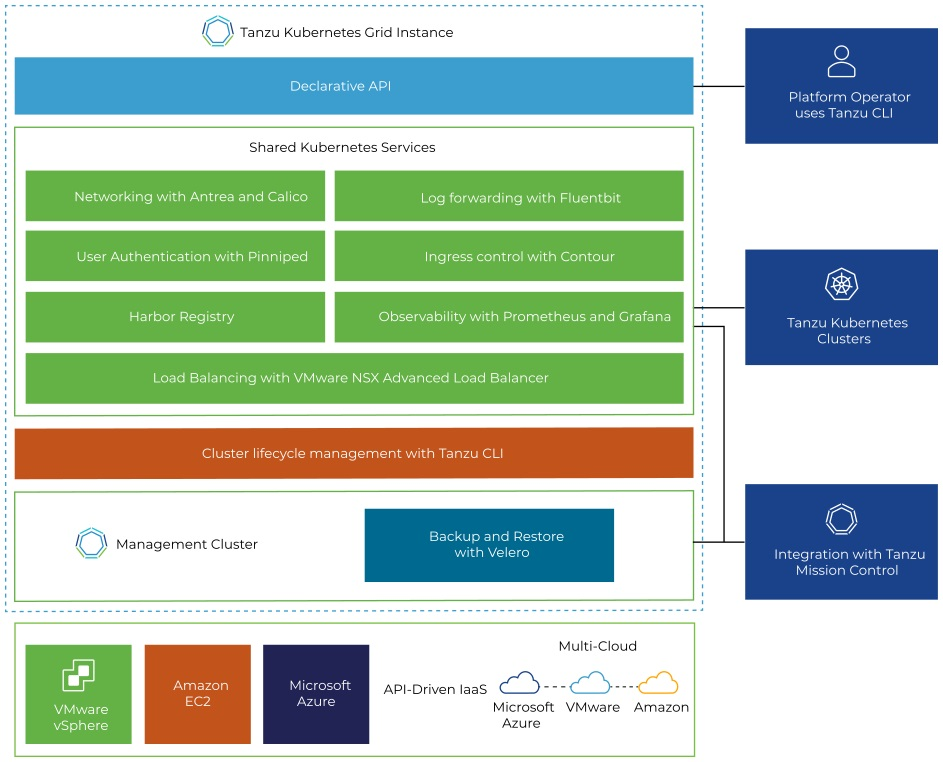

# VMware Tanzu Kubernetes Grid 1.4 Documentation

VMware Tanzu Kubernetes Grid provides organizations with a consistent, upstream-compatible, regional Kubernetes substrate that is ready for end-user workloads and ecosystem integrations. You can deploy Tanzu Kubernetes Grid across software-defined datacenters (SDDC) and public cloud environments, including vSphere, Microsoft Azure, and Amazon EC2.

##  Tanzu Kubernetes Grid Architecture

Tanzu Kubernetes Grid allows you to run Kubernetes with consistency and make it available to your developers as a utility, just like the electricity grid. Tanzu Kubernetes Grid has a native awareness of the multi-cluster paradigm, not just for clusters, but also for the services that your clusters share.

Tanzu Kubernetes Grid builds on trusted upstream and community projects and delivers a Kubernetes platform that is engineered and supported by VMware, so that you do not have to build your Kubernetes environment by yourself. In addition to Kubernetes binaries that are tested, signed, and supported by VMware, Tanzu Kubernetes Grid provides the services such as networking, authentication, ingress control, and logging that a production Kubernetes environment requires.

For more information about the key components of Tanzu Kubernetes Grid, how you use them, and what they do, see [Tanzu Kubernetes Grid Concepts](tkg-concepts.md).

##  Use the Tanzu Kubernetes Grid Documentation

The documentation for Tanzu Kubernetes Grid provides information about how to install, configure, and use Tanzu Kubernetes Grid. This documentation applies to all 1.4.x releases.

- [Tanzu Kubernetes Grid Concepts](tkg-concepts.md) introduces the main components of Tanzu Kubernetes Grid.
- [Install the Tanzu CLI and Other Tools](install-cli.md) describes the prerequisites for installing Tanzu Kubernetes Grid, how to install the Tanzu CLI.
- [Deploying Management Clusters](mgmt-clusters/deploy-management-clusters.md) describes how to set up your environment for deployment of management clusters to vSphere, Azure, and Amazon EC2, how to deploy  management clusters to your chosen provider, and how to manage your management clusters after deployment.
- [Deploying Tanzu Kubernetes Clusters](tanzu-k8s-clusters/index.md) describes how to use the Tanzu CLI to deploy Tanzu Kubernetes clusters from your management clusters, and how to manage the lifecycle of those clusters.
- [Deploying and Managing Extensions and Shared Services](extensions/index.md) describes how to set up local shared services for your Tanzu Kubernetes clusters, such as authentication and authorization, logging, networking, and ingress control.
- [Building Cluster API Machine Images](build-images/index.md) describes how to build your own OS images to run in cluster nodes.
- [Upgrading Tanzu Kubernetes Grid](upgrade-tkg/index.md) describes how to upgrade your Tanzu Kubernetes Grid installation, and how to upgrade the management clusters and Tanzu Kubernetes clusters that you deployed with a previous version.
- [Troubleshooting Tips for Tanzu Kubernetes Grid](troubleshooting-tkg/tips.md) includes tips to help you to troubleshoot common problems that you might encounter when installing Tanzu Kubernetes Grid and deploying management clusters and Tanzu Kubernetes clusters. This section also describes how to use the [Crash Recovery and Diagnostics tool](troubleshooting-tkg/crashd.md).
- [Tanzu CLI Command Reference](tanzu-cli-reference.md) lists all of the commands and options of the Tanzu CLI, and provides links to the section in which they are documented.

##  Intended Audience

This information is intended for administrators who want to install Tanzu Kubernetes Grid and use it to create and manage Tanzu Kubernetes clusters and their associated resources. This information is also intended for application administrators and developers who want to use Tanzu Kubernetes Grid to deploy and manage modern apps in a Kubernetes architecture. The information is written for users who have a basic understanding of Kubernetes and are familiar with container deployment concepts. In-depth knowledge of Kubernetes is not required.
