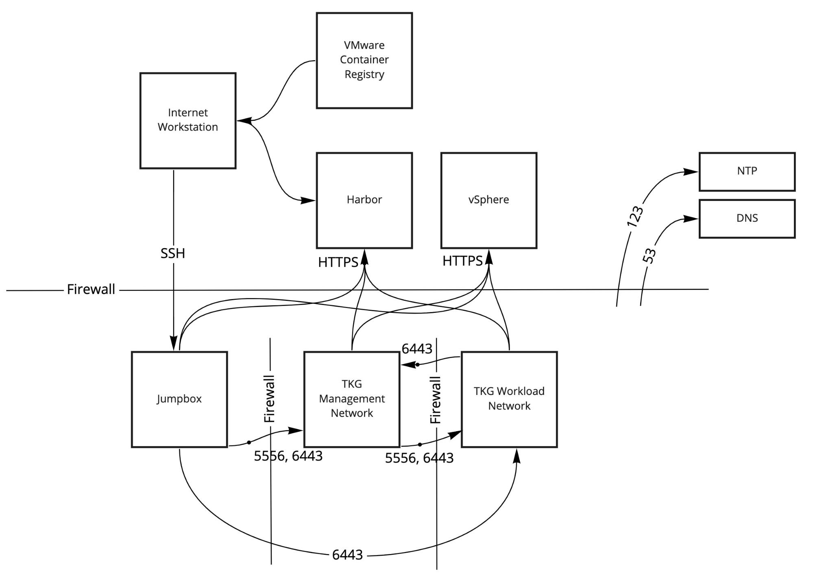

# Deploying Tanzu Kubernetes Grid in an Internet-Restricted Environment

You can deploy Tanzu Kubernetes Grid management clusters and Tanzu Kubernetes (workload) clusters in environments that are not connected to the Internet, such as:

- Proxied environments
- Airgapped environments, with no physical connection to the Internet

This topic explains how to deploy management clusters to internet-restricted environments on vSphere or AWS.

You do not need to perform these procedures if you are using Tanzu Kubernetes Grid in a connected environment that can pull images over an external Internet connection.

## <a id="prereqs"></a> General Prerequisites

Before you can deploy management clusters and Tanzu Kubernetes clusters in an Internet-restricted environment, you must have:

- A private Docker registry such as [Harbor](https://goharbor.io/), against which this procedure has been tested.
   - Install the Docker registry within your firewall (for vSphere).
   For information about how to install Harbor, see [Harbor Installation and Configuration](https://goharbor.io/docs/latest/install-config/).
   - You can configure the Docker registry with SSL certificates signed by a trusted CA, or with self-signed certificates.
   - The registry must not implement user authentication. For example, if you use a Harbor registry, the project must be public, and not private.
- (Optional) If needed, a USB key or other portable storage medium for bringing the private registry behind an airgap after it is populated with Tanzu Kubernetes Grid images.
- An Internet-connected Linux bootstrap machine that:
   - Can connect to your private Docker registry; for example, is inside your VPC.
   - Has the Docker client app installed.
   - Has the Tanzu CLI installed. See [Install the Tanzu CLI and Other Tools](../install-cli.md) to download, unpack, and install the Tanzu CLI binary on your Internet-connected system.
   - Has a version of [`yq`](https://github.com/mikefarah/yq#install) installed that is equal to or above v4.5.
   - If you intend to install one or more of the Tanzu Kubernetes Grid extensions, for example Harbor, the Carvel tools are installed. For more information, see [Install the Carvel Tools](../install-cli.md#install-carvel).

## <a id="vsphere"></a> vSphere Prerequisites and Architecture

On vSphere, in addition to the general prerequisites above, you must:

- Create an SSH key pair. See [Create an SSH Key Pair](vsphere.md#ssh-key) in _Deploy Management Clusters to vSphere_.
- Upload to vSphere the OVAs from which node VMs are created.  See [Import the Base Image Template into vSphere](vsphere.md#import-base-ova) in _Deploy Management Clusters to vSphere_.
- Add the rules listed in [Tanzu Kubernetes Grid Firewall Rules](../tkg-security.md#rules) to your firewall.

### <a id="vsphere-arch"></a> vSphere Architecture

An internet-restricted Tanzu Kubernetes Grid installation on vSphere has firewalls and communication between major components as shown here.



## <a id="aws"></a> Amazon EC2 Prerequisites and Architecture

For an Internet-restricted installation on Amazon EC2, in addition to the general prerequisites above, you also need:

- An Amazon EC2 VPC with no internet gateway ("offline VPC") configured as described below.
  - Your internet-connected bootstrap machine must be able to access IP addresses within this offline VPC.
- An Amazon S3 bucket.
- A Docker registry installed within your offline VPC, configured equivalently to the internet-connected registry above.
- A Linux bootstrap VM within your offline VPC, provisioned similarly to the internet-connected machine above.
- Before you deploy the offline management cluster, you must configure its load balancer with an internal scheme as described in [Step 5: Initialize Tanzu Kubernetes Grid](#init), below.

By default, deploying Tanzu Kubernetes Grid to Amazon EC2 creates a new, internet-connected VPC.
To deploy to an Internet-restricted environment, you must first create an offline VPC. For details, see the [Reuse a VPC and NAT gateway(s) that already exist in your availability zone(s)](aws.html#aws-vpc) instructions in the _Deploy Management Clusters to Amazon EC2_ topic.

After you create the offline VPC, you must add following endpoints to it:

   - Service endpoints:
     - `sts`
     - `ssm`
     - `ec2`
     - `ec2messages`
     - `elasticloadbalancing`
     - `secretsmanager`
     - `ssmmessages`
   - Gateway endpoint to your Amazon S3 storage bucket

To add the service endpoints to your VPC:

1. In the AWS console, browse to **VPC Dashboard** > **Endpoints**
1. For each of the above services
   1. Click **Create Endpoint**
   1. Search for the service and select it under **Service Name**
   1. Select your **VPC** and its **Subnets**
   1. **Enable DNS Name** for the endpoint
   1. Select a **Security group** that allows VMs in the VPC to access the endpoint
   1. Select **Policy** > **Full Access**
   1. Click **Create endpoint**

To add the Amazon S3 gateway endpoint to your VPC, follow the instructions in
[Endpoints for Amazon S3](https://docs.aws.amazon.com/vpc/latest/userguide/vpce-gateway.html) in the AWS documentation.

  - When an offline VPC has an S3 endpoint to dedicated S3 storage, all traffic between the VPC and S3 travels via internal AWS cloud infrastructure, and never over the open Internet.

### <a id="aws-arch"></a> Amazon EC2 Architecture

An internet-restricted Tanzu Kubernetes Grid installation on Amazon EC2 has firewalls and communication between major components as shown here.
Security Groups (SG) are automatically created between the control plane and workload domains, and between the workload components and control plane components.


## <a id="prepare"></a> Step 1: Prepare Environment

The following procedures apply both for the initial deployment of Tanzu Kubernetes Grid in an internet-restricted environment and to upgrading an existing internet-restricted Tanzu Kubernetes Grid deployment.

1. On the machine with an Internet connection on which you installed the Tanzu CLI, run the `tanzu init` and `tanzu management-cluster create` commands.

   - The `tanzu management-cluster create` command does not need to complete.

   Running `tanzu init` and `tanzu management-cluster create` for the first time installs the necessary Tanzu Kubernetes Grid configuration files in the `~/.tanzu/tkg` folder on your system. The script that you create and run in subsequent steps requires the Bill of Materials (BoM) YAML files in the `~/.tanzu/tkg/bom` folder to be present on your machine. The scripts in this procedure use the BoM files to identify the correct versions of the different Tanzu Kubernetes Grid component images to pull.

1. Set the IP address or FQDN of your local registry as an environment variable.

   In the following command example, replace `custom-image-repository.io` with the address of your private Docker registry.

   On Windows platforms, use the `SET` command instead of `export`. Include the name of the project in the value:

   ```
   export TKG_CUSTOM_IMAGE_REPOSITORY="custom-image-repository.io/yourproject"
   ```

1. If your private Docker registry uses a self-signed certificate, provide the CA certificate in base64 encoded format.

      ```
      export TKG_CUSTOM_IMAGE_REPOSITORY_CA_CERTIFICATE=LS0t[...]tLS0tLQ==
      ```

      If you specify the CA certificate in this option, it is automatically injected into all Tanzu Kubernetes clusters that you create in this Tanzu Kubernetes Grid instance.

   On Windows platforms, use the `SET` command instead of `export`.

1. If your airgapped environment has a DNS server, check that it includes an entry for your private Docker registry.<br />
If your environment lacks a DNS server, modify overlay files as follows to add the registry into the `/etc/hosts` files of the TKr Controller and all control plane and worker nodes:

  - Add the following to the `ytt` overlay file for your infrastructure, `~/.tanzu/tkg/providers/infrastructure-IAAS/ytt/IAAS-overlay.yaml` where `IAAS` is `vsphere`, `aws`, or `azure`.

     ```
     #@ load("@ytt:overlay", "overlay")

     #@overlay/match by=overlay.subset({"kind":"KubeadmControlPlane"})
     ---
     apiVersion: controlplane.cluster.x-k8s.io/v1alpha3
     kind: KubeadmControlPlane
     spec:
       kubeadmConfigSpec:
         preKubeadmCommands:
         #! Add nameserver to all k8s nodes
         #@overlay/append
         - echo "PRIVATE-REGISTRY-IP   PRIVATE-REGISTRY-HOSTNAME" >> /etc/hosts
   
     #@overlay/match by=overlay.subset({"kind":"KubeadmConfigTemplate"})
     ---
     apiVersion: bootstrap.cluster.x-k8s.io/v1alpha3
     kind: KubeadmConfigTemplate
     spec:
       template:
         spec:
           preKubeadmCommands:
           #! Add nameserver to all k8s nodes
           #@overlay/append
           - echo "PRIVATE-REGISTRY-IP   PRIVATE-REGISTRY-HOSTNAME" >> /etc/hosts
     ```

     Where `PRIVATE-REGISTRY-IP` and `PRIVATE-REGISTRY-HOSTNAME` are the IP address and name of your private Docker registry.

  - In your TKr Controller customization overlay file, `~/.tanzu/tkg/providers/ytt/03_customizations/01_tkr/tkr_overlay.lib.yaml` add the following into the `spec.template.spec` section, before the `containers` block and at the same indent level:

     ```
              #@overlay/match missing_ok=True
              hostAliases:
              - ip: PRIVATE-REGISTRY-IP
                hostnames:
                - PRIVATE-REGISTRY-HOSTNAME
     ```

     Where `PRIVATE-REGISTRY-IP` and `PRIVATE-REGISTRY-HOSTNAME` are the IP address and name of your private Docker registry.

## <a id="generate"></a> Step 2: Generate the `publish-images` Script

1. Copy and paste the following shell script in a text editor, and save it as `gen-publish-images.sh`.

    ``` bash
    #!/usr/bin/env bash
    # Copyright 2020 The TKG Contributors.
    #
    # Licensed under the Apache License, Version 2.0 (the "License");
    # you may not use this file except in compliance with the License.
    # You may obtain a copy of the License at
    #
    #     http://www.apache.org/licenses/LICENSE-2.0
    #
    # Unless required by applicable law or agreed to in writing, software
    # distributed under the License is distributed on an "AS IS" BASIS,
    # WITHOUT WARRANTIES OR CONDITIONS OF ANY KIND, either express or implied.
    # See the License for the specific language governing permissions and
    # limitations under the License.

    set -euo pipefail

    TANZU_BOM_DIR=${HOME}/.tanzu/tkg/bom
    LEGACY_BOM_DIR=${HOME}/.tkg/bom
    INSTALL_INSTRUCTIONS='See https://github.com/mikefarah/yq#install for installation instructions'

    echodual() {
      echo "$@" 1>&2
      echo "#" "$@"
    }

    if [ -z "$TKG_CUSTOM_IMAGE_REPOSITORY" ]; then
      echo "TKG_CUSTOM_IMAGE_REPOSITORY variable is not defined" >&2
      exit 1
    fi

    if [[ -d "$TANZU_BOM_DIR" ]]; then
      BOM_DIR="${TANZU_BOM_DIR}"
    elif [[ -d "$LEGACY_BOM_DIR" ]]; then
      BOM_DIR="${LEGACY_BOM_DIR}"
    else
      echo "Tanzu Kubernetes Grid directories not found. Run CLI once to initialise." >&2
      exit 2
    fi

    if ! [ -x "$(command -v imgpkg)" ]; then
      echo 'Error: imgpkg is not installed.' >&2
      exit 3
    fi

    if ! [ -x "$(command -v yq)" ]; then
      echo 'Error: yq is not installed.' >&2
      echo "${INSTALL_INSTRUCTIONS}" >&2
      exit 3
    fi
    
    echo "set -euo pipefail"
    echodual "Note that yq version must be equal to or above v4.5."

    actualImageRepository=""
    # Iterate through BoM file to create the complete Image name
    # and then pull, retag and push image to custom registry.
    for TKG_BOM_FILE in "$BOM_DIR"/*.yaml; do
      echodual "Processing BOM file ${TKG_BOM_FILE}"
      # Get actual image repository from BoM file
      actualImageRepository=$(yq e '.imageConfig.imageRepository' "$TKG_BOM_FILE")
      yq e '.. | select(has("images"))|.images[] | .imagePath + ":" + .tag ' "$TKG_BOM_FILE" |
        while read -r image; do
          actualImage=${actualImageRepository}/${image}
          customImage=$TKG_CUSTOM_IMAGE_REPOSITORY/${image}
          echo "docker pull $actualImage"
          echo "docker tag  $actualImage $customImage"
          echo "docker push $customImage"
          echo ""
        done
      echodual "Finished processing BOM file ${TKG_BOM_FILE}"
      echo ""
    done

    # Iterate through TKr BoM file to create the complete Image name
    # and then pull, retag and push image to custom registry.
    list=$(imgpkg  tag  list -i ${actualImageRepository}/tkr-bom)
    for imageTag in ${list}; do
      if [[ ${imageTag} == v* ]]; then 
        TKR_BOM_FILE="tkr-bom-${imageTag//_/+}.yaml"
        echodual "Processing TKR BOM file ${TKR_BOM_FILE}"

        actualTKRImage=${actualImageRepository}/tkr-bom:${imageTag}
        customTKRImage=${TKG_CUSTOM_IMAGE_REPOSITORY}/tkr-bom:${imageTag}
        echo ""
        echo "docker pull $actualTKRImage"
        echo "docker tag  $actualTKRImage $customTKRImage"
        echo "docker push $customTKRImage"
        imgpkg pull --image ${actualImageRepository}/tkr-bom:${imageTag} --output "tmp" > /dev/null 2>&1
        yq e '.. | select(has("images"))|.images[] | .imagePath + ":" + .tag ' "tmp/$TKR_BOM_FILE" |
        while read -r image; do
          actualImage=${actualImageRepository}/${image}
          customImage=$TKG_CUSTOM_IMAGE_REPOSITORY/${image}
          echo "docker pull $actualImage"
          echo "docker tag  $actualImage $customImage"
          echo "docker push $customImage"
          echo ""
        done
        rm -rf tmp
        echodual "Finished processing TKR BOM file ${TKR_BOM_FILE}"
        echo ""
      fi 
    done

    list=$(imgpkg  tag  list -i ${actualImageRepository}/tkr-compatibility)
    for imageTag in ${list}; do
      if [[ ${imageTag} == v* ]]; then 
        echodual "Processing TKR compatibility image"
        actualImage=${actualImageRepository}/tkr-compatibility:${imageTag}
        customImage=$TKG_CUSTOM_IMAGE_REPOSITORY/tkr-compatibility:${imageTag}
        echo ""
        echo "docker pull $actualImageRepository/tkr-compatibility:$imageTag"
        echo "docker tag  $actualImage $customImage"
        echo "docker push $customImage"
        echo ""
        echodual "Finished processing TKR compatibility image"
      fi
    done
    ```

1. Make the `gen-publish-images` script executable.

   ```
   chmod +x gen-publish-images.sh
   ```

1. Generate a `publish-images` shell script that is populated with the address of your private Docker registry.

   ```
   ./gen-publish-images.sh > publish-images.sh
   ```

1. Verify that the generated script contains the correct registry address.

   ```
   cat publish-images.sh
   ```

## <a id="run"></a> Step 3: Run the `publish-images` Script

1. Make the `publish-images` script executable.

   ```
   chmod +x publish-images.sh
   ```

1. Log in to your local private registry.

   ```
   docker login ${TKG_CUSTOM_IMAGE_REPOSITORY}
   ```

1. Run the `publish-images` script to pull the required images from the public Tanzu Kubernetes Grid registry, retag them, and push them to your private registry.

   ```
   ./publish-images.sh
   ```

   If your registry lacks sufficient storage for all images in the `publish-images` script, re-generate and re-run the script after either:

   - Increasing the `persistentVolumeClaim.registry.size` value in your Harbor extension configuration. See [Deploy Harbor Registry as a Shared Service](../extensions/harbor-registry.md) and the `extensions/registry/harbor/harbor-data-values.yaml.example` file in the **VMware Tanzu Kubernetes Grid Extensions Manifest** download for your version on [the Tanzu Kubernetes Grid downloads page](https://my.vmware.com/en/web/vmware/downloads/info/slug/infrastructure_operations_management/vmware_tanzu_kubernetes_grid/1_x).
   - Removing additional BoM files from the `~/.tanzu/tkg/bom` directory, as described in [Step 1: Prepare Environment](#prepare).

1. When the script finishes, do the following, depending on your infrastructure:
  - **vSphere**: Turn off your Internet connection.
  - **Amazon EC2**: Use the offline VPC's S3 gateway to transfer the Docker containers from the online registry to the offline registry, and the `tanzu` CLI and dependencies from the online bootstrap machine to the offline bootstrap machine.
  
    You can do this from the AWS console by uploading and downloading `tar` archives from the online registry and machine, and to the offline registry and machine.

## <a id="variables"></a> Step 4: Set Environment Variables

As long as the `TKG_CUSTOM_IMAGE_REPOSITORY` variable remains set, when you deploy clusters, Tanzu Kubernetes Grid will pull images from your local private registry rather than from the external public registry. To make sure that Tanzu Kubernetes Grid always pulls images from the local private registry, add `TKG_CUSTOM_IMAGE_REPOSITORY` to the global cluster configuration file, `~/.tanzu/tkg/config.yaml`. If your Docker registry uses self-signed certificates, also add `TKG_CUSTOM_IMAGE_REPOSITORY_CA_CERTIFICATE` to the cluster configuration file. Provide the CA certificate in base64 encoded format by executing `base64 -w 0 your-ca.crt`.
.

```
TKG_CUSTOM_IMAGE_REPOSITORY: custom-image-repository.io/yourproject
TKG_CUSTOM_IMAGE_REPOSITORY_CA_CERTIFICATE: LS0t[...]tLS0tLQ==
```

## <a id="init"></a> Step 5: Initialize Tanzu Kubernetes Grid

1. If your offline bootstrap machine does not have a `~/.tanzu` directory, because you have not yet created a Tanzu Kubernetes Grid management cluster with it, run `tanzu cluster list` to create the directory.

1. (Amazon EC2) On the offline machine, customize your AWS management cluster's load balancer template to use an internal scheme, avoiding the need for a public-facing load balancer.
To do this, add the following into the overlay file `~/.tanzu/tkg/providers/ytt/03_customizations/internal_lb.yaml`:

      ```
      #@ load("@ytt:overlay", "overlay")
      #@ load("@ytt:data", "data")

      #@overlay/match by=overlay.subset({"kind":"AWSCluster"})
      ---
      apiVersion: infrastructure.cluster.x-k8s.io/v1alpha3
      kind: AWSCluster
      spec:
      #@overlay/match missing_ok=True
        controlPlaneLoadBalancer:
      #@overlay/match missing_ok=True
           scheme: "internal"
      ```

## What to Do Next

Your Internet-restricted environment is now ready for you to deploy or upgrade Tanzu Kubernetes Grid management clusters and start deploying Tanzu Kubernetes clusters on vSphere or Amazon EC2.

- [Prepare to Deploy Management Clusters to vSphere](vsphere.md)
- [Prepare to Deploy Management Clusters to Amazon EC2](aws.md)
- [Prepare to Deploy Management Clusters to Microsoft Azure](azure.md)

- If you performed this procedure as a part of an upgrade, see [Upgrading Tanzu Kubernetes Grid](../upgrade-tkg/index.md).

You can also optionally deploy the Tanzu Kubernetes Grid extensions and use the Harbor Shared service instead of your private Docker registry.

### <a id="internet-restricted-extensions"></a> Deploying the Tanzu Kubernetes Grid Extensions in an Internet Restricted Environment

If you are using Tanzu Kubernetes Grid in an internet-restricted environment, after you download and unpack the Tanzu Kubernetes Grid extensions bundle, you must edit the extension files so that Tanzu Kubernetes Grid pulls images from your local private Docker registry rather than from the external Internet.

1. On a machine with an internet connection, [Download and Unpack the Tanzu Kubernetes Grid Extensions Bundle](../extensions/index.md#unpack-bundle).
1. Copy the unpacked folder of extensions manifests to the machine within your firewall on which you run the `tanzu` CLI.
1. Use the search and replace utility of your choice to search recursively through the `tkg-extensions-v1.4.0+vmware.1
` folder and replace `projects.registry.vmware.com/tkg` with the address of your private Docker registry, for example `custom-image-repository.io/yourproject`.

After making this change, when you implement the Tanzu Kubernetes Grid extensions, images will be pulled from your local private Docker registry rather than from `projects.registry.vmware.com/tkg`.

To deploy the extensions, must also install the Carvel tools on the machine on which you run the `tanzu` CLI. For more information, see [Install the Carvel Tools](../install-cli.md#install-carvel).

### <a id="internet-restricted-harbor"></a> Using the Harbor Shared Service in Internet-Restricted Environments

In Internet-restricted environments, you can set up Harbor as a shared service so that your Tanzu Kubernetes Grid instance uses it instead of an external registry. As described in the procedures above, to deploy Tanzu Kubernetes Grid in an Internet-restricted environment, you must have a private container registry running in your environment before you can deploy a management cluster. This private registry is a central registry that is part of your infrastructure and available to your whole environment, but is not necessarily based on Harbor or supported by VMware. This private registry is *not* a Tanzu Kubernetes Grid shared service; you deploy that registry later.

After you use this central registry to deploy a management cluster in an Internet-restricted environment, you configure Tanzu Kubernetes Grid so that Tanzu Kubernetes clusters pull images from the central registry rather than from the external Internet. If the central registry uses a trusted CA certificate, connections between Tanzu Kubernetes clusters and the registry are secure. If your central registry uses self-signed certificates, specify the `TKG_CUSTOM_IMAGE_REPOSITORY_CA_CERTIFICATE` option to automatically inject your self-signed certificates into your Tanzu Kubernetes clusters.

In either case, after you use your central registry to deploy a management cluster in an Internet-restricted environment, VMware recommends deploying the Harbor shared service in your Tanzu Kubernetes Grid instance and then configuring Tanzu Kubernetes Grid so that Tanzu Kubernetes clusters pull images from the Harbor shared service managed by Tanzu Kubernetes Grid, rather than from the central registry.

On infrastructures with load balancing, VMware recommends installing the External DNS service alongside the Harbor service, as described in [Harbor Registry and External DNS](../extensions/harbor-registry.md#external-dns).

For information about how to deploy the Harbor shared service, see [Deploy Harbor Registry as a Shared Service](../extensions/harbor-registry.md).
