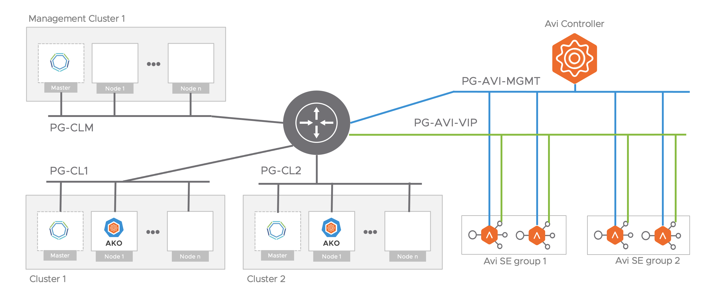
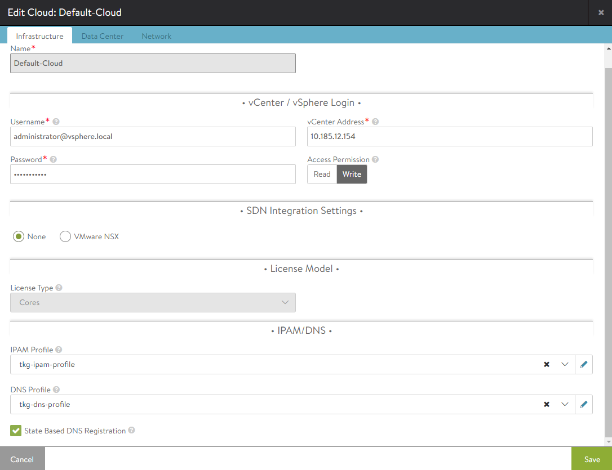

# Install VMware NSX Advanced Load Balancer on a vSphere Distributed Switch

If you use VMware Tanzu Kubernetes Grid to deploy management clusters to Amazon EC2 or Microsoft Azure, Amazon EC2 or Azure load balancer instances are created. To provide load balancing services to deployments on vSphere, Tanzu Kubernetes Grid includes VMware NSX Advanced Load Balancer Essentials Edition .

NSX Advanced Load Balancer, formerly known as Avi Vantage, provides an L4 load balancing solution. NSX Advanced Load Balancer includes a Kubernetes operator that integrates with the Kubernetes API to manage the lifecycle of load balancing and ingress resources for workloads.

## NSX Advanced Load Balancer Deployment Topology

NSX Advanced Load Balancer includes the following components:

- **Avi Kubernetes Operator (AKO)** provides the load balancer functionality for Kubernetes clusters. It listens to Kubernetes Ingress and Service Type `LoadBalancer` objects and interacts with the Avi Controller APIs to create `VirtualService` objects.
- **Service Engines (SE)** implement the data plane in a VM form factor.
- **Avi Controller** manages `VirtualService` objects and interacts with the vCenter Server infrastructure to manage the lifecycle of the service engines (SEs). It is the portal for viewing the health of `VirtualServices` and SEs and the associated analytics that NSX Advanced Load Balancer provides. It is also the point of control for monitoring and maintenance operations such as backup and restore.
- **SE Groups** provide a unit of isolation in the form of a set of Service Engines, for example a dedicated SE group for specific important namespaces. This offers control in the form of the flavor of SEs (CPU, Memory, and so on) that needs to be created and also the limits on the maximum number of SEs that are permitted.

You can deploy NSX Advanced Load Balancer in the topology illustrated in the figure below.

The topology diagram above shows the following configuration:

- Avi controller is connected to the management port group.
- The service engines are connected to the management port group and one or more VIP port groups. Service engines run in dual-arm mode.
- Avi Kubernetes Operator is installed on the Tanzu Kubernetes clusters and should be able to route to the controller’s management IP.
- Avi Kubernetes Operator is installed in `NodePort` mode only.

## Recommendations

- For set ups with a small number of Tanzu Kubernetes clusters that each have a large number of nodes, it is recommended to use one dedicated SE group per cluster.
- For set ups with a large number of Tanzu Kubernetes clusters that each have a small number of nodes, it is recommended to share an SE group between multiple clusters.
- An SE group can be shared by any number of workload clusters as long as the sum of the number of distinct cluster node networks and the number of distinct cluster VIP networks is no bigger than 8.
- All clusters can share a single VIP network or each cluster can have a dedicated VIP network.
- Clusters that share a VIP network should be grouped by labels. A dedicated `AKODeploymentConfig` should be created in the management cluster.
- For simplicity, in a lab environment all components can be connected to the same port group on which the Tanzu Kubernetes clusters are connected.

In the topology illustrated above, NSX Advanced Load Balancer provides the following networking, IPAM, isolation, tenancy, and Avi Kubernetes Operator functionalities.

### Networking

- SEs are deployed in a dual-arm mode in relation to the data path, with connectivity both to the VIP network and to the workload cluster node network.
- The VIP network and the workload networks must be discoverable in the same vCenter Cloud so AVI Controller could create SEs attached to both networks.
- VIP and SE data interface IP addresses are allocated from the VIP network.
- There can only be one VIP network per workload cluster. However, different VIP networks could be assigned to different workload clusters, for example in a large Tanzu Kubernetes Grid deployment.

### IPAM

- If DHCP is not available, IPAM for the VIP and SE Interface IP address is managed by Avi Controller.
- The IPAM profile in Avi Controller is configured with a Cloud and a set of Usable Networks.
- If DHCP is not configured for the VIP network, at least one static pool must be created for the target network.

### Resource Isolation

- Dataplane isolation across Tanzu Kubernetes clusters can be provided by using SE Groups. The vSphere admin can configure a dedicated SE Group and configure that for a set of Tanzu Kubernetes clusters that need isolation.
- SE Groups offer the ability to control the resource characteristics of the SEs created by the Avi Controller, for example, CPU, memory, and so on.

### Tenancy

With NSX Advanced Load Balancer Essentials, all workload cluster users are associated with the single admin tenant.

### Avi Kubernetes Operator

Avi Kubernetes Operator is installed on Tanzu Kubernetes clusters. It is configured with the Avi Controller IP address and the user credentials that Avi Kubernetes Operator uses to communicate with the Avi Controller. A dedicated user per workload is created with the admin tenant and a customized role. This role has limited access, as defined in  [https://github.com/avinetworks/avi-helm-charts/blob/master/docs/AKO/roles/ako-essential.json](https://github.com/avinetworks/avi-helm-charts/blob/master/docs/AKO/roles/ako-essential.json).

## Install Avi Controller on vCenter Server

You install Avi Controller on vCenter Server by downloading and deploying an OVA template. These instructions provide guidance specific to deploying Avi Controller for Tanzu Kubernetes Grid. For full details of how to deploy Avi Controller, see [Installing Avi Vantage for VMware vCenter](https://avinetworks.com/docs/20.1/installing-avi-vantage-for-vmware-vcenter/) in the Avi Networks documentation.

1. Access the Avi Networks portal from [the Tanzu Kubernetes Grid downloads page](https://my.vmware.com/en/web/vmware/downloads/info/slug/infrastructure_operations_management/vmware_tanzu_kubernetes_grid/1_x).
1. In the **VMware NSX Advanced Load Balancer** row, click **Go to Downloads**.
1. Click **Download Now** to go the NSX Advanced Load Balancer Customer Portal.
1. In the customer portal, go to **Software** > **20.1.3**.
1. Scroll down to **VMware**, and click the download button for **Controller OVA**.
1. Log in to the vSphere Client.
1. In the vSphere Client, right-click an object in the vCenter Server inventory, select **Deploy OVF template**.
1. Select **Local File**, click the button to upload files, and navigate to the downloaded OVA file on your local machine.
1. Follow the installer prompts to deploy a VM from the OVA template.

   Select the following options in the OVA deployment wizard:

   - Provide a name for the Controller VM, for example, `nsx-adv-lb-controller` and the datacenter in which to deploy it.
   - Select the cluster in which to deploy the Controller VM.
   - Review the OVA details, then select a datastore for the VM files. For the disk format, select **Thick Provision Lazy Zeroed**.
   - For the network mapping, select a port group for the Controller to use to communicate with vCenter Server. The network must have access to the management network on which vCenter Server is running.
   - If DHCP is available, you can use it for controller management.
   - Specify the management IP address, subnet mask, and default gateway. If you use DHCP, you can leave these fields empty.
   - Leave the key field in the template empty.
   - On the final page of the installer, click **Finish** to start the deployment.

   It takes some time for the deployment to finish.
1. When the OVA deployment finishes, power on the resulting VM.

   After you power on the VM, it takes some time for it to be ready to use.

## Set Up the Controller

For full details of how to set up the Controller, see the [Performing the Avi Controller Initial setup](https://avinetworks.com/docs/20.1/installing-avi-vantage-for-vmware-vcenter/#performing-the-avi-controller-initial-setup) in the Avi Controller documentation.

This section provides some information about configuration that has been validated on Tanzu Kubernetes Grid, as well as some tips that are not included in the Avi Controller documentation.

**NOTE**: If you are using an existing AVI Controller, you must make sure that the VIP Network that is be used during Tanzu Kubernetes Grid management cluster deployment has a unique name across all AVI Clouds.

1. In a browser, go to the IP address of the Controller VM.
1. Configure a password to create an admin account.
1. Optionally set DNS Resolvers and NTP server information, set the backup passphrase, and click **Next**.

   Setting the backup passphrase is mandatory.

1. Select **None** to skip SMTP configuration, and click **Next**.
1. For **Orchestrator Integration**, select **VMware**.
1. Enter the vCenter Server credentials and the IP address or FQDN of the vCenter Server instance.
1. For **Permissions**, select **Write**.

   This allows the Controller to create and manage SE VMs.

1. For **SDN Integration** select None and click **Next**.
1. Select the vSphere Datacenter.
1. For **System IP Address Management**, select **DHCP**.
1. For **Virtual Service Placement Settings**, leave both check boxes unchecked and click **Next**.
1. Select a distributed virtual switch to use as the management network, select DHCP and click **Next**.

   - The switch is used for the management network NIC in the SEs.
   - Select the same network as you used when you deployed the controller.

1. For **Support Multiple Tenants**, select **No**.

## Create IPAM and DNS Profiles and Add them to the Cloud

There are additional settings to configure in the Controller UI before you can use NSX Advanced Load Balancer.

1. In the Controller UI, go to **Applications** > **Templates** > **Profiles** > **IPAM/DNS Profiles**, click **Create** and select **IPAM Profile**.

    - Enter a name for the profile, for example, `tkg-ipam-profile`.
    - Leave the **Type** set to **Avi Vantage IPAM**.
    - Leave **Allocate IP in VRF** unchecked.
    - Click **Add Usable Network**.
    - Select **Default-Cloud**.
    - For **Usable Network**, select the distributed virtual switch that you selected in the preceding procedure.
    - (Optional) Click **Add Usable Network** to configure additional VIP networks.
    - Click **Save**.

   

1. In the **IPAM/DNS Profiles** view, click **Create** again and select **DNS Profile**.

   **NOTE**: The DNS Profile is optional for using Service type `LoadBalancer`.

    - Enter a name for the profile, for example, `tkg-dns-profile`.
    - For **Type**, select **AVI Vantage DNS**
    - Click **Add DNS Service Domain** and enter at least one **Domain Name** entry, for example `tkg.nsxlb.vmware.com`.
        - This should be from a DNS domain that you can manage.
        - This is more important for the L7 Ingress configurations, in which the Controller bases the logic to route traffic on hostnames.
        - Ingress resources that the Controller manages should use host names that belong to the domain name that you select here.
        - This domain name is also used for Services of type `LoadBalancer`, but it is mostly relevant if you use AVI DNS VS as your Name Server.
       - Each Virtual Service will create an entry in the AVI DNS configuration. For example, `service.namespace.tkg-lab.vmware.com`.
    - Click **Save**.

   

1. Click the menu in the top left corner and select **Infrastructure** > **Clouds**.
1. For **Default-Cloud**, click the edit icon and under **IPAM Profile** and **DNS Profile**, select the IPAM and DNS profiles that you created above.

   

1. Select the **DataCenter** tab.

    - Leave DHCP enabled. This is set per network.
    - Leave the **IPv6...** and **Static Routes...** check boxes unchecked.

1. Do not update the **Network** section yet.
1. Save the cloud configuration.
1. Go to **Infrastructure** > **Networks** and click the edit icon for the network you are using as the VIP network.
1. Edit the network to add a pool of IPs to be used as a VIP.

   Edit the subnet and add an IP Address pool range within the boundaries, for example 192.168.14.210-192.168.14.219.

## Create a Custom Controller Certificate

The default NSX Advanced Load Balancer certificate does not contain the Controller's IP or FQDN in the Subject Alternate Names (SAN), however valid SANs must be defined in AVI Controller's certificate. You consequently must create a custom certificate to provide when you deploy management clusters.

1. In the Controller UI, click the menu in the top left corner and select **Templates** > **Security** > **SSL/TLS Certificates**, click **Create**, and select **Controller Certificate**.
1. Enter the same name in the **Name** and **Common Name** text boxes.
1. Select **Self-Signed**.
1. For **Subject Alternate Name (SAN)**, enter either the IP address or FQDN, or both, of the Controller VM.

   If only the IP address or FQDN is used, it must match the value that you use for **Controller Host** when you [configure NSX Advanced Load Balancer settings during management cluster deployment](deploy-ui.html#nsx-adv-lb), or specify in the `AVI_CONTROLLER` variable in the management cluster configuration file.
1. Leave the other fields empty and click **Save**.
1. In the menu in the top left corner, select **Administration** > **Settings** > **Access Settings**, and click the edit icon in **System Access Settings**.
1. Delete all of the certificates in **SSL/TLS Certificate**.
1. Use the **SSL/TLS Certificate** drop-down menu to add the custom certificate that you created above.
1. In the menu in the top left corner, select **Templates** > **Security** >  **SSL/TLS Certificates**, select the certificate you create and click the export icon.
1. Copy the certificate contents.

   You will need the certificate contents when you deploy management clusters.

## What to Do Next

Your NSX Advanced Load Balancer deployment is ready for you to use with management clusters.

- [Deploy Management Clusters with the Installer Interface](deploy-ui.md)
- [Deploy Management Clusters from a Configuration File](deploy-cli.md)
