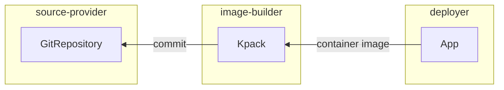

# Cartographer Catalog

Reusable Cartographer Supply Chains and templates for driving workloads from
source code to running Knative service in a cluster.

## Components

* Cartographer's ClusterSupplyChain and associated resources (templates)

## Configuration

The following configuration values can be set to customize the installation.

* `registry.server` (default: none, **required**): hostname of the registry
  server where app images are pushed to

* `registry.repository` (default: none **required**):  where the app images are
  stored in the image registry

* `service_account` (default: `default`): name of the serviceaccount to use by
  default in any children resources

* `cluster_builder` (default: `default`): name of the kpack clusterbuilder to
  use by default in any kpack image objects

* `git_implementation` (default: `go-git`): git implementation to use in flux
  gitrepository objects

## Installation

The Cartographer supply chains provided in this package require all
resources of which objects they create to be previously installed in the
cluster, those being:

* **cartographer**, for choreographing kubernetes resources according to the
  definition of the supply chains

* **kapp-controller**, for providing both the packaging primitives for
  installing this package as well as the `App` CRD used by the supply chain to
  deploy the applications built according to the supply chains

* **kpack**, for building container images out of source code

* **source-controller**, for keeping track of changes to a git repository and
  making source code available internally in the cluster

* **knative serving**, for running the application

With the dependencies met, proceed with the installation of this package:

1. Create a file named `cartographer-catalog.yaml` that specifies the
   corresponding values to the properties you want to change. For example:

    ```yaml
    cluster_builder: default
    service_account: default

    registry:
      server: SERVER-NAME
      repository: REPO-NAME
    ```

    _**SERVER-NAME**_ is the hostname of the registry server.
    Examples:
    * Harbor: "my-harbor.io"
    * DockerHub: "index.docker.io"
    * Google Cloud Registry: "gcr.io"
    * GitHub Packages (ghcr): "ghcr.io"

    _**REPO-NAME**_  is where workload images are stored in the registry.
    Images are written to SERVER-NAME/REPO-NAME/WL_NAME-WL_NAMESPACE.
    Examples:
    * Harbor: "my-project/supply-chain"
    * DockerHub: "my-dockerhub-user"
    * Google Cloud Registry: "my-project/supply-chain"
    * GitHub Packages (ghcr): "my-gh-repository" or
      "my-gh-repository/supply-chain"

1. Having the configuration ready, install the package by running:

    ```shell
    tanzu package install cartographer-catalog \
      --package-name cartographer-catalog.community.tanzu.vmware.com \
      --version ${OOTB_SUPPLY_CHAINS_PACKAGE_VERSION} \
      --values-file cartographer-catalog.yaml
    ```

    Example output:

    ```console
    \ Installing package 'cartographer-catalog.community.tanzu.vmware.com'
    | Getting package metadata for 'cartographer-catalog.community.tanzu.vmware.com'
    | Creating service account 'cartographer-catalog-default-sa'
    | Creating cluster admin role 'cartographer-catalog-default-cluster-role'
    | Creating cluster role binding 'cartographer-catalog-default-cluster-rolebinding'
    | Creating secret 'cartographer-catalog-default-values'
    | Creating package resource
    - Waiting for 'PackageInstall' reconciliation for 'cartographer-catalog'
    / 'PackageInstall' resource install status: Reconciling


     Added installed package 'cartographer-catalog' in namespace 'default'
    ```

## Usage

### Source to URL Supply Chain

This Cartographer Supply Chain ties together a series of Kubernetes resources
which drive a developer-provided Workload from source code to a running Knative
Service in the Kubernetes cluster, updating it whenever changes occur to either
source code or base image used for building the application.



To make use of it, we must first have in the same namespace as where the
Workload is submitted to a couple of objects that the resources managed by the
supplychain need so they can properly do their work:

* **container image registry secret** for providing credentials to the kpack
  Image objects created so the container images created can be pushed to the
  desired registry

* **serviceaccount** for providing means of representing inside Kubernete's
  role-based access control system the permissions that the Cartographer
  controller can make use of in favor of the Workload

* **rolebinding** for binding roles to the serviceaccount that represents the
  workload.

#### Container Image Registry Secret

Using the Tanzu CLI, Create a secret with push credentials for the container
image registry configured in installation of this package (i.e., for the server
and repository described in `registry.server` and `registry.repository` of
`ootb-supply-chain-values.yaml`):

```bash
tanzu secret registry add registry-credentials \
  --server REGISTRY-SERVER \
  --username REGISTRY-USERNAME \
  --password REGISTRY-PASSWORD \
  --namespace YOUR-NAMESPACE
```

Where:

* _**REGISTRY-SERVER**_ is the URL of the registry, not including the
  repository/directory where images will be pushed to. Examples:

  * Harbor: `my-harbor.io`
  * DockerHub: `https://index.docker.io/v1/`. Specifically, it _must_ have the
    leading `https://`, the `v1` path, and the trailing `/`)
  * Google Cloud Registry: `gcr.io`. The username can be `_json_key` and the
    password can be the JSON credentials you get from the GCP UI (under `IAM
    -> Service Accounts` create an account or edit an existing one and create
    a key with type JSON)
  * GitHub Packages (ghcr): `ghcr.io`

Alternatively, you can create the secret using `kubectl`:

```bash
kubectl create secret docker-registry registry-credentials \
  --docker-server=REGISTRY-SERVER \
  --docker-username=REGISTRY-USERNAME \
  --docker-password=REGISTRY-PASSWORD
```

#### ServiceAccount

Create a ServiceAccount to be used by Cartographer to manage the supply chain
resources as well as pass it down to them (the resources) so they are able to
gather necessary data and/or credentials to deal with the Kubernetes API.

Here we also need to associate the previously created Secret
(`registry-credentials`) to it so that anyone referencing such ServiceAccount
also gather the credentials to pull/push images to/from the container image
registry where the application should reside.

```yaml
apiVersion: v1
kind: ServiceAccount
metadata:
  name: default
secrets:
  - name: registry-credentials
imagePullSecrets:
  - name: registry-credentials
```

> **Note**: if during the installation of the package a different default
> service account name has been setup, make sure to create in the namespace a
> serviceaccount that matches the name set in the installation (e.g., if
> `ootb-supply-chains-values.yaml` is set such that `service_account: foo` is
> configured, this object must be named `foo`).

#### RoleBinding

Bind to the ServiceAccount the role that would then permit the controllers
involved to act upon the objects managed by the supplychain

```yaml
apiVersion: rbac.authorization.k8s.io/v1
kind: RoleBinding
metadata:
  name: ootb-supply-chain-source-to-url-workload
roleRef:
  apiGroup: rbac.authorization.k8s.io
  kind: ClusterRole
  name: ootb-supply-chain-source-to-url-workload
subjects:
  - kind: ServiceAccount
    name: default
```

> **Note**: Similar to the ServiceAccount setup, if during the installation of
> the package a different default service account name has been configured,
> make sure to not reference `default` in the subjects, but the name of the
> serviceaccount to be used by the workloads).

### Workload

With the namespace where the Workload will be submitted ready having all the
three objects mentioned above (image secret, serviceaccount, and rolebinding),
we can proceed with the creation of the Workload.

```bash
tanzu apps workload create hello-world \
  --git-branch main \
  --git-repo https://github.com/sample-accelerators/tanzu-java-web-app
  --label app.kubernetes.io/part-of=tanzu-java-web-app \
  --type web
```

```console
Create workload:
      1 + |---
      2 + |apiVersion: carto.run/v1alpha1
      3 + |kind: Workload
      4 + |metadata:
      5 + |  labels:
      6 + |    apps.tanzu.vmware.com/workload-type: web
      7 + |    app.kubernetes.io/part-of: hello-world
      8 + |  name: hello-world
      9 + |  namespace: default
     10 + |spec:
     11 + |  source:
     12 + |    git:
     13 + |      ref:
     14 + |        branch: main
     15 + |      url: https://github.com/sample-accelerators/tanzu-java-web-app
```

With the Workload submitted, you can follow the live logs using the `tanzu` cli:

```bash
tanzu apps workload tail hello-world --since 10m
```

Eventually, the resources described by the supply chain will be created, all of
them being children objects of the Workload carrying the
`app.kubernetes.io/part-of` label.

```scala
NAMESPACE  NAME
default    Workload/hello-world
default    ├─GitRepository/hello-world
default    ├─Image/hello-world
default    │ ├─Build/hello-world-build-1
default    │ ├─PersistentVolumeClaim/hello-world-cache
default    │ └─SourceResolver/hello-world-source
default    └─App/hello-world
```

Because we installed the package with its default service account name to
`default` and in the sections above both attached the secret and bound the
ClusterRole to the `default` serviceaccount, we don't need to tweak any extra
fields in the spec.

For reference, below you'll find the full definition of a Workload for this
supply chain:

```yaml
apiVersion: carto.run/v1alpha1
kind: Workload
metadata:
  name: hello-world
  labels:
    # the name of the higher-level applicaton that the objects involved
    # in the supply chain should be part of (this label gets pushed down
    # to them, including the final knative-service).
    #
    app.kubernetes.io/part-of: hello-world

    # type of this workload. this is required in order to match this workload
    # against the supplychain bundled in this package.
    #
    apps.tanzu.vmware.com/workload-type: web
spec:
  # name of the serviceaccount to grant to Cartographer the necessary
  # privileges for creating/watching/etc the resources defined by the
  # supply chain.
  #
  # the clusterrole provided by this package must be bound to this
  # serviceaccount for the controller to manage the resources according to the
  # supply chain specification.
  #
  serviceAccountName: default

  params:
    # name of the serviceaccount to pass down to the objects that need one
    # (e.g, kpack and kapp-ctrl/App).
    #
    - name: service_account
      value: default

  # details about where source code can be found in order to keep track of
  # changes to it so the resources managed by the supply chain can create new
  # builds and deployments whenever new revisions are found.
  #
  source:
    git:
      url: https://github.com/kontinue/hello-world
      ref: {branch: main}
```

#### Optional Parameters

In the `workload.spec.params` field we can specify a couple parameters to
override the default behavior of certains components:

* `service_account` (string): overrides the default name of the serviceaccount
  (set in `ootb-supply-chain-values.yaml`) to pass on to the children objects.

* `cluster_builder` (string): overrides the default name of the clusterbuilder
  (set in `ootb-supply-chain-values.yaml`) to be used by the `kpack/Image`
  created by the supply chain.

* `git_implementation` (string): overrides the default git implementation (set
  in `ootb-supply-chain-values.yaml`) to use for the GitRepository. Valid
  options: libgit2, go-git.

* `git_secret` (string): name of a git secret in the same namespace as the
  Workload where the GitRepository object can find the credentials for pulling
  the git repository contents.

## License

Copyright 2022 VMware Inc. All rights reserved

[GCR]: https://cloud.google.com/container-registry/
[DockerHub]: https://hub.docker.com/
