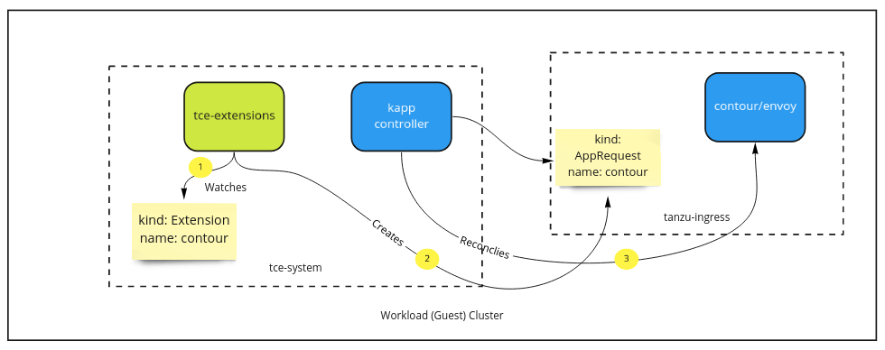
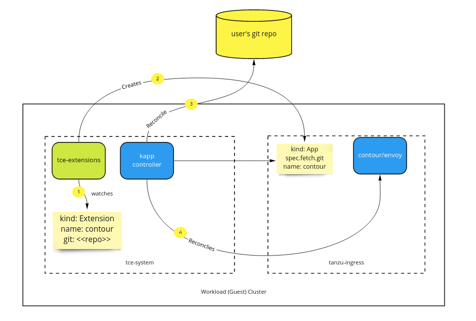

# Extension Deployment

## Summary 

This proposal covers extension support in Tanzu Community Edition (TCE).

⚠️ We, TCE, fully intend to coalesce our extension approach with TKG and other
relevant Tanzu-related programs. This proposal acts as a starting place for our
thinking so that we can help drive conversations. ⚠️ 

An extension is defined as software deployed to a running cluster, which extends
the cluster's functionality. These extensions are often platform services.
Platform services provide vital features to applications that run on the
cluster. For example, a secret management solution such as Vault is a platform
services that provides secret distribution and storage to applications. Platform
services are often managed independently from TCE's lifecycle. For example, an
upgrade to TCE will not upgrade platform services such as Vault. However,
**add-ons** such as the CNI plugin Antrea may change versions with TCE upgrades.

Add-ons are an independent concept from extensions. Add-ons are lower-level
system components that should be tied to TCE releases. Examples are CNI or CSI
plugins. They can both be satisfied using the same underlying package model,
however the following distinctions should be made.

* Add-on versions are tied to TCE versions. Since they are lower-level
  needed to run the Kubernetes cluster, we must ensure stability and
  compatibility for TCE releases. Extensions are upgraded independently of TCE.

* Extensions can be, and are often, deployed after a cluster is up and running.
  * ⚠️: Technically this is true for add-ons in that they are deployed via the
    kube-apiserver. The distinction is you may run a cluster successfully and
    add extensions after the fact. Where as with an add-on such as CNI, your
    cluster would not be successful without pod networking.

* Extensions benefit from discovery mechanisms, where platform operators can learn
  about what is available and deploy them to clusters.

### Motivation

Kubernetes alone is rarely enough to create a viable place to run applications.
Platform operators need to offer services atop to support applications.
Examples of services include secret management solutions such as
([Vault](https://www.vaultproject.io/)) or in-cluster load balancers such as
([Contour](https://www.vaultproject.io/)). These provide essential services to
applications deployed in clusters.

TCE aims to offer an opinionated, yet modular, set of extensions to users. To
achieve this need to create proper solutions for discovery, installation,
management, and extensibility of extensions.

#### User Stories

To best understand the experience we'd like to create, the following are user
stories we aim to satisfy.

* As a platform operator, I'd like to ensure my TCE installation includes
  necessary services to make applications successful.

  * I'd like to easily deploy a set of extensions with my clusters.

* As a platform operator, I'd like to manage platform services out-of-band from
  my Kubernetes clusters.

  * I'd like to manage updates for services such as Kafka Operator, Vault, and
    Contour independent of Kubernetes updates.

* As a platform operator, I'd like to easily discover, deploy, and manage
  extensions via Tanzu CLI.

* As a platform operator, I'd like to easily view the state of extensions via
  Octant.

* As a platform operator, I'd like to fully manage my extensions using a GitOps
  workflow and no require interaction with Tanzu CLI to do so.

#### Goals

* Implement the `Extension` API defined in Tanzu's `core` repository.

* Provide a CLI experience, via a `tanzu` CLI plugin, for discovering,
  deploying, and managing extensions.

* Offer a UI experience, via Octant, for discovering, deploying, and managing
  extensions.

* Support a GitOps model where TCE users can make all extension management
  decisions via git.

* Official TCE extension packages must be usable in other Tanzu distributions.

#### Non-Goals

* Support centralized extension management of many clusters.

## Proposal

This section covers the details on how we'd satisfy extensions via an API,
controller, CLI (tanzu) plugin, and UI (octant) plugin.

### Extension API

This extension API will be a cross-team effort that will eventually establish
this API in Tanzu's core repository. The following API details are likely to
change based on that progress.

TCE will use an extension API, implemented as a Custom Resource Definition
(CRD). The extension API acts as a layer of indirection between extensions and
the underlying engine, such as kapp-controller, that satisfies extension needs.
The cluster-scoped extension API looks as follows.

```yaml
apiVersion: extensions.tanzu.vmware.com/v1alpha1
kind: Extension

metadata:
  # cluster-scoped Extension object named "contour"
  # unique identifier used when creating the lower-level object (e.g.
  Deployment)
  name: contour

spec:

  # underlying provider that will manage every extension object.
  # examples include kapp (kapp-controller), argo, and flux.
  # (optional; default=kapp)
  extensionProvider: kapp

  # target namespace for the eventual Kubernetes resources are created in. 
  namespace: tanzu-ingress

  # metadata for the extension.
  # consume by CLI and UI plugins.
  description: A Kubernetes ingress controller that uses envoy to route traffic
  to pods.

  # the repository an extension can be found in, enables a gitops flow.
  # (optional)
  gitRepo: 

  # oci bundle that contains a ytt or helm template.
  ociRepo: 

  # raw k8s manifests to be deployed as this extension.
  rawObjects: |

  # values for templatized fields in a target manifest.
  # (optional)
  parameters:
    apiVersion: kappctrl.k14s.io/v1alpha1
    kind: App
```

#### Trade-Offs of an Extensions API

_We're trying to determine if this layer of inderection produces more value
relative to the problems it creates. What follows are some items we have
identified._

**Pros**:

* Introduces a tanzu-specific extensions API that can enable experiences
  throughout the portfolio.
* Decouples extensions from providers in a way that enables us to support
  engines such as argo, flux, or kapp-controller.
* Users with existing investments in projects such as Argo CD can continue using
  their existing tooling.

**Cons**:

* This indirection creates a cat and mouse game of chasing features in providers,
  such as kapp, and exposing them in our Extension API.
* Introduces an extra controller, which feeds the provider's controller.

### TCE Extensions Controller

Extension objects are reconciled into object types that can instruct a provider
how to deploy an extension. TCE will initially support kapp-controller, which is
the example used for the remainder of this section.

When an extension object is added, the following sequence occurs.



The underlying `AppRequest` and `AppDefinition` API created by TKG and used to
satisfy its add-ons is used here for extensions. The packaging mechanisms and
kapp-controller reconciliations need not be different.

#### Seeding the Controller

In order for this model to work, kapp-controller must be seeded in the cluster.
We will rely on the mechanism used by TKG to ensure it is added to the cluster.

### Extension CLI Plugin

TCE will create a Tanzu CLI plugin that satisfies the Tanzu Extension API. This
plugin will provide the following features.

* **Discovery**: By looking up extension packages in the TCE channel, we will
  provide a list of extensions that can be deployed to TCE clusters.

  ```shell
  $ tanzu extensions list

  registry: harbor
  service-routing: contour, istio
  secret-management: vault
  ```

* **Adding Extensions**: Adding new extensions to one or many clusters. This
  succeeds when the Extension object is successfully created in the cluster. The
  remained of the lifcycle is handled by the extension controller and
  kapp-controller.

  ```shell
  $ tanzu extensions add contour -c cluster-1, cluster-2

  adding contour to cluster-1 and cluster-2
  added contour to cluster-1 and cluster-2

  view status of extensions by running:

  kubectl describe extensions.tanzu.com contour
  ```

* **Upgrades**: Updates the extension object which in turn updates the
  `AppDefinition` and `AppRequest` objects used by kapp-controller.

  ```shell
  $ tanzu extensions update

  updating known extensions from ce channel
  extensions updated, new versions include:

  contour-1.5.5
  ```

  ```shell
  $ tanzu extensions upgrade contour -c cluster-1

  current contour version: 1.5.4
  new contour version: 1.5.5

  proceed with upgrade? [y/n]

  y

  contour is being upgraded, view status by running:
  kubectl describe extensions contour
  ```

### Extension UI Plugin

TODO(joshrosso)

TCE will offer UI extension interaction as an Octant plugin. This functionality
will enable users to see the extension packages available in the CE channel and,
which extensions are deployed to the cluster.

We may also wish to enable adding extensions via Octant. We need to do
additional discovery work to understand the octant plugin model and what can be
done.

### Extension GitOps Management

As users of TCE mature, it is likely they will no longer want to manage
extensions via Tanzu CLI or the Octant plugin. Instead users will prefer to
manage all of their extensions declaratively and utilize a GitOps workflow. To
accomplish this, Extensions objects can be added to instruct kapp-controller to
lookup resources from a user-owned git repository. From there it can detect
changes and mutate extensions as needed.


