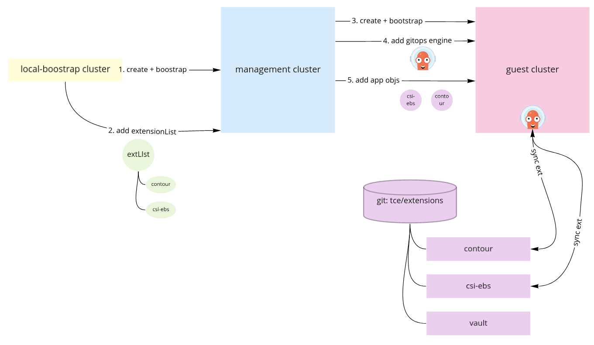

# Extension Deployment

## Summary 

This proposal covers implementation considerations for offering platform services within Tanzu Community Edition (TCE). Our goal is to offer a platform experience that creates a viable place to run applications. It will offer an opinionated set of building blocks that can be deployed by default. However, it will follow a modular approach, enabling users to choose between services we bundle or swap them out for their own.

### Motivation

Kubernetes alone is not enough to create a viable place to run applications in production. Organizations need to deploy platform services atop to support applications. Platform services include applications/extensions such as secret management ([Vault](https://www.vaultproject.io/)) or load balancers ([Contour](https://www.vaultproject.io/)) that provide essential services to the workloads that run in the cluster. Users also demand automation and guidance on how to deploy these services as part of their cluster bootstrapping process.

TCE intends to deploy both Kubernetes and platform services. To achieve this, we need to establish an approach to automating the deployment and configuration of platform services we offer. Ideally we can do so in a way that is practical and extensible to operators. A model that could realistically be used in their organization.

#### Goals

* Build a pluggable model for adding extensions.
    * pluggable: engines such as argo / kapp can be swapped out.
* Use a community-adopted approach.
* Establish a model users can extend to handle their own extension management.
* Stay _reasonably_ aligned with methodologies used in Tanzu product.

#### Non-Goals

* Bind ourselves to a single GitOps engine.
* Create a black-box solution that cannot be used generically for extension management.
* Handle cluster add-ons
    * add-ons: foundational cluster components such as container runtime or CNI.

## Proposal

TCE will leverage GitOps to facilitate extension management. We'll initially support this by leveraging Argo CD (argo) to deploy platform services to clusters. We will maintain a repository of extensions that will be pulled into guest clusters via the controller. Users will have the ability to source our master repo or create their own. This establishes a real-world Gitops model they can extend for future platform services they’d like to make available.

### Architecture

We will run in 2 modes. 

* **self-contained**: argo runs in every guest cluster and deploys platform services locally.
* **centralized**: argo runs in a shared-services cluster and deploys to each guest cluster.

#### self-contained


#### centralized


#### Argo Implementation

Argo CD abstracts the packaging/templating tooling within [its repository server](https://github.com/argoproj/argo-cd/blob/master/reposerver/repository/repository.go). The repository server holds a local git cache for the project and is responsible for returning Kubernetes YAML. Support can be built into upstream to make it compatible with ytt. We believe argo is the correct technology choice for the following reasons:

*   This is the CD tool seeing the most adoption to facilitate GitOps.
*   By using the common tool, we’ll be able to offer two benefits:
    *   Robust extension management
    *   Defined model for facilitating gitops
*   Intentions to support Argo exist in Tanzu Mission Control.

A subset of ArgoCD’s functionality competes with [kapp-controller](https://get-kapp.io/), which is a VMware maintained project. Over time, if we see additional adoption of kapp-controller, we can swap out the gitops engine (argo) in favor of kapp-controller.

### Extensions Repository

A benefit to the git-maintained model is that we’ve decoupled shipping TCE with extensions we ship. We will enable users to reference our own maintained repository or clone into their own they can maintain out of band of ours.

### Extension Onboarding Experience

#### UI Interaction

Through a UI, we can enable the setting of “default” extensions which will in turn enable the management cluster to facilitate the flow described in Architecture and instantiate default [Applications](https://github.com/argoproj/argo-cd/blob/master/manifests/crds/application-crd.yaml).	


Within the Extensions submenu, we will provide features such as the following.


#### CLI Interaction

_The following CLI interactions are ideas to best understand how this model could work. There is a lot to get figured out with regards to tanzu-cli, the core repository, and the [future] TKG CLI plugin._

To register an extension with clusters to be bootstrapped, it can be included in the deployment

```
$ tanzu init mgmtcluster --default-extensions=extensions.yaml
```

To register an extension with TCE managed clusters after the fact, a user can run:

```
$ tanzu clusters-x extensions add monitoring
```

#### Translation Engine

Extensions that will be deployed are brought into our own API, which will act as a layer of indirection between the extension(s) and the engine used to facilitate its deployment. 

TODO(joshrosso): Add example CRD.

By maintaining our own ExtensionList CRD, we can then do translation (via controller) to a target gitops engine. Meaning we can transparently support systems such as argo or kapp-controller. The only difference is whether each extension is translated into an [Application](https://github.com/argoproj/argo-cd/blob/master/manifests/crds/application-crd.yaml) (argo) or [App](https://github.com/k14s/kapp-controller/blob/develop/pkg/apis/kappctrl/v1alpha1/types.go) (carvel). 

The following covers how this would look in our two models.

**self-contained**



**centralized**


## Additional Considerations